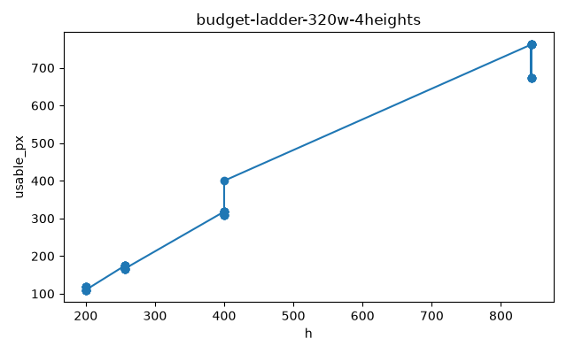
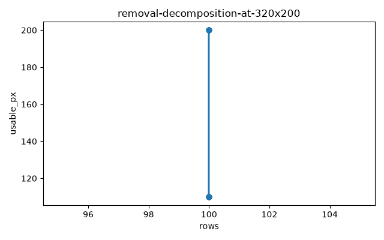
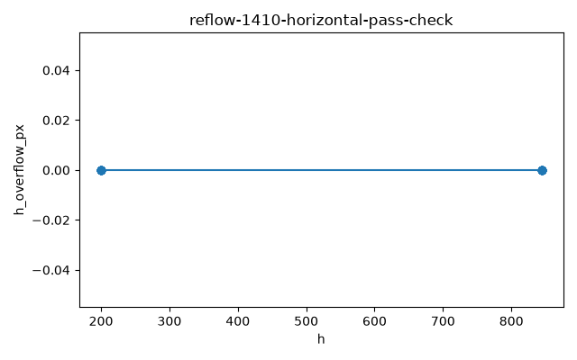

## The vertical reading space that shrinks at 400% zoom

There is a web rule called WCAG 1.4.10 Reflow. WCAG is a widely used checklist for making websites usable by everyone, and Reflow is the item in that list that deals with zooming. When you zoom a page to 400%, the rule asks one thing: the text should stack into a single column, and you should not have to scroll sideways to read it.

That is a good rule. But it only checks one direction. It checks that nothing spills out to the right. It says nothing about how much of the screen is left, top to bottom, for the words themselves.

Here is the part that actually affects you. On one real, live website, we zoomed to 400% on a very small screen. Then we measured how many vertical pixels actually reach the article text. The answer was 118px. On a screen 200px tall, that is barely more than half. The rest was covered by things like a header and an ad box sitting on top of the text.

Think of it like shopping. Imagine a store counter takes up the same amount of floor space no matter how big or tiny the store is. In a big store, losing that counter's footprint is a nuisance. In a tiny kiosk, that same counter eats most of the floor. The counter did not change. The store did.

That is exactly what happens when you zoom. Zooming to 400% does not just make things wider. The W3C (the group that writes these web rules) points out in its own explanation of the rule that "400% applies to the dimension, not the area." So your screen keeps its full width and height in physical terms, but the page is drawn four times bigger in each direction. The space left for reading, top to bottom, becomes a quarter of what it was. And whatever fixed furniture the page keeps on top of the text stays the same size.


## The same 82px loss at four screen heights

We wanted to know whether the lost space changes with the screen. So we measured the same page at four screen heights: 844px, 400px, 256px, and 200px. All of them were 320px wide, because that is the width the reflow rule uses.

The measuring tool was a hit test. It walks down the screen in small steps and asks, at each spot, "what element is on top here?" If the answer is the article text, that pixel counts as usable. If the answer is a header, an ad, or anything else covering the text, that pixel counts as lost.

Here is what the measurement showed:

```
screen height  usable vertical px  lost
844px          762                 82
400px          318                 82
256px          174                 82
200px          118                 82
```

The loss was exactly 82px at every height. Not roughly the same. Exactly. Subtract and check: 844−762=82, 400−318=82, 256−174=82, 200−118=82.

So the loss is fixed, like that store counter. Every screen pays the same amount. The same absolute chunk is taken away from every screen. So the smaller the screen, the bigger the share that disappears. On the tall 844px screen, 82px is under a tenth of the space. On the 200px screen, it is 41%. Same loss, very different impact.

This is why "small screens lose a bit of convenience" is the wrong picture. The picture is "small screens pay the same fixed fee, and the fee is huge relative to what they have."



## Where the 90px loss comes from, and its full recovery

Finding a fixed loss is one thing. Naming who takes it is another. So we ran a second experiment on the smallest screen, in a scrolled state where the loss was largest. We removed the page's fixed elements one at a time and measured how much vertical space came back each time.

The page had four suspects: a sticky header, a reading-progress bar, a "back to top" button, and a fixed ad container pinned to the bottom of the screen. The sticky header is a bar that stays pinned at the top while you scroll.

The results were lopsided. Removing the header gave back 0px. Removing the progress bar gave back 0px. Removing the back-to-top button gave back 0px. Removing the bottom ad container gave back 90px, and removing everything gave back the same 90px, no more. The pieces did not overlap, and the sums matched exactly: 0+0+0+90 equals 90.

So the entire mid-scroll loss belonged to one element: a fixed ad box at the bottom of the screen. And that box keeps a height of 400px regardless of whether the screen is 844px tall or 200px tall. It never adapts.

One detail surprised us. The 82px toll at the top of the screen turned out not to be the sticky header's fault. On the smallest screens the header stops sticking and flows away with the page. The 82px is simply the header block occupying its normal place inside the document. It takes its normal place at the top of the page no matter how tall the screen is.

What you would notice as a reader: one element you never chose to look at was responsible for nearly half the reading space on a small screen, and taking it away restored every pixel of it.



## Separating the horizontal check from vertical readability

Now the fair question: does the page fail the reflow rule, then? No. It passes. We checked it across 8 screen combinations, measuring horizontal overflow (how many pixels of content stick out past the right edge and force sideways scrolling). Every single combination measured 0px. The rule's own text asks only this: "Content can be presented without loss of information or functionality, and without requiring scrolling in two dimensions for: Vertical scrolling content at a width equivalent to 320 CSS pixels." Width. Not height.

The W3C's guide to the rule also acknowledges the risk we found, in its own words:

> Such sticky or fixed content can pose significant issues for those who would benefit from Reflow, as aside from obscuring keyboard focus, such sticky or fixed content can make reading content difficult if not impossible.
> — [Understanding Success Criterion 1.4.10: Reflow / W3C WAI](https://www.w3.org/WAI/WCAG22/Understanding/reflow.html)

There is a reasonable counterargument here, and it is worth stating honestly. The rule never promised anything about the vertical direction. Asking only for a 320px width is by design, not by oversight. Nobody ever claimed that passing 1.4.10 guarantees comfortable vertical reading. On that narrow, legal reading, the counterargument is correct.

But in everyday practice, teams use a passing reflow score as shorthand for "the page still works when zoomed." That shorthand is what breaks. The pass is real. It is also consistent with a screen where a fixed ad eats 45% of the reading space. Both things are true at once, because the check and the problem live on different axes.



## A separate check that measures vertical space directly

If the standard check does not cover it, the fix is to measure it yourself. The measurement we used is not complicated. It is a small script. The script steps down the screen in small steps, at three horizontal positions. At each step, it checks whether the article text is on top. If it is, that pixel counts as usable. The count is a single number: usable vertical pixels. Run it at a small screen size like 320x200, and you get the number of vertical pixels a reader can actually use when zoomed.

The W3C already suggests the remedy on the design side, too. Their technique C34 recommends turning sticky headers off at narrow widths, so that they stop pinning themselves over the content and simply scroll away with the page.

For a team that actually serves people who zoom (and that should be most teams), the concrete move is this: keep the horizontal reflow check. Add a vertical space measurement at a small screen size as a separate check. And let the bottom fixed containers scroll away with the page on short screens, using a media query, a rule that changes how the page looks at certain screen sizes.

For a team running plain document pages with no fixed menus, ads, or buttons (the local reports and control documents of the world), the honest answer is different: the horizontal pass alone is enough, and adding this extra measurement would be overkill. Know which kind of page you run before deciding.

## What this article could not verify

This piece rests on one live website, one machine, one browser, and 27 test runs. So it does not prove what happens on sites built differently. We also could not pin down some details. We only narrowed the screen height where the header stops sticking to somewhere between 400 and 844px. We do not know why the bottom ad sometimes failed to block during some runs; ad loading timing is our unconfirmed guess. And we never collected data on whether this loss actually drives real zoom users away. Next, someone should test the threshold value directly and run the same budget measurement across sites with different layouts.

And one plain line about when this judgment would be wrong: if we removed every element covering the text and the readable vertical space did not grow, or if the loss came out as a different amount at each screen height instead of the same 82px everywhere, this article's conclusion would be false. That did not happen. The loss was 82px at all four heights, and removing the cause gave back all 90px.

The one thing to walk away with: a zoom check that says "pass" only means no sideways scrolling. If a fixed menu or ad covers the text, the space you can actually read in can be far smaller than the screen, so measure that space directly, or make sure it was never built in the first place.

## References

1. [Understanding Success Criterion 1.4.10: Reflow / W3C WAI](https://www.w3.org/WAI/WCAG22/Understanding/reflow.html) — W3C
2. [WCAG 2.2 Success Criterion 1.4.10 Reflow (spec) / W3C](https://www.w3.org/TR/WCAG22/#reflow) — W3C
3. [CSS technique C34: Using media queries to un-fixing sticky headers / W3C WAI](https://www.w3.org/WAI/WCAG22/Techniques/css/C34) — W3C