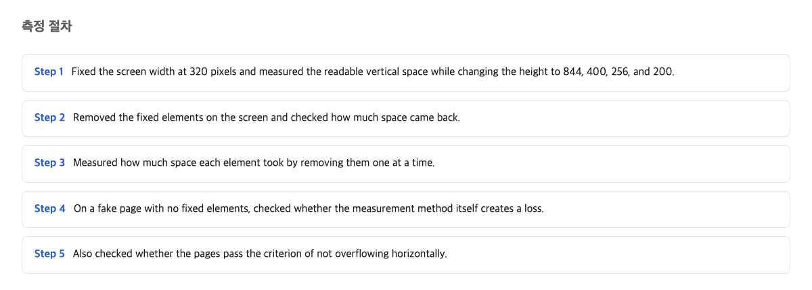
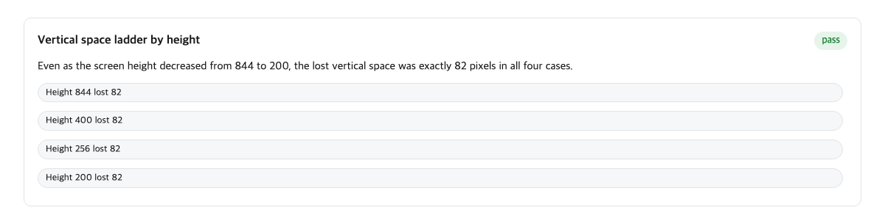
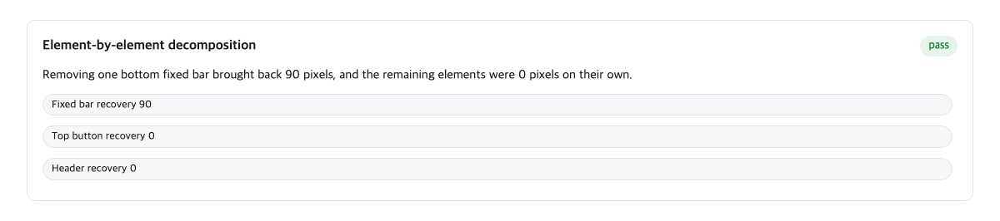
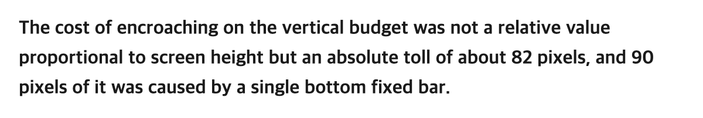

Imagine you are window-shopping on a narrow street. Every shop has a signboard bolted across its front. The signboard is the same size whether the shop behind it is large or tiny. Shrink the shop and the sign still eats the exact same chunk of the frontage. What is left for the actual display keeps getting smaller, and the sign never gives an inch.

That is what happened when we measured how much reading space a webpage really leaves you after you zoom in. The page passed its accessibility check. Yet on a very small, zoomed-in screen, a fixed 82 pixels of vertical space had vanished, the same 82 pixels no matter how tall the screen was.

Here is the one thing to carry away from this article: "the page passed its accessibility test" and "the page is readable when I zoom way in" are two different claims. The second one can only be proven by a separate measurement.

## What the zoom does to your screen

Let me set the scene first. Some people enlarge a webpage to 400% to read it. This is common for readers with low vision. At 400%, everything on the page becomes four times bigger in each direction: text, buttons, pictures.

Here is the part that surprises people: 400% is not four times bigger in area. It is four times bigger in each direction, which means the screen fits only a quarter of the page in width and a quarter in height. Your tall phone screen, at 400% zoom, behaves like a thin vertical sliver.

A good page handles this by reflowing: it rearranges itself so text runs in one column, and you scroll only down, never sideways. The text rewraps into one narrow column, and you scroll down to read the rest.

The web's rulebook for this is called WCAG (the Web Content Accessibility Guidelines), a set of shared rules for making sites usable by everyone. Its rule number 1.4.10, named Reflow, checks exactly this: does the page avoid sideways scrolling when narrowed?

Our page passed that check. All 8 test conditions came back clean, a full 8/8. And that pass told us almost nothing about whether the text was actually readable.

## How we measured the vertical space

The official rule only looks sideways. So we looked the other way: how many pixels of height actually reach the reader?

Pixel means one tiny dot on your screen. A phone screen is a grid of these dots, thousands of them tall. Our question was simple: of all those dots in the vertical column, how many show real content, and how many are covered by something else?

We used a testing tool (a program that drives a browser automatically) and asked it a question at every 2 pixels down the screen: "what part of the page is on top at this spot?" Three columns were checked, at a quarter, half, and three-quarters across the width. If the answer was the article's text, the pixel counted as usable. If the answer was a header bar, an ad, or a floating button, it did not.

To be sure the measuring stick itself was honest, we ran the same test on a plain document with nothing covering the text. Every line came back showing full content. So the tool was not manufacturing the loss.

The result, at the narrowest and most zoomed-in condition: only 118 pixels of vertical space actually touched the article text. On a screen that small, a couple of lines of text is all you get.

## The same 82 pixels disappeared at every screen height

Now the strange part. We repeated the measurement at four different screen heights, from a tall phone-like screen down to a very short one.

If the loss were a share of the screen (say, ten percent of the height), then a small screen would lose less in absolute terms than a big one. That is what most people assume. It is also wrong here.

The loss was 82 pixels in every single case. Tall screen: 82 pixels gone. Short screen: 82 pixels gone, out of far less to begin with. The arithmetic was exact: the difference between each screen's full height and its usable height came out to 82 every time.

This is the storefront sign. The sign is bolted on at a fixed size. Shrink the shop behind it all you like; the sign does not shrink with it. What changes is not the sign. What changes is the fraction of the shop the sign swallows.

For you as a reader, that fraction is the whole story. On a generous screen, 82 hidden pixels is a sliver you never notice. On a tiny zoomed-in screen, that same 82 pixels takes away roughly four in ten of the pixels that should have been showing text. The tool did not get more aggressive. The screen just had fewer pixels to begin with.

## Removing the fixed elements gave back 90 pixels

Next we asked who the culprit was. A page usually has a few "fixed" elements (things like a header bar or a floating button that stay glued to the screen while the rest of the page scrolls under them). The official guide to this rule warns about exactly these. In its words:

> Such sticky or fixed content can pose significant issues for those who would benefit from Reflow, as aside from obscuring keyboard focus, such sticky or fixed content can make reading content difficult if not impossible.
> — [Understanding Success Criterion 1.4.10: Reflow / W3C WAI](https://www.w3.org/WAI/WCAG22/Understanding/reflow.html)

So we stripped them out, one at a time, and remeasured. When we removed everything fixed at once, 90 pixels of vertical space came back, consistently, across repeated runs.

Then we took the elements apart individually, one at a time, so we could see which one caused the loss. The floating "back to top" button, taken alone: zero pixels recovered. The reading progress bar: zero. The header: zero. The bottom container, a fixed ad bar pinned across the foot of the screen: 90 pixels. The whole loss was that one element, and the individual removals added up exactly to the all-at-once removal, with no overlap.

That bottom container holds its height no matter how short the screen is. Its size does not respond to the screen at all. That is precisely why the loss comes out as a flat absolute number. A fixed-sized element subtracts a fixed number of pixels, whatever the screen behind it.

## The horizontal test passed everywhere

Meanwhile, the official check kept saying everything was fine. At every one of the 8 conditions, the page's content width exactly equaled the width of the viewing area. No sideways scrolling at all. A perfect 8/8 pass.

To be fair to the rulebook, this is by design. Here is the actual wording of the rule:

> Content can be presented without loss of information or functionality, and without requiring scrolling in two dimensions for: Vertical scrolling content at a width equivalent to 320 CSS pixels; Horizontal scrolling content at a height equivalent to 256 CSS pixels.
> — [WCAG 2.2 Success Criterion 1.4.10 Reflow (spec) / W3C](https://www.w3.org/TR/WCAG22/#reflow)

In plain words: for a page you scroll down, the rule only demands that the width come down to 320 pixels. It says nothing about the height. It never promised vertical readability, and no one should claim it did.

There is a real counterargument here, and it is correct as far as it goes. The rule was never designed to judge the vertical axis. So a pass cannot be attacked for failing to guarantee it. But that is exactly the trap. In everyday practice, people treat "passed 1.4.10" as shorthand for "zoom in and it still reads fine." Our numbers show that shorthand breaking down in front of a flat 82-pixel toll. The rule is innocent; the borrowed trust is not.

## The loss is a flat number, and it has an owner

Put the two findings together and you get the shape of the problem.

The loss is not a percentage. It is a fixed amount, about 82 pixels, charged the same at every screen height, the same flat charge at every screen height. And it has a specific owner: elements whose size ignores the screen they sit on, with the fixed bottom bar owning the mid-scroll loss and the document-flow header block the rest.

So what changes for you depends on which side of the page you sit on. If you are a reader who zooms in: a green accessibility score is not a promise about your reading space, and it is reasonable to ask whether a site has actually measured what is left after zooming. If you make or run websites: the part that actually affects you is that the standard check sits there next to a hole it was never built to look into.

There is a known remedy. The same guidebook includes a technique for letting fixed headers and bars drop their "stuck" behavior on small screens, so they scroll away like ordinary content instead of holding their ground. One site in our data did exactly this. Its header gave up its fixed position on the shortest screen and stopped blocking anything.

## Who should do what

Two kinds of readers, two actions.

If you produce plain documents and reports, pages with no fixed header bars, pinned ad strips, or floating buttons, the standard horizontal test is enough for you. You do not need to add a vertical measurement; running one would be effort without payoff.

Some sites serve people who zoom in heavily. Think of a reading site, a public service, anything with fixed bars and ad containers. If you run one of those, add a second check beside the standard one. Measure, at the narrow width and short height, how many pixels actually reach the article text. The standard pass will not tell you. Only this measurement will.

## What this article could not verify

This was one live site, one machine, one browser, over 27 test repetitions, not a survey of the web. We did not pin down the exact screen height at which the header stops acting fixed. We also could not explain why the bottom ad bar's blocking came and went between runs. And we did not measure whether any of this changes what real readers do, such as leaving the page. A useful next step is to rerun the vertical measurement across different site templates, and to check whether removing the fixed bars affects revenue as well as readability.

One honest correction from the data: the 82 pixels did not come from elements glued to the screen. On the shortest screens, the header gave up its fixed position, and the loss stayed at 82 anyway. The largest single recoverable chunk was the 90 pixels from the bottom bar. The rulebook's own technique page describes why these fixed regions matter:

> Sticky regions always stay visible in the viewport while the other content will disappear underneath when scrolling.
> — [CSS technique C34: Using media queries to un-fixing sticky headers / W3C WAI](https://www.w3.org/WAI/WCAG22/Techniques/css/C34)

So when would this article's judgment be wrong? In two cases. If removing every fixed element had not given the vertical space back, the claim that fixed elements cause the loss would be false. In our experiment, removing them returned 90 pixels. And if the lost amount changed with the screen's height instead of staying the same, then the claim that it is a fixed toll would be false too.

## References

1. [Understanding Success Criterion 1.4.10: Reflow / W3C WAI](https://www.w3.org/WAI/WCAG22/Understanding/reflow.html) — W3C
2. [WCAG 2.2 Success Criterion 1.4.10 Reflow (spec) / W3C](https://www.w3.org/TR/WCAG22/#reflow) — W3C
3. [CSS technique C34: Using media queries to un-fixing sticky headers / W3C WAI](https://www.w3.org/WAI/WCAG22/Techniques/css/C34) — W3C