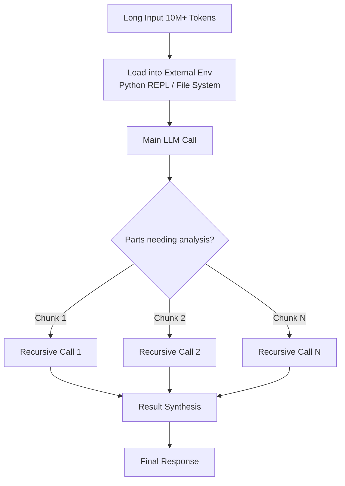
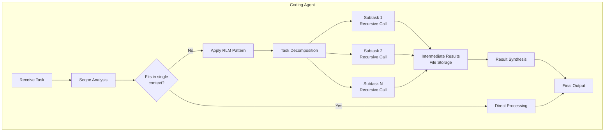
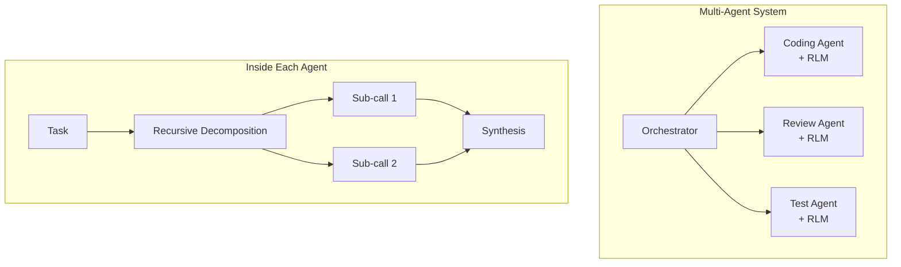

## Overview

When running LLM-powered coding agents, you inevitably hit a wall: <strong>the context window limit</strong>. Whether it's 128K or 200K tokens, working with large codebases causes the model to start missing critical information. This is known as "Context Rot" — the phenomenon where performance degrades sharply as context length increases.

MIT's <strong>Recursive Language Models (RLM)</strong> paper (arXiv:2512.24601) presents a fundamental solution to this problem. Recently, a developer named Tenobrus implemented this idea directly in Claude Code, generating significant buzz. He implemented RLM as a "skill" inside the coding agent itself.

From the perspective of an engineering manager who builds systems with AI, let me analyze why this approach matters and how it can be applied in practice.

## What is RLM?

### Core Idea

The essence of RLM is simple: <strong>enabling an LLM to recursively call itself</strong>.

In the conventional approach, long prompts are fed directly into the model. Naturally, anything beyond the context window gets truncated, and even within limits, Context Rot causes the model to miss information in the middle.

RLM takes a different approach:

1. <strong>Load prompts into an external environment</strong>: Store long inputs in an execution environment like Python REPL
2. <strong>Programmatic exploration</strong>: The LLM writes code to peek at only the necessary parts
3. <strong>Recursive self-invocation</strong>: Delegate subtasks to new instances of itself
4. <strong>Result synthesis</strong>: Programmatically combine results from each recursive call



### Key Results from the Paper

The MIT paper's results are impressive:

- <strong>10M+ token processing</strong>: Over 100x the base context window
- <strong>91.3% performance improvement</strong>: vs baseline on BrowseComp+ benchmark
- <strong>Context Rot solved</strong>: Virtually no performance degradation as input length increases
- <strong>Cost-effective</strong>: Comparable to or cheaper than direct base model calls

Notably, <strong>RLM-Qwen3-8B</strong>, a natively recursive model they trained, showed an average 28.3% improvement over base Qwen3-8B and approached vanilla GPT-5 performance on some tasks.

## Implementing RLM in Coding Agents

### Tenobrus's Experiment

Tenobrus implemented RLM as a "skill" within Claude Code. The key ideas:

- <strong>Bash as the execution environment</strong>: Using Bash shell instead of Python REPL
- <strong>Files as variables</strong>: Storing intermediate results in the file system
- <strong>Implementation inside the coding agent</strong>: As a native agent capability, no separate infrastructure

This is effectively a structure where "a coding agent inside a coding agent recursively calls itself."

### Why Coding Agents Need RLM

In practice, coding agent operators frequently encounter these scenarios:

1. <strong>Large-scale refactoring</strong>: Changes spanning dozens of files
2. <strong>Code review</strong>: Analyzing hundreds of file changes in a PR
3. <strong>Debugging</strong>: Error causes spanning multiple modules
4. <strong>Architecture analysis</strong>: Understanding the entire codebase structure

A single context window simply cannot handle these tasks properly. With the RLM pattern, the agent can autonomously split work, recursively process each part, and synthesize results.

### Implementation Architecture

The basic structure for implementing RLM in a coding agent:



Three key points:

1. <strong>Automatic decomposition</strong>: The LLM autonomously splits work into appropriate sizes
2. <strong>External storage utilization</strong>: Using the file system as "memory" to bypass context window limits
3. <strong>Programmatic synthesis</strong>: Intelligent result merging through code, not simple concatenation

## Single Model Limits and Where RLM Fits

### Multi-Agent vs RLM

The AI industry has recently focused on <strong>multi-agent systems</strong> to overcome single model limits — multiple models collaborating together.

RLM is a different approach. Because <strong>the same model recursively calls itself</strong>, there's no inter-model communication overhead, and it maintains a consistent "thought process."

| Comparison | Multi-Agent | RLM |
|-----------|------------|-----|
| Model diversity | Multiple models combinable | Single model |
| Communication overhead | High | Low |
| Consistency | Inter-model differences | Consistent (same model) |
| Context expansion | Distributed processing | Recursive splitting |
| Implementation complexity | High | Relatively low |

### Hybrid Approach in Practice

From an EM perspective managing teams, RLM and multi-agent are <strong>not either/or but complementary</strong>.

- <strong>RLM</strong>: Efficiently handling large contexts within a single agent
- <strong>Multi-agent</strong>: Collaboration between agents with different specializations

The most effective architecture in practice is <strong>each agent in a multi-agent system using RLM patterns internally</strong>.



## Practical Application: What You Can Try Now

### 1. RLM Skills in Claude Code

Following Tenobrus's approach, you can implement RLM with patterns like this:

```bash
# Example: Large codebase analysis
# Step 1: Save file list to external environment
find src/ -name "*.ts" > /tmp/rlm_files.txt

# Step 2: Recursively analyze each file
while read file; do
  # Execute subtask for each file
  analysis=$(claude --task "Summarize the key interfaces and dependencies of this file" < "$file")
  echo "$analysis" >> /tmp/rlm_summaries.txt
done < /tmp/rlm_files.txt

# Step 3: Synthesize summaries to understand overall structure
claude --task "Analyze the overall architecture based on these summaries" < /tmp/rlm_summaries.txt
```

### 2. Phased Adoption Strategy

When introducing RLM patterns in an organization, I recommend these phases:

1. <strong>Phase 1</strong>: Apply to code review automation first (low risk)
2. <strong>Phase 2</strong>: Extend to large-scale refactoring assistance
3. <strong>Phase 3</strong>: Integrate into debugging workflows
4. <strong>Phase 4</strong>: Apply across the entire development pipeline

## Paper Implications: Future Outlook

The RLM paper's implications are clear:

1. <strong>Current LLMs are underestimated</strong>: With proper software infrastructure, performance improves dramatically
2. <strong>The context window expansion race can be bypassed</strong>: Software-based recursion is more efficient than hardware expansion
3. <strong>Native RLM training is the next step</strong>: Training recursion natively, like RLM-Qwen3-8B, yields even greater results
4. <strong>Coding agents are the first beneficiaries</strong>: The file system already exists as a natural external environment

## Conclusion

RLM is not merely an academic idea. As Tenobrus's experiment demonstrates, it's a <strong>practical pattern you can implement in coding agents right now</strong>.

If you're feeling the limits of single models, try the RLM pattern before building a multi-agent system. You'll be surprised by how much more you can achieve with the same model.

From the perspective of building systems with AI, RLM embodies the essence of engineering — "boosting performance through architecture without changing the model." Not waiting for bigger models, but building smarter structures with what we have — that's the direction engineering managers should be watching.

## References

- [Recursive Language Models — MIT (arXiv:2512.24601)](https://arxiv.org/abs/2512.24601)
- [Tenobrus's Claude Code RLM Implementation](https://x.com/tenobrus/status/2020770310958768449)
- [RLM GitHub Repository](https://github.com/alexzhang13/rlm)
