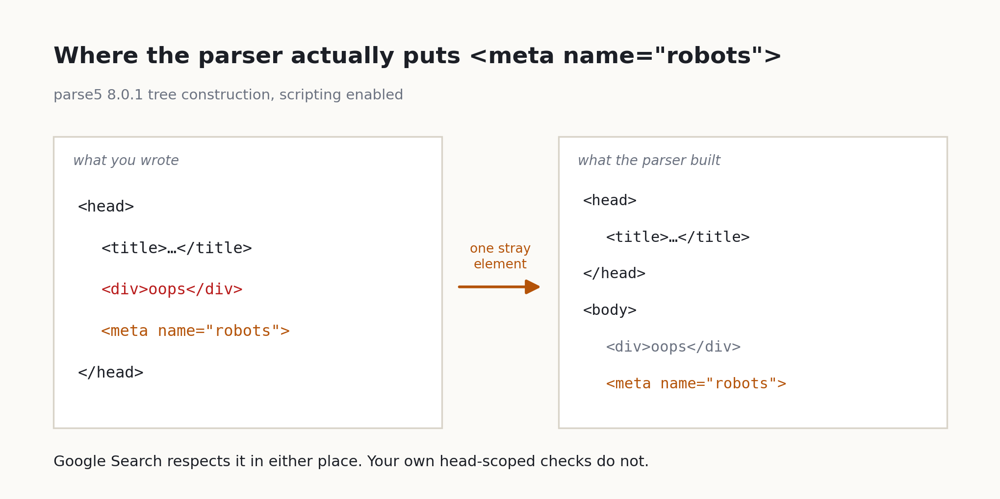
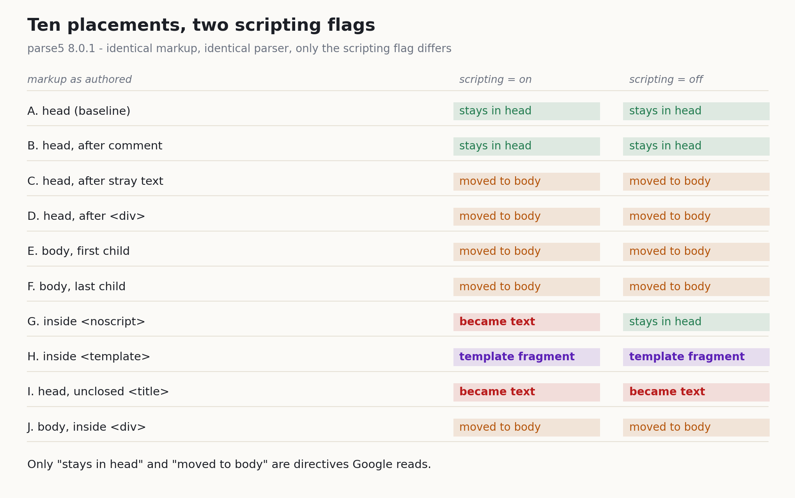

I ran ten HTML documents through a spec-compliant parser and counted where `<meta name="robots">` actually ended up. Two stayed in the head. Five moved to the body. In the remaining three, no meta element was built at all.

That third bucket is why I'm writing this. Head versus body is a difference you can see. Element versus no element is invisible until you parse. And from the point of view of anything reading directives, a node that was never built is far worse than a node in the wrong place.



## What actually closes the head

Start with the mechanism, because everything below depends on it.

A browser doesn't use your HTML string as written. It tokenizes it, then builds an element tree according to a fixed set of rules. That process is tree construction, and it carries a piece of state called the insertion mode. While the parser works through `<head>`, it sits in the "in head" mode.

The question that matters is when that mode ends. Most of us assume it ends at the `</head>` we typed. It doesn't. The moment anything appears that can't live in the head, the parser closes the head, opens the body, and reprocesses that content there. Your `</head>` is one of several exits, not the only one.

So the boundary between head and body isn't a value you declare. It's a result the parser computes. You can write a perfectly correct directive and still have no control over which side of that line it lands on. What the values themselves do is a separate topic, and I covered the directives one by one in [the meta line that decides whether AI Overviews cite your page](/en/blog/en/robots-snippet-controls-ai-overviews-2026). Today is only about location.

## The line Google added in March

Google's robots meta documentation has always said the same thing about placement: "Place the robots `meta` tag in the `<head>` section of a given page."

Then, on March 24, 2026, the [Search Central documentation update log](https://developers.google.com/search/updates) records a note added to the robots meta docs about how Google processes tags outside the HTML head. Here's that note, from the [robots meta tag specification](https://developers.google.com/search/docs/crawling-indexing/robots-meta-tag):

> Google Search doesn't enforce placement of meta robots in the HTML head and will respect robots meta tags in the body section of an HTML document as well.

Clear enough. The recommendation is still the head; the tolerance is now written down.

I'd push back on reading this as permission to start putting directives in the body. Almost nobody authors a robots meta tag in the body on purpose. In practice, a robots meta tag sitting in the body is a tag someone wrote in the head that the parser carried out of it.

Which means the note isn't handing you new freedom. It's taking one class of silent failure and making it stop being a failure, for Google. The failure itself is still there.

## Ten placements, one spec parser

I built ten documents in a throwaway sandbox. Every one contains the same tag, `<meta name="robots" content="noindex">`, and the only variable is where that line sits. I parsed them with parse5 8.0.1, which implements the HTML Standard's tree construction algorithm and lets you flip the scripting flag on and off.

After parsing, I walked the tree looking for `meta[name=robots]` and recorded the element's ancestor chain. When no element turned up, I also checked whether the original string survived somewhere as a text node.



| Markup | scripting on | scripting off |
| --- | --- | --- |
| A. in head (baseline) | `head > meta` | `head > meta` |
| B. in head, after a comment | `head > meta` | `head > meta` |
| C. in head, after stray text | `body > meta` | `body > meta` |
| D. in head, after a `<div>` | `body > meta` | `body > meta` |
| E. body, first child | `body > meta` | `body > meta` |
| F. body, last child | `body > meta` | `body > meta` |
| G. inside `<noscript>` | no element (text) | `head > noscript > meta` |
| H. inside `<template>` | separate fragment | separate fragment |
| I. in head, unclosed `<title>` | no element (text) | no element (text) |
| J. body, inside a `<div>` | `body > div > meta` | `body > div > meta` |

C and D are the accident I described above. A single text node reading `hello` inside the head was enough to push the following meta into the body. One `<div>` did the same. Comments are allowed in the head, so B came through untouched.

That gap is where real sites break. A tag manager snippet, a banner injected by the server, one non-whitespace character left behind by a template. Any of them can close the head early. And robots meta isn't the only thing that gets pushed out. Your canonical and your hreflang go with it.

C, D, and the deliberate E, F, and J all fall under what Google now says it respects. So far, so reassuring.

## A noindex inside noscript does the opposite of what it looks like

G is the row I stared at longest.

Wrapping `noindex` in `<noscript>` looks defensive. The intent reads as "keep the directive around even where scripts don't run." The actual behavior is inverted.

The HTML Standard defines how `noscript` works, and the wording is unusually blunt. The original is in [the noscript element section of the WHATWG HTML Standard](https://html.spec.whatwg.org/multipage/scripting.html#the-noscript-element):

> The `noscript` element is only effective in the HTML syntax, it has no effect in the XML syntax. This is because the way it works is by essentially "turning off" the parser when scripts are enabled, so that the contents of the element are treated as pure text and not as real elements.

With scripts enabled, the contents are plain text. Not elements. No meta node gets built, and with no node there's nothing to respect.

So which side is Google on? [JavaScript SEO Basics](https://developers.google.com/search/docs/crawling-indexing/javascript/javascript-seo-basics) answers it in one sentence: "Google Search runs JavaScript with an evergreen version of Chromium." Scripting on.

A robots directive inside `<noscript>` doesn't exist in the tree Google sees. It isn't ignored for being in the wrong place. There's simply no element to read.

There's a second fork here worth knowing about. I fed the same markup to jsdom 30.0.1 and changed nothing but the options.

```
runScripts=undefined      -> meta element present: true  | noscript text length: 0
runScripts=outside-only   -> meta element present: true  | noscript text length: 0
runScripts=dangerously    -> meta element present: false | noscript text length: 38
```

The default says the element is there. Turn scripting on and the same library says it isn't. Same string, same parser, opposite answers. And when teams wire jsdom into CI, they overwhelmingly leave the defaults alone. That's how you end up with a check that passes on a directive Google never sees.

H and I are simpler. Content inside `<template>` goes into a separate DocumentFragment rather than the document tree, so `document.querySelector` can't reach it and nothing reads it as a directive. I is an unclosed `<title>`, and since `title` swallows its content as text, everything after it became part of the title string. That one loses the element regardless of the scripting flag.

## My own checker was stricter than Google

Knowing where the directive lands, I turned to the code that goes looking for it. Internal linters, SEO crawlers, prerender verification: the lookup is almost always a one-line selector. I took the two forms I see most often and ran the same fixtures through jsdom 30.0.1 again.

| Markup | `document.head.querySelector` | `document.querySelector` |
| --- | --- | --- |
| A. in head (baseline) | found | found |
| C. in head, after stray text | missed | found |
| D. in head, after a `<div>` | missed | found |
| E. body, first child | missed | found |
| G. inside `<noscript>` | found | found |
| H. inside `<template>` | missed | missed |
| I. in head, unclosed `<title>` | missed | missed |
| K. injected by JS after parse | raw false / after script true | raw false / after script true |

The head-scoped lookup missed the directive in C, D, and E. Those three are exactly the placements Google documented as respected. My checker had become stricter than Google.

Strict isn't the problem. The direction is. It reports "no directive" on pages where the directive exists and works. Then in G it reports "directive present" when Google's tree contains nothing. Two errors, pointing opposite ways.

The document-scoped lookup caught C, D, and E correctly, and waved G straight through. Neither selector covers the table on its own.

## Anything the renderer has to build is a weaker guarantee

K is the case where the initial HTML has no robots meta and a script appends one to `document.head`. Absent right after parsing, present after the script runs. Obvious in isolation. On the search side, that "after" comes with a condition attached.

The same JavaScript SEO doc describes the rendering order:

> Googlebot queues all pages with a `200` HTTP status code for rendering, unless a robots `meta` tag or header tells Google not to index the page.

And then the warning that matters:

> When Google encounters the `noindex` tag, it may skip rendering and JavaScript execution, which means using JavaScript to change or remove the robots `meta` tag from `noindex` may not work as expected.

Meeting a noindex may cost you rendering and JavaScript execution entirely, so removing that noindex with JavaScript may never happen. Google's own advice is to keep noindex out of the original page code if you want the page indexed.

Lay that sentence over the parsing results and one rule falls out. **Bytes in the initial HTML are the strongest guarantee you have, and everything that depends on the renderer is weaker than that.** `<noscript>`, `<template>`, and JS injection are all weaker, for different reasons. The first two produce no element even when the renderer runs. The last one produces nothing unless it does.

If you want the layer before the crawler arrives, I wrote that up in [controlling AI crawlers properly with robots.txt](/en/blog/en/ai-crawler-control-robots-txt-llms-txt-2026). This post is the layer after.

## Five things to ask the parser before you ship

Turning the results into checks:

1. **Search the whole document.** Use `document.querySelector`, not `document.head.querySelector`. A head-scoped lookup reports "missing" on placements Google respects.
2. **Check the ancestor chain once you find it.** If `template` or `noscript` sits anywhere above the element, treat the directive as absent. Present-or-missing isn't enough; you need present-and-where.
3. **Parse with scripting enabled.** Google renders with evergreen Chromium, so match that condition. The jsdom default sits on the other side.
4. **Make head-versus-body a warning, not an error.** Google respects the body placement. But finding it there tells you the head closed early, so go check whether canonical and hreflang got pushed out alongside it.
5. **Put noindex in the initial HTML or leave it out.** Don't toggle it with JavaScript. That's Google's recommendation, not my preference.

Points 2 and 3 come to roughly this much code. Short enough to drop into an existing checker.

```js
import { parse } from 'parse5';

export function findRobotsDirective(html) {
  const doc = parse(html, { scriptingEnabled: true }); // same condition as Google
  const stack = [{ node: doc, path: [] }];
  while (stack.length) {
    const { node, path } = stack.pop();
    const name = node.tagName ?? node.nodeName;
    if (node.tagName === 'meta') {
      const attrs = Object.fromEntries(node.attrs.map((a) => [a.name, a.value]));
      if ((attrs.name ?? '').toLowerCase() === 'robots') {
        return { content: attrs.content, path: [...path, name] };
      }
    }
    // a template's contents live in its content fragment, not in childNodes
    if (node.tagName === 'template') stack.push({ node: node.content, path: [...path, name] });
    for (const child of node.childNodes ?? []) stack.push({ node: child, path: [...path, name] });
  }
  return null;
}

// usage: a template or noscript ancestor means the directive is never read
const found = findRobotsDirective(servedHtml);
const dead = found?.path.some((n) => n === 'template' || n === 'noscript');
```

I pointed this at my own site too. Three pages from the build output, same parser: 60 children in the head, zero of them elements that can't live there. No early close.

That's not a result worth bragging about, though. `BaseHead.astro` only emits robots meta when a `noindex` value is set, so most of my pages don't carry the tag at all. The head didn't stay quiet because it's well guarded. It stayed quiet because there was nothing to push out. The pages that do emit a directive, like the 404, are the risky ones, and I didn't count those this time.

One more boundary on the measurement. I measured how parse5 and jsdom implement the HTML Standard, not what Googlebot does. Both libraries implement the standard algorithm and Google uses Chromium, so I expect the tree construction to agree. Expecting is inference, not measurement. I didn't test Bing or any other crawler and I'm claiming nothing about them. And a directive sitting in the right place is a question of indexing and display eligibility, never of ranking.

## Only Google got lenient

One thing nagged at me the whole way through. Google deciding not to enforce placement looks like an engineering team accepting reality. The web's HTML is broken, and salvaging a directive out of a broken head serves users better than discarding it. That's a sound call.

What bothers me is that the leniency landed in exactly one place. My build pipeline still checks the head. No other engine has published the same sentence. And above all, a head that closed early is still a bug, whatever survived it. Robots meta making it through says nothing about the canonical that was sitting next to it.

So I've decided not to read the note as "the body is fine." I read it as "if you found it in the body, go find out where the head closed." That version is more useful at work. How long it stays useful, I don't know. Once other engines write the same line and frameworks take over head management completely, this check can disappear. We're not there.

Tracing where a directive vanishes inside a rendering pipeline is part of what I do for a living. The [contact page](/en/contact/) is the way in.

---

*Sources: Google Search Central's [Robots Meta Tags Specifications](https://developers.google.com/search/docs/crawling-indexing/robots-meta-tag), [JavaScript SEO Basics](https://developers.google.com/search/docs/crawling-indexing/javascript/javascript-seo-basics), [Latest Google Search Documentation Updates](https://developers.google.com/search/updates), and WHATWG's [HTML Standard, The noscript element](https://html.spec.whatwg.org/multipage/scripting.html#the-noscript-element) (all official). The four block quotes were pulled from those pages and compared against the fetched source on the spot, with the source link placed next to each quote. Measurement setup: 10 fixture documents in a throwaway sandbox directory, parse5 8.0.1, jsdom 30.0.1, Node 22.22, macOS, measured 13 August 2026. Probes are `scripts/probe-robots-meta-placement.mjs` and `scripts/probe-robots-meta-consumer.mjs`, raw data is `data/robots-meta-placement.json` and `data/robots-meta-consumer.json`, figures come from `scripts/chart-robots-meta-placement.py`. What I measured is the tree construction result of two libraries, not Googlebot's actual processing. I did not check Bing or other crawlers. Robots directives govern indexing and display eligibility, not ranking.*
