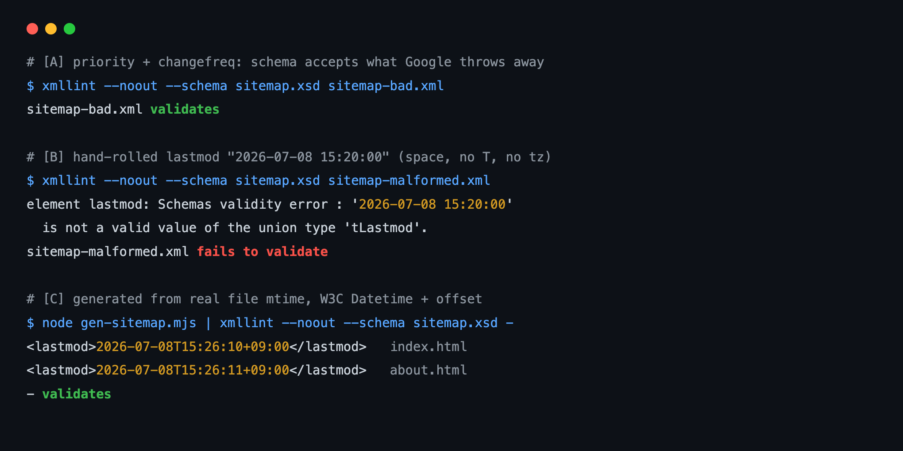

Open almost any generated sitemap and you'll find `<priority>1.0</priority>` on the homepage, `<changefreq>always</changefreq>` right below it. Both lines hit Google's crawler and get thrown away wholesale. The official docs say so in plain text.

That landed as a small letdown the first time I confirmed it. Half the fields our tooling reflexively emits are decoration. Worse: the one field Google does care about is the one most sites get wrong. That field is `lastmod`. Today I built three sitemaps and validated each against the official sitemaps.org schema (XSD) to see, in concrete terms, what passes and what's quietly discarded. Every log below is real output from a throwaway sandbox.

## Why priority 1.0 never reaches the crawler's decision

Clear one misconception first. sitemap.xml is not a file that tells search engines "crawl these pages in this order, at this importance." Plenty of developers treat `priority` like a ranking weight and `changefreq` like a crawl-frequency command. Neither is true.

Google states it doesn't use either field, right in the [official documentation](https://developers.google.com/search/docs/crawling-indexing/sitemaps/build-sitemap): "Google ignores `<priority>` and `<changefreq>` values." The reasoning is spelled out too. `changefreq` conceptually overlaps with `lastmod`, and `priority` is too subjective to reflect the real relative importance of pages on a site. Makes sense. Most sites stamp `priority 0.8` on every page, and if everything is 0.8, that's not signal, it's noise.

So two fields survive: `<loc>` (the URL) and `<lastmod>` (last-modified time). Of those, only `lastmod` actually feeds crawl scheduling. And getting that one field right is rarer than you'd think. Sites stamp the current time on every build. They hand-roll a date format and break it. They bump the timestamp daily on content that never changed. Each of those teaches Google to file your `lastmod` under "can't be trusted."

## Foundations first: what a sitemap and lastmod really do

Some readers have never hand-built a sitemap, so let's set the base.

sitemap.xml is a list of URLs your site hands to search engines. The format is standardized by the [sitemaps.org protocol 0.9](https://www.sitemaps.org/protocol.html): plain XML, a `<urlset>` wrapping repeated `<url>` entries. The only required field per entry is `<loc>`. Everything else, `<lastmod>`, `<changefreq>`, `<priority>`, is optional.

The key idea: a sitemap is a <strong>discovery</strong> aid. Search engines find pages by following links, but pages buried deep, or freshly published, are easy to miss. A sitemap says "here's this set of URLs" in one shot and raises the odds of discovery. That's the whole job. It doesn't lift rankings and it doesn't guarantee indexing.

So why is `lastmod` special? The most expensive decision a search engine makes about a known URL is when to revisit it. You can't recrawl tens of thousands of pages every day, so you have to prioritize: "this page changed recently, look at it first." `lastmod` is the input to exactly that scheduling. In the [2023 official blog post announcing the ping endpoint's retirement](https://developers.google.com/search/blog/2023/06/sitemaps-lastmod-ping), Google explains it uses lastmod as a signal for scheduling recrawls of already-discovered URLs. Accurate, it helps. Inaccurate, it's ignored. A conditional signal.

The definition of "accurate" is where it bites. The docs put it this way: Google uses lastmod only when it's "consistently and verifiably (for example by comparing to the last modification of the page) accurate." Unpacked: when the crawler actually fetches the page and compares its last-modified state, your sitemap's lastmod shouldn't contradict it. Stamp `new Date()` on every build while the body stays put, and after a few comparisons your whole site's lastmod loses credibility.

## Running three sitemaps through the official schema

Words don't land, so I measured it. In a throwaway sandbox I pulled the official sitemaps.org XSD and validated three sitemaps with `xmllint --schema`. One goal: see how far apart "passes the schema" and "useful to Google" really are.

The first is the shape you see everywhere. Every field filled in.

```xml
<url>
  <loc>https://example.com/</loc>
  <lastmod>2026-07-08</lastmod>
  <changefreq>always</changefreq>
  <priority>1.0</priority>
</url>
```

The second is the mistake you make hand-rolling a date: a space instead of the `T` separator, no timezone.

```xml
<lastmod>2026-07-08 15:20:00</lastmod>
```

The third is what I recommend. Drop the dead fields, keep a single lastmod in W3C Datetime with a timezone offset.

```xml
<lastmod>2026-07-08T15:20:11+09:00</lastmod>
```

Here's what the official XSD said about all three.

```
# [A] priority + changefreq, fully populated
$ xmllint --noout --schema sitemap.xsd sitemap-bad.xml
sitemap-bad.xml validates

# [B] hand-rolled lastmod "2026-07-08 15:20:00"
$ xmllint --noout --schema sitemap.xsd sitemap-malformed.xml
element lastmod: Schemas validity error :
  '2026-07-08 15:20:00' is not a valid value of the union type 'tLastmod'.
sitemap-malformed.xml fails to validate

# [C] accurate W3C Datetime lastmod only
$ xmllint --noout --schema sitemap.xsd sitemap-good.xml
sitemap-good.xml validates
```



Each result carries a different lesson.

[A] is the trap. A sitemap with `priority 1.0` and `changefreq always` <strong>passes</strong> schema validation. The XSD only checks grammar. That Google discards those fields is none of the schema's business. So the moment you trust a green "sitemap validator," you're happily hauling a load of fields that do nothing while believing you did it right. Passing validation and being useful are separate things.

[B] is the opposite: a bug that shows up constantly in real code. Assemble a date as a string without a library, reach for `Date`'s default string or a locale format instead of `toISOString()`, and you get this. The `tLastmod` union type accepts a bare date like `2026-07-08` or a full datetime like `2026-07-08T15:20:11+09:00`, but rejects the space-joined `2026-07-08 15:20:00`. This isn't Google ignoring you; it breaks at the schema level, and Search Console may bounce the entire sitemap as a parse error.

[C] passes. That's the target state.

## How to actually produce an accurate lastmod

So the real question is how to emit [C] automatically. One principle covers it: <strong>lastmod should be when the content actually changed, not when you built.</strong>

The simplest approximation is file modification time (mtime). For a static site, read each page's source-file mtime and use it directly as lastmod, and you've got a verifiable basis: "this is when the file last changed." Here's the generator from the sandbox.

```javascript
import { readdirSync, statSync } from 'node:fs';

// W3C Datetime + local timezone offset, e.g. 2026-07-08T15:26:10+09:00
function w3cLocal(d) {
  const p = (n) => String(n).padStart(2, '0');
  const tz = -d.getTimezoneOffset();
  const sign = tz >= 0 ? '+' : '-';
  return `${d.getFullYear()}-${p(d.getMonth() + 1)}-${p(d.getDate())}` +
    `T${p(d.getHours())}:${p(d.getMinutes())}:${p(d.getSeconds())}` +
    `${sign}${p(Math.floor(Math.abs(tz) / 60))}:${p(Math.abs(tz) % 60)}`;
}

const urls = readdirSync('content')
  .filter((f) => f.endsWith('.html'))
  .map((f) => ({
    loc: 'https://example.com/' + (f === 'index.html' ? '' : f.replace(/\.html$/, '')),
    lastmod: w3cLocal(statSync(`content/${f}`).mtime),
  }));
```

Create two files one second apart, run the generator, and this comes out.

```
<lastmod>2026-07-08T15:26:10+09:00</lastmod>   index.html
<lastmod>2026-07-08T15:26:11+09:00</lastmod>   about.html
```

Two pages, two distinct lastmods tracking their real modification times. That distinctness matters. If your whole site shares one build timestamp, Google reads it as "this site claims every page changes simultaneously, every time" and drops the signal. Trust accrues only when each file carries its own genuine change time.

mtime has a weakness. Check out the repo or deploy with rsync and mtime resets. So the sturdier approach uses version-control history. With Git, take each file's last commit time as its lastmod.

```bash
git log -1 --format=%cI -- content/about.html
# 2026-07-08T15:26:11+09:00
```

`%cI` prints the commit time as ISO 8601 (W3C Datetime compatible). No format conversion, and it maps more closely to "the last meaningful change to this file." I use this on a multilingual blog. The build-gate approach that enforces sitemap and hreflang in CI is written up in [the campaign that audited a multilingual blog and kept the fixes from regressing](/en/blog/en/multilingual-blog-technical-audit-campaign-2026), where the whole point was making the audit a loop rather than a one-off event.

One more rule. Only update lastmod on a <strong>meaningful</strong> change. Fixing a typo or bumping the footer year is not a reason to move lastmod. A sitemap that cries "changed!" every time becomes the boy who cried wolf; after a few wasted trips, the crawler ignores your lastmod. Raise the timestamp only when the body, the title, or the core structure actually changes.

## What lastmod won't do (the honest limits)

If you read this as "accurate lastmod makes crawling faster," you're half right. Here's the limits statement straight from the docs: "Keep in mind that submitting a sitemap is merely a hint: it doesn't guarantee that Google will download the sitemap or use the sitemap for crawling URLs on the site." Submitting a sitemap is a <strong>hint</strong>; there's no guarantee Google downloads it or crawls from it. Same with an accurate lastmod. It's a signal that <strong>can influence</strong> recrawl scheduling, not a command that <strong>forces</strong> a crawl.

And a sitemap has nothing to do with indexing. Getting crawled isn't getting indexed, and being in a sitemap isn't being in the index. Rankings, obviously, even less so. Whether it's structured data or a sitemap, no SEO element guarantees rankings, and that's Google's consistent official line. What lastmod buys you is a slightly better-grounded decision about revisit priority for pages already found. That's the whole of it.

One last thing: the sitemap ping endpoint was retired in 2023. You used to call `google.com/ping?sitemap=...` whenever a sitemap changed; that endpoint is dead now. Search engines fetch sitemaps on their own schedule. Announce the sitemap's location once via the `Sitemap:` line in robots.txt or via Search Console, and if you still have code pinging on every change, delete it. Deciding which crawlers see your sitemap and which you block ties into [controlling AI crawlers with robots.txt and llms.txt](/en/blog/en/ai-crawler-control-robots-txt-llms-txt-2026).

## A checklist you can apply today

Pulling it together, here's what you can do to sitemap.xml right now.

- <strong>Remove</strong> `<priority>` and `<changefreq>`. Google ignores them and other major engines effectively distrust them. Dropping them makes the file lighter and the intent clearer.
- Generate `<lastmod>` from content change time (file mtime or Git commit time), <strong>not</strong> from build time.
- Use W3C Datetime. A bare date (`2026-07-08`) is valid, but a full form with a timezone offset (`2026-07-08T15:20:11+09:00`) is more precise where you can manage it. The space-joined form breaks at the schema.
- Update lastmod only on a <strong>meaningful change</strong>. Don't mass-bump every page's timestamp on typos or automatic rebuilds.
- Add official XSD validation to CI. One line, `curl -s -o sitemap.xsd https://www.sitemaps.org/schemas/sitemap/0.9/sitemap.xsd && xmllint --noout --schema sitemap.xsd public/sitemap.xml`, catches parse errors before deploy.
- Register the sitemap's location once via the `Sitemap:` line in robots.txt and in Search Console. Delete any per-change ping code, since that's been retired.

A sitemap alone won't move rankings. But whether the crawler follows your changes <strong>on time and with trust</strong> comes down to the accuracy of this small signal. And that accuracy rests not on a green schema check, but on whether lastmod stays consistent with the real state of your content.

Structured data or sitemaps, how search and AI crawlers actually receive the signals your server emits isn't something you catch by reading docs alone. The fact that [AI crawlers don't run your JavaScript and miss client-side pages entirely](/en/blog/en/ai-crawlers-dont-render-javascript-csr-2026), for instance, only shows up once you hit the page with curl yourself. If you're weighing server-side rendering and crawler handling, or want the sitemap and hreflang pipeline on a multilingual site reviewed and locked down with a CI gate, I take on consulting and implementation work personally. Reach me through the contact link on my profile and tell me about your setup.
