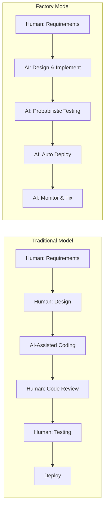
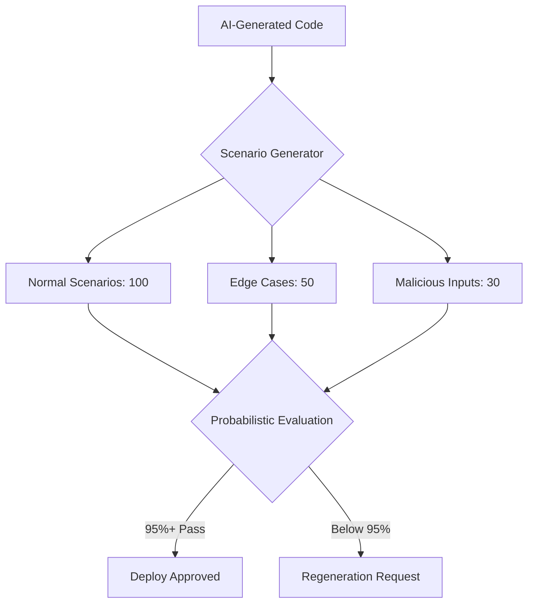
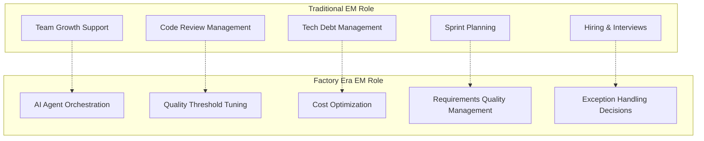

## Overview

"Humans don't write a single line of code." Just a year ago, this sounded like an exaggerated prediction. In 2026, it's emerging as an actual operational model.

The <strong>Software Factory</strong> model presented in iwashi86's "[Software Factories And The Agentic Moment](https://iwashi.co/2025/02/01/Software-Factories-And-The-Agentic-Moment)" goes beyond simply using AI coding tools — it fundamentally redesigns the entire software development process. It eliminates the stage where human developers write or review code, replacing it with AI agents autonomously operating the pipeline from requirements to deployment.

This article analyzes the core elements of the factory model: the <strong>zero-code process</strong>, <strong>scenario-based probabilistic testing</strong>, <strong>$1,000/day computing cost structure</strong>, and the <strong>fundamental transformation of the EM (Engineering Manager) role</strong>.

## The Zero-Code Development Process

### Traditional Model vs. Factory Model

Traditional AI-assisted development kept human developers at the center. GitHub Copilot suggests code, humans review and modify. The Software Factory model flips this premise entirely.



In the factory model, the human role concentrates on <strong>defining "what to build."</strong> The "how to build it" belongs entirely to the AI agents.

### Why Code Review Disappears

Humans not reviewing code doesn't mean abandoning quality. Rather, it acknowledges the <strong>limitations of human review</strong>.

- Human reviewers have a physical limit on the number of PRs they can process per day
- In an environment where AI agents generate hundreds of PRs daily, human review becomes a bottleneck
- Instead, <strong>scenario-based probabilistic testing</strong> replaces the quality gate function

## Scenario-Based Probabilistic Testing

### The Limits of Deterministic Testing

Traditional software testing is deterministic: "Given input A, output B must result." But AI-generated code requires a different approach.



### How Probabilistic Testing Works

Probabilistic testing doesn't require 100% pass rates. Instead, it verifies <strong>statistically significant accuracy levels</strong>.

1. <strong>Automated scenario generation</strong>: AI automatically creates diverse usage scenarios
2. <strong>Mass execution</strong>: Hundreds to thousands of scenarios run in parallel
3. <strong>Statistical evaluation</strong>: Overall pass rates, performance distributions, and error patterns are analyzed
4. <strong>Threshold-based decisions</strong>: Deployment is approved when predefined pass rates (e.g., 95%) are exceeded

This approach mirrors <strong>Statistical Quality Control (SQC)</strong> in manufacturing — guaranteeing overall quality through statistical sampling rather than inspecting every single product.

### The Inversion of Testing and Generation Costs

An interesting phenomenon: <strong>testing costs exceed code generation costs</strong>. Code generation is a one-time process, but validating that code's quality requires running hundreds of scenarios. This is the primary driver behind the $1,000/day computing cost.

## $1,000/Day in Computing Costs

### Cost Structure Breakdown

The estimate of approximately $1,000/day to operate a Software Factory breaks down as follows:

| Item | Share | Daily Cost (Est.) |
|------|-------|-------------------|
| AI Agent Inference (Code Generation) | 30% | ~$300 |
| Scenario-Based Test Execution | 40% | ~$400 |
| CI/CD Pipeline | 15% | ~$150 |
| Monitoring & Rollback Systems | 15% | ~$150 |

### Comparison with Developer Labor Costs

Estimating a senior developer's daily cost at $500–$800, the $1,000/day compute cost equals roughly <strong>1.5–2 developers</strong>. But the AI factory's throughput is tens of times that of a human team.

```
Factory Model Economics:
- Daily cost: ~$1,000 (compute)
- Daily output: 200-500 PRs processed
- Human team equivalent: 20-50 developers needed
- Human team daily cost: $10,000-$40,000
```

This 10x+ cost efficiency forms the economic foundation of the Software Factory model. Of course, this comparison applies to <strong>repetitive, standardized tasks</strong> — creative work like novel architecture design still requires human involvement.

## The Transformation of the EM Role

### The Traditional EM Role

Traditional EMs performed roles like:

- Supporting team members' technical growth
- Managing code review processes
- Sprint planning and task distribution
- Managing technical debt
- Hiring and interviewing

### The EM in the Factory Era

In the Software Factory model, the EM role transforms fundamentally.



In detail:

1. <strong>AI agent orchestration</strong>: Designing which agents to deploy in what combinations and defining inter-agent collaboration patterns
2. <strong>Quality threshold tuning</strong>: Adjusting probabilistic test pass criteria to business requirements — 99.9% for payment systems, 95% for admin panels
3. <strong>Cost optimization</strong>: Deciding how to allocate the $1,000/day compute budget across tasks
4. <strong>Requirements quality management</strong>: AI needs clear requirements to generate correct code. Ambiguous requirements produce ambiguous outputs
5. <strong>Exception handling</strong>: Making final decisions on edge cases that AI cannot resolve

### From EM to "Factory Manager"

The core of this transformation: EMs shift from <strong>managing people</strong> to <strong>managing systems</strong>. Instead of growing human team members' capabilities, the focus becomes optimizing AI agent pipeline efficiency.

This mirrors the pattern in manufacturing where floor supervisors became "plant managers" with the introduction of automated production lines.

## Practical Challenges and Limitations

### Where the Factory Model Excels

- CRUD-centric business logic
- Standardized API development
- Repetitive UI component implementation
- Migration and refactoring tasks

### Where Humans Are Still Needed

- Fundamental system architecture design
- Decisions requiring deep business domain understanding
- Regulatory compliance
- Emotional evaluation of user experience

### Organizational Challenges

- <strong>Trust</strong>: Building organizational confidence in deploying AI-generated code to production without human review
- <strong>Accountability</strong>: Determining responsibility for AI-created bugs
- <strong>Growth</strong>: How junior developers grow in an environment where they don't write code

## Conclusion

The Software Factory model deserves to be called an <strong>industrial revolution</strong> in software development. Just as manufacturing transitioned from craftwork to factory production, software development is shifting from artisanal handcrafting to automated factory lines.

The key point: this change doesn't make developers unnecessary — it <strong>redefines the developer's role</strong>. From code writers to system designers and supervisors. From team managers to factory line optimizers.

The $1,000/day computing cost is the admission price for this transition. And that cost will continue to drop. The real question isn't "Is this model possible?" but <strong>"Is our organization ready for this transition?"</strong>

## References

- [Software Factories And The Agentic Moment — iwashi86](https://iwashi.co/2025/02/01/Software-Factories-And-The-Agentic-Moment)
- [Anthropic Claude's Agentic Coding Patterns](https://docs.anthropic.com/en/docs/agents)
- [Statistical Quality Control in Manufacturing — ASQ](https://asq.org/quality-resources/statistical-quality-control)
