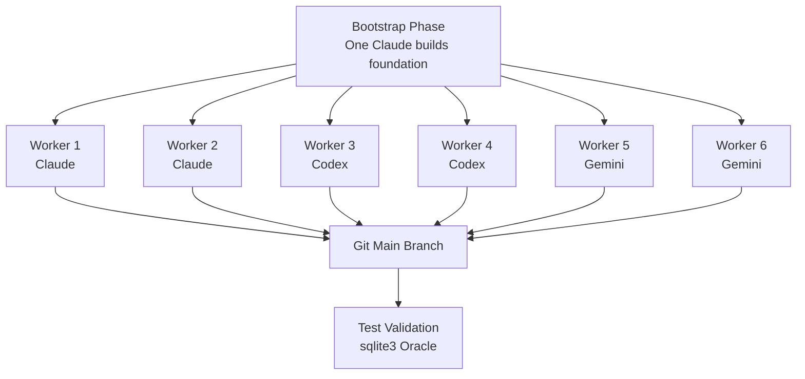
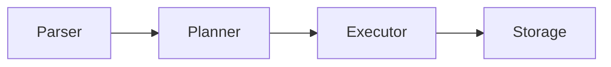

## Overview

Six AI agents (2 Claude, 2 Codex, 2 Gemini) <strong>collaborated in parallel</strong> to build a SQLite-compatible database engine in Rust. The result: approximately 19,000 lines of code passing 282 unit tests — a remarkably complete system.

This experiment was detailed in [Kian Kyars' blog post](https://kiankyars.github.io/machine_learning/2026/02/12/sqlite.html) and gained 63 points on Hacker News.

## Architecture: Software Development as a Distributed System

The core idea is simple: <strong>treat software engineering like a distributed system</strong>. Coordination happens through git, lock files, tests, and merge discipline.

### Workflow



### Agent Loop

Each agent runs an infinite loop:

1. Pull latest main branch
2. Claim one scoped task (lock file)
3. Implement + test against sqlite3 as oracle
4. Update shared progress docs/notes
5. Push

## Implemented Features

The completeness of this swarm-built SQLite clone is remarkable:

| Layer | Components |
|-------|------------|
| <strong>Parser</strong> | SQL parser |
| <strong>Planner</strong> | Stats-aware query planning |
| <strong>Executor</strong> | Volcano model executor |
| <strong>Storage</strong> | Pager, B+ trees |
| <strong>Transactions</strong> | WAL, recovery, transaction semantics |
| <strong>Features</strong> | JOINs, aggregates, indexing, grouped aggregates |

Total: <strong>154 commits</strong> over 2 days (2026-02-10 to 02-12).

## The Coordination Tax

The most fascinating finding is the <strong>coordination tax</strong>.

```
Total commits: 154
Coordination commits: 84 (54.5%)
├── Lock claims
├── Lock releases
├── Stale lock cleanup
└── Task coordination
```

<strong>54.5% of all commits were pure coordination overhead</strong>. This demonstrates that multi-agent parallel throughput depends heavily on lock hygiene and stale-lock cleanup discipline.

## Success Factors

### 1. Oracle-Based Validation + High Test Cadence

Using sqlite3 as the ground truth oracle for validation was decisive. Fast feedback loops through `cargo test` and `./test.sh` kept agents on track.

### 2. Strong Module Boundaries



Clear module boundaries — parser → planner → executor → storage — allowed agents to work on <strong>orthogonal slices</strong> with minimal merge conflicts.

### 3. Shared State Docs as Runtime, Not Documentation

PROGRESS.md and design notes functioned as <strong>system runtime state</strong>, not mere documentation. This highlights the importance of shared state management in multi-agent collaboration.

## Limitations and Lessons

### The Missing Coalescer

A coalescer agent was built to clean up duplication and drift, but it only ran once at project end. Gemini couldn't complete the full deduplication and stopped midway. <strong>The coalescer should run as frequently as the other agents</strong>.

### Untrackable Token Usage

Different platforms use different usage formats, making it impossible to determine which agent contributed most.

### Documentation Explosion

PROGRESS.md grew to 490 lines, and the notes directory accumulated massive amounts of documentation — a visible cost of inter-agent communication.

## Connection to Prior Work

This experiment aligns with [Verdent AI's multi-agent SWE-bench results](/en/blog/multi-agent-swe-bench-verdent). While Verdent demonstrated parallel execution effectiveness on benchmarks, this SQLite project proves <strong>multi-agent division of labor on real system construction</strong>.

Key shared insights:

- Give agents a <strong>narrow interface</strong>, a <strong>common truth source</strong>, and <strong>fast feedback</strong>, and you get compounding throughput on real systems code
- Tests are the <strong>anti-entropy force</strong>

## Key Summary

| Metric | Value |
|--------|-------|
| Agent count | 6 (Claude 2 + Codex 2 + Gemini 2) |
| Lines of code | ~19,000 (Rust) |
| Commits | 154 |
| Coordination overhead | 54.5% |
| Tests | 282 passing |
| Development time | 2 days |

## Conclusion

This experiment reveals both the promise and limits of multi-agent development. Six agents building a working 19,000-line database engine in 2 days is impressive, but the fact that over half of all commits were coordination overhead cannot be ignored.

<strong>Parallelism is powerful, but only with strict task boundaries</strong>. And tests aren't just quality assurance — they're the core mechanism fighting entropy in agent systems.

## References

- [Building SQLite With a Small Swarm — Kian Kyars](https://kiankyars.github.io/machine_learning/2026/02/12/sqlite.html)
- [GitHub: kiankyars/sqlite](https://github.com/kiankyars/sqlite)
- [GitHub: kiankyars/parallel-ralph](https://github.com/kiankyars/parallel-ralph)
- [Anthropic: Building a C Compiler](https://www.anthropic.com/engineering/building-c-compiler)
- [Cursor: Scaling Agents](https://cursor.com/blog/scaling-agents)
