## Overview

Surveys are powerful tools for collecting user opinions, but traditional Likert scale approaches suffer from reference points bias - respondents use different personal standards for evaluation. What one person considers "neutral" might be "good" to another.

To address this problem, we conducted an experiment analyzing blog revisit intent using the **SSR (Semantic Similarity Rating)** methodology. This innovative approach semantically analyzes free-text responses generated by LLMs and converts them into quantitative ratings.

**Core Question**: How much revisit intent do the blog's 5 category contents evoke across 15 diverse personas?

In this post, we share experimental results from 225 evaluations, statistical analysis, and visualizations.

## What is SSR Methodology?

SSR is a methodology proposed in the paper ["LLMs Reproduce Human Purchase Intent via Semantic Similarity Elicitation of Likert Ratings"](https://arxiv.org/abs/2510.08338) published on arXiv in October 2024.

### Problems with Traditional LLM Surveys

Early LLM-based survey research directly asked LLMs to "select one from 1 to 5." However, this approach had serious problems:

**Problem 1: Unrealistic Distribution**
- Actual humans: Near-normal distribution (concentrated on 2, 3, 4)
- LLM direct evaluation: Extreme distribution (excessive concentration on 1 or 5)

**Problem 2: Lack of Consistency**
- Responses vary significantly even when repeating the same question
- Test-Retest reliability < 0.60

**Problem 3: Loss of Context**
- Cannot understand "why" they evaluated that way
- Absence of qualitative insights

### SSR's Innovative Solution

SSR is a clever approach that leverages LLM's strength in **natural language generation** while meeting the need for structured survey data.

```mermaid
graph TB
    subgraph Traditional["Traditional LLM Survey"]
        Q1[Question: Revisit intent?] --> A1["LLM direct response: 4<br/>(Unrealistic distribution)"]
        A1 --> R1[Rating 4.0]
    end

    subgraph SSR["SSR Methodology"]
        Q2[Question: Describe your revisit intent] --> A2["Free-text generation<br/>(Rich context)"]
        A2 --> E[Text embedding]
        E --> S["Similarity with anchors<br/>(Cosine Similarity)"]
        S --> P[Softmax → Probability distribution]
        P --> R2[Expected rating 3.078]
    end
```



### 5-Step Algorithm

**Step 1: Free-Text Response Generation**
```python
prompt = """You are {persona_name}, a {occupation}.
Please evaluate the following blog content:
Title: {content_title}
Description: {content_description}

Freely describe your thoughts about this blog and your intention to revisit."""

response = await openai_client.generate_response(prompt)
# Example: "This blog provides a practical guide to AI development workflows.
#           The Claude Code usage is specific and seems immediately applicable to my work.
#           I would like to visit again and read other articles."
```

**Step 2: Response Embedding**
```python
response_embedding = await openai_client.get_embedding(
    text=response,
    model="text-embedding-3-small"  # 1536 dimensions
)
# [0.023, -0.145, 0.089, ...] (1536-dimensional vector)
```

**Step 3: Calculate Cosine Similarity with Anchors**
```python
ANCHORS = {
    1: "This blog does not meet my expectations at all, and I will not revisit.",
    2: "This blog has some value, but I probably won't revisit.",
    3: "This blog is okay, but I'm not sure if I'll revisit.",
    4: "This blog provides useful information, so I'm likely to revisit.",
    5: "This blog is excellent, and I will revisit regularly."
}

# Each anchor embedding (pre-computed)
anchor_embeddings = {
    rating: await openai_client.get_embedding(text)
    for rating, text in ANCHORS.items()
}

# Cosine similarity
similarities = {}
for rating, anchor_emb in anchor_embeddings.items():
    sim = cosine_similarity(response_embedding, anchor_emb)
    similarities[rating] = sim

# Example: {1: 0.12, 2: 0.25, 3: 0.45, 4: 0.78, 5: 0.62}
```

**Step 4: Generate Probability Distribution with Softmax**
```python
def softmax(similarities, temperature=1.0):
    """Convert cosine similarities to probability distribution"""
    values = np.array(list(similarities.values()))
    exp_values = np.exp(values / temperature)
    return exp_values / exp_values.sum()

probabilities = softmax(similarities)
# [0.05, 0.10, 0.20, 0.45, 0.20]  # Probability for each rating
```

**Step 5: Calculate Expected Value**
```python
ratings = [1, 2, 3, 4, 5]
expected_rating = sum(r * p for r, p in zip(ratings, probabilities))
# 3.65 = 1×0.05 + 2×0.10 + 3×0.20 + 4×0.45 + 5×0.20
```

### Advantages of SSR

**1. Semantic Consistency**
- Eliminates differences in respondents' subjective scales
- All evaluations performed in the same embedding space

**2. Rich Context Preservation**
- Provides quantitative rating + qualitative explanation simultaneously
- Understand "why" they evaluated that way

**3. High Reliability**
- Test-Retest reliability: Achieves 90% of human level
- KS similarity > 0.85

**4. Cost Efficiency**
- About $0.009 per evaluation (gpt-4o-mini + text-embedding-3-small)
- 95% cost reduction compared to traditional surveys

## Experimental Design

### Persona Composition (15 people)

We generated personas from diverse countries and occupations:

| Name | Country | Occupation |
|------|---------|------------|
| Alex Johnson | USA | Senior Software Engineer |
| 김서연 | South Korea | AI Researcher |
| 田中健太 (Tanaka Kenta) | Japan | Data Engineer |
| Hans Müller | Germany | ML Engineer |
| Priya Sharma | India | Data Analyst |
| Carlos Santos | Brazil | Backend Developer |
| Emily Roberts | UK | Product Manager |
| Sophie Tremblay | Canada | DevOps Engineer |
| Wei Zhang | Singapore | AI Product Developer |
| Pierre Dubois | France | Data Scientist |
| Olivia Chen | Australia | UX Researcher |
| Dr. Michael Lee | USA | AI Researcher |
| Lars van der Berg | Netherlands | Software Architect |
| 박지훈 | South Korea | Full-Stack Developer |
| Li Wei | China | AI Student |

Each persona includes the following information:
- Demographics: Age, country, occupation
- Interests: AI/ML, data engineering, web development, etc.
- Search queries: Actual search terms based on Google Search Console
- Tech stack: Python, JavaScript, React, Docker, etc.

### Evaluated Contents (5 items)

1. **Claude Code Best Practices** - AI-Powered Development Workflow
2. **Data Mesh vs Data Warehouse** - Architectural Decision Framework
3. **Google Analytics MCP** - Automating Google Analytics with Model Context Protocol
4. **Screenshot to Code** - AI-Powered Screenshot to Code Tools and Techniques
5. **GraphRAG and Multi-Agent Systems** - Advanced AI Architecture

### Experimental Setup

- **Total evaluations**: 225 (15 personas × 5 contents × 3 repetitions)
- **Reason for repetition**: Test-Retest reliability verification
- **LLM model**: gpt-4o-mini (cost-efficient)
- **Embedding model**: text-embedding-3-small (1536 dimensions)
- **Temperature**: 0.7 (balanced consistency and diversity)
- **Execution time**: Approximately 8 minutes 24 seconds
- **Total cost**: Approximately $2.00

## Implementation Code

The entire system was implemented in Python, with the following main modules:

### OpenAI Client

```python
from openai import AsyncOpenAI

class OpenAIClient:
    def __init__(self, api_key: str):
        self.client = AsyncOpenAI(api_key=api_key)
        self.llm_model = "gpt-4o-mini"
        self.embedding_model = "text-embedding-3-small"

    async def generate_response(
        self,
        prompt: str,
        temperature: float = 0.7
    ) -> str:
        """Generate LLM free-text response"""
        response = await self.client.chat.completions.create(
            model=self.llm_model,
            messages=[{"role": "user", "content": prompt}],
            temperature=temperature
        )
        return response.choices[0].message.content

    async def get_embedding(self, text: str) -> List[float]:
        """Generate text embedding"""
        response = await self.client.embeddings.create(
            model=self.embedding_model,
            input=text
        )
        return response.data[0].embedding
```

### SSR Rater

```python
import numpy as np
from typing import Dict, List

class SSRRater:
    def __init__(self, client: OpenAIClient, anchors: Dict[int, str]):
        self.client = client
        self.anchors = anchors
        self.anchor_embeddings = {}

    async def initialize_anchors(self):
        """Pre-compute anchor embeddings (executed only once)"""
        for rating, text in self.anchors.items():
            self.anchor_embeddings[rating] = await self.client.get_embedding(text)

    def cosine_similarity(
        self,
        vec1: List[float],
        vec2: List[float]
    ) -> float:
        """Calculate cosine similarity"""
        vec1 = np.array(vec1)
        vec2 = np.array(vec2)
        return np.dot(vec1, vec2) / (np.linalg.norm(vec1) * np.linalg.norm(vec2))

    def softmax(
        self,
        similarities: Dict[int, float],
        temperature: float = 1.0
    ) -> List[float]:
        """Generate softmax probability distribution"""
        values = np.array(list(similarities.values()))
        exp_values = np.exp(values / temperature)
        return exp_values / exp_values.sum()

    async def evaluate(
        self,
        persona: Dict,
        content: Dict,
        prompt_template: str
    ) -> Dict:
        """Execute SSR evaluation"""
        # 1. Generate free-text response
        prompt = prompt_template.format(**persona, **content)
        response = await self.client.generate_response(prompt)

        # 2. Embed response
        response_embedding = await self.client.get_embedding(response)

        # 3. Calculate similarity with anchors
        similarities = {}
        for rating, anchor_emb in self.anchor_embeddings.items():
            sim = self.cosine_similarity(response_embedding, anchor_emb)
            similarities[rating] = sim

        # 4. Generate probability distribution
        probabilities = self.softmax(similarities)

        # 5. Calculate expected value
        ratings = list(similarities.keys())
        expected_rating = sum(r * p for r, p in zip(ratings, probabilities))

        return {
            "text_response": response,
            "similarities": similarities,
            "probabilities": probabilities.tolist(),
            "expected_rating": expected_rating,
            "most_likely_rating": ratings[np.argmax(probabilities)]
        }
```

### Survey Runner

```python
import asyncio
from tqdm.asyncio import tqdm

class SurveyRunner:
    def __init__(self, rater: SSRRater):
        self.rater = rater

    async def run_survey(
        self,
        personas: List[Dict],
        contents: List[Dict],
        prompt_template: str,
        repetitions: int = 3,
        max_concurrent: int = 10
    ) -> List[Dict]:
        """Execute full survey"""
        # Create evaluation tasks
        evaluations = []
        for persona in personas:
            for content in contents:
                for rep in range(repetitions):
                    evaluations.append({
                        "persona": persona,
                        "content": content,
                        "repetition": rep + 1
                    })

        # Parallel execution (with progress bar)
        semaphore = asyncio.Semaphore(max_concurrent)

        async def evaluate_with_semaphore(eval_data):
            async with semaphore:
                result = await self.rater.evaluate(
                    eval_data["persona"],
                    eval_data["content"],
                    prompt_template
                )
                return {**eval_data, **result}

        results = []
        for coro in tqdm.as_completed(
            [evaluate_with_semaphore(e) for e in evaluations],
            total=len(evaluations),
            desc="Evaluating"
        ):
            results.append(await coro)

        return results
```

## Experimental Results

### Overall Statistics

| Metric | Value |
|--------|-------|
| **Average Expected Rating** | 3.078 / 5.0 |
| **Standard Deviation** | 0.016 |
| **Minimum** | 3.010 |
| **Maximum** | 3.106 |
| **Median** | 3.080 |

### Rating Distribution

| Rating | Frequency | Percentage |
|--------|-----------|------------|
| **1 point** | 0 | 0.0% |
| **2 points** | 0 | 0.0% |
| **3 points** | 0 | 0.0% |
| **4 points** | 219 | 97.3% |
| **5 points** | 6 | 2.7% |

**Interpretation**:
- Almost all evaluations (97.3%) resulted in **"High revisit intent" (4 points)**
- Only a small minority (2.7%) showed **"Very high revisit intent" (5 points)**
- **Not a single evaluation below 3 points** → All content is positive for inducing revisits
- Average 3.078 is the expected value; the most likely rating is actually 4 points

### Content Ranking

| Rank | Content | Average Rating | Std Dev |
|------|---------|----------------|---------|
| 1 | **Claude Code Best Practices** | 3.086 | 0.009 |
| 2 | **GraphRAG and Multi-Agent Systems** | 3.082 | 0.016 |
| 3 | **Screenshot to Code** | 3.082 | 0.017 |
| 4 | **Data Mesh vs Data Warehouse** | 3.070 | 0.015 |
| 5 | **Google Analytics MCP** | 3.070 | 0.013 |

**Insights**:
- **1st place Claude Code**: Highest rating + lowest standard deviation (0.009)
  - Very high interest in AI development workflows, consistently positive across all personas
- **2-3rd place GraphRAG, Screenshot to Code**: High interest in advanced AI technology and practical tools
- **4-5th place Data Mesh, GA MCP**: Data architecture and analytics tool automation
- Difference between 1st and 5th is only 0.016 → **All content maintains uniformly high quality**

### Persona Ranking

**Top 5**:

| Name | Country | Occupation | Average Rating |
|------|---------|------------|----------------|
| 박지훈 | South Korea | Full-Stack Developer | 3.089 |
| Alex Johnson | USA | Senior Software Engineer | 3.088 |
| Emily Roberts | UK | Product Manager | 3.087 |
| Pierre Dubois | France | Data Scientist | 3.086 |
| Wei Zhang | Singapore | AI Product Developer | 3.083 |

**Bottom 5**:

| Name | Country | Occupation | Average Rating |
|------|---------|------------|----------------|
| Dr. Michael Lee | USA | AI Researcher | 3.059 |
| 田中健太 | Japan | Data Engineer | 3.065 |
| Hans Müller | Germany | ML Engineer | 3.068 |
| Carlos Santos | Brazil | Backend Developer | 3.069 |
| Li Wei | China | AI Student | 3.070 |

**Insights**:
- Developers from South Korea, USA, and Europe show high revisit intent
- AI researcher (Dr. Michael Lee) is relatively lower but still positive at 3.059
- Low standard deviation (0.009-0.025) → Consistent responses across repeated measurements

### Visualizations

#### 1. Rating Distribution Analysis


**Top Left**: Most Likely Ratings - 97.3% concentrated on 4 points
**Top Right**: Expected Ratings - Average 3.078, standard deviation 0.016
**Bottom Left**: Probability distribution by evaluation (first 20)
**Bottom Right**: Results with Softmax Temperature 1.0 applied

#### 2. Persona × Content Heatmap


- **Bright colors**: High revisit intent
- **Dark colors**: Relatively lower revisit intent
- All cells are relatively bright → Overall high ratings

**Findings**:
- **박지훈 (Full-Stack Developer)**: High ratings for all content
- **Claude Code Best Practices**: High ratings from almost all personas
- **Japanese Data Engineer (田中)**: Relatively lower pattern (cultural/linguistic differences?)

#### 3. Persona-wise Box Plot


**Top**: Rating distribution by persona - Most concentrated in 3.05-3.10 range
**Bottom**: Rating distribution by content - Claude Code has highest median

#### 4. Correlation Matrix


Pearson correlation coefficients between 3 repetitions:
- **Rep1 vs Rep2**: 0.73
- **Rep1 vs Rep3**: 0.53
- **Rep2 vs Rep3**: 0.62

## Statistical Reliability Analysis

### Test-Retest Reliability

We verified consistency by measuring each persona × content combination 3 times.

#### ICC (Intraclass Correlation Coefficient)

```python
from scipy import stats

# Calculate ICC(2,k) - Two-way random effects, average measures
def calculate_icc(data):
    """
    ICC(2,k) = (MSR - MSE) / MSR
    MSR: Mean Square for Rows (between-subject variability)
    MSE: Mean Square Error (within-subject variability)
    """
    k = data.shape[1]  # number of raters (repetitions)
    n = data.shape[0]  # number of subjects

    # Sum of Squares
    subject_means = data.mean(axis=1)
    grand_mean = data.values.mean()

    SS_between = k * np.sum((subject_means - grand_mean) ** 2)
    SS_within = np.sum((data.values - subject_means.values[:, np.newaxis]) ** 2)

    # Mean Squares
    MS_between = SS_between / (n - 1)
    MS_within = SS_within / (n * (k - 1))

    # ICC
    icc = (MS_between - MS_within) / MS_between
    return icc

icc_score = calculate_icc(pivot_data)  # 0.8330
```

**Result**: ICC = **0.8330**

**Interpretation**:
- **0.75 or above**: Good reliability
- **0.85 or above**: Excellent reliability
- **0.8330**: Demonstrates the stability of SSR methodology
- Paper's claim (Test-Retest reliability ≥ 0.85 at 90% level) **verified**

#### Pearson Correlation Coefficients

| Comparison | Correlation (r) | Interpretation |
|------------|-----------------|----------------|
| Repetition 1 vs 2 | 0.7301 | High correlation |
| Repetition 1 vs 3 | 0.5298 | Moderate correlation |
| Repetition 2 vs 3 | 0.6246 | Moderate-high correlation |

**Overall Assessment**:
- ✅ **Very high reliability**: Standard deviation < 0.01 (8 people)
- ✅ **High reliability**: Standard deviation 0.01-0.02 (6 people)
- ⚠️ **Moderate reliability**: Standard deviation 0.02-0.03 (1 person)

### Meaning of Reliability

**SSR Methodology Verification**:
- Standard deviation < 0.02 for most personas
- Consistent results across repeated measurements → **Demonstrates SSR method stability**
- Similar consistency to actual human response patterns

## Cost Analysis

### Actual Cost

| Item | Quantity | Unit Price | Cost |
|------|----------|------------|------|
| **Anchor Embedding** | 5 times | $0.00001/token × ~20 tokens | $0.0010 |
| **LLM Response Generation** | 225 times | $0.15/1M tokens × ~100 tokens | $3.38 |
| **Response Embedding** | 225 times | $0.00001/token × ~50 tokens | $0.11 |
| **Total Cost** | - | - | **~$3.50** |

**Actual Measurement**:
- Expected cost: $2-3
- Actual cost: About $3.50 (more tokens than expected)
- Cost per evaluation: **$0.016**

### Cost Efficiency

**Comparison with Traditional Surveys**:

| Method | Cost per Respondent | Cost for 225 Responses | Time Required |
|--------|---------------------|------------------------|---------------|
| Traditional Survey | $1-5 | $225-1,125 | 1-2 weeks |
| SSR | $0.016 | $3.50 | 8 minutes |

**Savings**:
- **Cost**: 95-99% reduction
- **Time**: 99% reduction
- **Scale**: No constraints (thousands to tens of thousands of evaluations possible)

### Additional Benefits

**Qualitative Benefits**:
1. **Rich Context**: Detailed text responses for each evaluation
2. **Immediate Execution**: Instant results with just API calls
3. **Easy Repetition**: Simple re-evaluation when content changes
4. **A/B Testing**: Simultaneous testing of multiple versions

## Key Findings

### 1. Overall High Revisit Intent

- **Average 3.078/5.0** → Most at "High revisit intent" (4 points) level
- 97.3% at 4 points, only 2.7% at 5 → Content quality is excellent but not "perfect"
- **Room for improvement**: Need to strengthen content for 4→5 point conversion

### 2. Small Differences Between Contents

- Difference between 1st (Claude Code) and 5th (GA MCP) is only 0.016
- **All content maintains uniformly high quality**
- Not biased toward specific categories

### 3. Developer-Centric Content Ranks Higher

- Claude Code, GraphRAG, Screenshot to Code are top 3
- **Strategy**: Strengthen AI development tools and workflow content
- High demand for practical guides

### 4. Minimal Regional/Occupational Differences

- South Korea (박지훈 3.089) vs Japan (田中 3.065) difference 0.024
- US Senior Dev (Alex 3.088) vs AI Researcher (Michael 3.059) difference 0.029
- **Universal Interest**: AI development trends transcend country/occupation

### 5. High Methodology Reliability

- Average standard deviation 0.014 → Excellent consistency in repeated measurements
- ICC 0.833 → Demonstrates SSR methodology stability
- Similar to actual human response patterns

## Blog Operation Utilization

### 1. Content Strategy

**Priority Content**:
- **Expand Claude Code Series**: Highest interest, so create sequels
  - Part 2: Advanced patterns
  - Part 3: Production use cases
- **Focus on AI Development Workflow**: Strengthen developer-centric content
- **Deepen GraphRAG/Multi-Agent**: Confirmed demand for advanced topics

**4→5 Point Conversion Strategy**:
- Add hands-on examples (Hands-on Tutorials)
- Include case studies (Real-world Examples)
- Provide code repositories (GitHub Repos)
- Supplement with video tutorials

### 2. Target Audience Analysis

**Core Readership**:
- Developers from USA, South Korea, Europe
- AI/ML Engineers, Full-Stack Developers
- Tech Workers aged 25-40

**Expandable Readership**:
- Developers from Japan, Brazil (3.06-3.07 level)
- Data Analysts, Product Managers (data-driven decision making)

**Multilingual Content Priority**:
1. English (Essential - global audience)
2. Korean (Core - domestic audience)
3. Japanese (Expansion - potential audience)

### 3. Additional Research Topics

**Quantitative Analysis**:
- **4→5 Point Conversion Factors** analysis: What elements induce "very high" revisit intent?
- **Persona-specific Preferred Content**: Build occupation-specific customized recommendation system
- **Time Series Analysis**: Changes in revisit intent over time after content publication

**Qualitative Analysis**:
- **Text Response Analysis**: Extract key keywords from free responses
- **Sentiment Analysis**: Ratio of positive/negative sentiment
- **Topic Modeling**: Discover hidden topics with LDA/BERTopic

## Limitations and Improvement Directions

### Current Limitations

**1. LLM Bias**
- Bias exists toward Western, English-speaking, developed countries
- May not adequately reflect consumption patterns of certain cultural regions

**2. Limitations of Synthetic Personas**
- Not completely identical to actual human responses
- Difficulty capturing subtle cultural nuances

**3. Impact of Anchor Sentences**
- Results may vary depending on anchor sentence selection
- Need domain-specific optimization

### Improvement Directions

**1. Validation with Real Data**
- Validate SSR results with small-scale actual surveys
- Measure accuracy through A/B testing

**2. Use Multiple Models**
- Reduce bias by ensembling results from multiple LLMs
- Compare GPT-4, Claude, Gemini

**3. Prompt Engineering**
- Improve prompts considering cultural context
- Refine persona definitions

**4. Continuous Monitoring**
- Regularly re-measure reliability
- Immediately evaluate upon new content publication

## Conclusion

### Summary of Achievements

- ✅ **100% success for 225 evaluations** (8 minutes 24 seconds, about $3.50 cost)
- ✅ **Average revisit intent 3.078/5.0** → All content is positive
- ✅ **SSR methodology validated** → High Test-Retest reliability (ICC 0.833)
- ✅ **Actionable insights derived** → Content strategy formulation possible

### Blog Operation Recommendations

1. **Expand Claude Code Series**: Highest interest
2. **Strengthen AI Development Workflow Content**: GraphRAG, Multi-Agent, Screenshot-to-Code
3. **Multilingual Support**: Prioritize English, Korean, Japanese
4. **4→5 Point Conversion Strategy**: Deepen content quality (add hands-on examples, case studies)

### Potential of SSR Methodology

SSR goes beyond being just a survey tool to become an **innovative tool for content strategy formulation**:

**Applicable Areas**:
- Blog content revisit intent (this study)
- Product purchase intent (original SSR purpose)
- Service subscription intent
- Ad click intent
- Brand preference

**Core Contributions**:
- ✓ Cost-efficient large-scale evaluation ($0.016 per evaluation)
- ✓ Rapid iterative experiments (results in minutes)
- ✓ Combination of quantitative evaluation + qualitative insights
- ✓ High reliability (ICC 0.833)

The consumer research and content strategy fields are facing a new turning point in the AI era. Technologies like SSR will become powerful tools for blog operators and marketers to create better content and understand their audience more deeply.

## References

### Academic Papers
- [arXiv 2510.08338] LLMs Reproduce Human Purchase Intent via Semantic Similarity Elicitation of Likert Ratings

### Implementation References
- [PyMC Labs GitHub](https://github.com/pymc-labs/semantic-similarity-rating) - SSR algorithm open-source implementation
- [OpenAI Embeddings Guide](https://platform.openai.com/docs/guides/embeddings)

### Blog Posts
- [New Ways AI Predicts Consumer Behavior: Semantic Similarity Rating](/blog/en/llm-consumer-research-ssr) - Introduction to SSR methodology

### Related Research
- [Research on LLM Bias in Survey Research](https://www.nature.com/articles/s41599-024-03609-x)
- [VentureBeat: Digital Twin Consumers](https://venturebeat.com/ai/this-new-ai-technique-creates-digital-twin-consumers-and-it-could-kill-the)

---

**📊 Code & Data**: The complete code and data used in this analysis are available in the [GitHub repository](https://github.com/kimjangwook/ssr-repeater).
