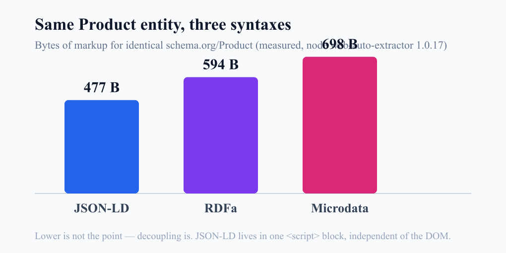

I've watched this argument play out in code review more than once. One side wants Microdata, because "markup should live on the HTML people actually see." The other side wants JSON-LD, because "just drop one `<script>` block and move on." It usually ends without a decision. Someone shrugs and says both work, pick whatever.

That shrug quietly charges you six months later. So I built the same product three ways, fed each into a parser, weighed the markup, and reproduced what happens when a redesign moves things around. Every log below is real output from that sandbox. Here's the short version: this was never an SEO question. It's a <strong>coupling</strong> question.

## What structured data is, and why there are three syntaxes

Start with the ground floor. Structured data is a set of standard labels you attach so search engines and AI crawlers can read a page's meaning mechanically. Tell them "this text is the product name, this is the price, this is the rating," and they parse it as fact instead of guessing. The vocabulary comes from [schema.org](https://schema.org): types and properties like `Product`, `Offer`, `AggregateRating`.

Here's the part people conflate. schema.org defines *what* you can say (the vocabulary). *How* you write it into HTML (the syntax) is a separate choice, and the same vocabulary can be written three ways.

- **JSON-LD**: a `<script type="application/ld+json">` block somewhere on the page, describing the whole entity as JSON. Invisible to the reader.
- **Microdata**: `itemscope`, `itemtype`, and `itemprop` attributes layered directly onto the visible HTML.
- **RDFa**: `vocab`, `typeof`, and `property` attributes, also on visible HTML. RDFa is a general-purpose standard, not schema.org-specific.

[Google's documentation](https://developers.google.com/search/docs/appearance/structured-data/intro-structured-data) supports all three and recommends JSON-LD. But the same page also says all three formats are "equally fine" for Google when implemented correctly. Read those two sentences together. Google recommends JSON-LD, yet you lose nothing in search by choosing any of the three. Which means the case for the recommendation rests on something other than ranking.

## I wrote the same product three times

I didn't want to argue this in the abstract, so I set up a sandbox. Node v22, with the open-source parser family that crawlers rely on (`web-auto-extractor`, `microdata-node`, `jsonld`). The subject: an ordinary product with a name, brand, price/currency/availability, and a rating.

The JSON-LD looks like this.

```html
<script type="application/ld+json">
{
  "@context": "https://schema.org",
  "@type": "Product",
  "name": "Aeropress Go",
  "brand": {"@type": "Brand", "name": "Aeropress"},
  "offers": {"@type": "Offer", "price": "39.95", "priceCurrency": "USD",
             "availability": "https://schema.org/InStock"},
  "aggregateRating": {"@type": "AggregateRating", "ratingValue": "4.8",
                      "reviewCount": "1027"}
}
</script>
```

The same content in Microdata scatters those properties across every visible tag.

```html
<div itemscope itemtype="https://schema.org/Product">
  <h1 itemprop="name">Aeropress Go</h1>
  <span itemprop="brand" itemscope itemtype="https://schema.org/Brand">
    <span itemprop="name">Aeropress</span>
  </span>
  <div itemprop="offers" itemscope itemtype="https://schema.org/Offer">
    <span itemprop="price">39.95</span>
    <meta itemprop="priceCurrency" content="USD">
    <link itemprop="availability" href="https://schema.org/InStock">
  </div>
  <div itemprop="aggregateRating" itemscope itemtype="https://schema.org/AggregateRating">
    <span itemprop="ratingValue">4.8</span>
    <span itemprop="reviewCount">1027</span>
  </div>
</div>
```

RDFa is structurally similar, swapping `property` for `itemprop` and `typeof` for `itemtype`. I parsed all three and normalized the output. The results were identical entities. name, brand, offers, aggregateRating all came back the same, nothing dropped. No surprise there. The meaning is the same regardless of syntax.

## The first place they diverged: bytes

Same parse result, different weight. Here's the byte count for expressing that one Product entity.



| Syntax | Bytes | Google's stance | Where it lives |
|--------|-------|-----------------|----------------|
| JSON-LD | 477 B | Recommended | Separate `<script>` block |
| RDFa | 594 B | Supported | Inline on visible HTML |
| Microdata | 698 B | Supported | Inline on visible HTML |

Microdata ran about 46% heavier than JSON-LD. The reason is plain. Inline syntaxes need a wrapping tag around every value plus repeated `itemscope`/`itemtype` declarations, and they reach for `<meta>` and `<link>` workarounds to encode values that shouldn't be visible.

Honestly, the number itself isn't the clincher. Two hundred bytes won't move your performance. But it's a symptom of something bigger: inline syntaxes lean on the DOM structure to express meaning. That leaning is what shows its real price in the next test.

## One redesign made the rating vanish

In practice, markup doesn't break on syntax errors. It breaks on redesigns. A designer moves the rating widget out of the product body and into a sidebar. Visually, nothing's wrong. The stars still render. But in Microdata, `aggregateRating` is no longer a child of the Product, because `itemprop` derives ownership from DOM nesting.

I reproduced it. I moved the rating block into an `<aside>` for the "after redesign" HTML and re-parsed.

```text
Product after redesign has aggregateRating? -> false
Keys: @context, @type, name, brand, offers
```

The rating fell clean off the Product. Only `name`, `brand`, and `offers` remained. That's the scenario where the star rich result quietly disappears from search. Nobody wrote invalid syntax. `itemprop="aggregateRating"` is still sitting right there on the page. It just lost its parent. And because the build doesn't break, review won't catch it either.

With JSON-LD, none of this happens. Move the rating widget to the sidebar, the footer, wherever. The `<script>` block is untouched. Meaning is decoupled from DOM position, so a redesign can't reach it. This is the real reason Google recommends JSON-LD, and it's not ranking. It's that JSON-LD is, in Google's own words, "the easiest to implement and maintain." Today I saw what that phrase means in practice. It means it survives the redesign. That coupling problem connects straight to [getting structured data out server-side reliably](/en/blog/en/localbusiness-structured-data-server-side-vs-js-2026/). Once you pick the syntax, the next gate is whether it actually reaches the crawler.

## Valid markup still doesn't guarantee a rich result

Here's the limit you have to state plainly. Picking the right syntax, even with perfectly valid markup, guarantees no rich result and no ranking bump. That's not my opinion; it's [Google's structured data policy](https://developers.google.com/search/docs/appearance/structured-data/sd-policies). Valid structured data only makes you *eligible* for a rich result. It doesn't force the display. Google weighs quality, page state, and other signals.

So choosing JSON-LD doesn't make stars appear. Picking a syntax isn't about raising the odds a rich result shows; it's closer to keeping a rich result that already shows from breaking on the next redesign. Don't blur that distinction. I think the posts selling syntax choice as SEO performance optimization are dishonest right at this point.

I also confirmed the JSON-LD is semantically sound. Expanding it to RDF with the `jsonld` library produced 14 triples. It doesn't merely parse; it resolves cleanly into a standard RDF graph.

```text
JSON-LD expands to 14 RDF triples
_:b0 <http://schema.org/aggregateRating> _:b1 .
_:b0 <http://schema.org/brand> _:b2 .
_:b0 <http://schema.org/name> "Aeropress Go" .
_:b0 <http://schema.org/offers> _:b3 .
```

## JSON-LD's one real weakness, and why it's a trap

Posts that push JSON-LD tend to skip its one genuine weakness: it's invisible. Because the `<script>` block is detached from the screen, a developer ends up maintaining the JSON-LD values and the visible values separately. That's how you get a price showing 39.95 while the JSON-LD still carries a stale 34.95. Microdata marks up the visible text itself, so this drift is structurally less likely.

The catch is that this drift is an actual Google policy violation. Structured data has to match the content visible to users. Mark up invisible information, or carry a value different from what's on screen, and you can lose rich result eligibility or draw a manual action. So JSON-LD's decoupling cuts both ways. It's strong against redesigns, but the truth of the values now needs a human guarantee.

My answer is simple: I never hand-write JSON-LD. I generate it from the exact data source that renders the page. When the variable that draws the price and the JSON-LD `price` reference the same value, they can't drift by construction. That's why server-side generation is an integrity mechanism, not a convenience. Hand-maintained JSON-LD just buys back Microdata's fragility in a different shape.

## So when do you use which

If all three are equal to Google, the decision belongs to engineering, not search performance. Here's the rule I use.

- **Default to JSON-LD.** It's the right answer 99% of the time. Generate it as one object server-side, manage one block per page, and unit-test it. Detached from the DOM, it's redesign-proof.
- **Microdata/RDFa only when you can't inject a `<script>`.** Locked-down CMS, restricted template access, email HTML where scripts are stripped. There, inline syntax on visible tags is your only option.
- **RDFa when you need vocabularies beyond schema.org.** If you're pure schema.org, RDFa's generality buys you nothing. It earns its keep only in special cases, like government or library data that must interoperate across multiple vocabularies as RDF.

The things to avoid are just as clear. **Don't double-mark the same entity in two syntaxes on one page.** Write a Product in JSON-LD and then layer the same thing in Microdata, and a crawler may read it as duplicate or conflicting. Pick one and stay consistent.

And whatever the syntax, **validate it in CI.** I expand the JSON-LD to RDF at build time and check the triple count and connected components. As today's experiment showed, markup can silently lose meaning without a single syntax error, and human eyes won't catch it. That "wire the scattered pieces together and verify" story runs deeper in the piece on [merging JSON-LD into a single @graph](/en/blog/en/json-ld-graph-entity-linking-2026/). And it's worth checking up front whether the markup is [buried in JS that AI crawlers never execute](/en/blog/en/ai-crawlers-dont-render-javascript-csr-2026/).

## Questions that keep coming up

**My site is already built in Microdata. Do I have to switch now?** No rush. If it works and no redesign is planned, Google won't penalize you for leaving it. Just put "migrate to JSON-LD" on the roadmap for your next big template rework. A rework is when inline markup breaks most easily, so that's the moment to convert.

**Why not mix the two? Isn't a second copy a safe backup?** It isn't safe. Two syntaxes on the same entity leave the crawler unsure which to trust when the values disagree. That's not a backup; it's one more place to conflict. Keep one syntax per entity.

**Is running the Rich Results Test enough for validation?** It helps, but online tools run one page at a time by hand, so they miss regressions. In my build pipeline I parse and expand the JSON-LD to auto-check required properties and connectivity. The "rating silently drops on redesign" failure I reproduced today only gets caught before the next deploy if you have a CI gate like that.

## What I confirmed today

The syntax debate was the wrong question from the start. Ask "which is better for SEO" and there's no answer, because Google treats all three equally. The right question is "which one won't break in our codebase six months from now." That one has a clear answer: JSON-LD, which lifts meaning off the DOM and manages it as a separate block.

To summarize by measurement: the three syntaxes parse to the same result (identical entity restored), JSON-LD is the lightest (477 vs 594 vs 698), and on redesign fragility the inline syntaxes silently lose data (rating drop reproduced). Google officially treats them as equal but recommends JSON-LD for maintainability. The limit stands: valid markup still guarantees no rich result.

If you want structured data emitted reliably server-side, or want an existing site's markup structure and validation pipeline reviewed so it survives a redesign, I take on consulting and implementation work personally. The contact path is in my profile.
