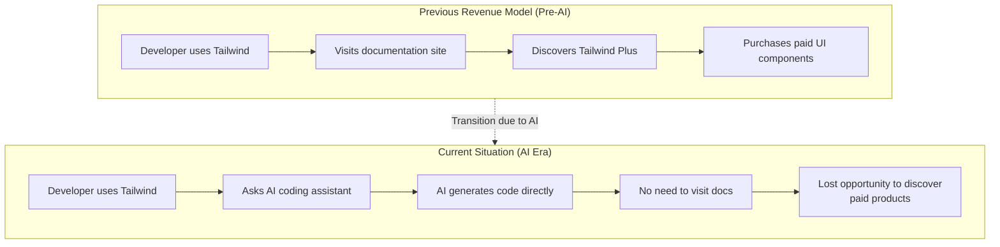
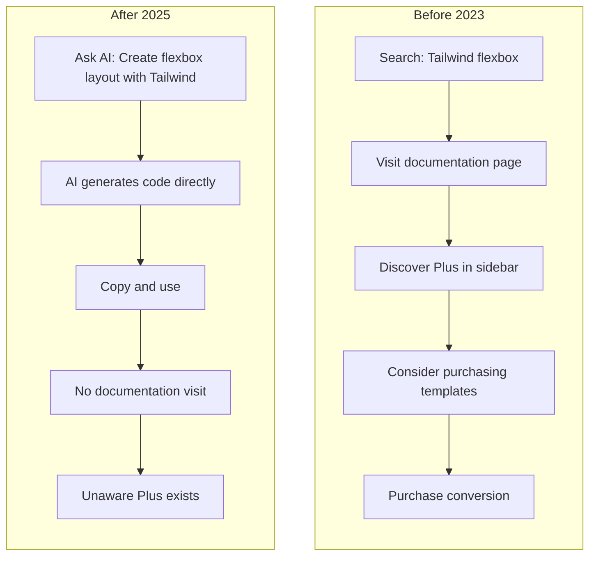
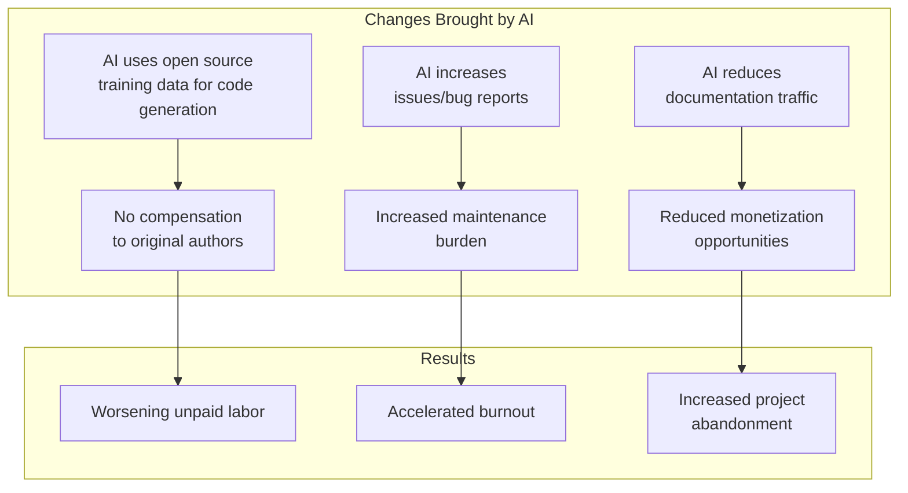
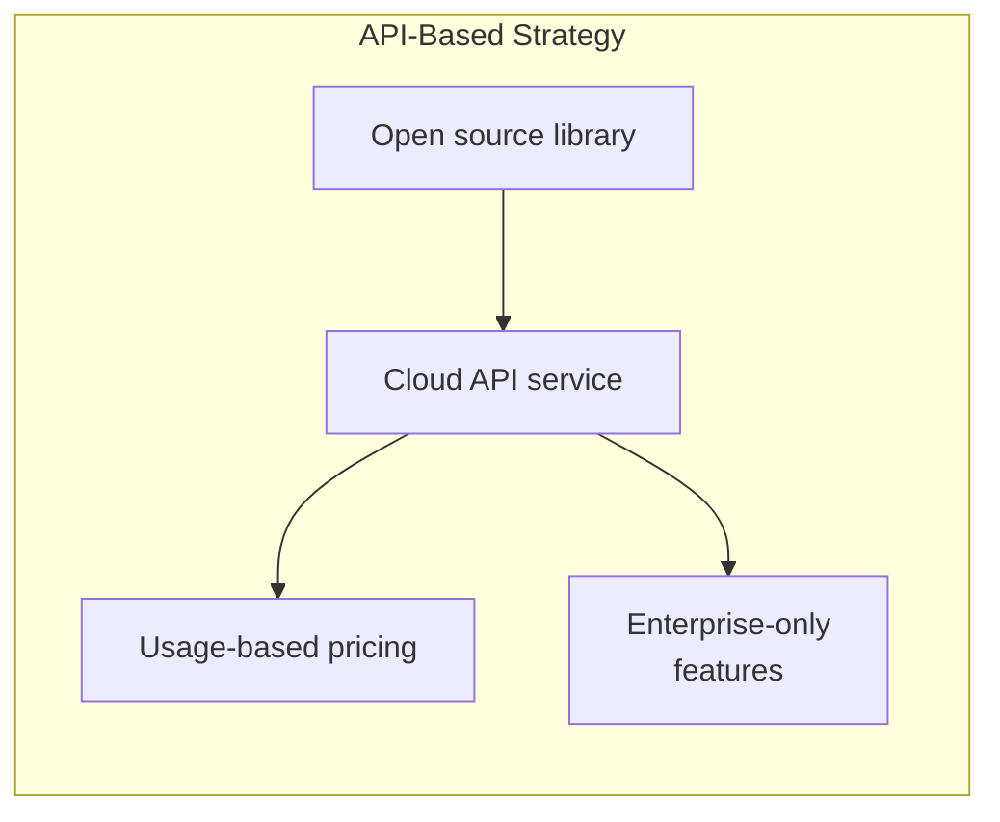
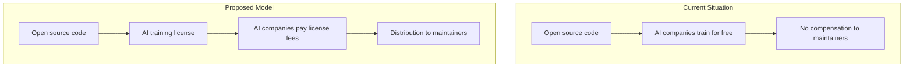

## Overview

On January 6, 2026, news broke that Tailwind Labs, the company behind <strong>Tailwind CSS</strong>—one of the most popular CSS frameworks among web developers—had laid off 75% of its engineering team. Founder and CEO Adam Wathan directly cited the "brutal impact AI has had on our business" as the cause.

This isn't just a simple startup restructuring. It raises a fundamental question: **How can open source projects generate revenue and maintain sustainability in the AI era?**

## The Tailwind Labs Crisis: What Happened

### The Shocking Numbers

| Metric | Change |
|--------|--------|
| Engineering Team | 4 → 1 (75% reduction) |
| Revenue | ~80% decline |
| Documentation Traffic | 40% drop since early 2023 |
| Framework Popularity | Continues to rise (617,000+ websites) |

The most ironic part is that **Tailwind CSS itself is more popular than ever**. Users increased, but revenue plummeted.

### The Business Model Collapse

Tailwind Labs' revenue structure was as follows:



**The core problem**: AI coding assistants (GitHub Copilot, Cursor, Claude, etc.) now answer developers' questions directly, eliminating the need to visit official documentation. Since documentation traffic was the only pathway to paid product discovery, traffic decline directly translated to revenue decline.

### Rejection of LLM-Friendly Documentation

How the situation became public is interesting. An open source contributor submitted a PR to **merge Tailwind documentation into a format more easily consumable by LLMs**. Adam Wathan rejected this request, stating:

> "This change would make our business even less sustainable."

Making documentation more AI-friendly would enable AI to provide more accurate answers, which would further reduce documentation site visits—a vicious cycle.

## AI Destroyed the "Documentation → Paid Product" Funnel

### Traditional Open Source Monetization Models

Many open source projects have used the following monetization strategies:

1. **Open Core**: Core is free, advanced features are paid
2. **Documentation-based Conversion**: Promote paid products/services on documentation sites
3. **SaaS/Hosting Services**: Provide managed services
4. **Consulting/Training**: Knowledge-based services
5. **Sponsorship/Donations**: GitHub Sponsors, Open Collective, etc.

Tailwind Labs primarily relied on **model #2**. They sold paid UI components/templates called Tailwind Plus, and developers would naturally discover them while browsing the documentation.

### Funnel Collapse in the AI Era



**AI has taken over the intermediary role**, severing the connection between developers and documentation sites. This isn't just Tailwind's problem. Every business model relying on documentation traffic is under threat.

## The Worsening Unpaid Labor of Open Source Contributors

### Shocking Statistics

The Tailwind situation is part of a larger problem:

- **60% of open source maintainers** have quit or considered quitting due to burnout
- Most maintainers manage critical infrastructure **without compensation**
- Companies depend on **billions of dollars worth** of open source while contributing minimally

### AI Is Making Unpaid Labor Worse

Open source contributors face increasingly difficult circumstances in the AI era:



**The core issue**: AI companies train their models on open source code and make billions, but the maintainers who wrote that code receive almost nothing in return.

### An Unsustainable Ecosystem

The current open source ecosystem depends on **unpaid labor from a small number of dedicated maintainers**. This is unsustainable and carries the following risks:

1. **Security vulnerabilities**: Delayed patches due to maintainer absence
2. **Innovation slowdown**: Development halts due to burnout
3. **Supply chain risks**: Sudden abandonment of critical dependencies

## Sustainable Monetization Strategies for the AI Era

### 1. Transition to API/Service-Based Models

Monetization based on **actual usage** instead of documentation traffic:



**Examples**:
- Vercel (Next.js) - Hosting and deployment services
- Supabase - Managed PostgreSQL
- PlanetScale - Managed MySQL

### 2. Enter the AI Agent/Plugin Ecosystem

**Collaborate** with AI tools to create new revenue streams:

```typescript
// Hypothetical Tailwind AI plugin example
const tailwindPlugin = {
  name: "tailwind-premium-components",
  capabilities: ["generate_ui", "suggest_design"],
  pricing: {
    free: { components: 10 },
    pro: { components: "unlimited", price: "$19/month" }
  },
  // AI suggests premium components through this plugin
  onGenerate: async (context) => {
    if (context.needsComplexUI) {
      return suggestPremiumComponent(context);
    }
  }
};
```

**Strategy**: Exist as a **plugin/extension** for AI coding assistants, so AI naturally recommends premium products when generating code.

### 3. Strengthen Enterprise Licensing

Free for individual developers, paid for enterprises:

| Tier | Target | Price | Includes |
|------|--------|-------|----------|
| Community | Individuals, startups | Free | Basic features |
| Team | SMBs | $99/month | Team collaboration, priority support |
| Enterprise | Large companies | Custom | SLA, dedicated support, security audits |

### 4. AI Training Data Licensing

A new revenue stream through **AI training data licensing**:



Some projects have already started adding "AI training prohibited" clauses to their licenses. This is a strategy to secure negotiating power.

### 5. Community-Based Sustainability

Models beyond **GitHub Sponsors** and **Open Collective**:

- **Mandatory corporate sponsorship**: Companies above a certain size must contribute to open source they depend on
- **Contributor unions**: Maintainers unite to secure negotiating power
- **Public funding**: Government/foundation-level support for open source infrastructure

## Directions Tailwind Can Take

Along with the plans Adam Wathan has shared, the following strategies are possible:

### Short-term Strategy

1. **Tailwind v4 release**: Reignite interest with a new version
2. **AI tool integration**: Official partnerships with Cursor, Copilot, etc.
3. **Premium CLI tools**: Monetize developer productivity tools

### Long-term Strategy

1. **Design system platform**: Evolve beyond simple CSS into a comprehensive design tool
2. **Enterprise market focus**: B2B licensing and support services
3. **Education platform**: Certified training courses

## Lessons We Should Learn

### As Developers

- Don't just depend on open source—**contribute or sponsor**
- Check the **sustainability** of projects you use
- Maintain the habit of **visiting documentation sites** even when using AI tools

### As Open Source Maintainers

- Reconsider revenue models that rely only on **documentation traffic**
- Build **diversified revenue streams**
- Explore **collaboration methods** with the AI ecosystem

### As Companies

- **Actively sponsor** open source you depend on
- Build **long-term partnerships**
- Recognize that the health of the open source ecosystem is **important to your business too**

## Conclusion

Tailwind Labs' layoffs are a symbolic event showing the **structural changes in the open source ecosystem during the AI era**.

The collapse of documentation-based revenue models, the worsening unpaid labor of open source contributors, and AI companies' free-riding problem are all interconnected. If we don't solve these issues, the open source ecosystem we depend on could itself be at risk.

**Solutions exist.** API-based services, collaboration with the AI ecosystem, enterprise licensing, and strengthened community support. But all of these require a **change in awareness across the entire ecosystem**.

Open source isn't "free." It's made with someone's time and effort. This fact doesn't change in the AI era. If anything, it's become more important.

---

## References

- [Tailwind Labs lays off 75 percent of its engineers - DEVCLASS](https://devclass.com/2026/01/08/tailwind-labs-lays-off-75-percent-of-its-engineers-thanks-to-brutal-impact-of-ai/)
- [Business Insider: Tailwind layoffs](https://www.businessinsider.com/tailwind-engineer-layoffs-ai-github-2026-1)
- [Open Source Trends for 2025 and Beyond - InfoWorld](https://www.infoworld.com/article/3800992/open-source-trends-for-2025-and-beyond.html)
- [The Decoder: Tailwind's shattered business model](https://the-decoder.com/tailwinds-shattered-business-model-is-a-grim-warning-for-every-business-relying-on-site-visits-in-the-ai-era/)
