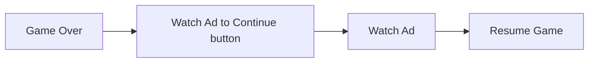
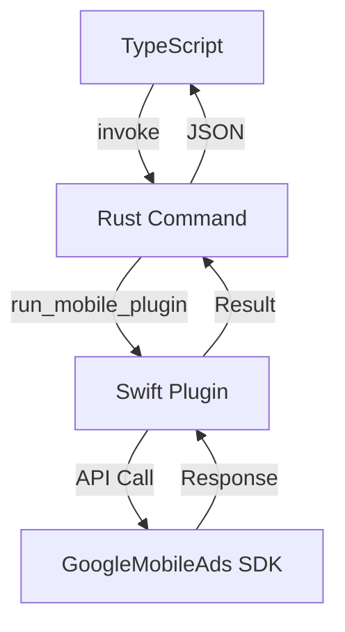
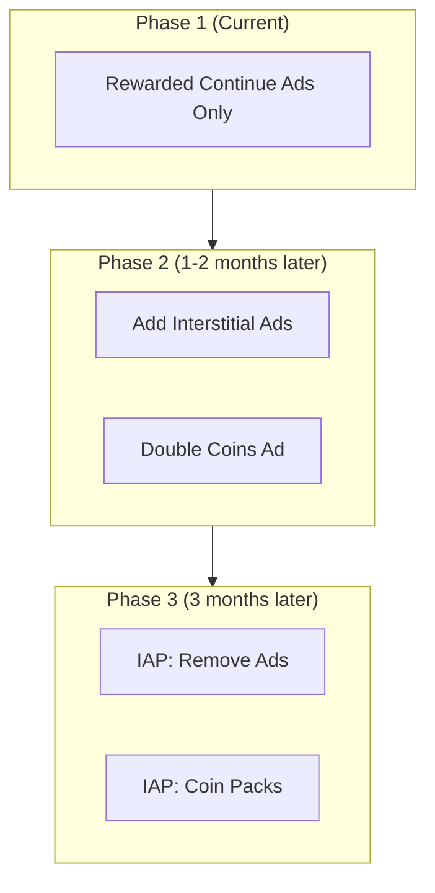

import { Image } from 'astro:assets';
import screenshot01 from '../../../assets/portfolio/shadow-dash/shadow-dash-01_iphone.png';
import screenshot04 from '../../../assets/portfolio/shadow-dash/shadow-dash-04_iphone.png';

## Overview

You've developed an iOS app with Tauri 2.x, and now you want to monetize it with AdMob ads. How do you do it?

Unfortunately, **there is no official AdMob plugin for Tauri**. In this article, I'll share the complete process of developing a custom Swift plugin to integrate AdMob rewarded ads.

> This post is a follow-up to [iOS Game Development with Tauri + PixiJS](/en/blog/en/tauri-pixijs-ios-game-development). It's based on real experience integrating ads into the Shadow Dash game.

<Image src={screenshot04} alt="Shadow Dash game over screen" width={300} class="mx-auto rounded-lg shadow-lg" />

## Why AdMob?

### Comparing Mobile Game Monetization Options

| Method | Pros | Cons |
|--------|------|------|
| **Rewarded Ads** | Great UX, high eCPM | Complex implementation |
| Banner Ads | Simple implementation | Low eCPM, hurts UX |
| In-App Purchases | High revenue | Complex implementation, payment review |

### Why I Chose Rewarded Ads

In Shadow Dash, I applied rewarded ads to the **continue system**:



Users **voluntarily** watch ads and receive rewards (continuing the game), which doesn't hurt the user experience.

### Ad SDK Selection Process

I evaluated available ad SDKs for Tauri apps:

| SDK | Pros | Cons | Decision |
|-----|------|------|----------|
| **AdMob** | High eCPM, various ad formats | Requires native plugin | ✅ Selected |
| AppLixir | JS SDK only integration | **Requires 5,000+ DAU** | ❌ Not selected |
| H5 Game Ads | HTML5 game specialized | **Beta service (unstable)** | ❌ Not selected |

**Why not AppLixir**:
- Requires a minimum of 5,000 daily active users (DAU) to apply
- Difficult to meet this requirement for new apps

**Why not H5 Game Ads**:
- Still in beta service stage
- Stability and profitability not verified

### AdMob vs AppLixir Detailed Comparison

Comparing AdMob and AppLixir performance:

| Feature | AdMob | AppLixir |
|---------|-------|----------|
| eCPM (Rewarded) | $20-30 | $15-25 |
| Fill Rate | 95%+ | 80-90% |
| Supported Formats | Rewarded, Interstitial, Banner | Rewarded only |
| Mediation | Supported | Not supported |
| Integration Difficulty | High (native required) | Low (JS SDK) |
| Entry Barrier | None | 5,000+ DAU required |

**Conclusion**: While native plugin development is required, AdMob has no entry barrier and offers higher eCPM and fill rate.

---

## Upgrading Tauri CLI

### XCFramework Support Required

To develop iOS plugins in Tauri v2, you need to use Swift Package Manager (SPM). For plugins that require external framework dependencies like the GoogleMobileAds SDK, **XCFramework support** is necessary.

### Upgrading to Tauri CLI 2.9.6+

```bash
# Upgrade Tauri CLI via Cargo
cargo install tauri-cli --force

# Verify version
cargo tauri --version
# Output: tauri-cli 2.9.6 (or higher)
```

### The --ios-framework Option

You can specify the iOS framework type when creating a plugin:

```bash
# Xcode project method (easy to add SPM dependencies) - Recommended
cargo tauri plugin new admob --ios --ios-framework xcode

# XCFramework method
cargo tauri plugin new admob --ios --ios-framework xcframework
```

| Option | Description | Pros | Cons |
|--------|-------------|------|------|
| `xcode` | Creates Xcode project | Easy to add SPM dependencies | Project file management required |
| `xcframework` | Creates XCFramework | Easy distribution | Complex external dependencies |

**For AdMob plugin, `xcode` option is recommended**: It allows easy addition of GoogleMobileAds SDK via SPM.

---

## Understanding Tauri Plugin Structure

### Directory Structure

```
tauri-plugin-admob/
├── src/                    # Rust code
│   ├── lib.rs             # Plugin entry point
│   ├── mobile.rs          # iOS/Android bridge
│   ├── desktop.rs         # Desktop stub
│   ├── commands.rs        # Tauri commands
│   └── models.rs          # Request/Response types
├── ios/                    # iOS native code
│   └── tauri-plugin-admob/
│       └── AdmobPlugin.swift
├── guest-js/              # TypeScript API
│   └── index.ts
├── permissions/           # Tauri permission settings
│   └── default.toml
├── build.rs               # Build script
└── Cargo.toml
```

### Data Flow



---

## Starting Plugin Development

### Plugin Scaffolding

```bash
# Create with Xcode project method
cargo tauri plugin new admob --ios --ios-framework xcode
```

### Adding GoogleMobileAds SDK

Open the plugin project in Xcode and add the SDK via Swift Package Manager:

1. Open `tauri-plugin-admob/ios/tauri-plugin-admob.xcodeproj`
2. **File → Add Package Dependencies**
3. Enter URL: `https://github.com/googleads/swift-package-manager-google-mobile-ads`
4. Select **GoogleMobileAds** and add

---

## Swift Plugin Implementation

### AdmobPlugin.swift

```swift
import SwiftRs
import Tauri
import UIKit
import WebKit
import GoogleMobileAds

// MARK: - Argument Types
class InitializeArgs: Decodable {}

class LoadRewardedArgs: Decodable {
    let adUnitId: String
}

class ShowRewardedArgs: Decodable {}

// MARK: - AdMob Plugin
class AdmobPlugin: Plugin {
    private var rewardedAd: GADRewardedAd?
    private var isInitialized = false
    private var pendingInvoke: Invoke?

    // Test ad ID (use actual ID in production)
    private let testAdUnitId = "ca-app-pub-3940256099942544/1712485313"

    @objc public override func load(webview: WKWebView) {
        NSLog("[AdMob Plugin] Loaded")
    }

    // Initialize SDK
    @objc public func initialize(_ invoke: Invoke) {
        if isInitialized {
            invoke.resolve(["success": true, "message": "Already initialized"])
            return
        }

        GADMobileAds.sharedInstance().start { status in
            self.isInitialized = true
            NSLog("[AdMob Plugin] SDK Initialized")
            invoke.resolve(["success": true, "message": "SDK initialized"])
        }
    }

    // Load rewarded ad
    @objc public func loadRewardedAd(_ invoke: Invoke) {
        do {
            let args = try invoke.parseArgs(LoadRewardedArgs.self)
            let adUnitId = args.adUnitId.isEmpty ? testAdUnitId : args.adUnitId

            let request = GADRequest()
            GADRewardedAd.load(withAdUnitID: adUnitId, request: request) { [weak self] ad, error in
                if let error = error {
                    invoke.resolve(["success": false, "error": error.localizedDescription])
                    return
                }

                self?.rewardedAd = ad
                self?.rewardedAd?.fullScreenContentDelegate = self
                invoke.resolve(["success": true])
            }
        } catch {
            invoke.reject(error.localizedDescription)
        }
    }

    // Check if ad is ready
    @objc public func isRewardedAdReady(_ invoke: Invoke) {
        let isReady = rewardedAd != nil
        invoke.resolve(["ready": isReady])
    }

    // Show ad
    @objc public func showRewardedAd(_ invoke: Invoke) {
        guard let rewardedAd = rewardedAd else {
            invoke.resolve(["success": false, "rewarded": false, "error": "No ad loaded"])
            return
        }

        guard let rootViewController = getRootViewController() else {
            invoke.resolve(["success": false, "rewarded": false, "error": "No root view controller"])
            return
        }

        pendingInvoke = invoke

        DispatchQueue.main.async {
            rewardedAd.present(fromRootViewController: rootViewController) { [weak self] in
                let reward = rewardedAd.adReward
                if let pending = self?.pendingInvoke {
                    pending.resolve([
                        "success": true,
                        "rewarded": true,
                        "rewardAmount": reward.amount.intValue,
                        "rewardType": reward.type
                    ])
                    self?.pendingInvoke = nil
                }
            }
        }
    }

    // Get Root View Controller
    private func getRootViewController() -> UIViewController? {
        if let windowScene = UIApplication.shared.connectedScenes
            .compactMap({ $0 as? UIWindowScene })
            .first(where: { $0.activationState == .foregroundActive }),
           let keyWindow = windowScene.windows.first(where: { $0.isKeyWindow }),
           let rootVC = keyWindow.rootViewController {
            var topController = rootVC
            while let presented = topController.presentedViewController {
                topController = presented
            }
            return topController
        }
        return nil
    }
}

// MARK: - GADFullScreenContentDelegate
extension AdmobPlugin: GADFullScreenContentDelegate {
    func adDidDismissFullScreenContent(_ ad: GADFullScreenPresentingAd) {
        rewardedAd = nil
        if let pending = pendingInvoke {
            pending.resolve(["success": true, "rewarded": false])
            pendingInvoke = nil
        }
    }

    func ad(_ ad: GADFullScreenPresentingAd, didFailToPresentFullScreenContentWithError error: Error) {
        rewardedAd = nil
        if let pending = pendingInvoke {
            pending.resolve(["success": false, "rewarded": false, "error": error.localizedDescription])
            pendingInvoke = nil
        }
    }
}

// MARK: - Plugin Export
@_cdecl("init_plugin_admob")
func initPlugin() -> Plugin {
    return AdmobPlugin()
}
```

### Key Points

1. **`@objc` annotation**: Required to expose to Rust via Objective-C runtime
2. **`pendingInvoke` pattern**: Used to bridge async ad callbacks to Tauri's sync invoke pattern
3. **`GADFullScreenContentDelegate`**: Handles ad dismiss/error events
4. **`@_cdecl("init_plugin_admob")`**: C function export for Rust plugin loading

---

## Rust Bridge Implementation

### models.rs

```rust
use serde::{Deserialize, Serialize};

#[derive(Debug, Clone, Default, Deserialize, Serialize)]
#[serde(rename_all = "camelCase")]
pub struct InitializeResponse {
    pub success: bool,
    pub message: Option<String>,
}

#[derive(Debug, Deserialize, Serialize)]
#[serde(rename_all = "camelCase")]
pub struct LoadRewardedAdRequest {
    pub ad_unit_id: String,
}

#[derive(Debug, Clone, Default, Deserialize, Serialize)]
#[serde(rename_all = "camelCase")]
pub struct LoadRewardedAdResponse {
    pub success: bool,
    pub error: Option<String>,
}

#[derive(Debug, Clone, Default, Deserialize, Serialize)]
#[serde(rename_all = "camelCase")]
pub struct IsRewardedAdReadyResponse {
    pub ready: bool,
}

#[derive(Debug, Clone, Default, Deserialize, Serialize)]
#[serde(rename_all = "camelCase")]
pub struct ShowRewardedAdResponse {
    pub success: bool,
    pub rewarded: bool,
    pub reward_amount: Option<i32>,
    pub reward_type: Option<String>,
    pub error: Option<String>,
}
```

### mobile.rs

```rust
use serde::de::DeserializeOwned;
use tauri::{
    plugin::{PluginApi, PluginHandle},
    AppHandle, Runtime,
};
use crate::models::*;

#[cfg(target_os = "ios")]
tauri::ios_plugin_binding!(init_plugin_admob);

pub fn init<R: Runtime, C: DeserializeOwned>(
    _app: &AppHandle<R>,
    api: PluginApi<R, C>,
) -> crate::Result<Admob<R>> {
    #[cfg(target_os = "ios")]
    let handle = api.register_ios_plugin(init_plugin_admob)?;
    Ok(Admob(handle))
}

pub struct Admob<R: Runtime>(PluginHandle<R>);

impl<R: Runtime> Admob<R> {
    pub fn initialize(&self) -> crate::Result<InitializeResponse> {
        self.0.run_mobile_plugin("initialize", ()).map_err(Into::into)
    }

    pub fn load_rewarded_ad(&self, ad_unit_id: String) -> crate::Result<LoadRewardedAdResponse> {
        self.0.run_mobile_plugin("loadRewardedAd",
            LoadRewardedAdRequest { ad_unit_id }).map_err(Into::into)
    }

    pub fn is_rewarded_ad_ready(&self) -> crate::Result<IsRewardedAdReadyResponse> {
        self.0.run_mobile_plugin("isRewardedAdReady", ()).map_err(Into::into)
    }

    pub fn show_rewarded_ad(&self) -> crate::Result<ShowRewardedAdResponse> {
        self.0.run_mobile_plugin("showRewardedAd", ()).map_err(Into::into)
    }
}
```

### build.rs (Important!)

```rust
const COMMANDS: &[&str] = &[
    "initialize",
    "load_rewarded_ad",
    "is_rewarded_ad_ready",
    "show_rewarded_ad"
];

fn main() {
    // Link frameworks for iOS builds
    let target = std::env::var("TARGET").unwrap_or_default();
    if target.contains("ios") {
        println!("cargo:rustc-link-lib=framework=GoogleMobileAds");
        println!("cargo:rustc-link-lib=framework=UserMessagingPlatform");
    }

    tauri_plugin::Builder::new(COMMANDS)
        .android_path("android")
        .ios_path("ios")
        .build();
}
```

**Note**: `#[cfg(target_os = "ios")]` doesn't work in build.rs. Since build.rs runs on the **host machine** (macOS), you need to check the target using `std::env::var("TARGET")`.

---

## TypeScript API Implementation

### guest-js/index.ts

```typescript
import { invoke } from '@tauri-apps/api/core'

export interface InitializeResponse {
  success: boolean;
  message?: string;
}

export interface LoadRewardedAdResponse {
  success: boolean;
  error?: string;
}

export interface IsRewardedAdReadyResponse {
  ready: boolean;
}

export interface ShowRewardedAdResponse {
  success: boolean;
  rewarded: boolean;
  rewardAmount?: number;
  rewardType?: string;
  error?: string;
}

export async function initialize(): Promise<InitializeResponse> {
  return await invoke<InitializeResponse>('plugin:admob|initialize');
}

export async function loadRewardedAd(adUnitId: string = ''): Promise<LoadRewardedAdResponse> {
  return await invoke<LoadRewardedAdResponse>('plugin:admob|load_rewarded_ad', {
    adUnitId,
  });
}

export async function isRewardedAdReady(): Promise<IsRewardedAdReadyResponse> {
  return await invoke<IsRewardedAdReadyResponse>('plugin:admob|is_rewarded_ad_ready');
}

export async function showRewardedAd(): Promise<ShowRewardedAdResponse> {
  return await invoke<ShowRewardedAdResponse>('plugin:admob|show_rewarded_ad');
}
```

---

## Integrating Plugin with Your App

### Add Plugin to Cargo.toml

```toml
[dependencies]
tauri-plugin-admob = { path = "../tauri-plugin-admob" }
```

### Register Plugin in lib.rs

```rust
pub fn run() {
    tauri::Builder::default()
        .plugin(tauri_plugin_admob::init())
        .run(tauri::generate_context!())
        .expect("error while running tauri application");
}
```

### Permission Configuration

**src-tauri/capabilities/default.json**:

```json
{
  "permissions": [
    "core:default",
    "admob:default"
  ]
}
```

**tauri-plugin-admob/permissions/default.toml**:

```toml
[default]
description = "Default permissions for the AdMob plugin"
permissions = [
    "allow-initialize",
    "allow-load-rewarded-ad",
    "allow-is-rewarded-ad-ready",
    "allow-show-rewarded-ad"
]
```

### Add App ID to Info.plist

**src-tauri/gen/apple/AppName_iOS/Info.plist**:

```xml
<key>GADApplicationIdentifier</key>
<string>ca-app-pub-XXXXXXXXXXXXXXXX~XXXXXXXXXX</string>
<key>SKAdNetworkItems</key>
<array>
    <dict>
        <key>SKAdNetworkIdentifier</key>
        <string>cstr6suwn9.skadnetwork</string>
    </dict>
</array>
```

---

## Using Ads in Your Game

### Ad Configuration File

**src/lib/config/admob.ts**:

```typescript
// Ad enabled flag (set to false until approval)
export const ADS_ENABLED = false;

const TEST_AD_UNITS = {
  rewardedAd: 'ca-app-pub-3940256099942544/1712485313',
  appId: 'ca-app-pub-3940256099942544~1458002511',
};

const PRODUCTION_AD_UNITS = {
  rewardedAd: 'ca-app-pub-XXXXXXXX/XXXXXXXXXX',  // Actual ad unit ID
  appId: 'ca-app-pub-XXXXXXXX~XXXXXXXXXX',       // Actual app ID
};

const isDevelopment = import.meta.env.DEV;

export const AD_UNITS = isDevelopment ? TEST_AD_UNITS : PRODUCTION_AD_UNITS;
export const isTestMode = isDevelopment;
```

### Usage in Game Over Screen

```typescript
import { AD_UNITS, ADS_ENABLED } from '$lib/config/admob';
import * as admob from 'tauri-plugin-admob-api';

let adLoading = false;
let adError = '';

async function handleWatchAd() {
  if (!ADS_ENABLED) {
    // Continue directly if ads disabled
    game.startContinue();
    return;
  }

  adLoading = true;
  adError = '';

  try {
    // Check if ad is ready
    const readyCheck = await admob.isRewardedAdReady();

    if (!readyCheck.ready) {
      // Load ad if not ready
      const loadResult = await admob.loadRewardedAd(AD_UNITS.rewardedAd);
      if (!loadResult.success) {
        adError = loadResult.error || 'Failed to load ad';
        adLoading = false;
        return;
      }
    }

    // Show ad
    const showResult = await admob.showRewardedAd();

    if (showResult.rewarded) {
      // Rewarded - continue game
      game.startContinue();
    } else if (showResult.error) {
      adError = showResult.error;
    }
  } catch (error) {
    adError = String(error);
  } finally {
    adLoading = false;
  }
}
```

---

## Troubleshooting

### Swift Type Error: "cannot find type 'RewardedAd' in scope"

**Cause**: GoogleMobileAds SDK is Objective-C based, requiring `GAD` prefix in Swift.

```swift
// ❌ Wrong
private var rewardedAd: RewardedAd?

// ✅ Correct
private var rewardedAd: GADRewardedAd?
```

### Linker Error: "Undefined symbols for architecture arm64"

**Cause**: GoogleMobileAds framework not linked

**Solution 1**: Add SDK to main app Xcode project too

1. Open `src-tauri/gen/apple/AppName.xcodeproj`
2. **File → Add Package Dependencies**
3. Add GoogleMobileAds SDK

**Solution 2**: Link framework in build.rs

```rust
let target = std::env::var("TARGET").unwrap_or_default();
if target.contains("ios") {
    println!("cargo:rustc-link-lib=framework=GoogleMobileAds");
}
```

### Tauri Permission Error

**Error message**:
```
admob.is_rewarded_ad_ready not allowed.
Permissions associated with this command: admob:allow-is-rewarded-ad-ready
```

**Solution**: Add permissions to `permissions/default.toml` and `capabilities/default.json`

### Ads Not Showing

**Symptom**: Button click doesn't show ad

**Check**:
1. Verify you're using test ad ID
2. Confirm `GADMobileAds.sharedInstance().start()` is called
3. Test on real device (simulator support is limited)

---

## Monetization Strategy Considerations

### Phased Implementation Plan



### Three Monetization Principles

1. **Protect Game Balance**: Cosmetics only, no pay-to-win
2. **Respect Free Players**: All content achievable without paying
3. **Value First**: Products users feel are "worth buying"

### Expected Revenue (10,000 DAU basis)

| Phase | Ad Types | Daily Revenue | Monthly Revenue |
|-------|----------|--------------|-----------------|
| 1 | Rewarded Only | ~$130 | ~$3,900 |
| 2 | Rewarded + Interstitial | ~$425 | ~$12,750 |
| 3 | Ads + IAP | ~$600 | ~$18,000 |

---

## Conclusion

### Key Lessons

1. **Keep Tauri CLI Updated**: Important features like XCFramework support are continuously added
2. **Understand Tauri Plugin Structure**: Essential Rust ↔ Swift bridge knowledge
3. **Cross-Compilation**: HOST vs TARGET distinction in build.rs is crucial
4. **Tauri v2 Permission System**: capabilities and permissions are required

### Checklist

- [ ] Upgrade to latest Tauri CLI (`cargo install tauri-cli --force`)
- [ ] Create plugin with `--ios-framework xcode` option
- [ ] Add GoogleMobileAds SDK to **both main app and plugin**
- [ ] Detect iOS in build.rs using `std::env::var("TARGET")`
- [ ] Define all command permissions in `permissions/default.toml`
- [ ] Add `admob:default` to `capabilities/default.json`
- [ ] Add `GADApplicationIdentifier` to Info.plist
- [ ] Separate test/production ad ID management

### Next Steps

- Add Android support
- Implement interstitial ads
- Implement banner ads
- StoreKit 2 integration for IAP

---

## Download Shadow Dash

Try **Shadow Dash**, developed with the technologies covered in this article!

<a href="https://apps.apple.com/app/shadow-dash/id6740092498" target="_blank" rel="noopener noreferrer">
  
</a>

**Feedback welcome!** If you find any improvements or bugs while playing, please let us know via App Store review or email.

> 📱 **Shadow Dash Details**: Check out the [portfolio page](/en/portfolio/shadow-dash) for core game mechanics and more screenshots.

## References

- [Tauri 2.0 Official Documentation](https://v2.tauri.app/)
- [Google AdMob iOS Documentation](https://developers.google.com/admob/ios/quick-start)
- [Swift Package Manager for Google Mobile Ads](https://github.com/googleads/swift-package-manager-google-mobile-ads)
- [Tauri Plugin Development](https://v2.tauri.app/develop/plugins/)
