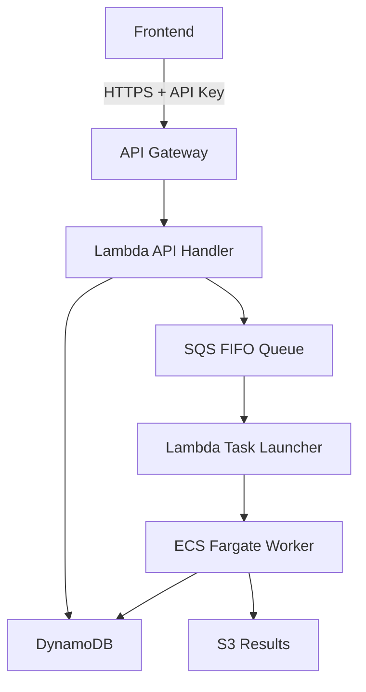

## Overview

One of the biggest challenges when deploying AI systems to production is <strong>infrastructure cost</strong>. Batch processing AI workloads don't need always-on servers, but they require sufficient computing resources when tasks execute.

This article analyzes the architecture of a **serverless AI batch system** built in a real project and explores the advantages of infrastructure management with Terraform.

## Architecture Design

### Overall Structure



### Core Components

| Component | Role | Cost Model |
|-----------|------|------------|
| API Gateway | REST API endpoint | Per-request |
| Lambda | Task creation/trigger | Per-execution |
| SQS FIFO | Task queue management | Nearly free |
| ECS Fargate | AI worker execution | Per-runtime |
| DynamoDB | State management | On-demand |
| S3 | Result storage | Per-storage |

## Advantages of Terraform

### 1. Excellent LLM Compatibility

Terraform's HCL (HashiCorp Configuration Language) has a **declarative and structured syntax** that makes it very easy for LLMs to generate and understand code.

```hcl
# Clear structure that's easy for LLMs to generate
resource "aws_lambda_function" "api_handler" {
  function_name = "ai-batch-api-handler"
  runtime       = "python3.11"
  handler       = "main.lambda_handler"
  memory_size   = 256
  timeout       = 30

  environment {
    variables = {
      DYNAMODB_TABLE = aws_dynamodb_table.jobs.name
      SQS_QUEUE_URL  = aws_sqs_queue.tasks.url
    }
  }
}
```

As of 2025, LLMs like Claude and GPT-4 can produce **near production-level** Terraform code. Describe your requirements in natural language and get high-quality IaC configurations.

### 2. Infrastructure State Management

Terraform's State file **guarantees consistency** between actual infrastructure and code.

```bash
# Check current infrastructure state
terraform show

# Preview changes
terraform plan

# Safe application
terraform apply
```

### 3. Reproducible Environments

Build **dev/staging/production** environments consistently with the same Terraform code.

```hcl
# variables.tf
variable "environment" {
  description = "Deployment environment"
  type        = string
  default     = "dev"
}

variable "allowed_ips" {
  description = "List of allowed IP addresses"
  type        = list(string)
  default     = []
}
```

## Shell Script-Based Operations

### Deployment Automation

Abstract complex deployment processes into a single script.

```bash
#!/bin/bash
# deploy.sh
set -e

echo "=== AI System Deployment ==="

# Load environment variables
source .env

# 1. Docker image build & push
cd workers/image_alt_generator
docker build -t ai-batch-worker:latest .
aws ecr get-login-password --region ${AWS_REGION} | \
    docker login --username AWS --password-stdin ${ECR_REGISTRY}
docker push ${ECR_REGISTRY}/ai-batch-worker:latest

# 2. Terraform infrastructure deployment
cd ../../terraform
terraform apply -auto-approve \
    -var="allowed_ips=${ALLOWED_IPS}" \
    -var="environment=prod"

# 3. Output results
echo "API Endpoint: $(terraform output -raw api_endpoint)"
echo "API Key: $(terraform output -raw api_key)"
```

### Monitoring Script

```bash
#!/bin/bash
# monitor.sh

# Check running ECS Tasks
aws ecs list-tasks --cluster ai-batch-cluster

# Real-time CloudWatch logs
aws logs tail /ecs/ai-batch/worker --follow

# Query DynamoDB job status
aws dynamodb scan --table-name ai-batch-jobs \
    --filter-expression "#s = :status" \
    --expression-attribute-names '{"#s": "status"}' \
    --expression-attribute-values '{":status": {"S": "RUNNING"}}'
```

## Cost Optimization Strategies

### Serverless Architecture Cost Benefits

| Scenario | EC2 Always-On | Serverless |
|----------|---------------|------------|
| 10,000 tasks/month | ~$150 | ~$21 |
| 1,000 tasks/month | ~$150 | ~$5 |
| 100 tasks/month | ~$150 | ~$1 |

For batch processing workloads, the **pay-per-use** serverless model is overwhelmingly advantageous.

### Leveraging Fargate Spot

```hcl
resource "aws_ecs_service" "worker" {
  # ...

  capacity_provider_strategy {
    capacity_provider = "FARGATE_SPOT"
    weight           = 1
    base             = 0
  }
}
```

Using Fargate Spot can achieve **up to 70% cost reduction**. AI batch tasks are mostly retryable, making them suitable for Spot instances.

## Notifications and Notion Integration

### Slack Notification Integration

```python
# lambda/notifier/main.py
import boto3
import requests

def notify_job_completion(job_id, status, result_url=None):
    webhook_url = os.environ['SLACK_WEBHOOK_URL']

    message = {
        "blocks": [
            {
                "type": "section",
                "text": {
                    "type": "mrkdwn",
                    "text": f"*Task Completion Notification*\n"
                           f"Job ID: `{job_id}`\n"
                           f"Status: {status}"
                }
            }
        ]
    }

    if result_url:
        message["blocks"].append({
            "type": "actions",
            "elements": [{
                "type": "button",
                "text": {"type": "plain_text", "text": "Download Results"},
                "url": result_url
            }]
        })

    requests.post(webhook_url, json=message)
```

### Notion Database Integration

Automatically log task results to a Notion database for **project management integration**.

```python
from notion_client import Client

def log_to_notion(job_data):
    notion = Client(auth=os.environ["NOTION_TOKEN"])

    notion.pages.create(
        parent={"database_id": os.environ["NOTION_DATABASE_ID"]},
        properties={
            "Task ID": {"title": [{"text": {"content": job_data["job_id"]}}]},
            "Status": {"select": {"name": job_data["status"]}},
            "Processing Time": {"number": job_data["duration_seconds"]},
            "Completed At": {"date": {"start": job_data["completed_at"]}}
        }
    )
```

## Scalability Considerations

### Adding New AI Workers

```
workers/
├── image_alt_generator/    # Image Alt Text generation
├── meta_desc_generator/    # Meta description generation
└── content_analyzer/       # Content analysis
```

When adding a new Worker:

1. Create Worker directory and implement code
2. Add Task Definition to `terraform/ecs.tf`
3. Add dedicated queue to `terraform/sqs.tf`
4. Update Lambda queue mapping
5. Run `./deploy.sh`

Thanks to Terraform's modularization, **adding new services is very straightforward**.

## Production Results

### Operational Metrics

- **Deployment time**: Manual 30min → Automated 5min
- **Infrastructure cost**: 85% reduction compared to EC2
- **Disaster recovery**: Immediate rebuild possible with State file
- **Code review**: PR reviews for infrastructure changes via IaC

### Lessons Learned

1. **HCL has a low learning curve**: Better readability than JSON/YAML
2. **LLM utilization is key**: Complex resource configurations requestable in natural language
3. **Abstract with shell scripts**: Simplify complex commands
4. **State management is critical**: S3 + DynamoDB Lock essential

## Conclusion

Serverless AI batch systems with Terraform offer these benefits:

- **Cost efficiency**: Usage-based billing optimal for batch processing
- **LLM-friendly**: Easy infrastructure code generation and management with AI tools
- **Operational convenience**: Automate complex tasks with shell scripts
- **Scalability**: Modular structure makes adding new services simple

Adopting IaC from the beginning when building AI systems can significantly improve **long-term operational efficiency**.

## References

- [AWS Fargate Terraform Deployment Guide](https://aws.amazon.com/blogs/developer/provision-aws-infrastructure-using-terraform-by-hashicorp-an-example-of-running-amazon-ecs-tasks-on-aws-fargate/)
- [HashiCorp - Deploying Serverless AI Agents](https://www.hashicorp.com/en/resources/deploying-serverless-ai-agents-on-aws-with-terraform-and-securing-them-with-hcp-v)
- [Using LLMs to Generate Terraform Code](https://terrateam.io/blog/using-llms-to-generate-terraform-code)
