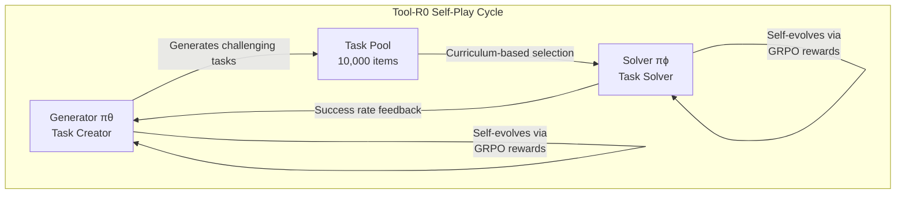
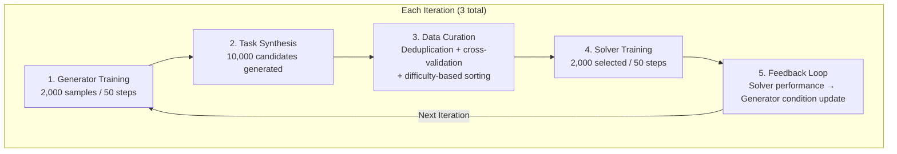
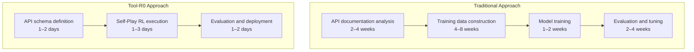

The core capability of an AI agent is <strong>"the ability to accurately invoke external tools."</strong> Calling APIs, querying databases, executing code — without these abilities, an agent is nothing more than a simple chatbot. Yet training this tool-calling capability has traditionally required tens or even hundreds of thousands of labeled data samples.

<strong>Tool-R0</strong> (Acikgoz et al., arXiv 2602.21320), published on arXiv in February 2026, upends this assumption. Starting from <strong>zero training data</strong>, it trains a tool-calling agent from scratch using only Self-Play reinforcement learning — and surpasses conventional supervised learning approaches in performance.

## Why This Paper Matters Right Now

The AI agent market is experiencing rapid growth centered on tool-calling (Function Calling / Tool Use) capabilities. OpenAI's Function Calling, Anthropic's Tool Use, Google's Gemini Function Calling — all frontier models ship with this capability as a core feature.

However, equipping open-source or domain-specific models with this capability has required <strong>expensive training data construction</strong>:

- xLAM dataset: 60,000 tool-calling examples
- Hammer dataset: 210,000 examples
- ToolACE dataset: 12,000 examples

These datasets must be rebuilt every time the domain changes, and customizing them for internal enterprise APIs is even more difficult. Tool-R0 eliminates this bottleneck entirely through Self-Play RL.

## The Core Idea of Tool-R0: Generator-Solver Co-Evolution

Tool-R0's architecture is remarkably elegant. Two independent agents are initialized from a single base LLM:

The <strong>Generator (πθ)</strong> creates tool-calling tasks. Specifically, it produces triplets of (user query, tool menu, ground-truth tool call).

The <strong>Solver (πϕ)</strong> learns to predict the correct tool call from a given query and tool list.

The key is that they are connected through <strong>complementary reward signals</strong>:

- The Generator receives a high reward when it creates problems that are <strong>moderately challenging</strong> for the Solver
- The Solver receives a high reward when it executes accurate tool calls

As this interaction repeats, the Generator creates increasingly sophisticated problems while the Solver learns to tackle progressively harder tasks — all without any data.

## The Sophistication of Reward Design

The reason Tool-R0 achieves such strong performance lies in its reward function design.

### Generator Reward: Three-Stage Quality Control

| Reward Component | Role | Description |
|:---|:---|:---|
| Format Reward (r_fmt) | Structural compliance | XML tag and JSON parsing validation |
| Validity Reward (r_valid) | Internal consistency | Ground-truth tool exists in menu, required parameters included, argument values grounded in query |
| Curriculum Reward (r_curr) | Difficulty calibration | Targets Solver success rate p&#770;_succ within [0.25, 0.75] |

The <strong>Curriculum Reward</strong> is particularly critical. The highest reward is given when generating problems where the Solver's success rate falls between 25% and 75%. Problems that are too easy (success rate > 75%) or too hard (success rate < 25%) do not contribute meaningfully to learning. This aligns precisely with the pedagogical concept of the <strong>"Zone of Proximal Development (ZPD)."</strong>

### Solver Reward: Fine-Grained Accuracy Measurement

The Solver's accuracy reward is not a simple correct/incorrect binary judgment but is decomposed along three dimensions:

1. <strong>Tool name matching</strong> (binary): Was the correct tool selected?
2. <strong>Key overlap</strong> (F1 score): Were required parameters omitted?
3. <strong>Value matching</strong> (flexible comparison): Are the argument values accurate?

A multiplicative penalty is applied when extraneous tool calls are generated. This fine-grained reward enables partial credit, providing meaningful gradients even during the early stages of training.

## Training Pipeline: The Power of Three Iterations

The entire training process consists of just three iterations:

The remarkable point is that each iteration uses only <strong>2,000 self-generated data samples</strong>. This stands in stark contrast to conventional supervised learning approaches that require tens or hundreds of thousands of samples.

## Benchmark Results: Outperforming Supervised Learning

### Key Results on Qwen2.5-1.5B

| Benchmark | Baseline | Tool-R0 | Relative Improvement |
|:---|---:|---:|---:|
| ToolAlpaca | 35.96% | 47.36% | +31.7% |
| SealTools | 47.27% | 83.00% | +75.6% |
| NexusRaven | 17.61% | 34.59% | +86.4% |
| API-Bank | 19.13% | 50.62% | +164.6% |
| SNIPS | 4.29% | 20.86% | +386.3% |
| <strong>Average</strong> | <strong>24.85%</strong> | <strong>47.84%</strong> | <strong>+92.5%</strong> |

The dramatic improvements on API-Bank and SNIPS are particularly noteworthy. These benchmarks simulate real-world API call scenarios, making it remarkable that a zero-data approach can achieve this level of performance.

### Comparison with Supervised Learning Datasets

The most impressive result is that Tool-R0 <strong>outperforms models trained on actual labeled data</strong>:

| Training Method | Data Size | Average Accuracy |
|:---|---:|---:|
| xLAM dataset | 60,000 samples | 43.60% |
| Hammer dataset | 210,000 samples | 43.74% |
| ToolACE dataset | 12,000 samples | 44.71% |
| ToolRL dataset | 4,000 samples | 46.06% |
| <strong>Tool-R0 (zero data)</strong> | <strong>0 samples</strong> | <strong>47.84%</strong> |

Tool-R0, trained with no data, outperforms Hammer — which uses 210,000 training samples — by more than 4 percentage points.

### Validation Across Multiple Models

Tool-R0 is not tied to any specific model:

| Model | Baseline | Tool-R0 | Improvement |
|:---|---:|---:|---:|
| Qwen2.5-0.5B | 15.47% | 30.57% | +101.0% |
| Qwen2.5-1.5B | 24.85% | 47.84% | +92.5% |
| Qwen2.5-3B | 43.97% | 48.50% | +10.3% |
| Llama-3.2-3B | 36.12% | 40.47% | +12.0% |

It achieves over 2x improvement on small models (0.5B) and over 10% improvement even on larger models (3B). While the magnitude of improvement decreases for larger models that already possess some tool-calling ability, consistent gains are observed across the board.

## Key Finding: Why Parameter Separation Matters

The most important finding from the ablation study is that <strong>Generator and Solver parameters must be kept separate</strong>:

| Configuration | Accuracy | Performance Drop |
|:---|---:|---:|
| Full Tool-R0 (separated) | 47.84% | — |
| Shared weights | 30.42% | -36.4% |
| Frozen Generator | 41.65% | -12.9% |
| No difficulty reward | 43.54% | -9.0% |

Using shared weights causes a 36.4% performance drop. The research team attributes this to <strong>"gradient interference"</strong> — when the conflicting objectives of exploration (Generator) and execution (Solver) are optimized within the same parameter space, they undermine each other.

This also carries organizational implications. It provides research-backed evidence that <strong>separating the team that defines problems from the team that solves them</strong>, while connecting them through feedback loops, is the optimal structure.

## Practical Implications for EMs and CTOs

### 1. Reducing the Cost of Building Enterprise API Tool-Calling Agents

In traditional approaches, the single largest cost was training data construction. Building tens of thousands of tool-calling examples tailored to internal enterprise APIs could take months of work. Tool-R0 eliminates this step entirely.

### 2. Reassessing Small Models

Tool-R0 achieves 2x performance improvement even on a 0.5B model. This means that <strong>viable tool-calling agents can be built for edge devices and cost-sensitive environments</strong>. This is particularly significant for startups with limited GPU budgets or private cloud environments.

### 3. Automating Curriculum Learning

The most impressive aspect is that <strong>the learning curriculum is generated automatically</strong>. Previously, humans had to manually sort data from easy to hard examples, but Tool-R0's Generator automatically detects the Solver's current skill level and generates problems at the appropriate difficulty.

This opens the door to <strong>autonomously operating the training pipeline for AI systems</strong>.

## Context Within ICLR 2026 Agent Research Trends

Tool-R0 is part of the broader <strong>"Self-Evolving Agent"</strong> paradigm that defines 2026 AI agent research:

- <strong>EvolveR</strong> (ICLR 2026 under review): Experience-based lifecycle for agent self-improvement
- <strong>Agent0</strong>: Building agents from zero data through tool-integrated reasoning
- <strong>EvoAgentX</strong> (open source on GitHub): Self-evolving agent ecosystem
- <strong>ICLR 2026 Workshop</strong>: "Lifelong Agents: Learning, Aligning, Evolving"

The common message across these works is clear: <strong>an era is dawning in which agents generate their own training data and evolve on their own, without relying on human-created data</strong>.

## Conclusion

Tool-R0 is an important study that demonstrates "you can build powerful AI agents without any data." The key takeaways are:

1. <strong>Self-Play RL alone can outperform supervised learning</strong> (92.5% improvement, outperforming a 210K-sample dataset)
2. <strong>Generator-Solver separation is essential</strong> (36.4% performance drop when shared)
3. <strong>Automatic curriculum generation</strong> is the key to training efficiency (ZPD range [0.25, 0.75])
4. <strong>Effective even on small models</strong> (2x improvement on 0.5B)

The most important implication for EMs and CTOs is that a methodology has emerged that can <strong>bypass the biggest bottleneck — training data construction — when building AI agents for internal enterprise APIs</strong>. Production-level validation is still needed, but this direction is likely to become a significant turning point in AI agent development in 2026.

## References

- [Tool-R0 Paper (arXiv 2602.21320)](https://arxiv.org/abs/2602.21320)
- [EvolveR: Self-Evolving LLM Agents (ICLR 2026)](https://openreview.net/forum?id=sooLoD9VSf)
- [EvoAgentX GitHub](https://github.com/EvoAgentX/EvoAgentX)
- [ICLR 2026 Lifelong Agents Workshop](https://lifelongagent.github.io/)
