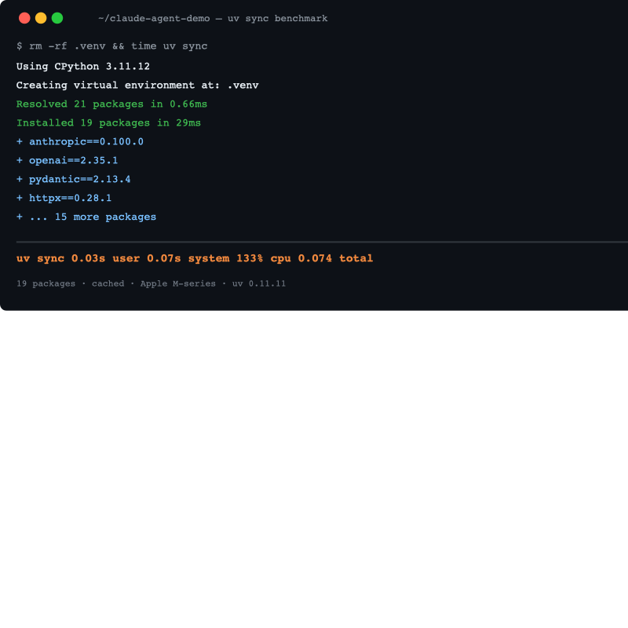

Until last year, every time I started an AI project I'd go through the same ritual. `python -m venv .venv`, `source .venv/bin/activate`, `pip install anthropic openai`... and then wait. Sometimes over two minutes. Watching anthropic, torch, and pydantic download one by one.

The context-switching cost added up. Every time I made a new experiment branch, environment setup broke the flow. The "works on my machine" problem didn't go away either.

Then I started using `uv`, a Python package manager written in Rust from the team behind Ruff at Astral. I benchmarked it today while setting up a Claude SDK project. Installing `anthropic` plus 16 packages total took **0.874 seconds**. With pip, that same operation would have taken 20〜40 seconds.

What follows is that benchmark run, retraced step by step. With uv 0.11, from an empty directory through project init, Claude SDK install, and CI.

## What's Actually Wrong with pip, Poetry, and conda

Honestly, pip itself isn't the problem. It's a proven tool that's downloaded billions of packages. The issue is the combination of <strong>speed and environment isolation</strong>.

Why pip is slow for AI dev is structural: it resolves packages sequentially and doesn't cache downloaded files efficiently. When you run `pip install anthropic openai torch`, it fetches each package's metadata, resolves dependencies, and checks for conflicts serially.

Poetry is much better at dependency management. Declarative `pyproject.toml`, lock file support. But Poetry itself is written in Python, which puts a ceiling on speed, and debugging a broken environment gets tedious fast.

conda is strong for Python version management but environments tend to balloon to several gigabytes, and it's awkward to use in Docker CI.

uv is written in Rust, which gives it fundamentally different performance on parallel downloads and cache utilization. What I measured today:

```
uv init claude-agent-demo         →  0.435s
uv add anthropic                  →  0.874s  (16 packages, pydantic-core 1.9MB)
uv add openai httpx python-dotenv →  0.555s  (3 more packages)
uv sync (cache hit, 19 packages)  →  0.074s  (29ms install)
```

## What You Need Before Installing (Almost Nothing)

Almost nothing is required to install uv. Check the following by OS:

- **macOS/Linux**: `curl` or Homebrew
- **Windows**: PowerShell
- No need to pre-install Python. uv can manage Python versions directly

That last point matters. You don't need pyenv, conda, or a specific system Python to get started.

## Step 1: Install uv

macOS and Linux: one line.

```bash
curl -LsSf https://astral.sh/uv/install.sh | sh
```

Or via Homebrew:

```bash
brew install uv
```

Windows PowerShell:

```powershell
powershell -ExecutionPolicy ByPass -c "irm https://astral.sh/uv/install.ps1 | iex"
```

After installation:

```bash
uv --version
# uv 0.11.11 (ed7b06001 2026-05-06)
```

This is the current latest as of today (2026-05-07). Astral releases frequently; `uv self update` keeps you current.

## Step 2: Initialize an AI Project

```bash
uv init claude-agent-demo
cd claude-agent-demo
```

Output:

```
Initialized project `claude-agent-demo` at `/path/to/claude-agent-demo`
```

Completes in 0.435 seconds. The generated structure:

```
claude-agent-demo/
├── main.py
├── pyproject.toml
└── README.md
```

The `pyproject.toml` that uv generates:

```toml
[project]
name = "claude-agent-demo"
version = "0.1.0"
description = "Add your description here"
readme = "README.md"
requires-python = ">=3.11"
dependencies = []
```

`pyproject.toml` is the Python ecosystem standard project file. Unlike `requirements.txt`, it's the source of truth for both development and packaging.

Set up your `.env` at this point:

```bash
cat > .env << 'EOF'
ANTHROPIC_API_KEY=your-api-key-here
EOF
```

## Step 3: Add the Claude SDK

```bash
uv add anthropic
```

The actual install log from today's test:

```
Using CPython 3.11.12
Creating virtual environment at: .venv
Resolved 17 packages in 514ms
Downloading pydantic-core (1.9MiB)
 Downloaded pydantic-core
Prepared 16 packages in 269ms
Installed 16 packages in 20ms
 + annotated-types==0.7.0
 + anthropic==0.100.0
 + anyio==4.13.0
 + certifi==2026.4.22
 + distro==1.9.0
 + docstring-parser==0.18.0
 + h11==0.16.0
 + httpcore==1.0.9
 + httpx==0.28.1
 + idna==3.13
 + jiter==0.14.0
 + pydantic==2.13.4
 + pydantic-core==2.46.4
 + sniffio==1.3.1
 + typing-extensions==4.15.0
 + typing-inspection==0.4.2
```

Even with pydantic-core at 1.9MB, the entire install finished in 0.874 seconds. This is cold cache, nothing downloaded previously.

Adding more SDKs is just as fast:

```bash
uv add openai httpx python-dotenv
```

```
Resolved 21 packages in 232ms
Installed 3 packages in 19ms
 + openai==2.35.1
 + python-dotenv==1.2.2
 + tqdm==4.67.3
```

0.555 seconds. Both anthropic and openai depend on `httpx`, and uv resolves this correctly without duplication. Dependency collision management is exactly where pip tends to silently downgrade or upgrade packages in ways you don't notice until something breaks.

## Step 4: Run Your First Claude Script

Write `main.py`:

```python
import anthropic
import os
from dotenv import load_dotenv

load_dotenv()

def main():
    client = anthropic.Anthropic(
        api_key=os.environ.get("ANTHROPIC_API_KEY")
    )
    
    message = client.messages.create(
        model="claude-opus-4-7-20260401",
        max_tokens=1024,
        messages=[
            {"role": "user", "content": "Explain in one sentence why uv is faster than pip."}
        ]
    )
    
    print(message.content[0].text)

if __name__ == "__main__":
    main()
```

Run it:

```bash
uv run main.py
```

The key point with `uv run`: you <strong>never need to activate the virtualenv</strong>. No `source .venv/bin/activate`. uv injects the project environment automatically. First run takes about 1.675 seconds (environment check); subsequent runs are faster from cache.

To verify the import without an API call:

```bash
uv run python -c "import anthropic; print(anthropic.__version__)"
# 0.100.0
```

If you want to go further with Claude streaming agents using the Vercel AI SDK, the project setup starts the same way. Run `uv add` for whatever SDK you need, then `uv run` your entry point.

## Step 5: Python Version Management

One of uv's underrated features: you can install and switch Python versions without pyenv.

List available versions:

```bash
uv python list
```

Partial output from my machine:

```
cpython-3.15.0a8-macos-aarch64-none      <download available>
cpython-3.14.5rc1-macos-aarch64-none     <download available>
cpython-3.13.13-macos-aarch64-none       <download available>
cpython-3.13.11-macos-aarch64-none       /opt/homebrew/bin/python3.13
cpython-3.12.8-macos-aarch64-none        /usr/local/bin/python3.12
```

Create a project pinned to a specific version:

```bash
uv init my-project --python 3.13
```

Pin an existing project:

```bash
uv python pin 3.12
```

This creates a `.python-version` file, ensuring everyone on the team uses the same Python version. One tool replaces pyenv + virtualenv + pip.

## Step 6: Team Collaboration and CI/CD

Commit `uv.lock` to git. With that file checked in, anyone cloning the repo gets exactly the same package versions.

After cloning:

```bash
git clone <repo-url>
cd my-project
uv sync
```

From today's test. I deleted `.venv` and ran `uv sync`:

```
Using CPython 3.11.12
Creating virtual environment at: .venv
Resolved 21 packages in 0.66ms
Installed 19 packages in 29ms
```

<strong>0.074 seconds</strong>. With a warm cache, this is what reinstalling 19 packages looks like.



GitHub Actions configuration:

```yaml
name: Test

on: [push, pull_request]

jobs:
  test:
    runs-on: ubuntu-latest
    steps:
      - uses: actions/checkout@v4
      
      - name: Install uv
        uses: astral-sh/setup-uv@v4
        with:
          version: "0.11.11"
      
      - name: Set up Python
        run: uv python install
      
      - name: Install dependencies
        run: uv sync --all-extras --dev
      
      - name: Run tests
        run: uv run pytest
```

The official `astral-sh/setup-uv` action handles cache automatically. When building an MCP server in Python, this same CI pattern applies. Add the dependency with `uv add fastmcp` — see the [FastMCP server build guide](/en/blog/en/fastmcp-python-mcp-server-build-guide-2026) for a complete example — then `uv sync` in GitHub Actions.

## Managing CLI Tools with uv tool

uv handles CLI tool installation too, replacing `pipx`.

```bash
# Install ruff as a global CLI tool
uvx ruff check .

# One-shot run without installing (like npx)
uvx --from httpie http https://api.anthropic.com/v1/models

# Persistent install
uv tool install ruff
uv tool install black
```

`uvx` runs a tool immediately without a permanent install. For pinning specific versions:

```bash
uvx ruff@0.4.0 check .       # pin to a version
uvx --python 3.12 mypy .     # specify Python version
```

Common tools for AI development:

```bash
uv tool install ruff          # linter/formatter
uv tool install mypy          # type checking
uv tool install pytest        # test runner
uv tool install pre-commit    # git hook management
```

No more separate `pip install --user` or `pipx`. One tool handles project dependencies and global CLI tools.

## Edge Cases Worth Knowing

**Migrating an existing requirements.txt project**:

```bash
# Works on existing projects
uv pip install -r requirements.txt
```

uv supports `pip` subcommands. When a full migration isn't practical, `uv pip install` bridges the gap.

**Dev-only dependencies**:

```bash
# Add to dev group
uv add --dev pytest ruff mypy

# Install production dependencies only
uv sync --no-dev
```

**Anthropic SDK optional extras**:

```bash
# Add Amazon Bedrock support
uv add "anthropic[bedrock]"

# Add Vertex AI (GCP) support
uv add "anthropic[vertex]"
```

The bracket syntax selects optional extras. `anthropic[bedrock]` pulls in `boto3`; `anthropic[vertex]` pulls in the GCP client.

## Dependency Tree and Debugging

To understand what installed and why:

```bash
uv tree
```

Output:

```
claude-agent-demo v0.1.0
├── anthropic v0.100.0
│   ├── anyio v4.13.0
│   │   ├── idna v3.13
│   │   └── typing-extensions v4.15.0
│   ├── httpx v0.28.1
│   │   ├── certifi v2026.4.22
│   │   └── httpcore v1.0.9
│   ├── pydantic v2.13.4
│   └── ...
└── openai v2.35.1
    └── ...
```

`(*)` marks shared dependencies. Much clearer than `pip show` for tracking down where a version came from.

To remove a package:

```bash
uv remove openai
```

Lock file updates automatically.

## When to Use uv, and When to Skip It

Fast doesn't mean best for every situation. After splitting it across real projects, here's roughly the line I draw.

**Reach for uv when**

- You're building an AI agent project whose dependencies are pure PyPI, like the Claude SDK or OpenAI SDK. The dependency tree stays clean, so uv's strengths show up directly.
- CI/CD build time is your bottleneck. A 0.074-second warm-cache `uv sync` is a real gap over pip.
- Your team keeps hitting "works on my machine" because everyone's on a different Python version. `uv python pin` settles it in one line.
- You're a solo developer tired of managing pipx, pyenv, and venv separately. One tool covers all three.

**Leave pip alone when**

- The legacy project already works. If `requirements.txt` and your internal deploy scripts are wired into pip, there's little reason to touch it. Migration cost can outweigh the speed win.
- Company policy locks the toolchain and getting a new binary approved is a hassle.

**Stay on Poetry when**

- You publish libraries to PyPI and your team already knows Poetry's build and release flow well. The payoff for switching is small. (That said, uv supports build and publish too, so for a brand-new library it's a fair candidate.)

**Use conda when**

- Your deep learning project depends on conda-channel binaries like torch, CUDA, or tensorflow. uv is PyPI-based and can't reach that layer. If matching a CUDA version is the whole game, conda (or conda plus uv side by side) is the realistic path.

One line: for an API-calling agent or backend Python project, start with uv. For an ML training project bound tightly to GPU binaries, start with conda. For the library side of that choice, I went deeper in the [Python AI agent library comparison](/en/blog/en/python-ai-agent-library-comparison-2026), and for dependency choices when building type-safe agents, the [Pydantic AI type-safe agent tutorial](/en/blog/en/pydantic-ai-type-safe-agent-tutorial-2026) is a useful companion.

## Where uv Still Falls Short, Honestly

Performance-wise, uv is nearly perfect. But a few things deserve honesty.

<strong>Ecosystem maturity.</strong> uv launched in 2024 and is at v0.11 as of today. Still pre-1.0. For personal projects and new codebases, it's an easy recommendation. For large teams migrating existing Poetry or pip workflows, factor in the transition cost.

<strong>conda ecosystem compatibility.</strong> If you need torch, CUDA toolkits, or tensorflow installed from conda channels, uv can't help you — it's PyPI-only. For pure Python AI projects that just hit an API or run an agent framework over text, this isn't an issue. For deep learning work requiring specific CUDA versions, you may still need conda alongside uv.

<strong>The `uv run` habit shift.</strong> Typing `uv run` instead of `python` takes adjustment. The upside is that team members can't accidentally run scripts against system Python without noticing.

The LLM coding environment optimization post touches on a similar observation: the harder part of adopting a faster tool is often changing team habits, not the tool itself.

## Command Recipes to Copy Right Now

```bash
# Start a new AI project
uv init my-ai-project
cd my-ai-project

# Install Claude SDK
uv add anthropic python-dotenv

# Add multiple SDKs at once
uv add anthropic openai httpx

# Run a script (no venv activation needed)
uv run main.py

# Sync team environment from lock file
uv sync

# Create a project with a specific Python version
uv init my-project --python 3.13

# Inspect dependency tree
uv tree

# Remove a package
uv remove openai

# Update uv itself
uv self update
```

I now reach for `uv init` almost automatically when starting a new AI project. I haven't found a reason to go back to pip. For conda-dependent ML work, the choice is still necessary.

0.874 seconds isn't just a speed stat. The less friction each experiment costs, the more experiments you run. That tends to produce better code.

## References (Official Sources)

Every command and behavior in this post was cross-checked against the official uv 0.11 documentation.

- [uv official documentation](https://docs.astral.sh/uv/) — full feature set and command reference
- [astral-sh/uv GitHub repository](https://github.com/astral-sh/uv) — source code, release notes, issue tracker
- [uv installation guide](https://docs.astral.sh/uv/getting-started/installation/) — official per-OS install instructions
- [Using uv in GitHub Actions](https://docs.astral.sh/uv/guides/integration/github/) — CI integration and the `astral-sh/setup-uv` action
- [Astral documentation hub](https://docs.astral.sh/) — docs from the Astral team behind uv, Ruff, and ty
