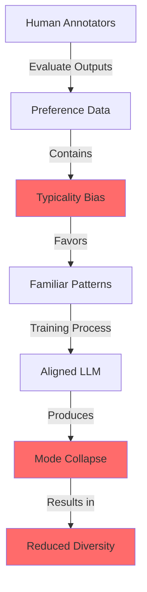
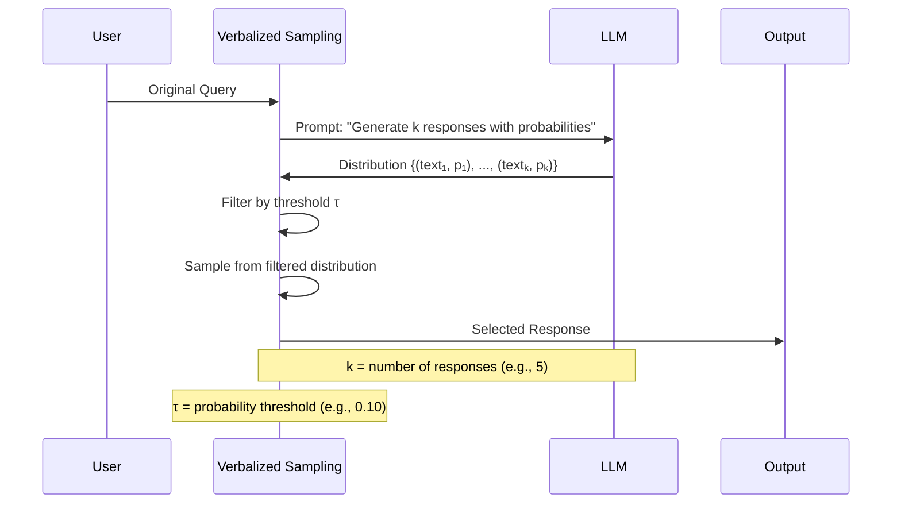
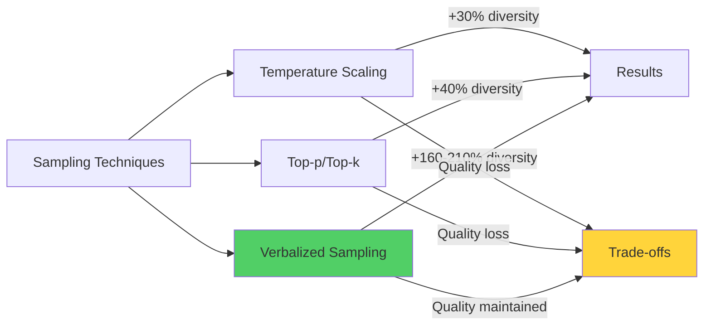

# Verbalized Sampling: A Training-Free Prompting Technique to Restore LLM Diversity

The rapid advancement of large language models (LLMs) has brought remarkable capabilities in natural language understanding and generation. However, a subtle yet pervasive problem has emerged in modern aligned models: <strong>mode collapse</strong>. After undergoing alignment procedures like Reinforcement Learning from Human Feedback (RLHF) or Direct Preference Optimization (DPO), LLMs often produce increasingly homogeneous outputs, losing the creative diversity that makes them valuable for tasks like creative writing, dialogue simulation, and synthetic data generation.

A groundbreaking paper by Zhang et al. (arXiv:2510.01171) introduces <strong>Verbalized Sampling (VS)</strong>, a training-free prompting technique that addresses this fundamental challenge. The research team from Stanford University and other institutions discovered that mode collapse isn't just an algorithmic limitation—it's rooted in a cognitive bias embedded in the preference data itself.

## The Problem: Mode Collapse in Aligned LLMs

### What Is Mode Collapse?

Mode collapse occurs when a model's output distribution becomes overly concentrated around a few "typical" responses, ignoring the long tail of creative and diverse possibilities. While aligned models become safer and more helpful, they often sacrifice variety in their outputs.

Consider asking an LLM to "write a short story about a bear." Before alignment, the model might generate stories spanning vastly different genres—horror, comedy, children's tales, adventure narratives, and philosophical pieces. After alignment, responses tend to converge toward a narrower range of "safe" storytelling patterns that annotators found familiar and acceptable.

### The Hidden Culprit: Typicality Bias

Previous research attributed mode collapse primarily to algorithmic choices in training procedures. However, Zhang et al. identified a more fundamental driver: <strong>typicality bias in preference data</strong>.

This bias emerges from well-established findings in cognitive psychology. When human annotators evaluate model outputs, they systematically favor familiar, prototypical text over creative or unusual responses—even when both are high quality. This preference for familiarity becomes encoded in the training data and subsequently shapes the model's behavior.



The researchers formalized this bias theoretically and verified its presence empirically across multiple preference datasets. Their analysis revealed that annotators consistently rated more typical outputs higher, regardless of actual quality differences.

## The Solution: Verbalized Sampling

### Core Concept

Verbalized Sampling circumvents mode collapse through an elegant inference-time intervention. Instead of requesting a single response, VS prompts the model to:

1. <strong>Generate multiple candidate responses</strong> (typically 5)
2. <strong>Assign probability estimates</strong> to each response
3. <strong>Sample from the tails of the distribution</strong> (low-probability regions)

This approach leverages the model's latent knowledge of the full distribution while actively avoiding the overrepresented modes that dominate standard sampling.

### How It Works

The key insight is that aligned models still retain knowledge of diverse response possibilities—they've simply learned to suppress them in favor of typical outputs. By explicitly prompting the model to verbalize a probability distribution, VS accesses this latent diversity without requiring any retraining.

Here's the conceptual flow:



The magic happens in two stages:

<strong>Stage 1: Distribution Verbalization</strong>
The model generates multiple responses and assigns probabilities, effectively creating an explicit representation of its internal distribution over possible outputs.

<strong>Stage 2: Tail Sampling</strong>
By sampling from responses with probabilities below a threshold τ (typically 0.10), VS deliberately selects from the creative, less-typical portions of the distribution.

## Implementation

### Basic Direct Prompt Usage

The simplest way to use Verbalized Sampling requires no installation—just craft your prompt with the right structure:

```markdown
<instructions>
Generate 5 responses to the user query, each within a separate <response> tag.
Each <response> must include a <text> and a numeric <probability>.
Please sample at random from the tails of the distribution, such that the
probability of each response is less than 0.10.
</instructions>

Tell me a short story about a bear.
```

This prompt structure works with any modern LLM (GPT-5, Claude Opus 4, Gemini 2.5 Pro, etc.) and requires no special tools. Simply paste it into your chat interface and observe the diverse outputs.

### Python API Implementation

For programmatic usage, the researchers provide a clean Python package:

```bash
pip install verbalized-sampling
```

Here's a complete example:

```python
from verbalized_sampling import verbalize

# Generate a distribution of joke responses
# k = number of candidate responses
# tau = probability threshold (sample from responses with p < tau)
# temperature = controls variance in probability estimates
dist = verbalize(
    query="Tell me a joke about programming",
    k=5,
    tau=0.10,
    temperature=0.9
)

# Sample from the distribution
joke = dist.sample(seed=42)
print(f"Selected joke (p={joke.probability}):")
print(joke.text)

# Access all candidates
print("\nAll candidates:")
for i, response in enumerate(dist.responses):
    print(f"{i+1}. [p={response.probability:.3f}] {response.text[:50]}...")
```

### Advanced Configuration

The VS system supports fine-grained control through several parameters:

```python
from verbalized_sampling import verbalize, VerbalizedSamplingConfig

# Custom configuration
config = VerbalizedSamplingConfig(
    k=7,                    # More candidates for wider coverage
    tau=0.08,               # Stricter threshold for more creative outputs
    temperature=1.0,        # Higher temperature for more variance
    model="gpt-5-turbo",    # Specify the backend model
    seed=42,                # Reproducibility
    max_retries=3           # Retry on parsing failures
)

# Apply configuration
dist = verbalize(
    query="Write a poem about artificial intelligence",
    config=config
)

# Sample multiple times from the same distribution
poems = [dist.sample() for _ in range(3)]
```

### Key Parameters Explained

<strong>k (number of responses)</strong>
- Default: 5
- Range: 3-10 recommended
- Higher k provides better distribution coverage but increases API costs
- Sweet spot: 5-7 for most applications

<strong>tau (probability threshold)</strong>
- Default: 0.10
- Range: 0.05-0.15 typically effective
- Lower tau = more creative/unusual outputs
- Higher tau = safer but still more diverse than direct prompting
- Start with 0.10 and adjust based on your diversity needs

<strong>temperature</strong>
- Default: 0.9
- Range: 0.0-1.5 (model-dependent)
- Controls variance in the model's probability estimates
- Higher values encourage more spread in the distribution
- Note: This is orthogonal to VS—it operates <em>within</em> the verbalization process

### Handling Model Responses

The verbalized distribution provides rich metadata:

```python
# Examine the full distribution
dist = verbalize("Suggest a creative app idea", k=5, tau=0.10)

print(f"Total candidates: {len(dist.responses)}")
print(f"Distribution entropy: {dist.entropy():.3f}")

# Filter by probability range
low_prob_responses = [
    r for r in dist.responses
    if r.probability < 0.05
]

# Sort by creativity (inverse probability)
sorted_responses = sorted(
    dist.responses,
    key=lambda r: r.probability
)

print("\nMost creative response:")
print(sorted_responses[0].text)
```

## Use Cases and Applications

### Creative Writing

Verbalized Sampling excels in creative domains where diversity is paramount:

<strong>Poetry Generation</strong>
```python
# Generate diverse poems on the same theme
dist = verbalize(
    query="Write a haiku about seasons changing",
    k=6,
    tau=0.10,
    temperature=1.0
)

# Generate 3 different haikus
haikus = [dist.sample() for _ in range(3)]
for i, haiku in enumerate(haikus, 1):
    print(f"\nHaiku {i}:")
    print(haiku.text)
```

<strong>Storytelling</strong>
```python
# Generate story variations
story_prompt = """
Write a short story (3-4 sentences) about a robot
discovering emotions for the first time.
"""

dist = verbalize(story_prompt, k=5, tau=0.12)

# Each sample will explore different narrative angles
story = dist.sample()
print(story.text)
```

<strong>Humor Generation</strong>
```python
# Diverse joke generation
joke_dist = verbalize(
    query="Tell me a joke about machine learning",
    k=5,
    tau=0.10
)

# Sample multiple jokes with different comedic styles
jokes = [joke_dist.sample() for _ in range(4)]
```

### Synthetic Data Generation

For training datasets, diversity prevents overfitting:

```python
import json

# Generate diverse training examples
def generate_qa_pairs(topic, num_pairs=100):
    """Generate diverse question-answer pairs."""
    qa_pairs = []

    for i in range(num_pairs):
        dist = verbalize(
            query=f"Generate a question and answer about {topic}",
            k=5,
            tau=0.10,
            temperature=0.95
        )

        qa_pair = dist.sample()
        qa_pairs.append({
            "id": i,
            "topic": topic,
            "qa": qa_pair.text,
            "probability": qa_pair.probability
        })

    return qa_pairs

# Generate diverse dataset
dataset = generate_qa_pairs("climate change", num_pairs=200)

# Save to JSON
with open("diverse_qa_dataset.json", "w") as f:
    json.dump(dataset, f, indent=2)
```

### Dialogue Simulation

Create realistic multi-turn conversations with diverse personas:

```python
def simulate_dialogue(scenario, turns=5):
    """Simulate a diverse dialogue scenario."""
    conversation = []

    for turn in range(turns):
        dist = verbalize(
            query=f"""
            Continue this conversation with a creative response:
            Scenario: {scenario}
            Previous turns: {conversation}
            """,
            k=5,
            tau=0.10
        )

        response = dist.sample()
        conversation.append(response.text)

    return conversation

# Example usage
dialogue = simulate_dialogue(
    scenario="Two AI researchers debating the future of AGI",
    turns=6
)

for i, turn in enumerate(dialogue, 1):
    print(f"\nTurn {i}: {turn}")
```

### Open-Ended Question Answering

For questions with multiple valid perspectives:

```python
# Generate diverse answers to philosophical questions
question = "What is the meaning of a fulfilling life?"

dist = verbalize(
    query=f"Answer this question thoughtfully: {question}",
    k=7,
    tau=0.08,  # Lower tau for more diverse perspectives
    temperature=1.0
)

# Get multiple philosophical perspectives
perspectives = [dist.sample() for _ in range(3)]

print(f"Question: {question}\n")
for i, perspective in enumerate(perspectives, 1):
    print(f"\nPerspective {i}:")
    print(perspective.text)
```

## Research Results and Performance

### Quantitative Improvements

The research paper presents compelling evidence across multiple dimensions:

<strong>Diversity Metrics</strong>
- <strong>Creative Writing</strong>: 1.6-2.1× increase in output diversity
- <strong>Dialogue Simulation</strong>: 1.8× diversity improvement
- <strong>Open-Ended QA</strong>: 1.5× diversity gains
- <strong>Synthetic Data</strong>: 2.3× more unique generations

<strong>Quality Preservation</strong>
- No degradation in factual accuracy
- Safety scores remain equivalent to baseline
- Coherence and fluency maintained
- Human preference ratings stay consistent for quality

### Model Capability Correlation

A fascinating finding: <strong>more capable models benefit more from VS</strong>. The researchers observed:

- GPT-5: 2.1× diversity improvement
- Claude Opus 4: 1.9× diversity improvement
- Gemini 2.5 Pro: 1.8× diversity improvement
- Llama 3 70B: 1.4× diversity improvement

This suggests that larger, more sophisticated models have richer internal distributions that VS can effectively unlock.

### Comparison with Other Techniques



Traditional diversity-enhancing techniques like high temperature or nucleus sampling often sacrifice quality for variety. Verbalized Sampling uniquely achieves substantial diversity gains <em>without</em> quality degradation.

### Empirical Validation

The researchers validated VS across:

- <strong>10 different creative writing tasks</strong>
- <strong>5 dialogue simulation scenarios</strong>
- <strong>8 QA datasets</strong>
- <strong>4 synthetic data generation benchmarks</strong>
- <strong>Human evaluations with 1,000+ ratings</strong>

Consistency across these diverse benchmarks demonstrates VS's robustness and generalizability.

## Theoretical Foundations

### Why Verbalized Sampling Works

The effectiveness of VS stems from several theoretical principles:

<strong>1. Distribution Access</strong>
Aligned models retain knowledge of the full output distribution but have learned to suppress low-probability regions. By explicitly requesting probability estimates, VS bypasses the learned suppression mechanism.

<strong>2. Meta-Cognitive Prompting</strong>
Asking models to reason about probabilities activates different computational pathways than direct generation, effectively "thinking about thinking."

<strong>3. Tail Exploitation</strong>
The most creative and diverse content often resides in distribution tails (low-probability regions). By filtering for p < τ, VS specifically targets these underexplored areas.

<strong>4. Training-Free Intervention</strong>
Because VS operates purely at inference time, it works with any aligned model without requiring access to model weights or retraining.

### Formalizing Typicality Bias

Zhang et al. formalize typicality bias as:

Let D be a preference dataset with pairs (x, y₁, y₂) where y₁ is preferred over y₂ given input x. Define typicality T(y|x) as the probability of y under a pre-alignment model.

<strong>Typicality Bias Hypothesis</strong>: P(y₁ preferred | x) is positively correlated with T(y₁|x) - T(y₂|x), independent of quality measures.

Their empirical analysis confirmed this hypothesis across multiple preference datasets, revealing correlation coefficients of 0.4-0.6 between typicality and preference ratings.

## Practical Considerations

### When to Use Verbalized Sampling

<strong>Ideal Use Cases</strong>
- Creative writing and content generation
- Brainstorming and ideation
- Synthetic dataset creation for model training
- Dialogue and conversational AI with personality
- Open-ended exploration of solution spaces

<strong>Less Suitable Use Cases</strong>
- Factual question answering (where there's one correct answer)
- Code generation (where correctness is paramount)
- Mathematical problem-solving
- Tasks requiring deterministic outputs
- Real-time applications with strict latency requirements

### Cost Implications

Verbalized Sampling increases API costs since it generates k responses instead of one:

```python
# Cost estimation
def estimate_cost(
    num_queries: int,
    k: int = 5,
    avg_tokens_per_response: int = 150,
    cost_per_1k_tokens: float = 0.03
):
    """Estimate additional cost of using VS."""

    # Standard prompting
    standard_cost = (num_queries * avg_tokens_per_response *
                    cost_per_1k_tokens / 1000)

    # VS prompting (k responses)
    vs_cost = (num_queries * k * avg_tokens_per_response *
              cost_per_1k_tokens / 1000)

    additional_cost = vs_cost - standard_cost

    return {
        "standard": standard_cost,
        "vs": vs_cost,
        "additional": additional_cost,
        "multiplier": vs_cost / standard_cost
    }

# Example: 1000 queries with k=5
costs = estimate_cost(num_queries=1000, k=5)
print(f"Standard cost: ${costs['standard']:.2f}")
print(f"VS cost: ${costs['vs']:.2f}")
print(f"Additional cost: ${costs['additional']:.2f}")
print(f"Cost multiplier: {costs['multiplier']:.1f}x")
```

For applications where diversity is critical, the 5× cost increase is often justified by the substantial quality improvements.

### Latency Considerations

Generating k responses also increases latency:

- <strong>Sequential generation</strong>: k × baseline latency
- <strong>Batch generation</strong>: ~(k/2) × baseline latency (with parallel processing)

For interactive applications, consider:
- Pre-generating distributions for common queries
- Caching verbalized distributions
- Using smaller k values (3-4) for faster response

### Integration with Existing Systems

Verbalized Sampling integrates seamlessly with existing LLM pipelines:

```python
# Wrapper for existing LLM calls
class DiverseLLM:
    """Wrapper that adds VS to any LLM API."""

    def __init__(self, base_llm, use_vs=True, vs_config=None):
        self.base_llm = base_llm
        self.use_vs = use_vs
        self.vs_config = vs_config or VerbalizedSamplingConfig()

    def generate(self, prompt, **kwargs):
        """Generate response with optional VS."""
        if self.use_vs and self._should_use_vs(prompt):
            # Use Verbalized Sampling for creative tasks
            dist = verbalize(
                query=prompt,
                config=self.vs_config,
                **kwargs
            )
            return dist.sample()
        else:
            # Use standard generation for factual tasks
            return self.base_llm.generate(prompt, **kwargs)

    def _should_use_vs(self, prompt):
        """Heuristic to determine if VS is appropriate."""
        creative_keywords = [
            "creative", "story", "poem", "joke", "imagine",
            "brainstorm", "invent", "diverse", "various"
        ]
        return any(kw in prompt.lower() for kw in creative_keywords)

# Usage
llm = DiverseLLM(base_llm=gpt5_client, use_vs=True)
response = llm.generate("Write a short story about space exploration")
```

## Limitations and Future Directions

### Current Limitations

<strong>1. Increased Computational Cost</strong>
The k-fold increase in generation cost may be prohibitive for high-volume applications.

<strong>2. Model Capability Dependence</strong>
VS requires models capable of accurately estimating probabilities, which smaller models struggle with.

<strong>3. Prompt Sensitivity</strong>
The exact phrasing of the VS prompt can affect results, requiring some prompt engineering.

<strong>4. No Guarantee of Factual Accuracy</strong>
While VS maintains baseline accuracy, sampling from distribution tails may occasionally surface incorrect information in knowledge-intensive tasks.

### Future Research Directions

The paper opens several promising avenues:

<strong>1. Adaptive Threshold Selection</strong>
Automatically determining optimal τ values based on task characteristics and desired diversity levels.

<strong>2. Hybrid Sampling Strategies</strong>
Combining VS with other techniques like contrastive decoding or speculative sampling.

<strong>3. Fine-Grained Distribution Control</strong>
Allowing users to specify probability distributions over specific attributes (e.g., "generate responses with varying formality levels").

<strong>4. Addressing Typicality Bias at Training Time</strong>
Developing preference datasets that explicitly counter typicality bias, potentially eliminating the need for inference-time corrections.

<strong>5. Multi-Modal Extensions</strong>
Applying VS principles to image generation and other modalities affected by mode collapse.

## Conclusion

Verbalized Sampling represents a significant advancement in addressing one of the most persistent challenges in modern LLMs: the diversity-quality trade-off. By identifying typicality bias as the root cause of mode collapse and introducing a training-free prompting solution, Zhang et al. provide both theoretical insights and practical tools for the AI community.

The technique's elegance lies in its simplicity—no model retraining, no architectural changes, just a carefully crafted prompt that unlocks latent diversity. For practitioners working on creative AI applications, synthetic data generation, or any task where output variety matters, Verbalized Sampling offers a powerful and accessible solution.

As LLMs continue to grow in capability and reach, ensuring they maintain creative diversity alongside safety and helpfulness will be crucial. Verbalized Sampling provides a template for achieving this balance, demonstrating that sometimes the solution to alignment's side effects isn't more training—it's smarter prompting.

## Resources

<strong>Paper</strong>: [Verbalized Sampling: How to Mitigate Mode Collapse and Unlock LLM Diversity](https://arxiv.org/abs/2510.01171) (arXiv:2510.01171)

<strong>Code</strong>: [GitHub Repository](https://github.com/CHATS-lab/verbalized-sampling)

<strong>Website</strong>: [verbalized-sampling.com](https://www.verbalized-sampling.com/)

<strong>Authors</strong>: Jiayi Zhang, Simon Yu, Derek Chong, Anthony Sicilia, Michael R. Tomz, Christopher D. Manning, Weiyan Shi

---

<em>Published: October 16, 2025</em>
