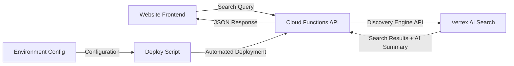

## Overview

Traditional site search solutions often rely on keyword matching and basic indexing. Google's Vertex AI Search (formerly known as Enterprise Search) takes a fundamentally different approach by leveraging machine learning and natural language processing to deliver intelligent, context-aware search results.

### What Makes Vertex AI Search Different?

<strong>Semantic Understanding</strong>: Unlike traditional keyword-based search, Vertex AI Search understands the <em>meaning</em> behind queries. Users can search using natural language questions, and the system comprehends intent rather than just matching words.

<strong>AI-Powered Summaries</strong>: When enabled, Vertex AI Search can generate concise summaries from multiple search results, providing users with quick answers without needing to click through every result.

<strong>Relevance Ranking</strong>: Machine learning models continuously improve search result ranking based on user interactions and contextual signals.

<strong>Multi-Modal Search</strong>: Support for searching across various content types including web pages, documents, images, and structured data.

### Architecture Overview

This guide walks you through building a complete site search solution with the following architecture:



<strong>Key Components</strong>:
1. <strong>Vertex AI Search Engine</strong>: Indexes and searches your content
2. <strong>Cloud Functions API Server</strong>: Securely proxies requests between your website and Vertex AI
3. <strong>Automated Deployment Script</strong>: Manages configuration and deployment lifecycle
4. <strong>Frontend Integration</strong>: JavaScript code to call the API and display results

## Prerequisites

Before diving into implementation, you'll need to set up several Google Cloud Platform (GCP) components.

### 1. Google Cloud Project Setup

First, ensure you have a GCP project with billing enabled:

```bash
# Install Google Cloud SDK if not already installed
# https://cloud.google.com/sdk/docs/install

# Initialize gcloud CLI
gcloud init

# Create a new project (or use an existing one)
gcloud projects create your-project-id --name="Your Project Name"

# Set the active project
gcloud config set project your-project-id
```

### 2. Enable Required APIs

You'll need to enable several APIs for this solution:

```bash
# Enable required APIs
gcloud services enable \
  discoveryengine.googleapis.com \
  cloudfunctions.googleapis.com \
  cloudbuild.googleapis.com \
  run.googleapis.com
```

### 3. Create Vertex AI Search Engine

1. Navigate to the [Vertex AI Agent Builder Console](https://console.cloud.google.com/gen-app-builder)
2. Click <strong>"Create App"</strong>
3. Choose <strong>"Search"</strong> as the app type
4. Configure your search engine:
   - <strong>Content Type</strong>: Website (for web crawling) or Unstructured documents
   - <strong>Data Source</strong>: Add your website URLs or upload documents
   - <strong>Advanced Settings</strong>: Enable "Return extractive answers" for AI summaries

5. Note your <strong>Engine ID</strong> and <strong>Data Store ID</strong> from the search engine details page

### 4. Set Up Service Account (Optional but Recommended)

For production deployments, create a dedicated service account:

```bash
# Create service account
gcloud iam service-accounts create vertex-search-api \
  --display-name="Vertex AI Search API Service Account"

# Grant necessary permissions
gcloud projects add-iam-policy-binding your-project-id \
  --member="serviceAccount:vertex-search-api@your-project-id.iam.gserviceaccount.com" \
  --role="roles/discoveryengine.editor"
```

## Cloud Functions API Server Implementation

The Cloud Functions API server acts as a secure bridge between your website and Vertex AI Search, handling authentication, request validation, and response formatting.

### Core Implementation: index.js

Here's the complete Cloud Functions implementation with detailed explanations:

```javascript
const { SearchServiceClient } = require('@google-cloud/discoveryengine').v1;

// Initialize the Discovery Engine client
const client = new SearchServiceClient();

// Environment configuration
const PROJECT_ID = process.env.PROJECT_ID;
const PROJECT_NUMBER = process.env.PROJECT_NUMBER;
const ENGINE_ID = process.env.ENGINE_ID;
const LOCATION = process.env.LOCATION || 'global';
const ALLOWED_DOMAINS = process.env.ALLOWED_DOMAINS
  ? process.env.ALLOWED_DOMAINS.split(',')
  : [];

/**
 * Cloud Function entry point
 * Handles search requests with CORS and domain validation
 */
exports.search = async (req, res) => {
  // Set CORS headers
  const origin = req.headers.origin;

  // Validate origin against allowed domains
  if (ALLOWED_DOMAINS.length > 0) {
    if (!origin || !ALLOWED_DOMAINS.some(domain =>
      origin.includes(domain) || origin.endsWith(domain)
    )) {
      res.status(403).json({
        error: 'Forbidden: Origin not allowed',
        allowedDomains: ALLOWED_DOMAINS
      });
      return;
    }
  }

  // Configure CORS response
  res.set('Access-Control-Allow-Origin', origin || '*');
  res.set('Access-Control-Allow-Methods', 'GET, POST, OPTIONS');
  res.set('Access-Control-Allow-Headers', 'Content-Type');
  res.set('Access-Control-Max-Age', '3600');

  // Handle preflight requests
  if (req.method === 'OPTIONS') {
    res.status(204).send('');
    return;
  }

  // Extract search query
  const query = req.query.q || req.body?.query || '';

  if (!query) {
    res.status(400).json({ error: 'Query parameter "q" is required' });
    return;
  }

  try {
    // Construct the serving config path
    const servingConfig = client.projectLocationCollectionEngineServingConfigPath(
      PROJECT_ID,
      LOCATION,
      'default_collection',
      ENGINE_ID,
      'default_config'
    );

    // Build search request
    const request = {
      servingConfig: servingConfig,
      query: query,
      pageSize: parseInt(process.env.PAGE_SIZE || '10'),
      queryExpansionSpec: {
        condition: 'AUTO' // Automatic query expansion
      },
      spellCorrectionSpec: {
        mode: 'AUTO' // Automatic spell correction
      },
      // Enable AI-powered content summary
      contentSearchSpec: {
        summarySpec: {
          summaryResultCount: 5, // Number of results to use for summary
          includeCitations: true, // Include source citations
          ignoreAdversarialQuery: true, // Filter out adversarial queries
          ignoreNonSummarySeekingQuery: false
        },
        extractiveContentSpec: {
          maxExtractiveAnswerCount: 3, // Extract up to 3 key answers
          maxExtractiveSegmentCount: 5  // Extract up to 5 relevant segments
        }
      }
    };

    // Execute search
    const [response] = await client.search(request);

    // Process and format results
    const results = (response.results || []).map(result => {
      const document = result.document;
      const structData = document.structData;

      return {
        id: document.id,
        title: structData?.fields?.title?.stringValue ||
               extractFromSnippet(result, 'title') ||
               'Untitled',
        link: structData?.fields?.link?.stringValue ||
              document.name,
        snippet: extractSnippet(result),
        thumbnail: structData?.fields?.thumbnailUrl?.stringValue ||
                   structData?.fields?.image?.stringValue,
        // Include extractive answers if available
        extractiveAnswers: result.extractiveAnswers?.map(answer => ({
          content: answer.content,
          pageNumber: answer.pageNumber
        })),
        // Include extractive segments for context
        extractiveSegments: result.extractiveSegments?.map(segment => ({
          content: segment.content,
          pageNumber: segment.pageNumber
        }))
      };
    });

    // Extract AI summary if available
    const summary = response.summary?.summaryText || null;
    const summaryWithMetadata = response.summary ? {
      text: response.summary.summaryText,
      citations: (response.summary.summarySkippedReasons || []),
      safetyAttributes: response.summary.safetyAttributes
    } : null;

    // Return formatted response
    res.json({
      query: query,
      totalResults: response.totalSize || results.length,
      results: results,
      summary: summaryWithMetadata,
      // Include attribution for transparency
      attribution: response.attributionToken
    });

  } catch (error) {
    console.error('Search error:', error);

    // Handle quota exceeded errors gracefully
    if (error.code === 8 || error.message?.includes('quota')) {
      res.status(429).json({
        error: 'Search quota exceeded. Please try again later.',
        retryAfter: 60
      });
      return;
    }

    // Generic error response
    res.status(500).json({
      error: 'Search failed',
      message: error.message,
      details: process.env.NODE_ENV === 'development' ? error.stack : undefined
    });
  }
};

/**
 * Extract snippet from search result
 */
function extractSnippet(result) {
  if (result.extractiveSegments && result.extractiveSegments.length > 0) {
    return result.extractiveSegments[0].content;
  }

  if (result.extractiveAnswers && result.extractiveAnswers.length > 0) {
    return result.extractiveAnswers[0].content;
  }

  const structData = result.document?.structData;
  return structData?.fields?.snippet?.stringValue ||
         structData?.fields?.description?.stringValue ||
         'No description available';
}

/**
 * Extract specific field from snippet data
 */
function extractFromSnippet(result, fieldName) {
  const snippet = result.document?.derivedStructData?.snippets?.[0];
  if (!snippet) return null;

  return snippet[fieldName] || null;
}
```

### Dependencies: package.json

```json
{
  "name": "vertex-search-api",
  "version": "1.0.0",
  "description": "Vertex AI Search API proxy with Cloud Functions",
  "main": "index.js",
  "scripts": {
    "deploy": "./deploy.sh",
    "test": "node test.js"
  },
  "dependencies": {
    "@google-cloud/discoveryengine": "^3.0.0"
  },
  "engines": {
    "node": ">=18.0.0"
  }
}
```

<strong>Key Dependencies</strong>:
- <strong>@google-cloud/discoveryengine</strong>: Official Google Cloud Discovery Engine client library for Node.js, providing access to Vertex AI Search APIs

## Environment Variable Configuration

Proper configuration management is crucial for maintaining multiple environments and ensuring security. Create a `.env` file to store your configuration:

### .env File Structure

```bash
# ============================================
# Google Cloud Project Configuration
# ============================================
PROJECT_ID=your-project-id
PROJECT_NUMBER=123456789012  # Find in GCP Console > Project Settings
ENGINE_ID=your-engine-id     # From Vertex AI Search console
DATA_STORE_ID=your-datastore-id

# ============================================
# Location Configuration
# ============================================
LOCATION=global  # Options: global, us, eu, asia-northeast1, etc.

# ============================================
# Security Configuration
# ============================================
# Comma-separated list of allowed domains for CORS
ALLOWED_DOMAINS=example.com,www.example.com,staging.example.com

# ============================================
# Search Configuration
# ============================================
PAGE_SIZE=10                    # Results per page (max: 100)
ENABLE_SUMMARY=true             # Enable AI summaries
SUMMARY_RESULT_COUNT=5          # Number of results to use for summary
MAX_EXTRACTIVE_ANSWERS=3        # Maximum extractive answers
MAX_EXTRACTIVE_SEGMENTS=5       # Maximum extractive segments

# ============================================
# Cloud Functions Deployment Configuration
# ============================================
REGION=us-central1              # Deployment region
FUNCTION_NAME=vertex-search-api # Cloud Function name
RUNTIME=nodejs20                # Node.js runtime version
MEMORY=512MB                    # Memory allocation (128MB-8GB)
TIMEOUT=60s                     # Function timeout (max: 540s)
MIN_INSTANCES=0                 # Minimum instances (0 for scale to zero)
MAX_INSTANCES=10                # Maximum instances

# ============================================
# Service Account (Optional)
# ============================================
# SERVICE_ACCOUNT=vertex-search-api@your-project-id.iam.gserviceaccount.com

# ============================================
# Development Settings
# ============================================
NODE_ENV=production  # Options: development, staging, production
```

### Environment-Specific Configuration

For managing multiple environments (development, staging, production), create separate env files:

```bash
.env.development
.env.staging
.env.production
```

<strong>Example .env.production</strong>:
```bash
PROJECT_ID=mysite-prod
ALLOWED_DOMAINS=mysite.com,www.mysite.com
REGION=us-central1
FUNCTION_NAME=vertex-search-api-prod
MIN_INSTANCES=1  # Keep at least one instance warm
MAX_INSTANCES=50
```

<strong>Example .env.staging</strong>:
```bash
PROJECT_ID=mysite-staging
ALLOWED_DOMAINS=staging.mysite.com
REGION=us-central1
FUNCTION_NAME=vertex-search-api-staging
MIN_INSTANCES=0  # Scale to zero when not in use
MAX_INSTANCES=5
```

## Automated Deployment Script (deploy.sh)

The deployment script is a critical component that automates the entire deployment lifecycle, from validation to testing. This shell script handles environment configuration, API enablement, deployment, and post-deployment verification.

### Complete deploy.sh Script

```bash
#!/bin/bash

# ============================================
# Vertex AI Search Cloud Functions Deployment Script
# ============================================
# This script automates the deployment of Cloud Functions
# for Vertex AI Search API with environment-specific configuration
# ============================================

set -e  # Exit on any error

# Color codes for output
RED='\033[0;31m'
GREEN='\033[0;32m'
YELLOW='\033[1;33m'
BLUE='\033[0;34m'
NC='\033[0m' # No Color

# Default values
ENV_FILE=".env"
DRY_RUN=false
VERBOSE=false

# ============================================
# Helper Functions
# ============================================

print_info() {
  echo -e "${BLUE}ℹ ${1}${NC}"
}

print_success() {
  echo -e "${GREEN}✓ ${1}${NC}"
}

print_warning() {
  echo -e "${YELLOW}⚠ ${1}${NC}"
}

print_error() {
  echo -e "${RED}✗ ${1}${NC}"
}

print_step() {
  echo -e "\n${BLUE}==== ${1} ====${NC}\n"
}

# ============================================
# Parse Command Line Arguments
# ============================================

usage() {
  cat << EOF
Usage: $0 [OPTIONS]

Deploy Vertex AI Search Cloud Functions with automated configuration

OPTIONS:
  -e, --env-file FILE    Environment file to use (default: .env)
  -d, --dry-run          Show what would be deployed without deploying
  -v, --verbose          Enable verbose output
  -h, --help             Show this help message

EXAMPLES:
  # Deploy using default .env file
  $0

  # Deploy using production configuration
  $0 --env-file .env.production

  # Preview deployment without executing
  $0 --env-file .env.staging --dry-run

  # Deploy with verbose logging
  $0 --env-file .env.production --verbose
EOF
  exit 0
}

while [[ $# -gt 0 ]]; do
  case $1 in
    -e|--env-file)
      ENV_FILE="$2"
      shift 2
      ;;
    -d|--dry-run)
      DRY_RUN=true
      shift
      ;;
    -v|--verbose)
      VERBOSE=true
      shift
      ;;
    -h|--help)
      usage
      ;;
    *)
      print_error "Unknown option: $1"
      usage
      ;;
  esac
done

# ============================================
# Load and Validate Environment Variables
# ============================================

print_step "Loading Environment Configuration"

if [[ ! -f "$ENV_FILE" ]]; then
  print_error "Environment file not found: $ENV_FILE"
  exit 1
fi

print_info "Loading configuration from: $ENV_FILE"

# Load environment variables
set -a  # Automatically export all variables
source "$ENV_FILE"
set +a

# Validate required variables
REQUIRED_VARS=(
  "PROJECT_ID"
  "PROJECT_NUMBER"
  "ENGINE_ID"
  "REGION"
  "FUNCTION_NAME"
)

MISSING_VARS=()
for var in "${REQUIRED_VARS[@]}"; do
  if [[ -z "${!var}" ]]; then
    MISSING_VARS+=("$var")
  fi
done

if [[ ${#MISSING_VARS[@]} -gt 0 ]]; then
  print_error "Missing required environment variables:"
  for var in "${MISSING_VARS[@]}"; do
    echo "  - $var"
  done
  exit 1
fi

print_success "All required variables present"

# Display configuration
if [[ "$VERBOSE" == "true" ]] || [[ "$DRY_RUN" == "true" ]]; then
  echo ""
  print_info "Deployment Configuration:"
  echo "  Project ID:      $PROJECT_ID"
  echo "  Project Number:  $PROJECT_NUMBER"
  echo "  Engine ID:       $ENGINE_ID"
  echo "  Region:          $REGION"
  echo "  Function Name:   $FUNCTION_NAME"
  echo "  Runtime:         ${RUNTIME:-nodejs20}"
  echo "  Memory:          ${MEMORY:-512MB}"
  echo "  Timeout:         ${TIMEOUT:-60s}"
  echo "  Min Instances:   ${MIN_INSTANCES:-0}"
  echo "  Max Instances:   ${MAX_INSTANCES:-10}"
  echo "  Allowed Domains: ${ALLOWED_DOMAINS:-none}"
fi

# ============================================
# Verify GCloud Project
# ============================================

print_step "Verifying GCloud Configuration"

CURRENT_PROJECT=$(gcloud config get-value project 2>/dev/null || echo "")

if [[ "$CURRENT_PROJECT" != "$PROJECT_ID" ]]; then
  print_warning "Current project ($CURRENT_PROJECT) doesn't match target ($PROJECT_ID)"

  if [[ "$DRY_RUN" == "false" ]]; then
    read -p "Switch to project $PROJECT_ID? (y/n) " -n 1 -r
    echo
    if [[ $REPLY =~ ^[Yy]$ ]]; then
      gcloud config set project "$PROJECT_ID"
      print_success "Switched to project: $PROJECT_ID"
    else
      print_error "Deployment cancelled"
      exit 1
    fi
  fi
else
  print_success "Project verified: $PROJECT_ID"
fi

# ============================================
# Enable Required APIs
# ============================================

print_step "Enabling Required APIs"

REQUIRED_APIS=(
  "discoveryengine.googleapis.com"
  "cloudfunctions.googleapis.com"
  "cloudbuild.googleapis.com"
  "run.googleapis.com"
  "artifactregistry.googleapis.com"
)

for api in "${REQUIRED_APIS[@]}"; do
  if [[ "$DRY_RUN" == "false" ]]; then
    print_info "Enabling $api..."
    gcloud services enable "$api" --project="$PROJECT_ID" --quiet
    print_success "$api enabled"
  else
    print_info "Would enable: $api"
  fi
done

# ============================================
# Deploy Cloud Function
# ============================================

print_step "Deploying Cloud Function"

# Build deployment command
DEPLOY_CMD="gcloud functions deploy $FUNCTION_NAME \
  --gen2 \
  --runtime=${RUNTIME:-nodejs20} \
  --region=$REGION \
  --source=. \
  --entry-point=search \
  --trigger-http \
  --allow-unauthenticated \
  --memory=${MEMORY:-512MB} \
  --timeout=${TIMEOUT:-60s} \
  --min-instances=${MIN_INSTANCES:-0} \
  --max-instances=${MAX_INSTANCES:-10}"

# Add environment variables
DEPLOY_CMD="$DEPLOY_CMD \
  --set-env-vars PROJECT_ID=$PROJECT_ID \
  --set-env-vars PROJECT_NUMBER=$PROJECT_NUMBER \
  --set-env-vars ENGINE_ID=$ENGINE_ID \
  --set-env-vars LOCATION=${LOCATION:-global}"

# Add optional environment variables
[[ -n "$ALLOWED_DOMAINS" ]] && DEPLOY_CMD="$DEPLOY_CMD --set-env-vars ALLOWED_DOMAINS=$ALLOWED_DOMAINS"
[[ -n "$PAGE_SIZE" ]] && DEPLOY_CMD="$DEPLOY_CMD --set-env-vars PAGE_SIZE=$PAGE_SIZE"
[[ -n "$NODE_ENV" ]] && DEPLOY_CMD="$DEPLOY_CMD --set-env-vars NODE_ENV=$NODE_ENV"

# Add service account if specified
if [[ -n "$SERVICE_ACCOUNT" ]]; then
  DEPLOY_CMD="$DEPLOY_CMD --service-account=$SERVICE_ACCOUNT"
fi

if [[ "$VERBOSE" == "true" ]]; then
  print_info "Deployment command:"
  echo "$DEPLOY_CMD" | tr ' ' '\n' | sed 's/^/  /'
fi

if [[ "$DRY_RUN" == "true" ]]; then
  print_warning "DRY RUN: Would execute deployment command above"
  exit 0
fi

# Execute deployment
print_info "Deploying Cloud Function (this may take several minutes)..."
eval "$DEPLOY_CMD"
print_success "Cloud Function deployed successfully"

# ============================================
# Get Function URL
# ============================================

print_step "Retrieving Function URL"

FUNCTION_URL=$(gcloud functions describe "$FUNCTION_NAME" \
  --region="$REGION" \
  --gen2 \
  --format='value(serviceConfig.uri)' 2>/dev/null || echo "")

if [[ -z "$FUNCTION_URL" ]]; then
  print_error "Failed to retrieve function URL"
  exit 1
fi

print_success "Function URL retrieved"
echo ""
echo "  $FUNCTION_URL"
echo ""

# Save URL to file
URL_FILE="function-url.txt"
echo "$FUNCTION_URL" > "$URL_FILE"
print_success "URL saved to: $URL_FILE"

# ============================================
# Generate Test HTML
# ============================================

print_step "Generating Test Page"

TEST_FILE="test-search.html"

cat > "$TEST_FILE" << 'EOF'
<!DOCTYPE html>
<html lang="en">
<head>
  <meta charset="UTF-8">
  <meta name="viewport" content="width=device-width, initial-scale=1.0">
  <title>Vertex AI Search Test</title>
  <style>
    * { margin: 0; padding: 0; box-sizing: border-box; }
    body {
      font-family: -apple-system, BlinkMacSystemFont, 'Segoe UI', Roboto, sans-serif;
      padding: 40px;
      max-width: 1200px;
      margin: 0 auto;
      background: #f5f5f5;
    }
    h1 { margin-bottom: 30px; color: #333; }
    .search-box {
      background: white;
      padding: 30px;
      border-radius: 8px;
      box-shadow: 0 2px 4px rgba(0,0,0,0.1);
      margin-bottom: 30px;
    }
    input[type="text"] {
      width: 100%;
      padding: 15px;
      font-size: 16px;
      border: 2px solid #ddd;
      border-radius: 4px;
      margin-bottom: 15px;
    }
    input[type="text"]:focus {
      outline: none;
      border-color: #4285f4;
    }
    button {
      background: #4285f4;
      color: white;
      padding: 12px 30px;
      border: none;
      border-radius: 4px;
      font-size: 16px;
      cursor: pointer;
    }
    button:hover { background: #3367d6; }
    button:disabled {
      background: #ccc;
      cursor: not-allowed;
    }
    .summary {
      background: #e8f0fe;
      padding: 20px;
      border-radius: 8px;
      margin-bottom: 30px;
      border-left: 4px solid #4285f4;
    }
    .summary h2 {
      color: #1a73e8;
      margin-bottom: 10px;
      font-size: 18px;
    }
    .results { display: flex; flex-direction: column; gap: 20px; }
    .result {
      background: white;
      padding: 20px;
      border-radius: 8px;
      box-shadow: 0 2px 4px rgba(0,0,0,0.1);
    }
    .result h3 {
      color: #1a73e8;
      margin-bottom: 8px;
      font-size: 18px;
    }
    .result a {
      color: #1a73e8;
      text-decoration: none;
    }
    .result a:hover { text-decoration: underline; }
    .result .snippet {
      color: #5f6368;
      line-height: 1.6;
      margin-top: 8px;
    }
    .result .url {
      color: #5f6368;
      font-size: 14px;
      margin-top: 4px;
    }
    .loading { text-align: center; padding: 40px; color: #5f6368; }
    .error {
      background: #fce8e6;
      color: #c5221f;
      padding: 20px;
      border-radius: 8px;
      border-left: 4px solid #c5221f;
    }
  </style>
</head>
<body>
  <h1>🔍 Vertex AI Search Test</h1>

  <div class="search-box">
    <input
      type="text"
      id="searchInput"
      placeholder="Enter your search query..."
      onkeypress="if(event.key==='Enter') search()"
    />
    <button onclick="search()" id="searchBtn">Search</button>
  </div>

  <div id="results"></div>

  <script>
    const API_URL = 'FUNCTION_URL_PLACEHOLDER';

    async function search() {
      const query = document.getElementById('searchInput').value.trim();
      const resultsDiv = document.getElementById('results');
      const searchBtn = document.getElementById('searchBtn');

      if (!query) {
        alert('Please enter a search query');
        return;
      }

      searchBtn.disabled = true;
      searchBtn.textContent = 'Searching...';
      resultsDiv.innerHTML = '<div class="loading">Searching...</div>';

      try {
        const response = await fetch(`${API_URL}?q=${encodeURIComponent(query)}`);

        if (!response.ok) {
          throw new Error(`HTTP ${response.status}: ${response.statusText}`);
        }

        const data = await response.json();
        displayResults(data);
      } catch (error) {
        resultsDiv.innerHTML = `
          <div class="error">
            <strong>Error:</strong> ${error.message}
          </div>
        `;
      } finally {
        searchBtn.disabled = false;
        searchBtn.textContent = 'Search';
      }
    }

    function displayResults(data) {
      const resultsDiv = document.getElementById('results');
      let html = '';

      // Display AI summary if available
      if (data.summary && data.summary.text) {
        html += `
          <div class="summary">
            <h2>AI Summary</h2>
            <p>${escapeHtml(data.summary.text)}</p>
          </div>
        `;
      }

      // Display search results
      if (data.results && data.results.length > 0) {
        html += '<div class="results">';
        data.results.forEach(result => {
          html += `
            <div class="result">
              <h3><a href="${escapeHtml(result.link)}" target="_blank">${escapeHtml(result.title)}</a></h3>
              <div class="url">${escapeHtml(result.link)}</div>
              <div class="snippet">${escapeHtml(result.snippet)}</div>
            </div>
          `;
        });
        html += '</div>';
      } else {
        html += '<div class="loading">No results found</div>';
      }

      resultsDiv.innerHTML = html;
    }

    function escapeHtml(text) {
      const div = document.createElement('div');
      div.textContent = text;
      return div.innerHTML;
    }
  </script>
</body>
</html>
EOF

# Replace placeholder with actual URL
if command -v sed &> /dev/null; then
  sed -i.bak "s|FUNCTION_URL_PLACEHOLDER|$FUNCTION_URL|g" "$TEST_FILE"
  rm -f "${TEST_FILE}.bak"
else
  print_warning "sed not available, please manually update FUNCTION_URL_PLACEHOLDER in $TEST_FILE"
fi

print_success "Test page generated: $TEST_FILE"

# ============================================
# Deployment Summary
# ============================================

print_step "Deployment Summary"

cat << EOF
${GREEN}✓ Deployment completed successfully!${NC}

${BLUE}Function Details:${NC}
  Name:     $FUNCTION_NAME
  Region:   $REGION
  Runtime:  ${RUNTIME:-nodejs20}
  URL:      $FUNCTION_URL

${BLUE}Next Steps:${NC}
  1. Open $TEST_FILE in your browser to test the search
  2. Update your website to use the function URL
  3. Monitor function logs: gcloud functions logs read $FUNCTION_NAME --region=$REGION

${BLUE}View in Console:${NC}
  https://console.cloud.google.com/functions/details/$REGION/$FUNCTION_NAME?project=$PROJECT_ID

${BLUE}Useful Commands:${NC}
  # View logs
  gcloud functions logs read $FUNCTION_NAME --region=$REGION --limit=50

  # Describe function
  gcloud functions describe $FUNCTION_NAME --region=$REGION --gen2

  # Delete function
  gcloud functions delete $FUNCTION_NAME --region=$REGION --gen2 --quiet

EOF
```

### Script Features Explained

<strong>1. Environment Configuration Loading</strong>

The script automatically loads and validates environment variables from `.env` files:

```bash
# Load environment variables
set -a  # Automatically export all variables
source "$ENV_FILE"
set +a

# Validate required variables
for var in "${REQUIRED_VARS[@]}"; do
  if [[ -z "${!var}" ]]; then
    MISSING_VARS+=("$var")
  fi
done
```

<strong>2. Automatic Project Verification and Switching</strong>

Ensures you're deploying to the correct GCP project:

```bash
CURRENT_PROJECT=$(gcloud config get-value project)

if [[ "$CURRENT_PROJECT" != "$PROJECT_ID" ]]; then
  read -p "Switch to project $PROJECT_ID? (y/n) "
  if [[ $REPLY =~ ^[Yy]$ ]]; then
    gcloud config set project "$PROJECT_ID"
  fi
fi
```

<strong>3. Automatic API Enablement</strong>

No more manual API enabling in the console:

```bash
REQUIRED_APIS=(
  "discoveryengine.googleapis.com"
  "cloudfunctions.googleapis.com"
  "cloudbuild.googleapis.com"
  "run.googleapis.com"
)

for api in "${REQUIRED_APIS[@]}"; do
  gcloud services enable "$api" --quiet
done
```

<strong>4. Intelligent Deployment Command Construction</strong>

Dynamically builds the deployment command based on configuration:

```bash
DEPLOY_CMD="gcloud functions deploy $FUNCTION_NAME \
  --gen2 \
  --runtime=${RUNTIME:-nodejs20} \
  --region=$REGION \
  --set-env-vars PROJECT_ID=$PROJECT_ID \
  --set-env-vars ENGINE_ID=$ENGINE_ID"

# Add optional variables only if they exist
[[ -n "$ALLOWED_DOMAINS" ]] && DEPLOY_CMD="$DEPLOY_CMD --set-env-vars ALLOWED_DOMAINS=$ALLOWED_DOMAINS"
```

<strong>5. Automatic Test Page Generation</strong>

After deployment, the script automatically generates a test HTML page with your function URL pre-configured:

```bash
# Generate test page
cat > test-search.html << 'EOF'
<!DOCTYPE html>
<html>
  <!-- Test page content -->
</html>
EOF

# Replace placeholder with actual URL
sed -i "s|FUNCTION_URL_PLACEHOLDER|$FUNCTION_URL|g" test-search.html
```

### Usage Examples

<strong>Basic Deployment</strong>:
```bash
# Deploy using default .env file
./deploy.sh
```

<strong>Multi-Environment Deployment</strong>:
```bash
# Deploy to staging
./deploy.sh --env-file .env.staging

# Deploy to production
./deploy.sh --env-file .env.production
```

<strong>Dry Run (Preview Without Deploying)</strong>:
```bash
# Preview what would be deployed
./deploy.sh --env-file .env.production --dry-run
```

This shows the full deployment configuration and commands without actually executing them.

<strong>Verbose Output</strong>:
```bash
# See detailed deployment process
./deploy.sh --env-file .env.production --verbose
```

### Managing Multiple Environments

Create a deployment workflow for different environments:

```bash
# Directory structure
.
├── .env.development
├── .env.staging
├── .env.production
├── deploy.sh
├── index.js
└── package.json

# Deployment workflow
# 1. Deploy to development
./deploy.sh --env-file .env.development

# 2. Test in development
# Open test-search.html

# 3. Deploy to staging
./deploy.sh --env-file .env.staging

# 4. Run integration tests
# (your test suite)

# 5. Deploy to production
./deploy.sh --env-file .env.production
```

## Frontend Integration

Now that your API is deployed, integrate it into your website's frontend.

### Basic Search Implementation

```javascript
class VertexSearch {
  constructor(apiUrl) {
    this.apiUrl = apiUrl;
  }

  async search(query, options = {}) {
    try {
      const params = new URLSearchParams({
        q: query,
        ...options
      });

      const response = await fetch(`${this.apiUrl}?${params}`);

      if (!response.ok) {
        throw new Error(`Search failed: ${response.status}`);
      }

      return await response.json();
    } catch (error) {
      console.error('Search error:', error);
      throw error;
    }
  }
}

// Initialize search client
const searchClient = new VertexSearch('YOUR_FUNCTION_URL');

// Perform search
async function performSearch() {
  const query = document.getElementById('searchInput').value;

  try {
    const results = await searchClient.search(query);
    displayResults(results);
  } catch (error) {
    showError(error.message);
  }
}
```

### Advanced Search UI with AI Summary

```html
<!DOCTYPE html>
<html lang="en">
<head>
  <meta charset="UTF-8">
  <meta name="viewport" content="width=device-width, initial-scale=1.0">
  <title>Site Search</title>
  <style>
    .search-container {
      max-width: 800px;
      margin: 0 auto;
      padding: 20px;
    }

    .search-box {
      display: flex;
      gap: 10px;
      margin-bottom: 30px;
    }

    .search-input {
      flex: 1;
      padding: 12px 20px;
      font-size: 16px;
      border: 2px solid #e0e0e0;
      border-radius: 24px;
      outline: none;
    }

    .search-input:focus {
      border-color: #4285f4;
    }

    .search-button {
      padding: 12px 30px;
      background: #4285f4;
      color: white;
      border: none;
      border-radius: 24px;
      cursor: pointer;
      font-size: 16px;
    }

    .search-button:hover {
      background: #3367d6;
    }

    .ai-summary {
      background: linear-gradient(135deg, #667eea 0%, #764ba2 100%);
      color: white;
      padding: 24px;
      border-radius: 12px;
      margin-bottom: 30px;
      box-shadow: 0 4px 6px rgba(0, 0, 0, 0.1);
    }

    .ai-summary-title {
      font-size: 18px;
      font-weight: 600;
      margin-bottom: 12px;
      display: flex;
      align-items: center;
      gap: 8px;
    }

    .ai-summary-text {
      line-height: 1.6;
      font-size: 15px;
    }

    .search-results {
      display: flex;
      flex-direction: column;
      gap: 20px;
    }

    .result-card {
      background: white;
      border: 1px solid #e0e0e0;
      border-radius: 8px;
      padding: 20px;
      transition: box-shadow 0.2s;
    }

    .result-card:hover {
      box-shadow: 0 4px 12px rgba(0, 0, 0, 0.1);
    }

    .result-title {
      font-size: 20px;
      margin-bottom: 8px;
    }

    .result-title a {
      color: #1a0dab;
      text-decoration: none;
    }

    .result-title a:hover {
      text-decoration: underline;
    }

    .result-url {
      color: #006621;
      font-size: 14px;
      margin-bottom: 8px;
    }

    .result-snippet {
      color: #545454;
      line-height: 1.6;
    }

    .extractive-answer {
      background: #f8f9fa;
      border-left: 3px solid #4285f4;
      padding: 12px;
      margin-top: 12px;
      font-size: 14px;
      font-style: italic;
    }

    .loading {
      text-align: center;
      padding: 40px;
      color: #666;
    }

    .error {
      background: #fee;
      color: #c00;
      padding: 16px;
      border-radius: 8px;
      border-left: 4px solid #c00;
    }
  </style>
</head>
<body>
  <div class="search-container">
    <div class="search-box">
      <input
        type="text"
        class="search-input"
        id="searchInput"
        placeholder="Search..."
        onkeypress="if(event.key==='Enter') search()"
      />
      <button class="search-button" onclick="search()">Search</button>
    </div>

    <div id="resultsContainer"></div>
  </div>

  <script>
    const API_URL = 'YOUR_FUNCTION_URL';

    async function search() {
      const query = document.getElementById('searchInput').value.trim();
      const container = document.getElementById('resultsContainer');

      if (!query) return;

      container.innerHTML = '<div class="loading">Searching...</div>';

      try {
        const response = await fetch(`${API_URL}?q=${encodeURIComponent(query)}`);

        if (!response.ok) {
          throw new Error(`HTTP ${response.status}`);
        }

        const data = await response.json();
        displayResults(data);
      } catch (error) {
        container.innerHTML = `
          <div class="error">
            <strong>Search Error:</strong> ${error.message}
          </div>
        `;
      }
    }

    function displayResults(data) {
      const container = document.getElementById('resultsContainer');
      let html = '';

      // Display AI Summary
      if (data.summary && data.summary.text) {
        html += `
          <div class="ai-summary">
            <div class="ai-summary-title">
              <span>✨</span>
              <span>AI Summary</span>
            </div>
            <div class="ai-summary-text">${escapeHtml(data.summary.text)}</div>
          </div>
        `;
      }

      // Display Results
      if (data.results && data.results.length > 0) {
        html += '<div class="search-results">';

        data.results.forEach(result => {
          html += `
            <div class="result-card">
              <div class="result-title">
                <a href="${escapeHtml(result.link)}" target="_blank">
                  ${escapeHtml(result.title)}
                </a>
              </div>
              <div class="result-url">${escapeHtml(result.link)}</div>
              <div class="result-snippet">${escapeHtml(result.snippet)}</div>
          `;

          // Show extractive answers if available
          if (result.extractiveAnswers && result.extractiveAnswers.length > 0) {
            result.extractiveAnswers.forEach(answer => {
              html += `
                <div class="extractive-answer">
                  <strong>Key Answer:</strong> ${escapeHtml(answer.content)}
                </div>
              `;
            });
          }

          html += '</div>';
        });

        html += '</div>';
      } else {
        html += '<div class="loading">No results found</div>';
      }

      container.innerHTML = html;
    }

    function escapeHtml(text) {
      const div = document.createElement('div');
      div.textContent = text;
      return div.innerHTML;
    }
  </script>
</body>
</html>
```

### React Integration Example

```jsx
import React, { useState } from 'react';

const VertexSearch = ({ apiUrl }) => {
  const [query, setQuery] = useState('');
  const [results, setResults] = useState(null);
  const [loading, setLoading] = useState(false);
  const [error, setError] = useState(null);

  const handleSearch = async (e) => {
    e.preventDefault();

    if (!query.trim()) return;

    setLoading(true);
    setError(null);

    try {
      const response = await fetch(`${apiUrl}?q=${encodeURIComponent(query)}`);

      if (!response.ok) {
        throw new Error(`Search failed: ${response.status}`);
      }

      const data = await response.json();
      setResults(data);
    } catch (err) {
      setError(err.message);
    } finally {
      setLoading(false);
    }
  };

  return (
    <div className="search-container">
      <form onSubmit={handleSearch}>
        <input
          type="text"
          value={query}
          onChange={(e) => setQuery(e.target.value)}
          placeholder="Search..."
          className="search-input"
        />
        <button type="submit" disabled={loading}>
          {loading ? 'Searching...' : 'Search'}
        </button>
      </form>

      {error && (
        <div className="error">
          Error: {error}
        </div>
      )}

      {results && (
        <>
          {results.summary && (
            <div className="ai-summary">
              <h3>AI Summary</h3>
              <p>{results.summary.text}</p>
            </div>
          )}

          <div className="results">
            {results.results.map((result, index) => (
              <div key={index} className="result-card">
                <h3>
                  <a href={result.link} target="_blank" rel="noopener noreferrer">
                    {result.title}
                  </a>
                </h3>
                <div className="url">{result.link}</div>
                <p>{result.snippet}</p>

                {result.extractiveAnswers && (
                  <div className="extractive-answers">
                    {result.extractiveAnswers.map((answer, i) => (
                      <div key={i} className="extractive-answer">
                        <strong>Key Answer:</strong> {answer.content}
                      </div>
                    ))}
                  </div>
                )}
              </div>
            ))}
          </div>
        </>
      )}
    </div>
  );
};

export default VertexSearch;
```

## Conclusion and Next Steps

You've now built a complete, production-ready site search solution powered by Vertex AI Search. Let's recap what we've covered:

<strong>What We've Built</strong>:
- <strong>Intelligent Search API</strong>: Cloud Functions server that securely bridges your website and Vertex AI Search
- <strong>AI-Powered Features</strong>: Semantic search, extractive answers, and AI-generated summaries
- <strong>Automated Deployment</strong>: Shell script that handles configuration, validation, deployment, and testing
- <strong>Multi-Environment Support</strong>: Easy management of development, staging, and production deployments
- <strong>Frontend Integration</strong>: Ready-to-use examples for vanilla JavaScript and React

### Key Advantages of This Approach

<strong>1. Security and Control</strong>
- API keys never exposed to the frontend
- Domain-based CORS restrictions
- Centralized authentication and rate limiting

<strong>2. Flexibility</strong>
- Easy to customize search parameters
- Response formatting and filtering
- Integration with existing authentication systems

<strong>3. Operational Excellence</strong>
- Automated deployment reduces human error
- Environment-specific configurations
- Built-in testing and validation

<strong>4. Cost Efficiency</strong>
- Pay only for actual search queries
- Automatic scaling (scale to zero when not in use)
- Quota management and fallback handling

### Next Steps

<strong>Immediate Enhancements</strong>:

1. <strong>Add Analytics</strong>:
```javascript
// Track search queries
exports.search = async (req, res) => {
  const query = req.query.q;

  // Log to Cloud Logging
  console.log(JSON.stringify({
    severity: 'INFO',
    type: 'search_query',
    query: query,
    timestamp: new Date().toISOString()
  }));

  // Continue with search...
};
```

2. <strong>Implement Caching</strong>:
```javascript
const NodeCache = require('node-cache');
const cache = new NodeCache({ stdTTL: 300 }); // 5 minutes

exports.search = async (req, res) => {
  const query = req.query.q;
  const cacheKey = `search:${query}`;

  // Check cache first
  const cached = cache.get(cacheKey);
  if (cached) {
    return res.json(cached);
  }

  // Perform search and cache results
  const results = await performSearch(query);
  cache.set(cacheKey, results);
  res.json(results);
};
```

3. <strong>Add Rate Limiting</strong>:
```javascript
const rateLimit = require('express-rate-limit');

const limiter = rateLimit({
  windowMs: 15 * 60 * 1000, // 15 minutes
  max: 100 // limit each IP to 100 requests per windowMs
});

app.use('/search', limiter);
```

<strong>Advanced Features</strong>:

1. <strong>Personalized Search</strong>: Use user context to tailor results
2. <strong>Search Suggestions</strong>: Implement autocomplete using Vertex AI
3. <strong>Faceted Search</strong>: Add filters for date, type, category, etc.
4. <strong>Search Analytics Dashboard</strong>: Visualize popular queries and user behavior
5. <strong>A/B Testing</strong>: Test different search configurations

<strong>Monitoring and Optimization</strong>:

```bash
# Monitor function performance
gcloud functions logs read vertex-search-api \
  --region=us-central1 \
  --limit=50

# View metrics in Cloud Console
# Navigation: Cloud Functions > [Your Function] > Metrics

# Set up alerts for errors or high latency
gcloud alpha monitoring policies create \
  --notification-channels=CHANNEL_ID \
  --display-name="Search API Errors" \
  --condition-threshold-value=10 \
  --condition-threshold-duration=60s
```

### Resources

<strong>Official Documentation</strong>:
- [Vertex AI Search Documentation](https://cloud.google.com/generative-ai-app-builder/docs/introduction)
- [Cloud Functions Documentation](https://cloud.google.com/functions/docs)
- [Discovery Engine API Reference](https://cloud.google.com/generative-ai-app-builder/docs/reference/rest)

<strong>Community Resources</strong>:
- [Google Cloud Community](https://www.googlecloudcommunity.com/)
- [Stack Overflow - vertex-ai-search](https://stackoverflow.com/questions/tagged/vertex-ai-search)

### Final Thoughts

Vertex AI Search represents a significant leap forward from traditional search solutions. By combining Google's state-of-the-art machine learning models with a well-architected deployment pipeline, you've built a search experience that:

- <strong>Understands</strong> user intent, not just keywords
- <strong>Provides</strong> AI-generated summaries for quick answers
- <strong>Scales</strong> automatically with your traffic
- <strong>Deploys</strong> consistently across environments
- <strong>Maintains</strong> security and performance

The automated deployment script we've built eliminates the friction of manual deployments, making it easy to iterate quickly and maintain multiple environments. This infrastructure-as-code approach ensures reproducibility and reduces the risk of configuration drift between environments.

As you continue to refine your search implementation, remember that search is not a "set it and forget it" feature. Monitor user queries, analyze which searches return poor results, and continuously tune your Vertex AI Search configuration to improve relevance and user satisfaction.

Happy searching! 🔍
