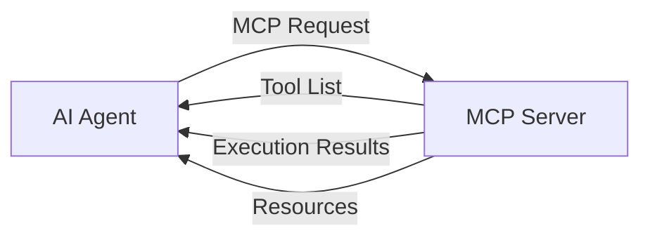
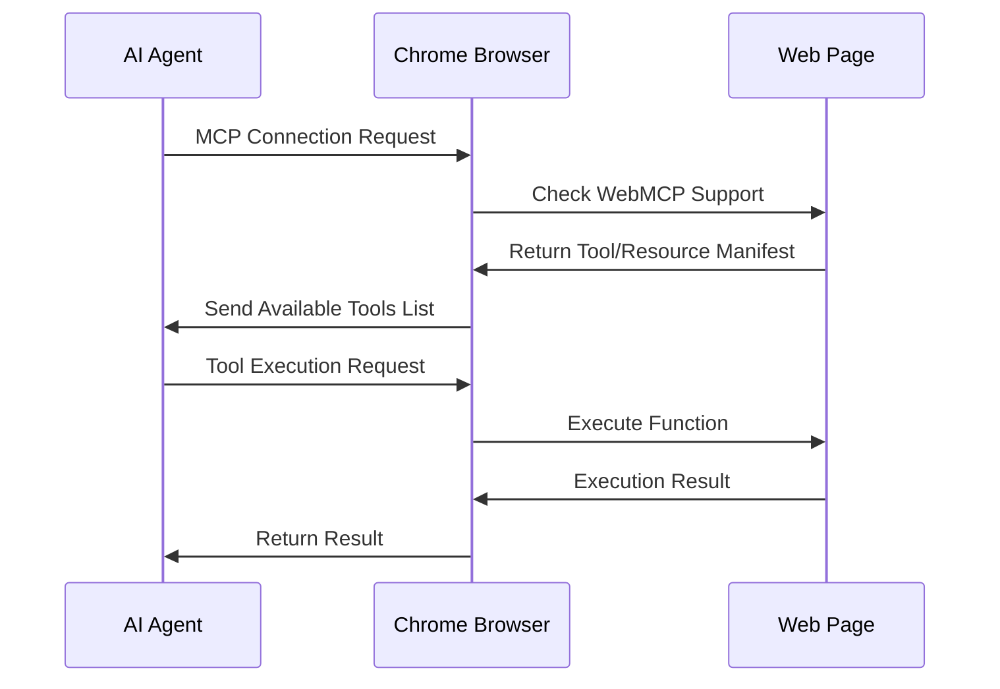
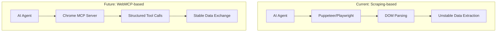

## Overview

Google Chrome 146 introduces <strong>WebMCP</strong> — a groundbreaking feature that turns the browser itself into an MCP (Model Context Protocol) server, allowing AI agents to use the browser directly as a tool server.

Previously, AI agents needed separate automation tools like Puppeteer or Playwright to interact with web pages. WebMCP fundamentally changes this paradigm. The browser becomes an <strong>MCP server</strong>, directly providing structured tools and data to AI agents.

## What is MCP (Model Context Protocol)?

MCP is an open protocol proposed by Anthropic that standardizes communication between AI models and external tools and data sources.



The core components of MCP include:

- <strong>Tools</strong>: Functions that AI can invoke (search, form input, page manipulation, etc.)
- <strong>Resources</strong>: Structured data that AI can read
- <strong>Prompts</strong>: Pre-defined prompt templates

## How WebMCP Works

WebMCP enables web pages to expose their functionality as an MCP server. Web developers can declaratively define tools and data that AI agents can use.

### Architecture



### Key Changes

| Aspect | Traditional Approach | WebMCP |
|--------|---------------------|--------|
| Browser Control | Puppeteer/Playwright | Native MCP |
| Page Understanding | DOM Parsing/Scraping | Structured Resources |
| Interaction | CSS Selector-based | Declarative Tool Calls |
| Auth/Permissions | Manual Setup | Browser Built-in |
| Stability | Breaks on UI Changes | API-level Stability |

## Implementing WebMCP for Web Developers

Web developers can implement WebMCP on their sites to expose functionality that AI agents can leverage.

### Example: E-commerce Site

```javascript
// WebMCP tool definition example
navigator.mcp.registerTool({
  name: "search_products",
  description: "Search for products",
  inputSchema: {
    type: "object",
    properties: {
      query: { type: "string", description: "Search keyword" },
      category: { type: "string", description: "Category filter" },
      maxPrice: { type: "number", description: "Maximum price" }
    },
    required: ["query"]
  },
  handler: async (params) => {
    const results = await searchAPI(params);
    return { products: results };
  }
});

// Resource registration
navigator.mcp.registerResource({
  uri: "cart://current",
  name: "Current Cart",
  description: "Current user's cart contents",
  handler: async () => {
    return { items: await getCartItems() };
  }
});
```

### Example: SaaS Dashboard

```javascript
// Provide dashboard data to AI agents
navigator.mcp.registerTool({
  name: "generate_report",
  description: "Generate an analytics report for a specified period",
  inputSchema: {
    type: "object",
    properties: {
      startDate: { type: "string", format: "date" },
      endDate: { type: "string", format: "date" },
      metrics: {
        type: "array",
        items: { type: "string" }
      }
    }
  },
  handler: async (params) => {
    return await dashboardAPI.generateReport(params);
  }
});
```

## Impact on the AI Agent Ecosystem

WebMCP fundamentally transforms how AI agents interact with the web.



### 1. The End of Scraping

Websites provide structured interfaces directly, eliminating the need for fragile DOM scraping. Even when site UIs change, MCP interfaces remain stable.

### 2. Simplified Agent Development

AI agent developers no longer need to write custom scraping logic for each site. They can communicate with all WebMCP-enabled sites through standardized MCP protocols.

### 3. Security and Permission Management

With the browser acting as an intermediary layer, AI agent access can be safely controlled with user consent. Existing browser security models (CORS, CSP, etc.) apply seamlessly.

### 4. New Business Models

Providing <strong>MCP endpoints</strong> for AI agents could become as strategically important as SEO for web services. A new discipline of "AI Engine Optimization (AEO)" is likely to emerge.

## Cross-Browser Support and Standardization Outlook

While WebMCP launches first in Chrome 146, it's expected to spread to other browsers through web standardization.

- <strong>Firefox</strong>: Potential adoption aligned with Mozilla's AI strategy
- <strong>Safari</strong>: Notable from Apple Intelligence integration perspective
- <strong>Edge</strong>: Natural integration with Copilot expected

Since MCP is already designed as an open protocol, achieving cross-browser compatibility should be relatively straightforward.

## What Developers Should Prepare

### Short-term (3-6 months)

1. Learn the MCP protocol specification
2. Identify AI agent use cases for your services
3. Experiment with WebMCP in Chrome 146 beta

### Mid-term (6-12 months)

1. Design and implement WebMCP interfaces
2. Test AI agent compatibility
3. Establish security and permission models

### Long-term (1+ years)

1. Develop AEO (AI Engine Optimization) strategies
2. Deploy agent-specific analytics and monitoring
3. Address multi-agent scenarios

## Conclusion

WebMCP represents the next evolutionary step for the web. Web pages transform from mere human-facing UIs into <strong>structured services that AI agents can leverage</strong>.

The introduction of WebMCP in Chrome 146 is just the beginning. A future where every web service provides both "UI for humans" and "MCP interfaces for AI" simultaneously is approaching rapidly.

For web developers, this isn't just a new feature — it's a <strong>turning point that redefines the very purpose of the web</strong>.

## References

- [MCP Official Site](https://modelcontextprotocol.io/)
- [Chrome 146 Release Notes](https://developer.chrome.com/blog)
- [@firt's WebMCP Introduction Tweet](https://x.com/firt/status/2020903127428313461)
- [Anthropic MCP Announcement](https://www.anthropic.com/news/model-context-protocol)
