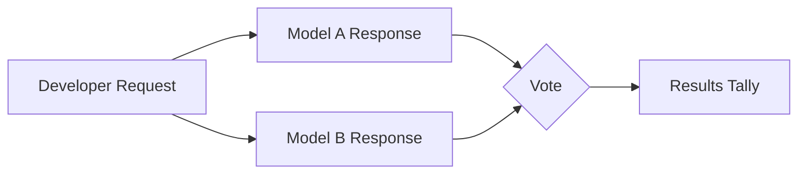
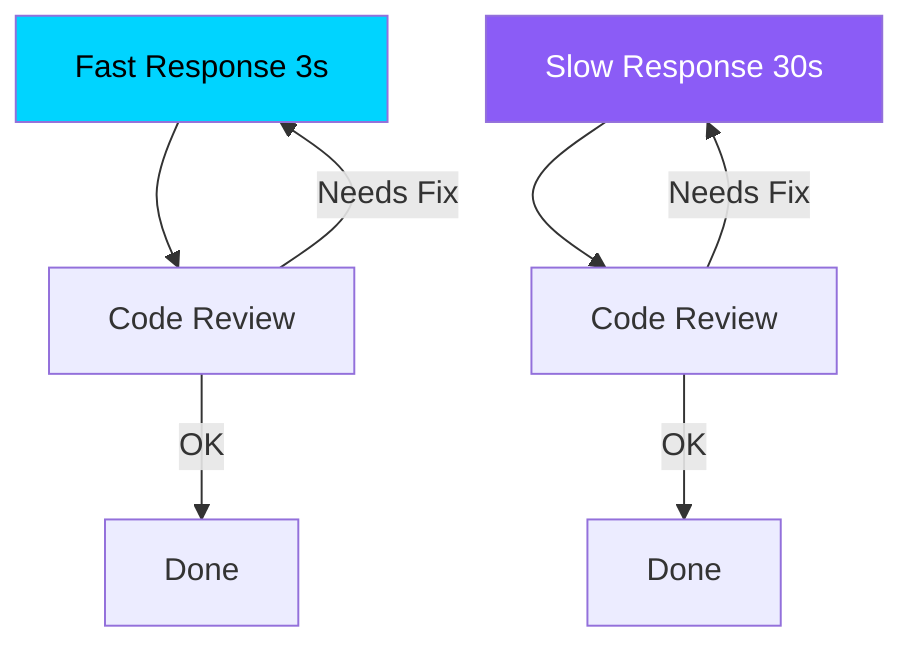

## Overview

Windsurf's <strong>Arena Mode</strong>, introduced in their AI coding assistant, has produced fascinating voting results. In this large-scale experiment with over 40,000 votes, developers <strong>overwhelmingly prioritized speed over accuracy</strong>.

This finding carries significant implications for the AI coding tool market. Developers prefer a workflow of generating code quickly and iterating fast, rather than waiting for perfectly accurate code.

## What Is Arena Mode?

Windsurf's Arena Mode is a <strong>blind test</strong> format that shows responses from two AI models side by side, letting developers vote for the better response.

This approach is similar to Chatbot Arena (LMSYS) but differentiates itself by focusing on <strong>actual coding tasks</strong>. Developers compare two models on practical work like code completion, refactoring, and debugging.

## Key Finding: Speed Beats Accuracy

The core insight from over 40,000 votes is clear:

- <strong>Models providing faster responses consistently received higher preference</strong>
- Minor accuracy differences were ignored in the face of speed advantages
- This tendency was especially pronounced in <strong>repetitive code writing and editing tasks</strong>

### Why Speed?

Considering developers' actual workflows, this result makes perfect sense:

1. <strong>Fast feedback loops</strong>: Receive code quickly, run it, and immediately request fixes if needed
2. <strong>Context preservation</strong>: Slow responses break the developer's flow of thought
3. <strong>Iterability</strong>: Even if the first response isn't perfect, 2-3 quick iterations reach the desired result
4. <strong>Good enough over perfect</strong>: Getting 80% accurate code fast is more efficient than waiting for 100% accurate code

A fast model can complete in 3s × 3 iterations = 9s, while a slow model at 30s × 1 iteration is already at a disadvantage in absolute time.

## Implications for the AI Coding Tool Market

### 1. Shift in Model Selection Strategy

This result directly impacts how AI coding tool providers choose their models. Rather than the most accurate cutting-edge model, a <strong>model with the right balance of speed and accuracy</strong> may achieve higher user satisfaction.

### 2. The Importance of Streaming and Progressive Generation

Technologies that improve perceived speed become core competitive advantages:

- <strong>Token streaming</strong>: Show partial results before the full response completes
- <strong>Progressive generation</strong>: Generate the skeleton first, then fill in details incrementally
- <strong>Caching strategies</strong>: Reduce response time for similar requests

### 3. Redefining "Good Code"

For developers, "good AI code" means <strong>not perfect code, but a fast starting point they can work with</strong>. This shifts the very criteria for evaluating AI coding tools:

| Traditional Criteria | What Arena Mode Revealed |
|---|---|
| Code accuracy | Response speed |
| First-try success rate | Iteration efficiency |
| Benchmark scores | Perceived productivity |

## Comparison with Other Benchmarks

Existing benchmarks like SWE-bench and HumanEval evaluate models with an <strong>accuracy-first</strong> approach. The Arena Mode results suggest these benchmarks may be disconnected from actual developer preferences.

In real development environments:

- The #1 benchmark model isn't necessarily the most preferred
- <strong>Perceived speed</strong> impacts satisfaction more than actual accuracy
- Developers choose "fast and roughly correct" over "slow but precise"

## Conclusion

Windsurf Arena Mode's 40,000+ vote results send a clear message to the AI coding tool industry: <strong>what developers want is not perfection—it's speed.</strong>

This isn't simply about "faster is better." It reflects how modern software development has evolved into an <strong>iterative and incremental process</strong>. AI coding tools should position themselves not as providers of the perfect solution, but as enablers of fast feedback loops.

When evaluating AI coding tools, consider not just benchmark scores but also <strong>perceived speed in real-world tasks</strong>.

## References

- [Windsurf Arena Mode Voting Results (X/Twitter)](https://x.com/windsurf/status/2021693447099273530)
- [Windsurf Official Site](https://windsurf.com)
- [Chatbot Arena (LMSYS)](https://chat.lmsys.org/)
