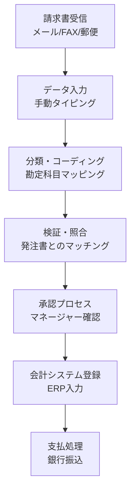
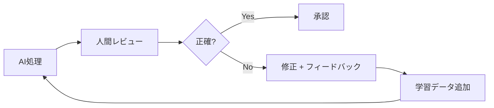
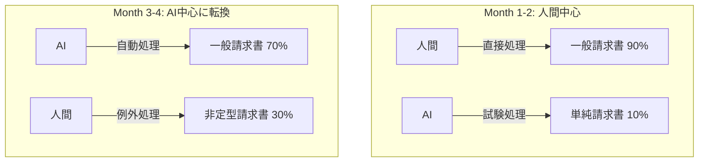
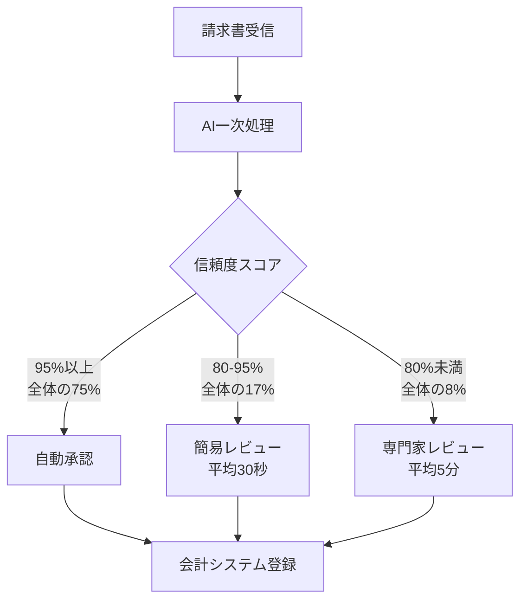

## 概要

「AIを導入すればコストが97%削減されます。」

このようなヘッドラインを見ると、ほとんどのエンジニアリングマネージャーはまず疑いから入ります。私もそうでした。しかし、実際の会計事務所で6ヶ月間AIエージェントを運用したデータを分析してみると、数字自体は嘘ではありませんでした。ただし、その数字に到達するまでの過程は、どのベンダーのデモでも見せてくれないものでした。

この記事では、中規模会計事務所（従業員約50名）が請求書処理業務にAIエージェントを導入した6ヶ月間の実データに基づき、コスト削減だけでなく、精度の変化、人間の役割の転換、そして導入プロセスで直面した現実的な問題を分析します。

## 導入前の状態 — 手作業による請求書処理のコスト構造

### 既存プロセス

会計事務所の請求書処理は、思っている以上に複雑です。単に数字を入力するだけではなく、以下のステップを経ます。



### 既存のコストデータ

| 項目 | 数値 |
|------|------|
| 月間処理請求書数 | 約3,000件 |
| 1件あたり平均処理時間 | 12分 |
| 1件あたり平均コスト | $7.00 |
| 月間総処理コスト | $21,000 |
| エラー率 | 約20%（再作業が必要） |
| 再作業コスト | 1件あたり追加$15 |

ここで注目すべきは<strong>エラー率20%</strong>です。これは業界平均とそれほど変わらない数値です。単純なタイピングミスから勘定科目の分類ミス、発注書マッチングの漏れまで、さまざまな種類のエラーが含まれています。

## 6ヶ月間の導入過程 — 月別データ分析

### Month 1：パイロット導入と最初の衝撃

AIエージェントを全請求書の10%にあたる約300件に試験適用しました。

| 指標 | 手動処理 | AI処理 | 差異 |
|------|----------|--------|------|
| 1件あたりコスト | $7.00 | $2.50 | -64% |
| 精度 | 80% | 72% | <strong>-8%</strong> |
| 処理時間 | 12分 | 3分 | -75% |

<strong>初月の精度はむしろ低下しました。</strong> これが多くのAI導入事例で隠されている部分です。AIモデルがその会計事務所固有の請求書フォーマット、取引先ごとのパターン、社内の勘定科目体系に適応できなかったためです。

### Month 2：学習データの精製とフィードバックループの構築



2ヶ月目には、人間レビュアーの修正データをAIモデルにフィードバックするループを構築しました。

| 指標 | Month 1 | Month 2 | 変化 |
|------|---------|---------|------|
| AI処理比率 | 10% | 25% | +15% |
| 1件あたりコスト | $2.50 | $1.80 | -28% |
| 精度 | 72% | 81% | <strong>+9%</strong> |
| 人間レビュー時間 | 8分/件 | 5分/件 | -37% |

### Month 3-4：転換点 — 人間とAIの役割再定義

3ヶ月目に重要な転換が起きました。AIの精度が<strong>人間単独処理の精度（80%）を超えたの</strong>です。

| 指標 | Month 3 | Month 4 |
|------|---------|---------|
| AI処理比率 | 50% | 70% |
| 1件あたりコスト | $0.90 | $0.55 |
| 精度 | 88% | 93% |
| 例外処理件数 | 450件 | 210件 |

この時点で人間の役割が根本的に変わりました。

<strong>Before</strong>：データ入力者 → すべての請求書を直接処理
<strong>After</strong>：例外処理の専門家 → AIが処理できない非定型ケースのみを担当



### Month 5-6：安定化と最終数値

| 指標 | Month 5 | Month 6 | 導入前比 |
|------|---------|---------|----------|
| AI処理比率 | 85% | 92% | — |
| 1件あたりコスト | $0.30 | <strong>$0.20</strong> | <strong>-97%</strong> |
| 精度 | 96% | <strong>98%</strong> | <strong>+18%p</strong> |
| 月間総コスト | $900 | $600 | -97% |
| 処理時間 | 45秒 | 30秒 | -96% |

## 数字の裏にある真実 — 隠れたコストと考慮事項

### 導入コスト分析

ヘッドラインの数字「1件あたり$7→$0.20」には含まれないコストがあります。

| 項目 | コスト |
|------|--------|
| AIプラットフォームライセンス（年間） | $24,000 |
| 初期統合開発（3ヶ月） | $45,000 |
| 学習データ精製の人件費 | $18,000 |
| 従業員再教育費用 | $8,000 |
| <strong>初期投資総額</strong> | <strong>$95,000</strong> |

### ROI計算

```
月間削減額：$21,000 - $600 - $2,000（ライセンス） = $18,400
初期投資回収期間：$95,000 / $18,400 ≈ 5.2ヶ月
年間純削減額：$18,400 × 12 - $95,000 = $125,800（初年度）
2年目以降の年間削減額：$18,400 × 12 = $220,800
```

<strong>5ヶ月で投資が回収</strong>されます。これは非常に魅力的な数値ですが、一つの前提があります。導入過程で既存従業員の離職なく役割転換が成功的に行われなければならないということです。

## 精度向上のメカニズム — なぜAIが人間より正確になったのか

### 人間のエラー vs AIのエラーの違い

人間とAIのエラーパターンは根本的に異なります。

| エラー種類 | 人間の頻度 | AIの頻度 |
|------------|------------|----------|
| 単純タイピングミス | 高い | ほぼなし |
| 勘定科目分類ミス | 中程度 | 低い（学習後） |
| 発注書マッチング漏れ | 高い | 非常に低い |
| 非定型フォーマット処理 | 低い | <strong>高い</strong> |
| 金額計算エラー | 中程度 | ほぼなし |
| 文脈判断ミス | 非常に低い | <strong>中程度</strong> |

AIは<strong>反復的でパターン化されたタスク</strong>では圧倒的に優れていますが、<strong>文脈理解が必要な非定型ケース</strong>ではまだ人間が必要です。

### 98%精度の構成

最終的な98%の精度は「AI単独」ではなく、<strong>AI＋人間のハイブリッドシステム</strong>の結果です。



## 人間の役割の変化 — 最も困難だった部分

### 従業員構成の変化

| 役割 | 導入前 | 導入後 | 変化 |
|------|--------|--------|------|
| データ入力担当 | 8名 | 0名 | -100% |
| 検証・照合担当 | 4名 | 2名 | -50% |
| AI運用・モニタリング | 0名 | 2名 | 新規 |
| 例外処理専門家 | 0名 | 3名 | 新規 |
| クライアントコンサルティング | 3名 | 8名 | +167% |

総人数は15名から15名で変化はありませんでした。しかし、<strong>役割構成が完全に変わりました</strong>。単純入力業務を行っていた従業員が、クライアントと直接コミュニケーションを取り、付加価値の高いコンサルティング業務に転換したのです。

### 転換過程での抵抗と解決

正直に言えば、この過程は順調ではありませんでした。

1. <strong>第1段階 — 否定（Month 1）</strong>：「AIが私たちの仕事を奪おうとしている」という認識が蔓延していました。
2. <strong>第2段階 — 実験（Month 2-3）</strong>：AIのエラーを人間が修正する過程で、従業員がAIの限界を理解し始めました。
3. <strong>第3段階 — 協力（Month 4-5）</strong>：AIが単純業務を処理してくれることで、より意味のある業務に集中できることを実感しました。
4. <strong>第4段階 — 主導（Month 6）</strong>：従業員が自らAI改善のアイデアを提案し始めました。

## エンジニアリングマネージャーとしての教訓

### 1. 精度は最初に必ず低下する

どのAIシステムでも導入初期には既存システムより性能が低い可能性があります。これを<strong>「Jカーブ効果」</strong>と呼びます。経営陣にこのJカーブを事前に説明し、3ヶ月の学習期間についての合意を得ることが重要です。

### 2. フィードバックループが核心である

AIモデルの性能を上げるのはモデル自体ではなく、<strong>フィードバックループの品質</strong>です。人間レビュアーがAIのエラーを正確に分類しフィードバックする体制を構築することに最も多くの時間を投資すべきです。

### 3. 人の問題が技術の問題より難しい

技術的な実装は3ヶ月で十分でしたが、組織文化の転換は6ヶ月が経っても完全には終わりませんでした。エンジニアリングマネージャーとして最も重要な役割はコードを書くことではなく、チームメンバーの不安を解消し、新しい役割に対するビジョンを提示することでした。

### 4. 段階的導入が唯一の正解である

10% → 25% → 50% → 70% → 92%と段階的にAI処理比率を高めたことが成功の核心でした。一度に100%の切り替えを試みていたら、初期の精度低下によりプロジェクトが中断されていたでしょう。

## 他の業務領域への拡張可能性

請求書処理で成功を収めた後、他の会計業務にもAI導入を検討しています。

| 業務領域 | 自動化可能性 | 予想コスト削減 | 難易度 |
|----------|-------------|--------------|--------|
| 経費精算 | 高い | 85-90% | 低い |
| 給与処理 | 中程度 | 60-70% | 中程度 |
| 税務申告 | 低い〜中程度 | 30-40% | 高い |
| 監査準備 | 中程度 | 50-60% | 高い |
| 財務レポート | 中程度〜高い | 70-80% | 中程度 |

## 結論

会計事務所のAI転換は「魔法のボタン」ではありません。$7から$0.20へのコスト削減は実際に達成可能ですが、その過程には初期精度の低下、従業員の抵抗、フィードバックシステムの構築、役割の再定義という現実的な課題があります。

エンジニアリングマネージャーとして私が強調したいのは3つです。

1. <strong>Jカーブを覚悟せよ</strong>：最初の3ヶ月は投資期間である。
2. <strong>人に投資せよ</strong>：技術より組織変革マネジメントの方が重要である。
3. <strong>データで語れ</strong>：月次指標を透明に共有することが信頼の基盤である。

AI導入の「理想」と「現実」の間のギャップは確かに存在します。しかし、そのギャップを埋めるのはより良いAIモデルではなく、<strong>より良いプロセスとより良いチーム</strong>です。

## 参考資料

- [Gartner - AI in Finance and Accounting 2025](https://www.gartner.com/en/finance/topics/artificial-intelligence-in-finance)
- [McKinsey - The State of AI in 2025](https://www.mckinsey.com/capabilities/quantumblack/our-insights/the-state-of-ai)
- [ACCA - Digital Transformation in Accounting](https://www.accaglobal.com/gb/en/professional-insights/technology/digital-transformation.html)
- [IEEE - Intelligent Document Processing](https://ieeexplore.ieee.org/document/9782342)
