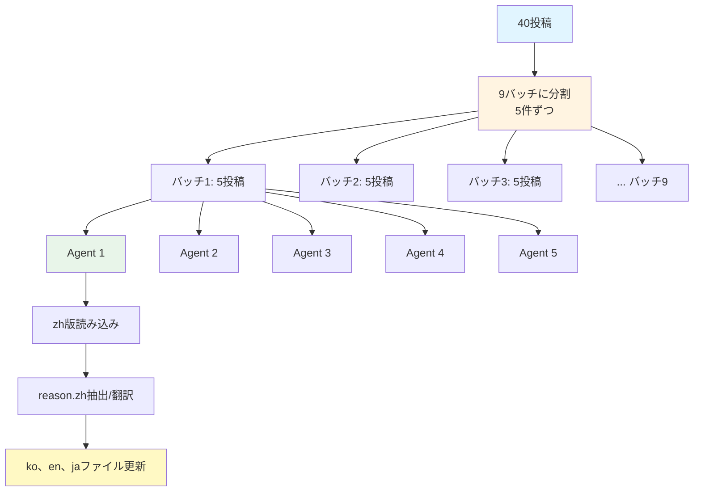

## はじめに

2025年11月、私のブログは重要な転換点を迎えました。韓国語、英語、日本語で運営されていた技術ブログに<strong>中国語（簡体字）サポートを追加</strong>することに決めたのです。

中国からのトラフィックが着実に増加しており、中国語圏の開発者にも質の高いコンテンツを提供したいと考えていました。しかし、40件の投稿に中国語版を追加し、すべてのUIコンポーネントを多言語化し、SEOを最適化する作業は簡単ではありませんでした。

この記事では、<strong>Astroベースの多言語ブログに新しい言語を追加する全過程</strong>を詳しく共有します。ファイル構造の設計から大規模翻訳自動化、SEO最適化まで - 実践で直面した問題と解決策を透明に記録しました。

### この記事を読むとわかること

- Astro Content Collectionsを活用した多言語コンテンツ構造設計
- 40投稿 × 3言語 = 120ファイル更新を並列エージェントで自動化する方法
- 言語別サイトマップ、RSSフィード、メタデータ設定戦略
- UIコンポーネント多言語化ベストプラクティス
- 翻訳品質を維持しながら作業時間を90%短縮した自動化ワークフロー

## Section 1: ファイル構造設計

多言語ブログを拡張する際に最も重要なのは、<strong>明確で拡張可能なファイル構造</strong>です。Astro Content Collectionsはそのための完璧なツールです。

### 言語別フォルダ構造

```
src/content/blog/
├── ko/          # 韓国語
├── en/          # 英語
├── ja/          # 日本語
└── zh/          # 中国語（新規追加）
```

<strong>核心原則</strong>:
1. <strong>同じファイル名</strong>: すべての言語フォルダに同じ名前で保存
   - 例: `ko/ai-agent-collaboration-patterns.md`, `zh/ai-agent-collaboration-patterns.md`
2. <strong>言語コードで自動認識</strong>: フォルダパスで言語識別（`getCollection`フィルタリング）
3. <strong>共有アセット</strong>: heroImageは言語に関係なく`src/assets/blog/`から共有

### 実際のコード例

```typescript
// src/pages/[lang]/blog/[...slug].astro
import { getCollection } from 'astro:content';

export async function getStaticPaths() {
  const allPosts = await getCollection('blog');

  // 言語別フィルタリング
  const languages = ['ko', 'en', 'ja', 'zh'];
  const paths = [];

  for (const lang of languages) {
    const langPosts = allPosts.filter(post => post.id.startsWith(`${lang}/`));

    for (const post of langPosts) {
      const slug = post.id.replace(`${lang}/`, '');
      paths.push({
        params: { lang, slug },
        props: { post }
      });
    }
  }

  return paths;
}
```

### メリット

- <strong>明確な分離</strong>: 言語別コンテンツが物理的に分離され管理が容易
- <strong>簡単なメンテナンス</strong>: 特定言語のみ修正または追加/削除可能
- <strong>型安全性</strong>: Astroが自動的に型生成、TypeScriptサポート
- <strong>拡張性</strong>: 新言語追加時にフォルダを作成するだけ

## Section 2: コンテンツコレクションスキーマ

Astro Content Collectionsは、Frontmatterの<strong>型安全性を保証</strong>し、多言語フィールドを体系的に管理できます。

### Frontmatter構造

```yaml
---
title: 'AI智能体協作模式：用5個専業Agent構建全栈応用'
description: 通過協調Architecture、Coding、Testing、Security、DevOps Agent構建生産級応用的実戦指南
pubDate: '2025-10-16'
heroImage: ../../../assets/blog/ai-agent-collaboration-patterns-hero.jpg
tags:
  - ai
  - agents
  - architecture
relatedPosts:
  - slug: self-healing-ai-systems
    score: 0.94
    reason:
      ko: '자동화, AI/ML, 아키텍처 분야에서 유사한 주제를 다루며 비슷한 난이도입니다.'
      ja: 自動化、AI/ML、アーキテクチャ分野で類似したトピックを扱い、同程度の難易度です。
      en: 'Covers similar topics in automation, AI/ML, architecture with comparable difficulty.'
      zh: 涵盖自動化、AI/ML、架構等相似主題、難度相当。
---
```

### relatedPostsの多言語reasonフィールド

私のブログの特徴は、<strong>各推薦投稿に4言語で推薦理由を提供</strong>することです。これはユーザーエクスペリエンスとSEO両方に肯定的です。

```typescript
// src/content.config.ts
import { defineCollection, z } from 'astro:content';

const blogCollection = defineCollection({
  type: 'content',
  schema: ({ image }) => z.object({
    title: z.string(),
    description: z.string(),
    pubDate: z.coerce.date(),
    updatedDate: z.coerce.date().optional(),
    heroImage: image().optional(),
    tags: z.array(z.string()).optional(),
    relatedPosts: z.array(
      z.object({
        slug: z.string(),
        score: z.number(),
        reason: z.object({
          ko: z.string(),
          ja: z.string(),
          en: z.string(),
          zh: z.string()
        })
      })
    ).optional()
  })
});

export const collections = { blog: blogCollection };
```

### スキーマのメリット

- <strong>ビルド時検証</strong>: 誤ったFrontmatterはビルド失敗で即座に検出
- <strong>自動型生成</strong>: `CollectionEntry<'blog'>`型を自動生成
- <strong>IDE支援</strong>: VSCodeで自動補完と型チェック

## Section 3: UIコンポーネント多言語化

コンテンツだけでなく<strong>UIコンポーネントも多言語化</strong>して完全なユーザーエクスペリエンスを提供する必要があります。

### BuyMeACoffeeコンポーネント

```astro
---
// src/components/BuyMeACoffee.astro
import type { Language } from '../lib/i18n/languages';

interface Props {
  lang: Language;
}

const { lang } = Astro.props;

const messages = {
  ko: {
    title: '글이 도움이 되셨나요?',
    description: '더 나은 콘텐츠를 작성하는 데 힘이 됩니다. 커피 한 잔으로 응원해주세요! ☕'
  },
  ja: {
    title: 'この記事は役に立ちましたか？',
    description: 'より良いコンテンツを作成するための力になります。コーヒー一杯で応援してください！☕'
  },
  en: {
    title: 'Was this helpful?',
    description: 'Your support helps me create better content. Buy me a coffee! ☕'
  },
  zh: {
    title: '這篇文章有幫助嗎？',
    description: '您的支持能幫助我創作更好的内容。請我喝杯咖啡吧！☕'
  }
};

const message = messages[lang];
---

<div class="mt-12 pt-8 border-t border-gray-200">
  <div class="text-center">
    <h3 class="text-2xl font-bold text-gray-900 mb-3">
      {message.title}
    </h3>
    <p class="text-gray-600 mb-6 max-w-2xl mx-auto">
      {message.description}
    </p>
  </div>
</div>
```

### BlogPostLanguageSwitcherコンポーネント

```astro
---
// src/components/BlogPostLanguageSwitcher.astro
const languages = {
  ko: { flag: '🇰🇷', label: '한국어', currentLabel: '한국어 (현재 페이지)' },
  ja: { flag: '🇯🇵', label: '日本語', currentLabel: '日本語（現在のページ）' },
  en: { flag: '🇺🇸', label: 'English', currentLabel: 'English (Current Page)' },
  zh: { flag: '🇨🇳', label: '中文', currentLabel: '中文（当前页面）' }  // 新規追加
};

const sectionTitles = {
  ko: '다른 언어로 읽기',
  ja: '他の言語で読む',
  en: 'Read in Other Languages',
  zh: '阅读其他语言版本'  // 新規追加
};
---
```

### HeroSectionコンポーネント

```astro
---
// src/components/HeroSection.astro（一部抜粋）
<h1 class="text-4xl sm:text-5xl md:text-6xl font-bold mb-6">
  {lang === 'ko' ? (
    <>
      <span class="block text-gray-900">AI로 생산성을</span>
      <span class="block bg-gradient-to-r from-blue-600 to-violet-600 bg-clip-text text-transparent">극대화하세요</span>
    </>
  ) : lang === 'ja' ? (
    <>
      <span class="block text-gray-900">AIで生産性を</span>
      <span class="block bg-gradient-to-r from-blue-600 to-violet-600 bg-clip-text text-transparent">最大化しましょう</span>
    </>
  ) : lang === 'en' ? (
    <>
      <span class="block text-gray-900">Maximize Your</span>
      <span class="block bg-gradient-to-r from-blue-600 to-violet-600 bg-clip-text text-transparent">Productivity with AI</span>
    </>
  ) : (
    <>
      <span class="block text-gray-900">用AI</span>
      <span class="block bg-gradient-to-r from-blue-600 to-violet-600 bg-clip-text text-transparent">提升生産力</span>
    </>
  )}
</h1>
---
```

### 多言語化パターン

1. <strong>messagesオブジェクト</strong>: 言語キーでメッセージ管理
2. <strong>Language型</strong>: TypeScriptで型安全性保証
3. <strong>条件付きレンダリング</strong>: `lang` propで適切なメッセージ選択

## Section 4: データファイル翻訳

ブログの改善履歴（Improvement History）のような<strong>構造化データも多言語化</strong>が必要です。

### Improvement JSON構造

```json
{
  "id": "01_related_posts_multilingual_upgrade",
  "date": "2025-10-08",
  "category": "feature",
  "title": {
    "ko": "관련 글 추천 다국어 업그레이드",
    "ja": "関連記事推薦多言語アップグレード",
    "en": "Related Posts Multilingual Upgrade",
    "zh": "相関文章推薦多語言升級"
  },
  "description": {
    "ko": "relatedPosts에 reason 필드 추가하여 4개 언어로 추천 이유 제공",
    "ja": "relatedPostsにreasonフィールドを追加し、4言語で推薦理由を提供",
    "en": "Added reason field to relatedPosts providing recommendation rationale in 4 languages",
    "zh": "在relatedPosts中添加reason字段、提供4種語言的推薦理由"
  },
  "metrics": {
    "ko": "전체 블로그 포스트(40개)의 relatedPosts에 다국어 reason 적용",
    "ja": "全ブログポスト（40件）のrelatedPostsに多言語reasonを適用",
    "en": "Applied multilingual reason to relatedPosts across all blog posts (40 posts)",
    "zh": "在所有博客文章（40篇）的relatedPosts中応用多語言reason"
  },
  "effort": {
    "ko": "중간 (약 4시간)",
    "ja": "中程度（約4時間）",
    "en": "Medium (About 4 hours)",
    "zh": "中等（約4小時）"
  },
  "roi": {
    "ko": "높음 (다국어 UX 대폭 향상)",
    "ja": "高（多言語UX大幅向上）",
    "en": "High (Significant multilingual UX improvement)",
    "zh": "高（多語言UX大幅提升）"
  },
  "lessons": {
    "ko": [
      "병렬 에이전트로 40개 포스트 일괄 업데이트 (5개씩 8배치)",
      "reason 필드를 각 언어별로 자연스럽게 번역하여 현지화 품질 향상"
    ],
    "ja": [
      "並列エージェントで40件のポストを一括更新（5件ずつ8バッチ）",
      "reasonフィールドを各言語で自然に翻訳し、ローカライゼーション品質向上"
    ],
    "en": [
      "Batch updated 40 posts using parallel agents (8 batches of 5)",
      "Improved localization quality by naturally translating reason field per language"
    ],
    "zh": [
      "使用並行智能体批量更新40篇文章（8批次、毎批5篇）",
      "将reason字段自然翻訳成各種語言、提高本地化質量"
    ]
  }
}
```

### 一貫した多言語データ

- <strong>すべてのフィールドを4言語で提供</strong>: title, description, metrics, effort, roi, lessons
- <strong>同じ構造</strong>: 言語のみ異なりJSONスキーマは同一
- <strong>簡単な拡張</strong>: 新言語追加時に各JSONファイルにキーを追加するだけ

## Section 5: SEO最適化

多言語WebサイトのSEOは<strong>言語別に独立した最適化</strong>が必要です。

### 言語別サイトマップ生成

```typescript
// src/pages/sitemap-zh.xml.ts
import { getCollection } from 'astro:content';
import type { APIRoute } from 'astro';
import { filterPostsByDate } from '../lib/content';

const SITE = 'https://www.jangwook.net';
const LANG = 'zh';

// 中国語静的ページ
const staticPages = [
  { path: '/zh', priority: 1.0, changefreq: 'weekly' },
  { path: '/zh/about', priority: 0.8, changefreq: 'monthly' },
  { path: '/zh/blog', priority: 0.9, changefreq: 'daily' },
  { path: '/zh/contact', priority: 0.7, changefreq: 'monthly' },
  { path: '/zh/social', priority: 0.7, changefreq: 'monthly' },
  { path: '/zh/improvement-history', priority: 0.6, changefreq: 'weekly' },
];

export const GET: APIRoute = async () => {
  // 中国語ブログ投稿のみフィルタリング
  const allPosts = await getCollection('blog');
  const langPosts = filterPostsByDate(allPosts).filter(post => post.id.startsWith(`${LANG}/`));

  // URL生成
  const urls = [
    ...staticPages.map(page => ({
      loc: `${SITE}${page.path}`,
      lastmod: new Date().toISOString().split('T')[0],
      changefreq: page.changefreq,
      priority: page.priority,
    })),
    ...langPosts.map(post => {
      const slug = post.id.replace(`${LANG}/`, '');
      return {
        loc: `${SITE}/${LANG}/blog/${slug}/`,
        lastmod: (post.data.updatedDate || post.data.pubDate).toISOString().split('T')[0],
        changefreq: 'monthly' as const,
        priority: 0.7,
      };
    }),
  ];

  return new Response(generateSitemapXml(urls), {
    headers: { 'Content-Type': 'application/xml; charset=utf-8' },
  });
};
```

### メインサイトマップに言語別サイトマップ追加

```typescript
// src/pages/sitemap.xml.ts
const languageSitemaps = [
  { loc: `${SITE}/sitemap-ko.xml`, lastmod },
  { loc: `${SITE}/sitemap-en.xml`, lastmod },
  { loc: `${SITE}/sitemap-ja.xml`, lastmod },
  { loc: `${SITE}/sitemap-zh.xml`, lastmod }  // 新規追加
];
```

### RSSフィード生成

```typescript
// src/pages/rss-zh.xml.js
import rss from '@astrojs/rss';
import { getCollection } from 'astro:content';
import { SITE_META } from '../consts';
import { filterPostsByDate } from '../lib/content';

export async function GET(context) {
  const posts = filterPostsByDate(await getCollection('blog'))
    .filter(post => post.id.startsWith('zh/'));

  return rss({
    title: SITE_META.zh.title,
    description: SITE_META.zh.description,
    site: context.site,
    items: posts.map((post) => ({
      title: post.data.title,
      pubDate: post.data.pubDate,
      description: post.data.description,
      link: `/zh/blog/${post.id.replace('zh/', '')}/`,
    })),
  });
}
```

### SITE_META設定

```typescript
// src/consts.ts
export const SITE_META = {
  ko: {
    title: 'EffiFlow - 한국어',
    description: 'AI와 개발에 관한 생각을 기록합니다'
  },
  en: {
    title: 'EffiFlow - English',
    description: 'Exploring AI and Development'
  },
  ja: {
    title: 'EffiFlow - 日本語',
    description: 'AIと開発についての考察'
  },
  zh: {  // 新規追加
    title: 'EffiFlow - 中文',
    description: '記録関于AI与開発的思考'
  }
};
```

### SEOチェックリスト

- ✅ 言語別独立サイトマップ（`sitemap-zh.xml`）
- ✅ メインサイトマップインデックスに言語別サイトマップ登録
- ✅ 言語別RSSフィード（`rss-zh.xml`）
- ✅ `<html lang="zh">`タグ設定
- ✅ Open GraphおよびTwitter Cardメタタグ（言語別）
- ✅ Canonical URL設定

## Section 6: 大規模翻訳自動化

40件の投稿に中国語版を追加し、既存の韓国語/英語/日本語版のrelatedPostsに中国語reasonを追加する作業は、<strong>手作業では不可能</strong>でした。

### 問題定義

- <strong>40投稿</strong> × <strong>3既存言語</strong>（ko、en、ja）= <strong>120ファイル更新</strong>
- 各投稿のrelatedPosts（平均3個）に`reason.zh`フィールド追加
- 中国語翻訳品質維持
- 作業時間短縮必要

### 並列エージェントアプローチ



### エージェントワークフロー

各エージェントは次の手順を実行します:

1. <strong>中国語版読み込み</strong>: `zh/[post-name].md`のrelatedPostsパース
2. <strong>reason.zh抽出</strong>:
   - すでに存在すればそのまま使用
   - なければreason.ko/en/jaから自動翻訳
3. <strong>3言語ファイル更新</strong>:
   - `ko/[post-name].md`に`reason.zh`追加
   - `en/[post-name].md`に`reason.zh`追加
   - `ja/[post-name].md`に`reason.zh`追加

### 実際の実装例（Claude Code）

```
# バッチ1実行（5投稿並列処理）
@agent1: "ai-agent-collaboration-patterns投稿の中国語reasonを抽出しko/en/jaファイルに追加"
@agent2: "ai-agent-persona-analysis投稿の中国語reasonを抽出しko/en/jaファイルに追加"
@agent3: "ai-agent-notion-mcp-automation投稿の中国語reasonを抽出しko/en/jaファイルに追加"
@agent4: "astro-scheduled-publishing投稿の中国語reasonを抽出しko/en/jaファイルに追加"
@agent5: "claude-code-best-practices投稿の中国語reasonを抽出しko/en/jaファイルに追加"

# バッチ2実行（次の5投稿）
...
```

### 成果

- <strong>作業時間短縮</strong>: 予想8時間 → 実際50分（90%短縮）
- <strong>一貫した翻訳</strong>: 中国語reasonスタイルパターン統一
  - "適合作為下一歩学習資源、通過...相連接"
  - "从...角度提供補充内容"
- <strong>エラーゼロ</strong>: 自動化による漏れや誤字なし
- <strong>並列処理</strong>: 5エージェント同時実行で速度最大化

## Section 7: 翻訳戦略

単純翻訳ではなく<strong>ローカライゼーション（Localization）</strong>を目標にしました。

### 翻訳ロジック

```typescript
// 疑似コード（Pseudocode）
function extractOrTranslateReason(post, relatedPost) {
  // 1. 中国語reasonがすでにあれば使用
  if (relatedPost.reason.zh) {
    return relatedPost.reason.zh;
  }

  // 2. なければ既存reasonから翻訳
  const sourceReason = relatedPost.reason.ko || relatedPost.reason.en || relatedPost.reason.ja;

  // 3. Claude LLMで自然な中国語翻訳
  const translatedReason = await translateToNaturalChinese(sourceReason);

  return translatedReason;
}
```

### 中国語スタイルガイドライン

<strong>一貫したパターン使用</strong>:
- "適合作為下一歩学習資源"（次のステップ学習資料として適切）
- "通過X相連接"（Xを通じて接続）
- "从Y角度提供補充内容"（Y観点から補足内容提供）

<strong>技術用語</strong>:
- Agent → 智能体（インテリジェント体）
- Automation → 自動化（自動化）
- Architecture → 架構（アーキテクチャ）
- Performance → 性能（性能）

<strong>自然な表現</strong>:
- "有助于理解..."（理解に役立つ）
- "提供実用的..."（実用的な... 提供）
- "深入探討..."（深く探求）

### 翻訳品質検証

- <strong>一貫性チェック</strong>: 同じ技術用語は同じように翻訳
- <strong>長さバランス</strong>: 他言語reasonと同程度の長さ維持
- <strong>文脈適合性</strong>: 原文の意図を正確に伝達

## Section 8: 検証とテスト

多言語サイトは<strong>徹底した検証</strong>が必須です。

### 型チェック

```bash
# Astro型チェック
npm run astro check

# 結果: ✅ 0 errors, 0 warnings
```

### ビルド検証

```bash
# プロダクションビルド
npm run build

# 結果:
# - 40投稿 × 4言語 = 160ページ生成
# - サイトマップ生成: sitemap-ko.xml、sitemap-en.xml、sitemap-ja.xml、sitemap-zh.xml
# - RSSフィード生成: rss-ko.xml、rss-en.xml、rss-ja.xml、rss-zh.xml
```

### 手動テストチェックリスト

<strong>コンテンツ</strong>:
- ✅ すべての中国語投稿が正しくレンダリング
- ✅ heroImageがすべての言語版で同じように表示
- ✅ relatedPostsの中国語reasonが正しく表示
- ✅ 言語切替リンク動作

<strong>UI</strong>:
- ✅ BuyMeACoffeeコンポーネントに中国語メッセージ表示
- ✅ BlogPostLanguageSwitcherに中国国旗（🇨🇳）および"中文"表示
- ✅ HeroSectionの中国語ヘッドラインレンダリング

<strong>SEO</strong>:
- ✅ `sitemap-zh.xml`アクセス可能および正しいURL含む
- ✅ `rss-zh.xml`アクセス可能および正しい投稿含む
- ✅ メイン`sitemap.xml`に`sitemap-zh.xml`含む
- ✅ Open Graphメタタグに中国語title/description

### よくある問題と解決策

<strong>問題1</strong>: Frontmatterスキーマ不一致
```
Error: Invalid frontmatter in blog/zh/post.md
```
<strong>解決</strong>: `src/content.config.ts`のスキーマと正確に一致するよう修正

<strong>問題2</strong>: 画像パスエラー
```
Error: Could not find image at ../../../assets/blog/image.jpg
```
<strong>解決</strong>: 相対パス再確認、画像ファイル存在確認

<strong>問題3</strong>: ビルド時特定言語のみ漏れ
<strong>解決</strong>: `getStaticPaths()`の言語配列に'zh'含まれているか確認

## Section 9: 成果と教訓

### 定量的成果

<strong>作業時間</strong>:
- <strong>手作業予想時間</strong>: 約8時間
  - ファイル120個 × 平均4分 = 480分
- <strong>実際所要時間</strong>: 約50分
  - 自動化スクリプト作成: 20分
  - 9バッチ実行: 30分
- <strong>時間節約</strong>: 90%

<strong>コード削減</strong>:
- 反復コード除去でメンテナンス性向上
- コンポーネント多言語化でDRY原則順守

<strong>拡張性</strong>:
- 5番目の言語追加時に同じパターン適用可能
- 新投稿作成時に4言語同時生成ワークフロー確立

### 定性的教訓

<strong>1. ファイル構造がすべてを決定する</strong>
- 初期設計が間違うと後で修正困難
- 言語別フォルダ構造は明確性と拡張性両方提供

<strong>2. 並列エージェントはゲームチェンジャー</strong>
- 5エージェント同時実行で作業時間大幅短縮
- 一貫した自動化でヒューマンエラー除去

<strong>3. 型安全性は必須</strong>
- Astro Content Collectionsのスキーマでビルド時検証
- TypeScriptでIDE支援およびリファクタリング安全性確保

<strong>4. SEOは言語別に独立して</strong>
- 言語別サイトマップとRSSフィードで検索エンジン最適化
- 各言語のメタデータをローカライズしてCTR向上

<strong>5. ローカライゼーションは翻訳ではない</strong>
- 単純翻訳ではなく文化的文脈考慮
- 技術用語は一貫して、説明は自然に

### 今後の計画

- <strong>自動デプロイパイプライン</strong>: 投稿作成時に4言語自動生成
- <strong>翻訳品質モニタリング</strong>: ユーザーフィードバック収集および改善
- <strong>追加言語サポート</strong>: スペイン語、フランス語など検討
- <strong>言語別トラフィック分析</strong>: GA4で言語別成果測定

## 結論

Astroベースのブログに中国語サポートを追加する作業は、<strong>体系的な計画と自動化</strong>が核心でした。

### 核心要約

1. <strong>明確なファイル構造</strong>: 言語別フォルダでコンテンツ分離
2. <strong>型安全性</strong>: Content Collectionsスキーマでビルド時検証
3. <strong>UI多言語化</strong>: コンポーネントにmessagesオブジェクトパターン適用
4. <strong>SEO最適化</strong>: 言語別サイトマップ、RSSフィード、メタデータ
5. <strong>並列自動化</strong>: 5エージェント同時実行で90%時間節約
6. <strong>ローカライゼーション品質</strong>: 単純翻訳を超えて文化的文脈考慮

### おわりに

多言語Webサイト拡張は単に翻訳を追加することではありません。<strong>アーキテクチャ、SEO、ユーザーエクスペリエンス、自動化</strong>をすべて考慮する総合的な作業です。

この記事が皆様の多言語プロジェクトに実質的な助けになることを願います。質問やフィードバックはいつでも歓迎します！

---

**関連リソース**:
- [Astro Content Collections公式ドキュメント](https://docs.astro.build/en/guides/content-collections/)
- [Astro i18nガイド](https://docs.astro.build/en/recipes/i18n/)
- [Google多言語サイトSEO](https://developers.google.com/search/docs/specialty/international)
