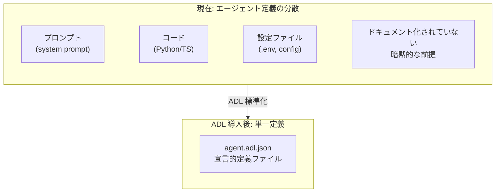
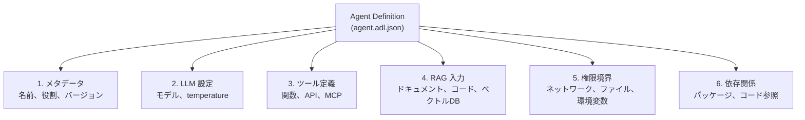
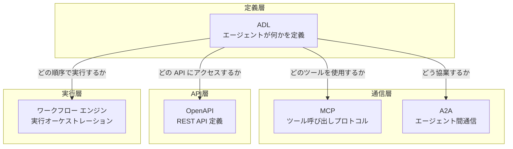
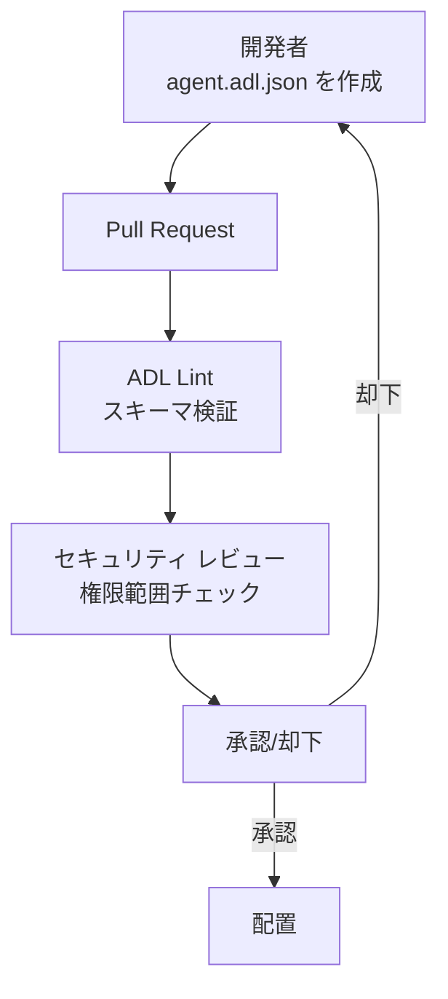
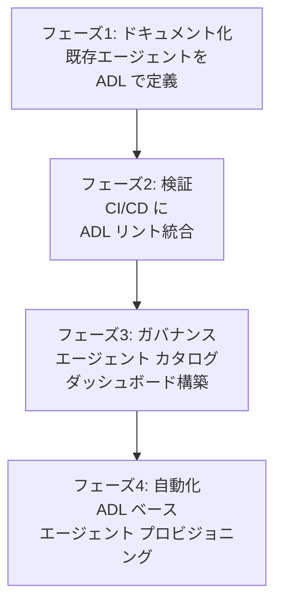

## 概要

2026年のAIエージェント エコシステムは爆発的に成長していますが、深刻な問題が一つあります。<strong>エージェントの定義がコード、プロンプト、設定ファイルに散在していて、「このエージェントは正確に何ができるのか」を把握するのが難しい</strong>ということです。

Next Mocaが Apache 2.0 ライセンスで公開した<strong>Agent Definition Language（ADL）</strong>は、この問題に正面から取り組みます。APIの世界でOpenAPI（Swagger）が「APIが何をするか」を宣言的に定義したように、ADLは「AIエージェントが何をするか」をベンダー中立的に定義する標準仕様です。

本記事ではADLの核構造、既存標準（MCP、OpenAPI、A2A）との関係、そしてEngineering ManagerとCTOが注目すべきガバナンス戦略を実務的な観点からまとめます。

## ADLが解決する問題

現在、ほとんどの組織でAIエージェントは次のような状態で管理されています：



具体的にADLが解決する問題をまとめると：

- <strong>可視性の欠落</strong>: エージェントがどのツールにアクセスし、どのデータを使用するかが一目で把握できない
- <strong>ガバナンスの空白</strong>: セキュリティチームがエージェントの権限範囲を事前審査できない
- <strong>再現性の不足</strong>: エージェント配置時に「どのバージョンがどの設定で配置されたか」を追跡できない
- <strong>チーム間のコミュニケーション断絶</strong>: 開発チーム、セキュリティチーム、コンプライアンスチームが同じ言葉でエージェントについて議論できない

## ADLの核構造

ADL仕様はJSON スキーマベースで、エージェントを6つのモジュールで宣言的に定義します：



### 1. エージェント メタデータ

```json
{
  "name": "code-review-agent",
  "displayName": "Code Review Assistant",
  "description": "PRに対する自動コードレビューを実行するエージェント",
  "role": "コード品質検査および改善提案",
  "version": "2.1.0",
  "owner": "platform-team@company.com",
  "created": "2026-01-15T09:00:00Z",
  "modified": "2026-02-28T14:30:00Z"
}
```

セマンティック バージョニングと所有者情報を通じて、<strong>「誰がこのエージェントを管理し、どのバージョンが運用中か」</strong>を即座に把握できます。

### 2. LLM 設定

```json
{
  "llm": {
    "provider": "anthropic",
    "model": "claude-opus-4-6",
    "parameters": {
      "temperature": 0.3,
      "maxTokens": 4096
    }
  }
}
```

LLM プロバイダーとモデルを明示的に宣言することで、モデル置換時に変更履歴を追跡し、性能低下を検出できます。

### 3. ツール定義

```json
{
  "tools": [
    {
      "name": "github_pr_review",
      "description": "GitHub PR の変更内容を取得し、レビューコメントを作成",
      "invocationType": "mcp",
      "category": "Code Review",
      "parameters": [
        {
          "name": "pr_url",
          "type": "string",
          "description": "レビュー対象の PR の URL",
          "required": true
        },
        {
          "name": "review_depth",
          "type": "string",
          "description": "レビュー深度（quick|standard|deep）",
          "required": false
        }
      ],
      "returnType": "ReviewResult"
    }
  ]
}
```

各ツールの呼び出し方法（Python関数、HTTP、MCPなど）とパラメータを明示することで、セキュリティチームがエージェントがアクセス可能な外部システムの全リストを事前にレビューできます。

### 4. 権限境界

```json
{
  "permissions": {
    "networkAccess": {
      "allowed": true,
      "domainWhitelist": [
        "api.github.com",
        "api.anthropic.com"
      ]
    },
    "fileAccess": {
      "readPaths": ["/workspace/src/**"],
      "writePaths": ["/workspace/reviews/**"]
    },
    "environmentVariables": {
      "exposed": ["GITHUB_TOKEN", "ANTHROPIC_API_KEY"]
    },
    "sandbox": {
      "enabled": true,
      "constraints": ["no-internet-except-whitelist"]
    }
  }
}
```

これがADLの最も強力な部分です。ネットワークアクセス、ファイルシステム、環境変数公開範囲を<strong>コードではなく宣言的仕様で定義</strong>することで、CI/CDパイプラインで自動検証が可能になります。

## ADLと既存標準の関係

ADLは既存標準を置き換えるのではなく、<strong>「定義レイヤー（Definition Layer）」</strong>として補完します：



| 標準 | 役割 | ADLとの関係 |
|------|------|-------------|
| <strong>OpenAPI</strong> | REST API定義 | ADLが参照するAPIツールの仕様 |
| <strong>MCP</strong> | ツール呼び出しプロトコル | ADLが「どのMCPサーバーを使用するか」を宣言 |
| <strong>A2A</strong> | エージェント間通信 | ADLが「どのエージェントと協業するか」を定義 |
| <strong>ワークフロー エンジン</strong> | 実行順序管理 | ADLは静的定義のみ、ランタイムは別途 |

核となる違いは<strong>ADLはランタイム プロトコルではなく静的仕様</strong>であるということです。エージェントの「設計図」を提供し、実際の実行はMCPやA2Aのようなランタイム プロトコルが担当します。

## EM/CTO 視点: ADL ベース ガバナンス戦略

### 1. CI/CD パイプラインへの ADL 検証統合



ADLのJSON スキーマを活用すれば、エージェント配置前に自動的に以下を検証できます：

- ネットワーク ホワイトリストがポリシーに適合しているか
- ファイルアクセス範囲が最小権限原則を遵守しているか
- LLMモデルが承認されたリストに含まれているか
- 必須メタデータ（所有者、バージョン）がすべて記載されているか

### 2. エージェント カタログの構築

組織内のすべてのエージェントのADL定義を中央リポジトリで管理すれば、<strong>エージェント カタログ</strong>を自動で構築できます：

```json
{
  "catalog": [
    {
      "name": "code-review-agent",
      "version": "2.1.0",
      "owner": "platform-team",
      "tools": ["github_pr_review", "jira_comment"],
      "llm": "claude-opus-4-6",
      "riskLevel": "medium"
    },
    {
      "name": "deployment-agent",
      "version": "1.0.3",
      "owner": "devops-team",
      "tools": ["kubectl_apply", "slack_notify"],
      "llm": "gpt-5.3-codex",
      "riskLevel": "high"
    }
  ]
}
```

これにより、CTOは「現在組織で運用中のエージェントはいくつで、それぞれどのシステムへのアクセス権を持っているか」をダッシュボードで確認できます。

### 3. 変更履歴とロールバック

ADL ファイルはGitでバージョン管理されるため：

- <strong>変更履歴</strong>: 「このエージェントの権限がいつ拡張されたか」をdiffで確認
- <strong>ロールバック</strong>: 問題発生時に以前のバージョンのADL定義で即座に復旧
- <strong>監査証跡</strong>: コンプライアンス要件への証拠資料確保

## 実践適用シナリオ: コード レビュー エージェント定義

実際の組織でADLを使用してコード レビュー エージェントを定義する完全な例です：

```json
{
  "name": "code-review-agent",
  "displayName": "コード レビュー エージェント",
  "description": "PRのコード品質、セキュリティ脆弱性、パフォーマンス問題を自動検出",
  "role": "senior-code-reviewer",
  "version": "2.1.0",
  "owner": "platform-team@company.com",
  "llm": {
    "provider": "anthropic",
    "model": "claude-opus-4-6",
    "parameters": {
      "temperature": 0.2,
      "maxTokens": 8192
    }
  },
  "tools": [
    {
      "name": "github_pr_diff",
      "invocationType": "mcp",
      "category": "Code Review",
      "parameters": [
        {"name": "pr_number", "type": "integer", "required": true}
      ]
    },
    {
      "name": "sonarqube_scan",
      "invocationType": "http",
      "category": "Code Quality",
      "parameters": [
        {"name": "project_key", "type": "string", "required": true}
      ]
    }
  ],
  "rag": [
    {
      "name": "coding-standards",
      "type": "documents",
      "location": "s3://company-docs/coding-standards/",
      "description": "社内コーディング標準ドキュメント"
    }
  ],
  "permissions": {
    "networkAccess": {
      "allowed": true,
      "domainWhitelist": [
        "api.github.com",
        "sonarqube.internal.company.com"
      ]
    },
    "fileAccess": {
      "readPaths": ["/workspace/**"],
      "writePaths": []
    },
    "sandbox": {"enabled": true}
  },
  "dependencies": {
    "packages": ["pygithub>=2.0", "requests>=2.31"]
  },
  "governance": {
    "created": "2026-01-15T09:00:00Z",
    "createdBy": "kim.jangwook@company.com",
    "modified": "2026-02-28T14:30:00Z",
    "modifiedBy": "kim.jangwook@company.com",
    "changeLog": "v2.1.0: SonarQube連携追加、セキュリティスキャン範囲拡張"
  }
}
```

## 導入ロードマップ

ADLはまだ初期段階（Early-Stage Standard）のため、段階的導入が現実的です：



- <strong>フェーズ1</strong>（1〜2週間）: 現在運用中のエージェントをADL形式でドキュメント化
- <strong>フェーズ2</strong>（2〜4週間）: JSON スキーマ検証をCIパイプラインに追加
- <strong>フェーズ3</strong>（1〜2ヶ月）: エージェント カタログと権限ダッシュボードを構築
- <strong>フェーズ4</strong>（3〜6ヶ月）: ADL定義からエージェント スキャフォルディングを自動生成

## 結論

ADLはAIエージェント開発に<strong>「コードから分離された宣言的定義」</strong>という重要なレイヤーを追加します。OpenAPIがREST API エコシステムを標準化したように、ADLはエージェント エコシステムの可視性、ガバナンス、再現性の問題を解決する可能性を秘めています。

特にEngineering ManagerとCTOにとっては：

- <strong>セキュリティ ガバナンス</strong>: エージェントの権限範囲をコード レビューのように事前審査可能
- <strong>組織の可視性</strong>: エージェント カタログで全社的なAI資産を把握
- <strong>変更管理</strong>: Git ベースのバージョン管理で監査証跡とロールバック対応

まだ初期段階ですが、Apache 2.0 ライセンスのオープンソース標準なので、今からこれに関心を持ち、試験的導入を検討するのに良いタイミングです。

## 参考資料

- [ADL GitHub Repository (Next Moca)](https://github.com/nextmoca/adl)
- [ADL公式ブログ — Next Moca](https://www.nextmoca.com/blogs/agent-definition-language-adl-the-open-source-standard-for-defining-ai-agents)
- [InfoQ — Next Moca Releases Agent Definition Language](https://www.infoq.com/news/2026/02/agent-definition-language/)
- [TechCrunch — Guide Labs Debuts Interpretable LLM](https://techcrunch.com/2026/02/23/guide-labs-debuts-a-new-kind-of-interpretable-llm/)
