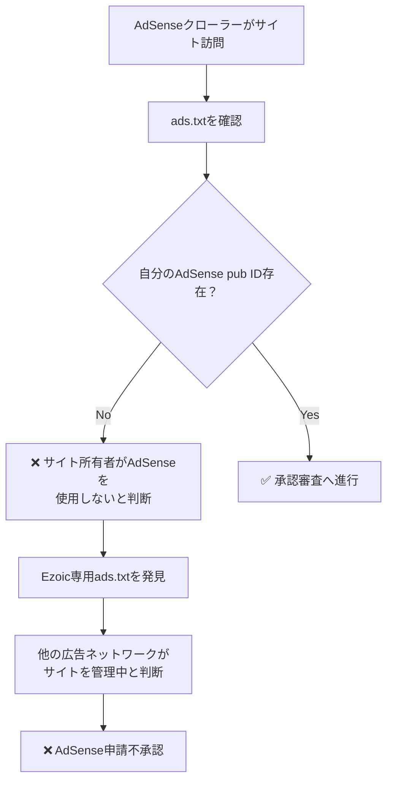
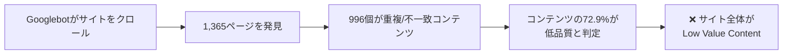
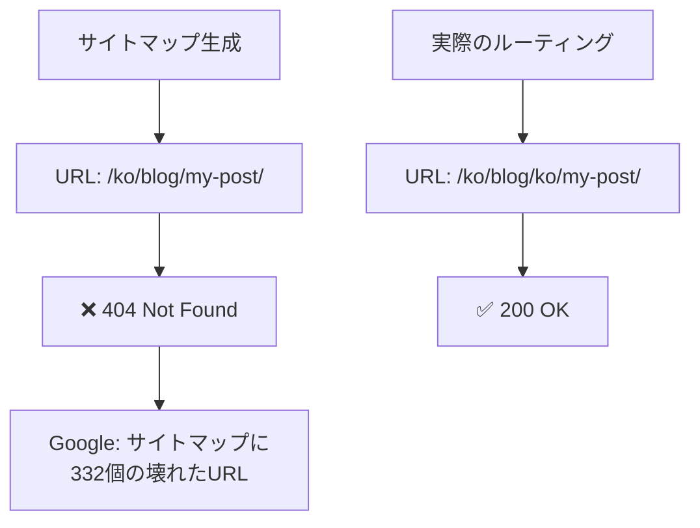
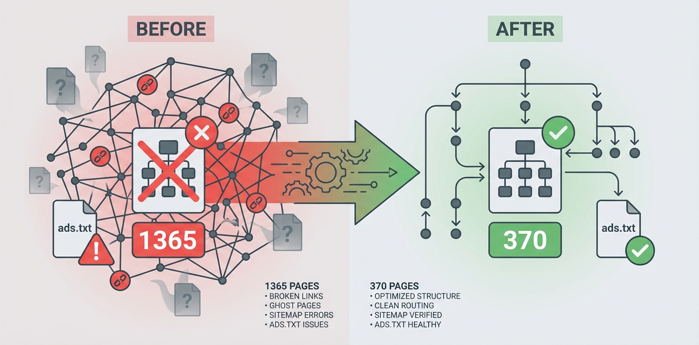
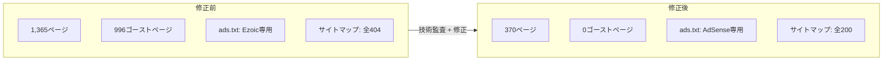

## 概要

Google AdSenseに何度申請しても<strong>「価値の低いコンテンツ（Low Value Content）」</strong>という理由で不承認になった経験はありませんか？私もそうでした。83記事を4言語（韓国語・英語・日本語・中国語）で運営し、316以上の技術記事を持つブログにもかかわらずです。

問題はコンテンツそのものではありませんでした。<strong>サイトの技術的欠陥がGoogleに「低品質サイト」と見せていたのです。</strong>この記事では、実際に発見して修正した8つの問題を共有します。同じ悩みを持つ開発者の方々の実践的なガイドになれば幸いです。

## 背景：なぜ不承認だったのか

このブログは[Astro](https://astro.build)フレームワークベースの多言語技術ブログです。

- <strong>コンテンツ</strong>：83記事 × 4言語 = 316以上の技術記事
- <strong>必須ページ</strong>：プライバシーポリシー、利用規約、お問い合わせページすべて完備
- <strong>技術スタック</strong>：Astro SSG、Cloudflare Pages、Content Collections

表面的にはAdSense承認条件を十分に満たしていました。しかし、申請するたびに返ってくる回答は常に同じでした：

> <strong>「価値の低いコンテンツ」</strong> — サイトに有用なコンテンツが十分にありません。

サイト全体を技術的に監査した結果、<strong>コンテンツ自体ではなく技術的欠陥</strong>の3つが根本原因であり、さらに5つの問題を追加発見しました。

## 重大な問題1：Ezoic ads.txt の競合（最も直接的な原因）

### 発見の経緯

ライブサイトの`ads.txt`を直接確認したところ、自分のAdSenseエントリがありませんでした。代わりに、Ezoic管理下の80以上の広告ネットワークエントリのみが存在していました。

```bash
# ライブサイトのads.txt確認
curl https://jangwook.net/ads.txt | head -5
# → Ezoic管理のエントリのみ80+個表示
# → 自分のAdSense pub IDは存在しない
```

### 原因分析

GitHub Actionsの`deploy.yml`にこのようなコードがありました：

```yaml
# deploy.yml（問題のコード）
- name: Build
  run: |
    # ... ビルドコマンド ...
    curl -L https://srv.adstxtmanager.com/19390/jangwook.net > public/ads.txt
```

ビルドのたびにEzoicの`adstxtmanager`から`ads.txt`をダウンロードして上書きしていました。ローカルの`public/ads.txt`には正しいGoogle AdSenseエントリがありましたが、<strong>デプロイ時に完全に置き換え</strong>られていたのです。

```
# ローカル public/ads.txt（正しい内容）
google.com, pub-7556938384772610, DIRECT, f08c47fec0942fa0

# ライブサイト ads.txt（デプロイ後 — Ezoicが上書き）
# → 80+個の広告ネットワークエントリ
# → pub-7556938384772610エントリは存在しない！
```

<strong>さらに</strong>、`BaseHead.astro`にEzoicのCMP（同意管理プラットフォーム）および広告スクリプト3つがすべてのページに読み込まれていました：

```astro
<!-- BaseHead.astro（問題のスクリプト） -->
<script src="https://the.gatekeeperconsent.com/cmp.min.js" data-cfasync="false"></script>
<script src="https://cdn.ezoic.net/ezoicplugin.js"></script>
<script src="https://www.ezojs.com/ezoic/sa.min.js"></script>
```

### Googleはこれをどう見るか

AdSenseクローラーの視点でこの状況を整理すると：



AdSenseはサイトの`ads.txt`に自身のpub IDがなければ、<strong>そのサイトがAdSenseを使用する意思がない、もしくは他のサービスがすでに管理中</strong>と判断します。

### 修正方法

1. `deploy.yml`からEzoic `ads.txt`ダウンロード行を削除
2. `BaseHead.astro`からEzoicスクリプト3つをすべて削除
3. `public/ads.txt`に正しいAdSenseエントリのみを維持

```yaml
# deploy.yml（修正後）
- name: Build
  run: |
    npm run build
    # curl行を完全削除 — ローカルのpublic/ads.txtをそのまま使用
```

```
# public/ads.txt（修正後）
google.com, pub-7556938384772610, DIRECT, f08c47fec0942fa0
```

## 重大な問題2：URLルーティング欠陥で996個のゴーストページ

### 発見の経緯

ビルドログを分析したところ、<strong>1,365ページ</strong>が生成されていました。83記事 × 4言語 = 332ページのはずが、静的ページ数が異常に多い状態でした。

### 原因分析

`[...slug].astro`の`getStaticPaths`関数に問題がありました：

```typescript
// [...slug].astro（問題のコード）
export async function getStaticPaths() {
  const posts = await getCollection("blog");
  const languages = ["ko", "en", "ja", "zh"];

  return languages.flatMap((lang) =>
    posts.map((post) => ({
      params: { slug: post.slug }, // post.slug = "ko/my-post-title"
      props: { post, lang },
    }))
  );
}
```

このコードの問題点は、<strong>すべての記事をすべての言語ルートにマッピング</strong>していることです。`post.slug`にはすでに言語プレフィックス（`ko/`、`en/`など）が含まれているのに、これを4言語それぞれのルートに入れることで<strong>クロス言語URL</strong>が大量に生成されました。

```
# 正常なURL（332個）
/ko/blog/ko/my-post/     ← 韓国語ルートに韓国語コンテンツ ✅
/en/blog/en/my-post/     ← 英語ルートに英語コンテンツ ✅

# ゴーストURL（996個）— コンテンツ言語不一致
/en/blog/ko/my-post/     ← 英語ルートに韓国語コンテンツ ❌
/ja/blog/ko/my-post/     ← 日本語ルートに韓国語コンテンツ ❌
/zh/blog/en/my-post/     ← 中国語ルートに英語コンテンツ ❌
# ... 996個のこのような組み合わせが生成
```

### Googleはこれをどう見るか



Googleはサイト全体のコンテンツ品質を評価します。全ページの<strong>約73%が言語不一致の重複コンテンツ</strong>であれば、サイト全体が「価値の低いコンテンツ」と判定されるのは当然です。

### 修正方法

各記事を該当する言語のルートにのみマッピングするよう修正しました：

```typescript
// [...slug].astro（修正後）
export async function getStaticPaths() {
  const posts = await getCollection("blog");

  return posts.map((post) => ({
    params: { slug: post.slug }, // "ko/my-post-title"を該当言語ルートにのみマッピング
    props: { post },
  }));
}
```

<strong>結果</strong>：ビルドページ数 <strong>1,365 → 370</strong>（995個のゴーストページを除去）

## 重大な問題3：サイトマップ全体404

### 発見の経緯

Google Search Consoleでサイトマップを送信しましたが、インデックスされたページが極めて少ない状態でした。サイトマップのURLを実際にブラウザで開いてみると<strong>すべて404</strong>でした。

### 原因分析

サイトマップ生成ロジックと実際のルーティング間でURL形式が不一致でした：

```
# サイトマップが生成するURL
https://jangwook.net/ko/blog/my-post-title/

# 実際のページURL（二重言語プレフィックス）
https://jangwook.net/ko/blog/ko/my-post-title/
```

サイトマップは`/{lang}/blog/{slug}/`形式でURLを生成していましたが、`slug`にはすでに`ko/`のような言語プレフィックスが含まれていたため、実際のURLは`/{lang}/blog/{lang}/{slug}/`でした。<strong>サイトマップのブログURL 332個すべてが404</strong>を返していました。



### 修正方法

サイトマップ生成ロジックでスラッグの言語プレフィックスを考慮するよう修正しました：

```typescript
// サイトマップ設定（修正後）
// slugはすでに"ko/my-post"形式なのでそのまま使用
const url = `/${lang}/blog/${post.slug}/`;
// → /ko/blog/ko/my-post/（実際のパスと一致）
```

## 付随する問題4：機械翻訳の構造同一性

### 問題

83記事の<strong>39%</strong>（約32記事）が4言語版でH2、H3見出し数とコードブロック数が完全に一致していました。これはGoogleに<strong>機械翻訳で自動生成されたコンテンツ</strong>と認識される可能性があります。

### 修正方法

すべてのコンテンツを書き直すよりも、Googleに<strong>「これは同じコンテンツの公式翻訳版」</strong>と明示的に知らせることが効果的です。

```html
<!-- hreflangを正しく設定 -->
<link rel="alternate" hreflang="ko" href="https://jangwook.net/ko/blog/ko/my-post/" />
<link rel="alternate" hreflang="en" href="https://jangwook.net/en/blog/en/my-post/" />
<link rel="alternate" hreflang="ja" href="https://jangwook.net/ja/blog/ja/my-post/" />
<link rel="alternate" hreflang="zh" href="https://jangwook.net/zh/blog/zh/my-post/" />
<link rel="alternate" hreflang="x-default" href="https://jangwook.net/en/blog/en/my-post/" />
```

hreflangを正しく設定すれば、Googleが各言語ページを<strong>独立した翻訳版として認識</strong>し、重複コンテンツペナルティを回避できます。

## 付随する問題5：お問い合わせページがクローラーに見えない

### 問題

お問い合わせページがGoogle Formの`<iframe>`のみで構成されていました。クローラーはiframe内部を読めないため、このページは<strong>事実上空のページ</strong>でした。

```html
<!-- 元のお問い合わせページ（クローラーには空ページ） -->
<iframe
  src="https://docs.google.com/forms/d/e/..."
  width="100%"
  height="800"
></iframe>
```

### 修正方法

クローラーが読める構造化されたコンテンツを追加しました：

```html
<!-- 修正後のお問い合わせページ -->
<section>
  <h1>お問い合わせ</h1>
  <p>技術ブログ運営者のキム・ジャンウクです。以下の方法でご連絡ください。</p>

  <h2>メール</h2>
  <a href="mailto:contact@jangwook.net">contact@jangwook.net</a>

  <h2>ソーシャル</h2>
  <ul>
    <li><a href="https://github.com/...">GitHub</a></li>
    <li><a href="https://twitter.com/...">Twitter</a></li>
  </ul>

  <h2>ブログについて</h2>
  <p>AI自動化、Web開発、DevOpsに関する技術コンテンツを共有しています。</p>
</section>

<!-- Google Formは下部に維持 -->
<iframe src="https://docs.google.com/forms/d/e/..." width="100%" height="800"></iframe>
```

## 付随する問題6：hreflang x-defaultエラー

### 問題

ブログ記事の`x-default`が誤ったURLを指していました。英語をデフォルト言語に設定していましたが、URL変換時にブログパス内の言語コードを変換しなかったため、<strong>英語URLが韓国語コンテンツ</strong>にリンクされていました。

```html
<!-- 誤ったx-default -->
<link rel="alternate" hreflang="x-default"
  href="https://jangwook.net/en/blog/ko/my-post/" />
<!-- → 英語ルートだが韓国語コンテンツを指す ❌ -->
```

### 修正方法

hreflang生成ロジックでブログパス内の言語コードも変換するよう修正しました：

```typescript
// hreflang URL生成（修正後）
function getAlternateUrl(currentUrl: string, targetLang: string): string {
  // URLパスの言語プレフィックスを変換
  let url = currentUrl.replace(/^\/(ko|en|ja|zh)\//, `/${targetLang}/`);
  // ブログスラッグ内の言語プレフィックスも変換
  url = url.replace(/\/blog\/(ko|en|ja|zh)\//, `/blog/${targetLang}/`);
  return url;
}
```

## 付随する問題7：自己参照的メタ分析記事

### 問題

ブログ自体の運営レポート6件（週次分析、月次分析、AdSense不承認分析など）が存在していました。これらの記事は<strong>ブログ自身に関する分析</strong>であり、外部訪問者にとっては価値のない「自己参照的低価値コンテンツ」に分類される可能性があります。

### 修正方法

これらの記事に`noindex`メタタグを適用し、検索エンジンのインデックスから除外しました：

```html
<!-- メタ分析記事にnoindexを適用 -->
<meta name="robots" content="noindex, follow" />
```

これによりGoogleがこれらのページをインデックスしなくなり、サイト全体のコンテンツ品質評価から除外されます。内部リンクの`follow`は維持してクロール自体は許可します。

## 付随する問題8：その他の技術的修正

残りの発見した問題と修正方法をまとめます。

### 8-1. カスタム404ページの不在

デフォルトの404ページがなく、ユーザーが無効なURLにアクセスした際に空のページやサーバーデフォルトエラーが表示されていました。

```astro
---
// src/pages/404.astro — 多言語404ページ生成
const lang = Astro.currentLocale || "en";
const messages = {
  ko: { title: "페이지를 찾을 수 없습니다", back: "홈으로 돌아가기" },
  en: { title: "Page Not Found", back: "Go back home" },
  ja: { title: "ページが見つかりません", back: "ホームに戻る" },
  zh: { title: "页面未找到", back: "返回首页" },
};
---
<h1>{messages[lang].title}</h1>
<a href={`/${lang}/`}>{messages[lang].back}</a>
```

### 8-2. og:typeの未分岐

すべてのページで`og:type`が`"website"`に設定されていました。ブログ記事は`"article"`であるべきです。

```astro
<!-- 修正後 -->
<meta property="og:type" content={isPost ? "article" : "website"} />
```

### 8-3. サイトマップリンクの不一致

`robots.txt`で参照しているサイトマップのファイル名が実際のファイル名と異なっていました。

```
# robots.txt（修正前）
Sitemap: https://jangwook.net/sitemap-index.xml

# 実際のファイル：/sitemap.xml

# robots.txt（修正後）
Sitemap: https://jangwook.net/sitemap.xml
```

### 8-4. 中国語RSS hreflangの欠落

韓国語、英語、日本語のRSSフィードにはhreflangが正しく設定されていましたが、中国語（zh）のみ欠落していました。

### 8-5. robots.txtにクロス言語URLブロック規則を追加

ゴーストページが修正される前にすでにインデックスされたクロス言語URLがある可能性があるため、`robots.txt`にブロック規則を追加しました：

```
# robots.txtに追加
Disallow: /en/blog/ko/
Disallow: /en/blog/ja/
Disallow: /en/blog/zh/
Disallow: /ko/blog/en/
Disallow: /ko/blog/ja/
Disallow: /ko/blog/zh/
Disallow: /ja/blog/ko/
Disallow: /ja/blog/en/
Disallow: /ja/blog/zh/
Disallow: /zh/blog/ko/
Disallow: /zh/blog/en/
Disallow: /zh/blog/ja/
```

## 修正前後の比較



すべての修正を適用した後の結果です：

| 項目 | 修正前 | 修正後 |
|------|--------|--------|
| ビルドページ数 | 1,365個 | 370個 |
| ゴーストページ | 996個 | 0個 |
| ads.txt状態 | Ezoic 80+エントリ | AdSense 1エントリ |
| サイトマップ404 URL | 332個 | 0個 |
| hreflang x-defaultエラー | 全記事 | 0個 |
| 自己参照記事のインデックス | 6個 | noindex適用 |
| 低品質コンテンツ比率 | 約73% | 約0% |



## 多言語ブログ運営者のためのチェックリスト

この経験をもとに、AdSense申請前に確認すべき技術的チェックリストをまとめました：

### ads.txt関連
- [ ] ライブサイトの`ads.txt`を直接確認したか？
- [ ] CI/CDパイプラインで`ads.txt`を上書きするスクリプトがないか？
- [ ] 以前使用した広告サービスのスクリプトが残っていないか？

### URL・ルーティング関連
- [ ] ビルドされたページ数が予想と一致するか？
- [ ] クロス言語URL（例：`/en/blog/ko/...`）が生成されていないか？
- [ ] サイトマップのすべてのURLが200 OKを返すか？

### hreflang関連
- [ ] すべてのページに正しいhreflangが設定されているか？
- [ ] `x-default`が正しい言語ページを指しているか？
- [ ] ブログパス内の言語コードも正しく変換されているか？

### コンテンツ品質関連
- [ ] 自己参照的コンテンツ（運営レポート等）にnoindexが適用されているか？
- [ ] `og:type`が記事では`"article"`に設定されているか？
- [ ] お問い合わせページにクローラーが読めるテキストコンテンツがあるか？
- [ ] カスタム404ページが存在するか？

## まとめ

AdSense「価値の低いコンテンツ」不承認は、<strong>コンテンツの問題ではなく技術的欠陥が原因である場合</strong>が多いです。特に多言語サイトでは、URLルーティング、サイトマップ、hreflang設定の複雑さから、こうした問題が発生しやすくなります。

重要な教訓をまとめると：

1. <strong>ads.txtは必ずライブサイトで直接確認しましょう。</strong> CI/CDパイプラインでの上書きが発生している可能性があります。
2. <strong>ビルドページ数を定期的にモニタリングしましょう。</strong> 予想より多い場合、ゴーストページが生成されている可能性があります。
3. <strong>サイトマップのURLに実際にアクセスしてみましょう。</strong> サイトマップとルーティング間の不一致はよくある問題です。
4. <strong>Googleの視点でサイトを見ましょう。</strong> 開発者にとって当然のことも、クローラーには異なって見えることがあります。

この記事が同じ問題で悩んでいる開発者の方々のお役に立てれば幸いです。

## 参考資料

- [Google AdSenseプログラムポリシー](https://support.google.com/adsense/answer/48182)
- [ads.txt公式仕様](https://iabtechlab.com/ads-txt/)
- [Google多言語サイト管理ガイド](https://developers.google.com/search/docs/specialty/international)
- [hreflang実装ガイド](https://developers.google.com/search/docs/specialty/international/localized-versions)
- [Astro国際化（i18n）ドキュメント](https://docs.astro.build/en/guides/internationalization/)
