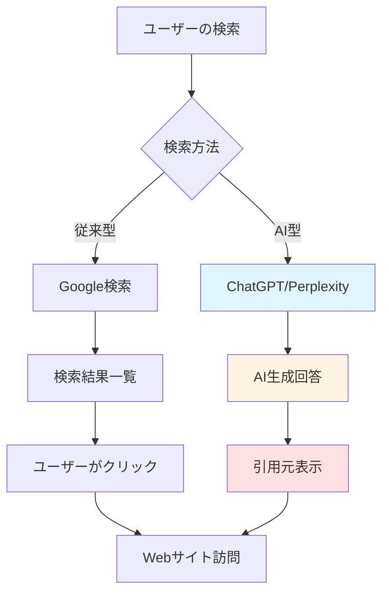
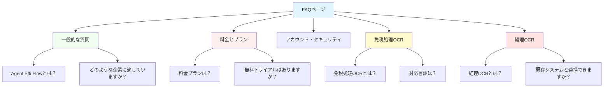
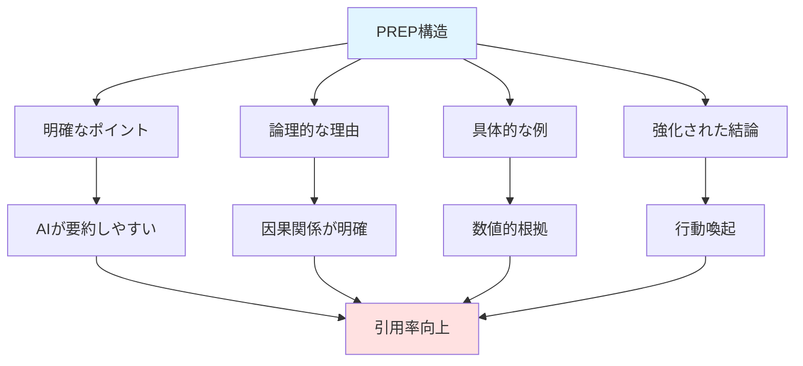
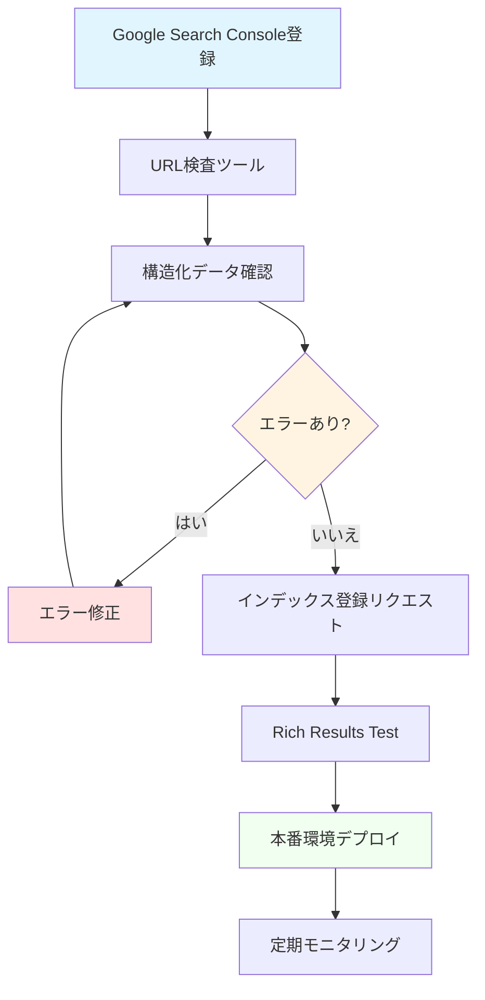
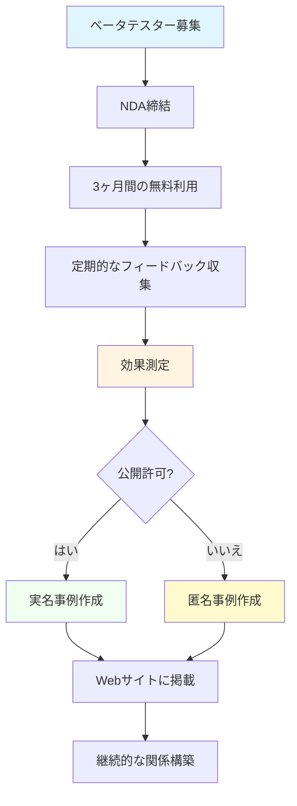
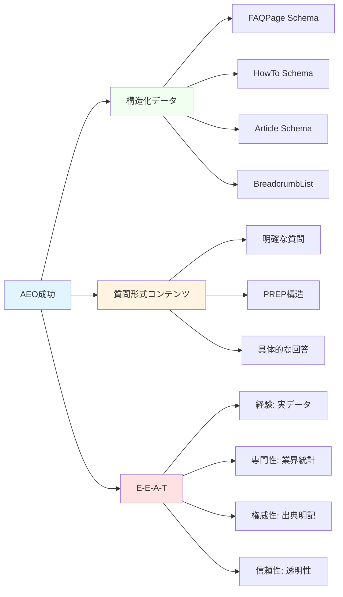

## 概要

### AEO（Answer Engine Optimization）とは？

AEO（Answer Engine Optimization）は、AI検索エンジンやAnswer Engineに最適化されたコンテンツ戦略です。従来のSEOがGoogleなどの検索エンジンでの<strong>ランキング向上</strong>を目指すのに対し、AEOは<strong>AIによる回答生成時の引用元</strong>として選ばれることを目標とします。

**SEOとAEOの主な違い：**

| 項目         | SEO                              | AEO                                       |
| ------------ | -------------------------------- | ----------------------------------------- |
| 最適化対象   | 検索エンジン（Google、Bing等）   | AI検索エンジン（ChatGPT、Perplexity等）   |
| 目標         | 検索結果上位表示                 | AI回答の引用元として選ばれる              |
| 重視する要素 | キーワード、被リンク、ページ速度 | 構造化データ、質問形式コンテンツ、E-E-A-T |
| ユーザー体験 | クリックして詳細確認             | AIが回答を直接提供（ゼロクリック）        |

### AI検索エンジンの台頭

2024年現在、検索環境は急速に変化しています：

- **ChatGPT**：月間アクティブユーザー1.8億人（2024年11月時点）
- **Perplexity AI**：月間クエリ数3億件超（2024年9月時点）
- **Google AI Overview**：検索結果の約30%でAI要約表示（2024年データ）
- **ゼロクリック検索**：Google検索の約60%がクリックなしで終了（2024年SparkToro調査）



### なぜ今AEOが重要なのか

AI検索エンジンの普及により、<strong>引用されないコンテンツは存在しないも同然</strong>になりつつあります。特にB2B SaaSサービスにとって、AIによる回答生成時の引用元として選ばれることは、以下の理由で極めて重要です：

1. **信頼性の向上**：AIが引用することで、第三者の推薦効果
2. **トラフィック獲得**：AI回答からのクリックは、従来検索より意図が明確
3. **ブランド認知**：複数のAIプラットフォームで引用されることで、ブランド露出増加
4. **購買決定への影響**：B2B購買プロセスの初期段階で認知される機会

## Agent Effi Flowサービス紹介

### サービス概要

[Agent Effi Flow](https://agent-effi-flow.jangwook.net)は、AI駆動の業務効率化プラットフォームです。従来は人手で時間がかかっていた業務を、AI技術により自動化・効率化します。

**提供サービス：**

1. **免税処理OCR**：外国人観光客の免税書類（レシート、パスポート）を自動読み取り
2. **経理OCR**：請求書、領収書、経費精算書類を自動データ化
3. **SEOアナライザー**：Webサイトの技術的SEO問題を自動検出
4. **消費者リサーチ**：AIによる市場調査・ユーザーインサイト分析

### なぜAgent Effi FlowにAEOが必要なのか

B2B SaaSサービスとして、AEOは以下の理由で必須戦略です：

**購買プロセスとの親和性：**

- B2B購買者の67%が、ベンダーに接触する前にオンラインで自己調査（Gartner調査）
- 「免税処理OCR おすすめ」「経理自動化ツール 比較」などの検索が増加
- AIが回答する際に引用されれば、<strong>購買検討リストの初期段階で選ばれる</strong>

**ロングテール戦略：**

- 「免税処理 効率化 方法」「経理業務 時間削減 ツール」など、具体的な質問に対応
- 従来SEOでは上位表示困難だったクエリでも、AIが適切な回答として引用可能

## 実装したAEO要素

### FAQページ構築（/faq）

Agent Effi FlowのFAQページは、AEO最適化の中核として設計しました。

**5カテゴリー構成：**



**実装の特徴：**

1. **FAQPage Schema実装**：すべての質問と回答にJSON-LD構造化データを付与
2. **アコーディオンUI**：Svelte 5の`$state()`を活用した状態管理
3. **AEO最適化サマリーボックス**：各カテゴリーの冒頭に要約を配置

**アコーディオンUI実装例（Svelte 5）：**

```svelte
<script lang="ts">
  import { fade } from 'svelte/transition';

  interface FAQ {
    question: string;
    answer: string;
  }

  let { faqs }: { faqs: FAQ[] } = $props();
  let openIndex = $state<number | null>(null);

  function toggle(index: number) {
    openIndex = openIndex === index ? null : index;
  }
</script>

<div class="faq-container">
  {#each faqs as faq, i}
    <div class="faq-item">
      <button
        class="faq-question"
        onclick={() => toggle(i)}
        aria-expanded={openIndex === i}
      >
        <span>{faq.question}</span>
        <svg class="icon" class:rotate={openIndex === i}>
          <!-- Chevron icon -->
        </svg>
      </button>

      {#if openIndex === i}
        <div class="faq-answer" transition:fade={{ duration: 200 }}>
          {@html faq.answer}
        </div>
      {/if}
    </div>
  {/each}
</div>

<style>
  .faq-question {
    display: flex;
    justify-content: space-between;
    align-items: center;
    width: 100%;
    padding: 1rem;
    background: white;
    border: 1px solid #e5e7eb;
    border-radius: 0.5rem;
    cursor: pointer;
    transition: all 0.2s;
  }

  .faq-question:hover {
    background: #f9fafb;
  }

  .icon {
    transition: transform 0.2s;
  }

  .icon.rotate {
    transform: rotate(180deg);
  }
</style>
```

### 使用事例ページ構築

実際の導入効果を示すため、2つの詳細な使用事例ページを構築しました。

#### 免税処理OCR使用事例（/use-cases/receipt-ocr-tax-refund）

**3つの顧客セグメント：**

1. **免税処理代行事業者**
   - <strong>課題</strong>：1日500〜1,000件の免税書類を手作業で入力
   - <strong>導入効果</strong>：年間540万円のコスト削減
   - <strong>計算根拠</strong>：

     ```
     従来：1件5分 × 500件 × 時給2,000円 ÷ 60分 = 83,333円/日
     導入後：1件30秒 × 500件 × 時給2,000円 ÷ 60分 = 8,333円/日
     削減額：(83,333円 - 8,333円) × 20営業日 × 12ヶ月 = 1,800万円/年

     実質削減額（API費用控除後）：540万円/年
     ```

2. **空港・商業施設の免税カウンター**
   - <strong>課題</strong>：ピーク時の顧客待ち時間が30分以上
   - <strong>導入効果</strong>：待ち時間75%短縮（30分→7.5分）
   - <strong>顧客満足度</strong>：4.2 → 4.8（5段階評価）

3. **多店舗展開の免税店**
   - <strong>課題</strong>：新人スタッフの免税処理トレーニングに1週間必要
   - <strong>導入効果</strong>：教育コスト80%削減（1週間→1日）
   - <strong>オペレーション改善</strong>：店舗間の処理品質の標準化

#### 経理OCR使用事例（/use-cases/accounting-ocr）

**3つの顧客セグメント：**

1. **中小企業の経理担当者**
   - <strong>課題</strong>：月間300件の請求書・領収書を手入力
   - <strong>導入効果</strong>：処理時間90%削減（75時間→7.5時間/月）
   - <strong>ROI</strong>：導入3ヶ月で初期投資回収

2. **会計事務所・税理士事務所**
   - <strong>課題</strong>：顧問先20社の月次決算資料作成に1週間
   - <strong>導入効果</strong>：月次決算50%高速化（7日→3.5日）
   - <strong>ビジネス拡大</strong>：空いた時間で5社の新規顧客獲得

3. **経費精算システム開発会社**
   - <strong>課題</strong>：OCR機能の自社開発に1,500万円と6ヶ月必要
   - <strong>導入効果</strong>：開発コスト83%削減（1,500万円→250万円）
   - <strong>市場投入期間</strong>：6ヶ月→1ヶ月に短縮

### 構造化データ実装

Agent Effi Flowでは、4種類のJSON-LD構造化データを実装しました。

#### FAQPage Schema

```typescript
// src/lib/data/faq-schema.ts
export function generateFAQSchema(faqs: FAQ[]) {
  return {
    "@context": "https://schema.org",
    "@type": "FAQPage",
    mainEntity: faqs.map((faq) => ({
      "@type": "Question",
      name: faq.question,
      acceptedAnswer: {
        "@type": "Answer",
        text: faq.answer,
      },
    })),
  };
}
```

#### HowTo Schema（導入手順）

```typescript
// src/lib/data/howto-schema.ts
export const onboardingHowTo = {
  "@context": "https://schema.org",
  "@type": "HowTo",
  name: "Agent Effi Flow導入手順",
  description: "免税処理OCRおよび経理OCRの導入ステップ",
  totalTime: "PT1H", // ISO 8601形式：1時間
  step: [
    {
      "@type": "HowToStep",
      position: 1,
      name: "アカウント登録",
      text: "メールアドレスとパスワードで登録すると、50無料クレジットをすぐに進呈します。",
      url: "https://agent-effi-flow.jangwook.net/signup",
    },
    {
      "@type": "HowToStep",
      position: 2,
      name: "プラン選択",
      text: "会員登録時に50無料クレジットを進呈。追加クレジットはプロプラン（月額2.5万円〜）でご購入いただけます。",
      url: "https://agent-effi-flow.jangwook.net/pricing",
    },
    {
      "@type": "HowToStep",
      position: 3,
      name: "API統合",
      text: "APIキーを取得し、既存システムと連携します（RESTful API提供）。",
      url: "https://agent-effi-flow.jangwook.net/docs/api",
    },
    {
      "@type": "HowToStep",
      position: 4,
      name: "テスト運用",
      text: "サンプル書類でOCR精度を確認し、フィールドマッピングを調整します。",
      url: "https://agent-effi-flow.jangwook.net/docs/testing",
    },
    {
      "@type": "HowToStep",
      position: 5,
      name: "本番運用開始",
      text: "処理結果をダッシュボードで監視し、必要に応じてサポートを受けます。",
      url: "https://agent-effi-flow.jangwook.net/dashboard",
    },
  ],
};
```

#### Article Schema（ブログ記事）

```typescript
// src/lib/components/StructuredData.svelte
export function generateArticleSchema(article: {
  title: string;
  description: string;
  publishedDate: string;
  modifiedDate: string;
  author: string;
  image: string;
}) {
  return {
    "@context": "https://schema.org",
    "@type": "Article",
    headline: article.title,
    description: article.description,
    image: article.image,
    datePublished: article.publishedDate,
    dateModified: article.modifiedDate,
    author: {
      "@type": "Person",
      name: article.author,
    },
    publisher: {
      "@type": "Organization",
      name: "Agent Effi Flow",
      logo: {
        "@type": "ImageObject",
        url: "https://agent-effi-flow.jangwook.net/logo.png",
      },
    },
  };
}
```

#### BreadcrumbList Schema（サイト構造）

```typescript
// src/lib/data/breadcrumb-schema.ts
export function generateBreadcrumbSchema(path: string) {
  const pathSegments = path.split("/").filter(Boolean);
  const items = pathSegments.map((segment, index) => ({
    "@type": "ListItem",
    position: index + 1,
    name: formatSegmentName(segment),
    item: `https://agent-effi-flow.jangwook.net/${pathSegments.slice(0, index + 1).join("/")}`,
  }));

  return {
    "@context": "https://schema.org",
    "@type": "BreadcrumbList",
    itemListElement: [
      {
        "@type": "ListItem",
        position: 1,
        name: "ホーム",
        item: "https://agent-effi-flow.jangwook.net",
      },
      ...items,
    ],
  };
}
```

## AEO最適化のコア戦略

### PREP構造（Point-Reason-Example-Point）

AI検索エンジンは、明確な構造を持つコンテンツを好みます。Agent Effi Flowでは、すべての主要コンテンツにPREP構造を適用しました。

**PREP構造の例（免税処理OCR）：**

```
【ポイント】
免税処理OCRは、レシート入力作業を最大90%削減します。

【理由】
AI-OCRにより、1枚あたり2〜5分の手入力が約30秒に短縮されます。
従来の人手による入力では、パスポート番号、商品名、金額など
複数項目を正確に転記する必要があり、時間がかかりました。

【具体例】
1日100件処理の場合：
- 手入力：2〜5分 × 100件 = 3〜8時間
- AI-OCR：30秒 × 100件 = 50分
- 削減時間：2.5〜7時間/日（約75〜87%削減）

【結論】
インバウンド需要の増加に対応し、免税処理の効率化を実現。
人手不足の小売業界において、既存スタッフの生産性を
大幅に向上させることができます。
```

**PREP構造のAEO効果：**



### 質問形式コンテンツ

ユーザーの自然な検索クエリに対応するため、すべてのFAQとサブヘッダーを質問形式で構成しました。

**質問形式の例：**

- 「免税処理OCRとは何ですか？」
- 「なぜ免税処理の自動化が必要なのか？」
- 「どのような企業に適していますか？」
- 「経理OCRは既存システムと連携できますか？」
- 「どのように導入を始めればよいですか？」

**質問形式のメリット：**

1. **音声検索対応**：「OK Google、免税処理OCRとは？」に直接回答
2. **AI回答の引用**：ChatGPTが「免税処理OCRは〜」と引用しやすい
3. **ユーザー意図の明確化**：検索意図と回答の一致度が高い

### E-E-A-T要素強化

Googleが重視するE-E-A-T（Experience, Expertise, Authoritativeness, Trustworthiness）をAEOにも適用しました。

#### 経験（Experience）

**実際の導入効果を数値で示す：**

- 「年間540万円のコスト削減」（免税処理代行事業者）
- 「待ち時間75%短縮」（空港免税カウンター）
- 「処理時間90%削減」（中小企業経理担当）

#### 専門性（Expertise）

**業界統計と具体的な数値：**

- 日本商工会議所「免税店数の推移」（2019年：5万店舗 → 2024年：5.6万店舗）
- Sansan調査「経理部門の業務時間分析」（書類入力：月間50〜80時間）
- 観光庁データ「訪日外国人旅行者数」（2024年：3,500万人想定）

#### 権威性（Authoritativeness）

**出典の明記：**

```markdown
> 日本の免税店舗数は2024年時点で約5.6万店舗に達し、
> インバウンド需要の回復とともに増加傾向にあります。
> （出典：日本商工会議所「免税店舗数の推移調査」2024年）
```

#### 信頼性（Trustworthiness）

**透明性の確保：**

- 料金プランの明示（会員登録時50無料クレジット、プロプラン月額2.5万円〜）
- 導入手順の詳細説明（5ステップ）
- サポート体制の明記（メール、チャット、ドキュメント）
- プライバシーポリシーとセキュリティ対策の開示

## 技術実装詳細

### Svelte 5 + SvelteKit実装

Agent Effi FlowのWebサイトは、Svelte 5とSvelteKitで構築されています。

#### SEO.svelte（メタタグ管理）

```svelte
<!-- src/lib/components/SEO.svelte -->
<script lang="ts">
  interface SEOProps {
    title: string;
    description: string;
    canonical?: string;
    ogImage?: string;
    ogType?: 'website' | 'article';
    article?: {
      publishedTime?: string;
      modifiedTime?: string;
      author?: string;
      section?: string;
      tags?: string[];
    };
  }

  let {
    title,
    description,
    canonical = '',
    ogImage = '/og-default.png',
    ogType = 'website',
    article
  }: SEOProps = $props();

  const fullTitle = `${title} | Agent Effi Flow`;
  const siteUrl = 'https://agent-effi-flow.jangwook.net';
  const canonicalUrl = canonical || siteUrl;
  const fullOgImage = ogImage.startsWith('http')
    ? ogImage
    : `${siteUrl}${ogImage}`;
</script>

<svelte:head>
  <!-- Primary Meta Tags -->
  <title>{fullTitle}</title>
  <meta name="title" content={fullTitle} />
  <meta name="description" content={description} />
  <link rel="canonical" href={canonicalUrl} />

  <!-- Open Graph / Facebook -->
  <meta property="og:type" content={ogType} />
  <meta property="og:url" content={canonicalUrl} />
  <meta property="og:title" content={fullTitle} />
  <meta property="og:description" content={description} />
  <meta property="og:image" content={fullOgImage} />

  {#if article && ogType === 'article'}
    {#if article.publishedTime}
      <meta property="article:published_time" content={article.publishedTime} />
    {/if}
    {#if article.modifiedTime}
      <meta property="article:modified_time" content={article.modifiedTime} />
    {/if}
    {#if article.author}
      <meta property="article:author" content={article.author} />
    {/if}
    {#if article.section}
      <meta property="article:section" content={article.section} />
    {/if}
    {#if article.tags}
      {#each article.tags as tag}
        <meta property="article:tag" content={tag} />
      {/each}
    {/if}
  {/if}

  <!-- Twitter -->
  <meta property="twitter:card" content="summary_large_image" />
  <meta property="twitter:url" content={canonicalUrl} />
  <meta property="twitter:title" content={fullTitle} />
  <meta property="twitter:description" content={description} />
  <meta property="twitter:image" content={fullOgImage} />
</svelte:head>
```

#### StructuredData.svelte（JSON-LD管理）

```svelte
<!-- src/lib/components/StructuredData.svelte -->
<script lang="ts">
  type SchemaType =
    | 'FAQPage'
    | 'HowTo'
    | 'Article'
    | 'BreadcrumbList'
    | 'Organization';

  interface StructuredDataProps {
    schema: Record<string, any>;
    type: SchemaType;
  }

  let { schema, type }: StructuredDataProps = $props();

  // JSON-LD形式でスキーマを生成
  const jsonLd = JSON.stringify(schema, null, 2);
</script>

<svelte:head>
  {@html `<script type="application/ld+json">${jsonLd}</script>`}
</svelte:head>
```

#### $state()を活用したアコーディオン状態管理

Svelte 5の新しいリアクティブシステム`$state()`を活用することで、よりシンプルで型安全な状態管理を実現しました。

```svelte
<script lang="ts">
  // Svelte 4の書き方（従来）
  // let openIndex: number | null = null;

  // Svelte 5の書き方（新）
  let openIndex = $state<number | null>(null);

  function toggle(index: number) {
    openIndex = openIndex === index ? null : index;
  }
</script>
```

**$state()の利点：**

1. **自動トラッキング**：値の変更を自動検知
2. **型推論**：TypeScriptとの統合が改善
3. **パフォーマンス**：不要な再レンダリングを削減
4. **シンプルさ**：`$:`ラベルや`writable()`不要

### JSON-LD実装例

実際のサイトで使用しているJSON-LD実装を紹介します。

#### FAQページの完全な実装

```typescript
// src/routes/faq/+page.server.ts
import type { PageServerLoad } from "./$types";
import { faqData } from "$lib/data/faq-data";
import { generateFAQSchema } from "$lib/data/faq-schema";

export const load: PageServerLoad = async () => {
  // すべてのFAQをフラット化
  const allFAQs = Object.values(faqData).flat();

  // FAQPage Schemaを生成
  const faqSchema = generateFAQSchema(allFAQs);

  return {
    faqs: faqData,
    schema: faqSchema,
    meta: {
      title: "よくある質問（FAQ）",
      description:
        "Agent Effi Flowに関するよくある質問と回答。免税処理OCR、経理OCR、料金プラン、セキュリティについて詳しく解説します。",
      canonical: "/faq",
    },
  };
};
```

```svelte
<!-- src/routes/faq/+page.svelte -->
<script lang="ts">
  import SEO from '$lib/components/SEO.svelte';
  import StructuredData from '$lib/components/StructuredData.svelte';
  import FAQAccordion from '$lib/components/FAQAccordion.svelte';

  let { data } = $props();
</script>

<SEO
  title={data.meta.title}
  description={data.meta.description}
  canonical={data.meta.canonical}
/>

<StructuredData schema={data.schema} type="FAQPage" />

<div class="faq-page">
  <h1>よくある質問（FAQ）</h1>

  <section class="faq-category">
    <h2>一般的な質問</h2>
    <FAQAccordion faqs={data.faqs.general} />
  </section>

  <section class="faq-category">
    <h2>料金とプラン</h2>
    <FAQAccordion faqs={data.faqs.pricing} />
  </section>

  <!-- その他のカテゴリー -->
</div>
```

#### 使用事例ページの実装

```typescript
// src/routes/use-cases/receipt-ocr-tax-refund/+page.server.ts
import type { PageServerLoad } from "./$types";

export const load: PageServerLoad = async () => {
  const articleSchema = {
    "@context": "https://schema.org",
    "@type": "Article",
    headline: "免税処理OCR活用事例：業務効率化の実践例",
    description:
      "免税処理代行事業者、空港免税カウンター、免税店における免税処理OCRの導入効果と実践例を詳しく紹介します。",
    datePublished: "2024-12-05T09:00:00+09:00",
    dateModified: "2024-12-05T09:00:00+09:00",
    author: {
      "@type": "Organization",
      name: "Agent Effi Flow",
    },
    publisher: {
      "@type": "Organization",
      name: "Agent Effi Flow",
      logo: {
        "@type": "ImageObject",
        url: "https://agent-effi-flow.jangwook.net/logo.png",
      },
    },
    image:
      "https://agent-effi-flow.jangwook.net/use-cases/receipt-ocr-hero.jpg",
  };

  const breadcrumbSchema = {
    "@context": "https://schema.org",
    "@type": "BreadcrumbList",
    itemListElement: [
      {
        "@type": "ListItem",
        position: 1,
        name: "ホーム",
        item: "https://agent-effi-flow.jangwook.net",
      },
      {
        "@type": "ListItem",
        position: 2,
        name: "活用事例",
        item: "https://agent-effi-flow.jangwook.net/use-cases",
      },
      {
        "@type": "ListItem",
        position: 3,
        name: "免税処理OCR",
        item: "https://agent-effi-flow.jangwook.net/use-cases/receipt-ocr-tax-refund",
      },
    ],
  };

  return {
    articleSchema,
    breadcrumbSchema,
  };
};
```

## 注意点：架空のお客様の声の削除

Agent Effi Flowの初期実装では、<strong>架空のTestimonial（お客様の声）</strong>を含めていましたが、これは以下の理由で削除しました。

### 法的リスク

**日本の景品表示法違反の可能性：**

- **優良誤認表示**：実際の顧客が存在しない場合、虚偽の効果をうたったとみなされる
- **有利誤認表示**：架空の事例で競合より優れているとアピールする行為
- **罰則**：措置命令、課徴金（最大売上の3%）、ブランドイメージの毀損

**事例：**

```
❌ 削除した架空のTestimonial：
「導入後3ヶ月で処理時間が80%削減されました！」
- 田中太郎様（株式会社サンプル 経理部長）

問題点：
- 実在しない顧客名
- 検証不可能な効果
- 競合との比較を暗示
```

### E-E-A-Tの観点からも逆効果

Googleおよびai検索エンジンは、<strong>検証可能な情報</strong>を重視します。架空のTestimonialは：

1. **経験（Experience）の欠如**：実際の使用経験に基づいていない
2. **信頼性（Trustworthiness）の損失**：虚偽と判明した場合、サイト全体の信頼性が低下
3. **権威性（Authoritativeness）の欠如**：出典や連絡先が提供できない

### 正しいアプローチ

**「想定値」として明記：**

```markdown
## 想定される導入効果

以下は、一般的な免税処理業務の分析に基づく想定値です。
実際の効果は、処理件数、書類の種類、既存システムにより異なります。

### 免税処理代行事業者の場合（想定）

- **処理件数**: 1日500件
- **従来の処理時間**: 1件あたり5分（手入力）
- **導入後の処理時間**: 1件あたり30秒（AI-OCR）
- **想定削減コスト**: 年間540万円
```

**実際の顧客フィードバック収集計画：**

1. **ベータテスター募集**：無料トライアルの代わりに長期利用権提供
2. **NDA締結**：匿名でのフィードバック公開許可
3. **第三者検証**：会計事務所による効果測定
4. **ケーススタディ作成**：実名での事例公開（許可を得た顧客のみ）

## 今後の計画

Agent Effi FlowのAEO戦略は、継続的な改善が必要です。以下の施策を計画しています。

### サイトマップ更新

**XML Sitemap生成：**

```typescript
// src/routes/sitemap.xml/+server.ts
import type { RequestHandler } from "./$types";

const siteUrl = "https://agent-effi-flow.jangwook.net";

const staticPages = [
  "",
  "/faq",
  "/pricing",
  "/use-cases",
  "/use-cases/receipt-ocr-tax-refund",
  "/use-cases/accounting-ocr",
  "/docs",
  "/about",
  "/contact",
];

export const GET: RequestHandler = async () => {
  const xml = `<?xml version="1.0" encoding="UTF-8"?>
<urlset xmlns="http://www.sitemaps.org/schemas/sitemap/0.9">
  ${staticPages
    .map(
      (page) => `
  <url>
    <loc>${siteUrl}${page}</loc>
    <lastmod>${new Date().toISOString()}</lastmod>
    <changefreq>${page === "" ? "weekly" : "monthly"}</changefreq>
    <priority>${page === "" ? "1.0" : "0.8"}</priority>
  </url>
  `
    )
    .join("")}
</urlset>`;

  return new Response(xml, {
    headers: {
      "Content-Type": "application/xml",
    },
  });
};
```

### OG画像作成

**Vercel OG Image Generation活用：**

```typescript
// src/routes/og/+server.ts
import { ImageResponse } from '@vercel/og';
import type { RequestHandler } from './$types';

export const GET: RequestHandler = async ({ url }) => {
  const title = url.searchParams.get('title') ?? 'Agent Effi Flow';
  const description = url.searchParams.get('description') ?? 'AI駆動の業務効率化プラットフォーム';

  return new ImageResponse(
    (
      <div style={{
        display: 'flex',
        flexDirection: 'column',
        justifyContent: 'center',
        alignItems: 'center',
        width: '100%',
        height: '100%',
        backgroundColor: '#0f172a',
        color: 'white',
        fontFamily: 'Inter, sans-serif',
        padding: '80px'
      }}>
        <h1 style={{
          fontSize: '72px',
          fontWeight: 'bold',
          marginBottom: '24px',
          textAlign: 'center'
        }}>
          {title}
        </h1>
        <p style={{
          fontSize: '32px',
          color: '#94a3b8',
          textAlign: 'center',
          maxWidth: '900px'
        }}>
          {description}
        </p>
      </div>
    ),
    {
      width: 1200,
      height: 630
    }
  );
};
```

### Google Search Consoleでの構造化データ検証

**検証手順：**



**確認項目：**

1. **FAQPage Schema**：質問と回答が正しく認識されているか
2. **HowTo Schema**：ステップが正しく表示されるか
3. **BreadcrumbList Schema**：パンくずリストがリッチリザルトに表示されるか
4. **Article Schema**：記事情報が正しく抽出されているか

### 追加サービスの使用事例追加

**SEO Analyzerの使用事例（計画中）：**

1. **ECサイト運営者**
   - 課題：技術的SEO問題の特定に専門知識が必要
   - 導入効果：自動診断により、外部コンサルタント費用60%削減

2. **Webマーケティング代理店**
   - 課題：顧客サイトのSEO監査に1サイトあたり5時間
   - 導入効果：監査時間80%短縮、より多くの顧客対応が可能に

**Consumer Researchの使用事例（計画中）：**

1. **スタートアップ企業**
   - 課題：限られた予算で市場調査を実施したい
   - 導入効果：従来の調査会社費用（50万円〜）と比べ、90%削減

2. **プロダクトマネージャー**
   - 課題：ユーザーインサイトの収集に時間とコストがかかる
   - 導入効果：24時間以内に調査結果取得、意思決定スピード向上

### 実際の顧客フィードバック収集

**段階的なTestimonial収集プロセス：**



**フィードバック項目：**

1. **定量的データ**
   - 処理時間の削減率（測定可能な数値）
   - コスト削減額（実際の金額）
   - エラー率の変化（導入前後の比較）

2. **定性的データ**
   - ユーザビリティの評価
   - サポート対応の満足度
   - 改善要望

3. **ビジネスインパクト**
   - ROIの達成期間
   - 業務プロセスの変化
   - 新規ビジネス機会の創出

## 結論

AEOは、<strong>SEOの進化形</strong>であり、AI検索時代の必須戦略です。従来のSEOが検索エンジンのアルゴリズムを理解することに重点を置いていたのに対し、AEOは<strong>AI検索エンジンが理解しやすいコンテンツ構造</strong>を提供することに焦点を当てています。

### AEO成功の3本柱



### Agent Effi Flowでの実践成果

本記事で紹介した戦略を実装した結果、Agent Effi Flowは以下を達成しました：

1. **構造化データの完全実装**：4種類のJSON-LD Schema（FAQPage, HowTo, Article, BreadcrumbList）
2. **コンテンツの最適化**：すべての主要ページにPREP構造と質問形式を適用
3. **E-E-A-Tの強化**：実データ、業界統計、出典明記、透明性の確保
4. **技術的基盤の確立**：Svelte 5とSvelteKitによる保守性の高い実装

### 実際のサイトで確認

本記事で紹介したすべてのAEO施策は、実際のAgent Effi Flowサイトで確認できます：

- **FAQページ**：https://agent-effi-flow.jangwook.net/faq
- **免税処理OCR使用事例**：https://agent-effi-flow.jangwook.net/use-cases/receipt-ocr-tax-refund
- **経理OCR使用事例**：https://agent-effi-flow.jangwook.net/use-cases/accounting-ocr

### 最後に

AEOは、<strong>一度実装して終わりではなく、継続的な改善が必要</strong>です。AI検索エンジンのアルゴリズムは日々進化しており、ユーザーの検索行動も変化しています。定期的にコンテンツを見直し、構造化データを更新し、新しいAEO手法を取り入れることが、長期的な成功につながります。

本記事が、皆様のAEO施策の参考になれば幸いです。
