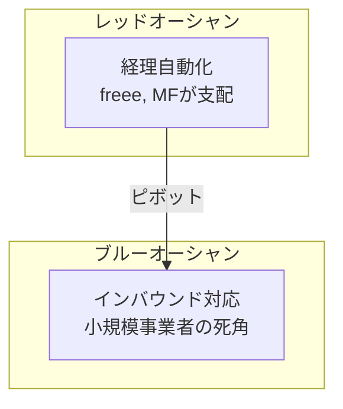
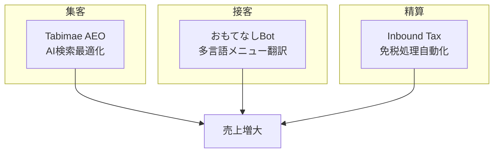
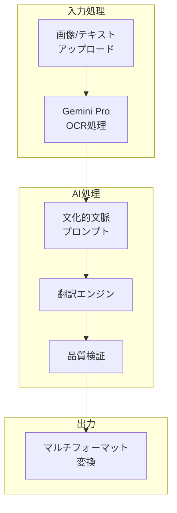

## 始まり：AI効率化ツールという夢

2025年11月、私は<strong>Agent Effi Flow</strong>という名前でAI基盤の業務効率化SaaSをリリースしました。「レシートOCRで経理業務を自動化しよう」というシンプルなアイデアから始まりました。

技術スタックは堅実でした：
- <strong>SvelteKit</strong> + <strong>Supabase</strong> + <strong>Vercel</strong>
- <strong>Google Gemini 2.5 Pro</strong>基盤のAI処理
- クレジット基盤の決済システム（Stripe連携）
- 5言語多言語対応

しかしリリース後一週間、冷静な現実に向き合わなければなりませんでした。

---

## 現実直面：レッドオーシャンの壁

### 日本経理市場の真実

日本の経理自動化市場を調査する中で衝撃的な事実を発見しました：

| サービス | シェア | MAU | 特徴 |
|----------|--------|-----|------|
| freee | 33% | 370万+ | 確定申告ワンクリック |
| Money Forward | 27% | 300万+ | 金融連携最強 |
| 弥生 | 22% | - | 税理士ネットワーク |

<strong>レシートOCR</strong>はすでにこれらの巨大プレイヤーの<strong>基本機能</strong>でした。一人開発者がこの市場で差別化を生み出すことは不可能に近いと感じました。

### 危機のシグナル

```
❌ 検索露出：ほぼなし
❌ 競争優位：明確でない
❌ 価格競争力：freee基本料金¥1,980/月と比較不可
❌ 信頼度：ブランド認知度ゼロ
```

このままではいけないと気づきました。

---

## 転換点：ブルーオーシャンを探して

### 日本市場の逆説的な機会

日本は世界第3位の経済大国ですが、デジタル競争力はOECD最下位圏です。この<strong>デジタルパラドックス</strong>の中で機会を発見しました。



### インバウンド3,000万時代

2024年の訪日外国人数が<strong>3,600万人</strong>を突破しました。しかし：

- 小規模事業者の<strong>72%</strong>が外国語対応に困難
- メニュー翻訳サービスの多くが<strong>文化的文脈を無視</strong>
- 「ホルモン」を「Hormone」と翻訳するミスが頻発

これこそが私が解決できる問題でした。

---

## 新しいビジョン：お店を守るAI支配人

### 3 Pillar戦略



<strong>集客 → 接客 → 精算</strong>の一貫した顧客ジャーニーをAIでサポートすることが新しいビジョンです。

### コアバリュー

| キーワード | 意味 | サービスへの反映 |
|------------|------|-----------------|
| <strong>安心</strong> | ミスのない運営 | 文化的エラー自動検出 |
| <strong>おもてなし</strong> | 心からの歓待 | 文脈を理解する翻訳 |
| <strong>売上</strong> | ビジネス成長 | AI検索露出最適化 |

---

## おもてなしBot：最初の成果

### サービス概要

2025年12月3日、<strong>おもてなしBot</strong>を正式リリースしました。

> 「ミスのない完璧な多言語対応」

メニュー写真をアップロードすると<strong>13言語</strong>で文化的文脈を反映した翻訳を提供します。

### 主要機能

#### 1. 文化的文脈翻訳

単純な直訳ではなく、各文化圏の食文化を理解した翻訳：

```
❌ 従来：ホルモン → "Hormone"（ホルモン？）
✅ おもてなしBot：ホルモン → "Beef Offal BBQ"（牛内臓バーベキュー）

❌ 従来：ガス入りの水 → "Gas water"（ガス水？）
✅ おもてなしBot：ガス入りの水 → "Sparkling water"（炭酸水）
```

#### 2. 業種別プリセット

各業種の特性を反映した翻訳最適化：

- <strong>居酒屋</strong>：おつまみ文化、飲酒マナー反映
- <strong>焼肉</strong>：部位別説明、焼き加減ガイド
- <strong>寿司</strong>：旬の魚、おまかせコンセプト
- <strong>ラーメン</strong>：麺の太さ、スープの濃さ用語

#### 3. アレルギー情報自動検出

```
⚠️ 検出：小麦粉 - Wheat flour
⚠️ 検出：えび - Shrimp
⚠️ 検出：卵 - Egg
```

#### 4. 多様な出力形式

- <strong>テキスト</strong>：簡単なコピー＆ペースト用
- <strong>Markdown</strong>：ドキュメント化用
- <strong>CSV</strong>：Excel編集用
- <strong>画像</strong>：実際のメニューデザイン用

---

## 技術実装：プロンプトアーキテクチャ

### システム構造



### プロンプト設計原則

おもてなしBotの核心は<strong>文化的文脈を理解するプロンプト</strong>です。

#### 言語別文化ガイドライン

各ターゲット言語に対して文化的特性を定義しました：

```typescript
// 例：英語圏ガイドライン
{
  language: 'en',
  cultural_notes: [
    'Avoid literal translations of Japanese onomatopoeia',
    'Include cooking method descriptions for unfamiliar dishes',
    'Add texture/flavor hints for adventurous items'
  ]
}
```

#### 誤訳防止テーブル

よくある誤訳パターンを事前に定義：

| 日本語 | 間違った翻訳 | 正しい翻訳 |
|--------|--------------|------------|
| ホルモン | Hormone | Beef/Pork Offal |
| もつ | Motsu | Offal/Giblets |
| ガス入り | Gas in | Sparkling |
| 並 | Normal | Regular size |

#### 重大度ベースの検証

翻訳結果を3段階で検証：

```typescript
type Severity = 'high' | 'medium' | 'low';

// high: アレルギー、宗教的タブー関連エラー
// medium: 意味の歪曲、不適切な表現
// low: スタイル、ニュアンス改善提案
```

### クレジットシステム

```typescript
const CREDIT_COSTS = {
  base: 10,        // 基本テキスト処理
  image_output: 30 // 画像生成時に追加
};
```

小規模事業者が負担なく利用できるリーズナブルな価格を設定しました。

---

## 経理OCR：戦略的一時停止

既存の経理OCR機能は<strong>一時停止</strong>しました。

### 理由

1. <strong>レッドオーシャン回避</strong>：freee、Money Forwardとの直接競争を断念
2. <strong>リソース集中</strong>：インバウンド特化機能に開発力を集中
3. <strong>リブランディング検討</strong>：小規模事業者により役立つ方向を探り、リニューアル予定（時期未定）

### 今後の計画

経理OCRは単純なレシート認識ではなく、<strong>インバウンド売上特化</strong>機能として生まれ変わる予定です：

- 免税/課税自動分類
- Duty-Free、Tax-Freeキーワード検出
- 弥生、freee CSVフォーマット対応

---

## 学んだこと

### 1. 市場選択が技術より重要

いくら良い技術でもレッドオーシャンでは輝きにくいです。<strong>競争の少ない市場</strong>を見つけることが一人開発者にとっての生存戦略です。

### 2. ニッチを深く掘れ

「すべての人のためのサービス」より「特定の顧客の具体的な問題解決」の方がはるかに価値があります。

### 3. ピボットは失敗ではない

方向転換は諦めではありません。市場のフィードバックを受け入れ、より良い機会を探す<strong>戦略的決定</strong>です。

### 4. 文化的文脈が差別化

AI翻訳サービスは多いですが、<strong>文化的文脈</strong>を理解するサービスは稀です。これがおもてなしBotのコア競争力です。

---

## 次のステップ

### Phase 3（2025年1〜2月）

- <strong>Tabimae AEO</strong>：AI検索エンジン最適化プロモーション生成
- <strong>おもてなしBot高度化</strong>：バッチ処理、接客スクリプト

### 2026年免税制度変更対応

2026年の免税処理方式の変化に合わせて、インバウンド顧客を対象に免税処理を行う小規模事業者向けの免税処理用レシートOCR機能をさらに強化する予定です。

---

## まとめ

レッドオーシャンでもがいていた経理OCRサービスが、インバウンド観光というブルーオーシャンで新しい可能性を発見しました。

<strong>おもてなしBot</strong>はその最初の成果です。「お店を守るAI支配人」というビジョンの下、日本の小規模事業者が世界中のお客様をお迎えできるよう、継続して発展させていきます。

---

<strong>サービスはこちら</strong>：[Agent Effi Flow](https://agent-effi-flow.jangwook.net/)

フィードバックやご質問があればいつでもご連絡ください。一緒により良いサービスを作っていきたいです。
