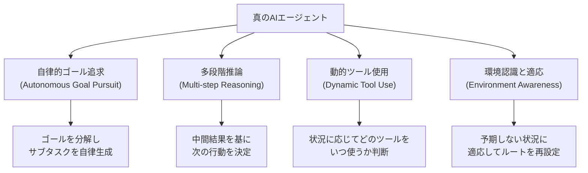
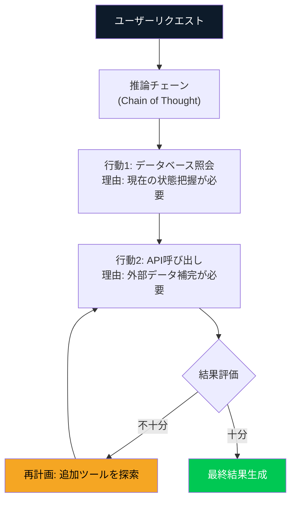
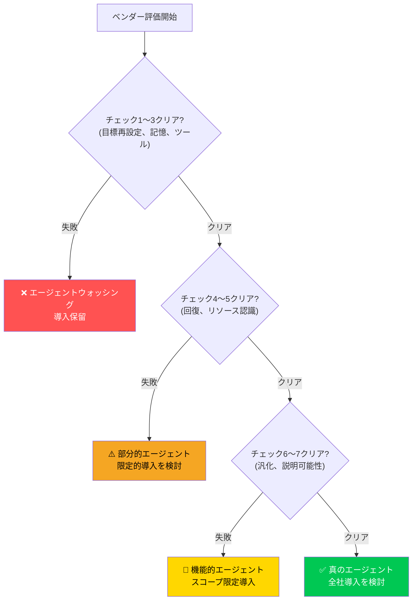

2026年3月現在、「AIエージェント」という言葉はあらゆるITベンダーのマーケティング資料に登場しています。Gartnerは2026年末までに企業アプリケーションの40%にAIエージェントが組み込まれると予測しています。しかし、冷静な調査結果は異なります。数千の「AIエージェント」ベンダーのうち、真のエージェントシステムを構築しているのは<strong>約130社に過ぎません</strong>。

残りの数千社は何でしょうか? 単純な自動化、if-thenルールエンジン、またはLLM API呼び出しをラップしただけのものに「AIエージェント」という名前を付けたものです。これを<strong>エージェントウォッシング(Agent Washing)</strong>と呼びます。グリーンウォッシングが環境に優しくない製品を親環境的に見せるように、エージェントウォッシングは単純な自動化を知的エージェントとして見せます。

Engineering Managerとして、この罠を避けることは単なる技術的な判断を超えて、<strong>チームの時間、予算、信頼を守ること</strong>です。この記事では、実践で検証された7つのチェックリストを通じて、エージェントウォッシングを見抜く方法を紹介します。

## エージェントウォッシングとは何か

エージェントウォッシングを理解するには、まず<strong>真のAIエージェント</strong>が何かを知る必要があります。

真のAIエージェントは以下の4つの核心特性を持ちます:



一方、エージェントウォッシングの特徴は以下の通りです:

- 事前定義されたスクリプトやフローチャートを実行
- 分岐はあるが<strong>新しい計画を生成しない</strong>
- 失敗時はすぐに人間にエスカレーション(自律回復なし)
- LLMを使用しているが単純なテキスト生成用にのみ活用

## 7つの見抜きチェックリスト

### ✅ チェック1: 「ゴール再設定」テスト

<strong>質問:</strong> 実行中に予期しない障害が生じた場合、どうなりますか?

真のエージェントは障害に遭遇した際、<strong>自ら代替ルートを生成</strong>します。エージェントウォッシング製品は「シナリオAが失敗しました。サポートチームにお問い合わせください」というエラーメッセージを返します。

**実践テスト**: デモ中に意図的に異常な入力値を入れてみてください。システムが新しいアプローチを試みるか、単にエラーを返すかを確認します。

```python
# 真のエージェントの反応例
# 障害発生 → 自律的な再計画

async def handle_obstacle(self, obstacle: Exception):
    # エージェントが自ら代替案を生成
    alternative_plans = await self.llm.generate_alternatives(
        original_goal=self.current_goal,
        obstacle=str(obstacle),
        context=self.memory.get_context()
    )
    return await self.execute_best_plan(alternative_plans)

# エージェントウォッシングの反応例
# 障害発生 → エラー返却

def handle_obstacle(self, error):
    raise AgentError(f"Predefined flow failed: {error}")
    # またはNoneを返すだけ
```

### ✅ チェック2: 「コンテキスト記憶」テスト

<strong>質問:</strong> 以前のやり取りの結果が次の行動にどの程度反映されますか?

真のエージェントは<strong>エピソードメモリ</strong>を活用して、以前の失敗と成功を現在の決定に反映します。エージェントウォッシングは各リクエストを独立して処理するか、単に以前の会話テキストを貼り付けるだけです。

**実践テスト**: 同じタスクを2回依頼し、2回目には最初の結果の欠点を伝えてください。エージェントがそのフィードバックを反映して異なるアプローチを取るか確認します。

### ✅ チェック3: 「ツール選択の柔軟性」テスト

<strong>質問:</strong> 使用可能なツールが変更された場合、システムはどう反応しますか?

真のエージェントは現在の状況で<strong>どのツールが最適かをランタイムに判断</strong>します。エージェントウォッシングは特定のツール使用順序がハードコードされており、ツールがなければ動作しません。

```python
# 真のエージェント: ツール選択の柔軟性

class GenuineAgent:
    async def select_tool(self, task: str, available_tools: list) -> Tool:
        # 現在のタスクとコンテキストを分析して最適ツールを動的に選択
        tool_analysis = await self.llm.analyze_tools(
            task=task,
            tools=[t.description for t in available_tools],
            history=self.memory.recent_actions
        )
        return available_tools[tool_analysis.best_tool_index]

# エージェントウォッシング: ハードコードされたツール順序

class WashedAgent:
    TOOL_SEQUENCE = ["search", "summarize", "format"]  # 変更不可

    def execute(self, task):
        for tool_name in self.TOOL_SEQUENCE:
            result = self.tools[tool_name].run(task)  # 順序固定
        return result
```

### ✅ チェック4: 「失敗回復」テスト

<strong>質問:</strong> サブタスクが失敗した場合、全体のタスクは中断しますか?

真のエージェントは<strong>部分的な失敗でも全体的なゴールに向けて進み</strong>、失敗した部分を回避または再試行します。エージェントウォッシングは一つが失敗するとパイプライン全体が止まります。

**実践テスト**: 意図的にAPIを一時的に無効化して、システムがどのように反応するか観察します。

### ✅ チェック5: 「予算・時間認識」テスト

<strong>質問:</strong> リソース制約がある場合、システムはトレードオフを認識しますか?

真のエージェントは与えられた<strong>時間、トークン、[APIコスト](/ja/blog/ja/ai-agent-cost-reality)の制約内で最適な結果を導き出す</strong>ために戦略を調整します。エージェントウォッシングはリソース制約を認識せず、常に同じ方法で実行されます。

```python
# 真のエージェント: リソース認識

async def run_with_budget(self, task, token_budget=10000):
    estimated_cost = await self.estimate_cost(task)

    if estimated_cost > token_budget:
        # 予算超過時に戦略を調整
        simplified_plan = await self.create_simplified_plan(
            task, max_tokens=token_budget * 0.8
        )
        return await self.execute(simplified_plan)
    return await self.execute_full_plan(task)
```

### ✅ チェック6: 「新ドメイン汎化」テスト

<strong>質問:</strong> トレーニングデータにない新しいタイプのタスクも処理できますか?

真のエージェントは<strong>転移学習能力</strong>で新しいドメインのタスクも既存の知識を活用して処理します。エージェントウォッシングは特定のユースケースのみを処理するように設計された専用自動化です。

**実践テスト**: ベンダーがデモしていない新しいエッジケースを要求してみてください。「このユースケースは現在サポートしていません」という回答はエージェントウォッシングのサインです。

### ✅ チェック7: 「説明可能な推論」テスト

<strong>質問:</strong> システムがなぜ特定の行動を選んだかを説明できますか?

真のエージェントは<strong>[意思決定プロセスの透明なトレース](/ja/blog/ja/ai-agent-observability-production-guide)</strong>を提供します。エージェントウォッシングは「ブラックボックス」として機能するか、事前に作成された説明のみを返します。



## EMがベンダー評価時に聞くべき質問

上記7つのチェックリストを基に、ベンダーミーティングで直接聞ける核心的な質問リストです:

| 質問 | 真のエージェントの回答パターン | エージェントウォッシングの回答パターン |
|-----|--------------------------|----------------------------------|
| 「非定型入力が来たら?」 | 「新しい計画を生成します」 | 「定めたフォーマットに変換します」 |
| 「失敗率はどの程度ですか?」 | 具体的な数値 + 回復方法 | 「信頼性が高い」(数値なし) |
| 「どのように学習・改善しますか?」 | RLHF、GRPOなど具体的なメカニズム | 「定期的にアップデートします」 |
| 「推論過程を見られますか?」 | 詳細なtrace提供 | 「結果のみ提供されます」 |
| 「新しいツールを追加したら?」 | 「活用方法を自動的に学習します」 | 「開発チームが連携します」 |

## エージェントウォッシングの実際のコスト

エージェントウォッシングを見抜けなかった場合のコストは、単なる誤った購入にとどまりません。

**1. 機会費用**: 真のエージェントAIを導入するための予算と時間を無駄にします。

**2. 組織の信頼損失**: 「AI導入失敗」の経験が積み重なると、チームが今後の真のAIプロジェクトにも懐疑的になります。

**3. 技術的負債**: 単純な自動化をエージェントと信じてアーキテクチャを設計すると、後で真のエージェントに切り替える際に全面的な再設計が必要になります。

**4. 競争上の劣位**: 真のエージェントAIを導入した競合他社が20〜40%の運用コスト削減を達成する一方、エージェントウォッシング製品を使用する組織はその恩恵を受けられません。

## 実践評価フレームワーク

EMとして新規AIエージェントの導入を検討する際、以下のフレームワークを活用してください:



## 2026年のエージェント市場の現実

現在の企業AI導入調査(2026年3月)によると:

- 57.3%の組織がエージェントをプロダクションで運用中
- しかし、そのうち<strong>真の自律エージェント</strong>は全体の20%未満
- 残りの80%は自動化されたワークフロー、LLM強化チャットボット、またはルールベースのシステム

このギャップがまさにエージェントウォッシングが繁栄する理由です。「エージェントがある」と「真のエージェントAIがある」はまったく異なる話です。

## まとめ: 疑いの技術

エージェントウォッシングの見抜き方は技術的なスキルでもありますが、何より<strong>正しい質問を投げかける習慣</strong>です。

ベンダーが「AIエージェント」を自信を持って披露する際、EMとしてあなたは7つのチェックリストの質問を投げかけるべきです。ほとんどの真のエージェントAIは、これらの質問を歓迎し、具体的な回答を提供します。エージェントウォッシング製品は曖昧な答え、話題の転換、または「ロードマップにあります」で応答するでしょう。

2026年のエンタープライズAI導入の波の中で、本物と偽物を見分ける能力はEMの核心的な競争力になります。130社の真のエージェントを見つけ出すこと、それが2026年のEMに与えられた課題です。

## 参考資料

- [AI Journey Report 2026: Generative to Agentic - ResearchAndMarkets](https://www.globenewswire.com/news-release/2026/03/12/3254690/28124/en/AI-Journey-Report-2026-Generative-to-Agentic-Understand-How-Agentic-AI-Can-Help-LLM-Vendors-Achieve-Profitability-and-Identify-the-Likely-Winners-from-the-First-Phase-of-the-AI-Inv.html)
- [State of Agent Engineering 2026 - LangChain](https://www.langchain.com/state-of-agent-engineering)
- [5 Key Trends Shaping Agentic Development in 2026 - The New Stack](https://thenewstack.io/5-key-trends-shaping-agentic-development-in-2026/)
- [Unlocking the value of multi-agent systems in 2026 - Computer Weekly](https://www.computerweekly.com/opinion/Unlocking-the-value-of-multi-agent-systems-in-2026)
- [2026 enterprise AI predictions - InformationWeek](https://www.informationweek.com/machine-learning-ai/2026-enterprise-ai-predictions-fragmentation-commodification-and-the-agent-push-facing-cios)
