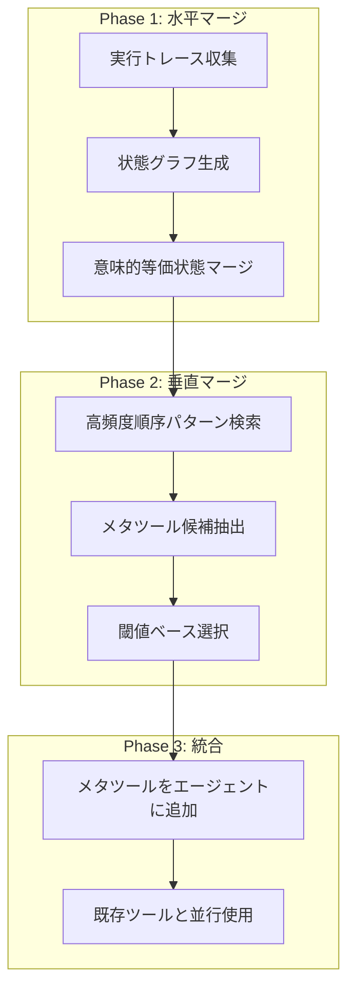
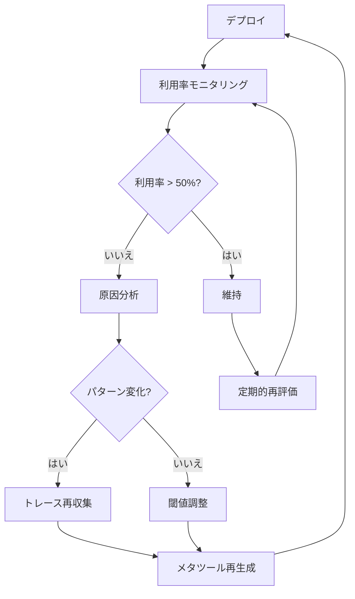

## 概要

AIエージェントシステムをプロダクション環境に配置すると、予期しないコストと遅延が発生します。エージェントが毎回LLMを呼び出して次のアクションを推論するためです。ログイン、検索、フォーム送信などの反復パターンも毎回新しい推論を通ります。

2026年1月にarXivで発表された<strong>「Optimizing Agentic Workflows using Meta-tools」</strong>という論文は、この問題に対する実用的な解決策を提示します。核心的なアイデアは単純です。エージェントの実行ログを分析して反復されるツール呼び出しパターンを見つけ、これを<strong>メタツール(Meta-tool)</strong>という決定論的な複合ツールにコンパイルするのです。

本記事では、AWO(Agent Workflow Optimization)フレームワークの動作原理を分析し、エンジニアリングチームがどのように活用できるかを実践的な観点から考察します。

## なぜエージェントワークフロー最適化が必要なのか

現在、ほとんどのAIエージェントシステムは<strong>ReAct(Reasoning + Acting)</strong>パターンに従っています。エージェントがユーザーリクエストを受け取ると、LLMが推論して、ツールを呼び出して、結果を観察して、再び推論するループを繰り返します。

問題はこのプロセスで発生する非効率です:

- <strong>不要な推論</strong>: 毎回同じパターンで実行されるログイン、検索などのタスクでもLLM推論を通ります
- <strong>コスト累積</strong>: LLM呼び出し一回あたり数セント積もると、大規模デプロイで大きなコストになります
- <strong>遅延増加</strong>: 不要なLLM呼び出しは応答時間を増やします
- <strong>ハルシネーション危険</strong>: LLM呼び出しが増えるほど、誤った判断が発生する確率も高くなります

実際のベンチマークでは、エージェントは同じタスクに対して非常に多様な実行パスを示します。場合によっては3ステップで終わるタスクを10ステップ以上かけることもあります。

## AWOフレームワーク: 3段階最適化パイプライン

AWOはエージェントの実行履歴(trace)を分析してメタツールを自動抽出するフレームワークです。大きく3段階で構成されます。



### Phase 1: 水平マージ(Horizontal Merging)

最初のステップでは、複数の実行トレースを1つの状態グラフに統合します。各実行はツール呼び出しの順序列として表現されます:

```
E_i = (Tool_1, Tool_2, ..., Tool_n)
```

核心は<strong>意味的に等価な状態</strong>を認識することです。例えば:

- 読み取り専用操作は順序が変わっても結果は同じです(交換法則)
- ユーザーIDやセッショントークンは正規化して同一に扱います
- 繰り返される認証フローは1つに短縮します

このプロセスでは、ドメイン専門家がマージ規則を定義します。完全自動化はまだ限界がありますが、規則そのものは再利用可能です。

### Phase 2: 垂直マージ(Vertical Merging)

水平マージで統合されたグラフから<strong>高頻度順序パターン</strong>を貪欲(greedy)アルゴリズムで抽出します:

```python
# AWOメタツール抽出アルゴリズム (簡略版)
def extract_meta_tools(graph, threshold_T):
    meta_tools = []
    while True:
        # 重みが閾値以上のエッジペア検索
        pairs = find_high_weight_pairs(graph, threshold_T)
        if not pairs:
            break

        # 最も高い重みのペアを選択
        best_pair = max(pairs, key=lambda p: p.weight)
        candidate = [best_pair.start, best_pair.end]

        # 後続ノードで拡張 (子ノードの重みが十分に高い場合)
        current = best_pair.end
        while child := select_high_freq_child(current, threshold_T):
            candidate.append(child)
            current = child

        meta_tools.append(candidate)
        graph = compress(graph, candidate)

    return meta_tools
```

選択基準は明確です。エッジの重み `w(n_y, n_z)` がそのノードの全子エッジ重みの合計の半分を超える必要があります。これはそのパターンが<strong>圧倒的に頻繁に</strong>発生した場合のみメタツール化するという意味です。

### Phase 3: メタツール統合

抽出されたメタツールはエージェントのツールセットに追加されます。既存のツールを置き換えるのではなく<strong>並行</strong>します。エージェントは状況に応じてメタツールを使用するか、既存の個別ツールを使用できます。

## 実験結果: ベンチマーク別成果

### VisualWebArena (ウェブエージェントベンチマーク)

Reddit、Classifieds、Shoppingという3つのウェブ環境で910個のタスクをテストしました。

| 指標 | Reddit | Classifieds | Shopping |
|------|--------|-------------|----------|
| LLM呼び出し削減 | 5.6% | 8.3% | 10.2% |
| コスト削減 | 5.7% | 8.5% | 10.2% |
| 成功率変化 | +2.1%p | +4.2%p | +1.8%p |
| 生成されたメタツール数 | 2個 | 2個 | 2個 |

Shoppingカテゴリーで最も大きな効果が見られました。検索やレビュー作成のような反復パターンが明確だったからです。

<strong>実際に生成されたメタツール例</strong>:

```
# Shoppingメタツール: search
search [query]
  = type(search_box_id, query) → click(search_submit_id)

# Shoppingメタツール: leave_review
leave_review [rating, title, review]
  = click(review_tab)
  → scroll_down()
  → set_rating(rating)
  → fill(title_field, title)
  → fill(review_field, review)
  → click(post_button)
```

### AppWorld (マルチアプリケーションエージェントベンチマーク)

9つのアプリケーション環境で168個のタスクをテストしました。

| 指標 | GPT 5.1 | Claude 4.5 |
|------|---------|------------|
| LLM呼び出し削減 | 11.9% | 7.2% |
| コスト削減 | 15.0% | 4.2% |
| メタツール利用率 | 98.2% | 39.3% |
| 生成されたメタツール数 | 5個 | 5個 |

興味深いことに、GPT 5.1がメタツールを98.2%の確率で活用した一方で、Claude 4.5は39.3%に留まったということです。これはモデルごとに<strong>ツール活用傾向</strong>が異なることを示しています。

## 実務適用ガイド: エンジニアリングチームのためのロードマップ

### ステップ1: 実行トレース収集

AWOを適用するには、まずエージェントの実行ログを体系的に収集する必要があります。

```python
# エージェント実行トレース収集例
import json
from datetime import datetime

class TraceCollector:
    def __init__(self):
        self.traces = []
        self.current_trace = []

    def log_tool_call(self, tool_name: str, params: dict, result: dict):
        self.current_trace.append({
            "tool": tool_name,
            "params": self._normalize_params(params),
            "timestamp": datetime.now().isoformat(),
            "success": result.get("success", True)
        })

    def _normalize_params(self, params: dict) -> dict:
        """ユーザーIDなどを正規化してパターン検索を容易にします"""
        normalized = {}
        for k, v in params.items():
            if k in ["user_id", "session_token"]:
                normalized[k] = "<NORMALIZED>"
            else:
                normalized[k] = v
        return normalized

    def end_trace(self):
        if self.current_trace:
            self.traces.append(self.current_trace)
            self.current_trace = []

    def export(self, path: str):
        with open(path, 'w') as f:
            json.dump(self.traces, f, indent=2)
```

### ステップ2: パターン分析とメタツール候補の識別

収集されたトレースから反復パターンを見つけます。実務では、完全自動化より<strong>半自動アプローチ</strong>が効果的です:

```python
from collections import Counter

def find_frequent_sequences(traces, min_length=2, min_freq=5):
    """頻出ツール呼び出しシーケンスを検索します"""
    sequences = Counter()

    for trace in traces:
        tool_names = [step["tool"] for step in trace]
        # n-gram方式でシーケンスを抽出
        for length in range(min_length, min(len(tool_names), 6)):
            for i in range(len(tool_names) - length + 1):
                seq = tuple(tool_names[i:i + length])
                sequences[seq] += 1

    # 頻度ベースでフィルタリング
    return {
        seq: count
        for seq, count in sequences.most_common()
        if count >= min_freq
    }
```

### ステップ3: メタツール実装とデプロイ

識別されたパターンを決定論的関数として実装します:

```python
# メタツール実装例: 自動ログイン + 検索
class MetaTool:
    def __init__(self, name: str, steps: list):
        self.name = name
        self.steps = steps

    async def execute(self, agent_context, **params):
        """LLM推論なしに決定論的に実行します"""
        results = []
        for step in self.steps:
            tool_name = step["tool"]
            tool_params = self._resolve_params(step["params"], params)
            result = await agent_context.call_tool(tool_name, tool_params)
            results.append(result)

            if not result.get("success"):
                # 失敗時はエージェントに制御を返す
                return {"success": False, "partial_results": results}

        return {"success": True, "results": results}

    def _resolve_params(self, template: dict, actual: dict) -> dict:
        """テンプレートパラメータを実際の値で置換します"""
        resolved = {}
        for k, v in template.items():
            if isinstance(v, str) and v.startswith("$"):
                resolved[k] = actual.get(v[1:], v)
            else:
                resolved[k] = v
        return resolved

# 使用例
auto_login_search = MetaTool(
    name="auto_login_and_search",
    steps=[
        {"tool": "get_credentials", "params": {"service": "$service"}},
        {"tool": "login", "params": {"username": "$username", "password": "$password"}},
        {"tool": "search", "params": {"query": "$query"}}
    ]
)
```

### ステップ4: モニタリングと反復改善

メタツールデプロイ後は、利用率と効果を継続的に監視します:



## EM/VPoE観点: 導入時の考慮事項

### コスト対効果分析

AWOのROIはエージェント使用規模に比例します:

- <strong>小規模</strong>(1日100件未満): 導入コスト対効果が微々たるものです
- <strong>中規模</strong>(1日1,000〜10,000件): 5〜15%のコスト削減が意味のある金額になります
- <strong>大規模</strong>(1日10,000件以上): 必須の最適化戦略です

### チーム能力要件

AWO導入に必要な能力:

- <strong>ドメイン専門性</strong>: 水平マージ規則を定義できる業務ドメイン理解
- <strong>ログインフラ</strong>: エージェント実行トレースを体系的に収集するパイプライン
- <strong>テスト環境</strong>: メタツールの正確性を検証するベンチマーク

### 注意事項

- 水平マージ規則は<strong>手動定義</strong>が必要です。完全自動化では性能が停滞しました
- モデルによってメタツール利用率が大きく異なります(GPT 98% vs Claude 39%)
- タスク分布が変わると、メタツールを<strong>再生成</strong>する必要があります

## 他の最適化アプローチとの比較

| アプローチ | 方式 | AWOとの違い |
|--------|------|--------------|
| LLMCompiler | 並列DAG実行 | ランタイム最適化 vs AWOは事前デプロイ最適化 |
| ReAct | 推論〜行動交替 | 重複推論を除去しない |
| Tree of Thought | 複数推論経路探索 | 探索 vs AWOは統合 |
| AVATAR | 対比学習ベース | 学習が必要だがAWOは実行分析のみ使用 |

AWOの利点は<strong>既存システムに非侵襲的に適用</strong>できることです。エージェントのコアロジックを修正せず、ツールを追加するだけです。

## 結論

AWOフレームワークはAIエージェントシステムの実質的な運営コストを削減する実用的なアプローチです。核心は「エージェントが毎回推論する必要がないパターンは決定論的に実行しよう」という単純な原則です。

プロダクション環境でAIエージェントを運営するチームなら、実行トレース収集から始めることをお勧めします。データが積み重なると、どのパターンがメタツール候補かが自然に見えてくるようになります。

## 参考資料

- [Optimizing Agentic Workflows using Meta-tools (arXiv:2601.22037)](https://arxiv.org/abs/2601.22037)
- [A Practical Guide for Production-Grade Agentic AI Workflows (arXiv:2512.08769)](https://arxiv.org/abs/2512.08769)
- [How Agentic AI Will Reshape Engineering Workflows in 2026 (CIO)](https://www.cio.com/article/4134741/how-agentic-ai-will-reshape-engineering-workflows-in-2026.html)
- [7 Agentic AI Trends to Watch in 2026 (MachineLearningMastery)](https://machinelearningmastery.com/7-agentic-ai-trends-to-watch-in-2026/)
