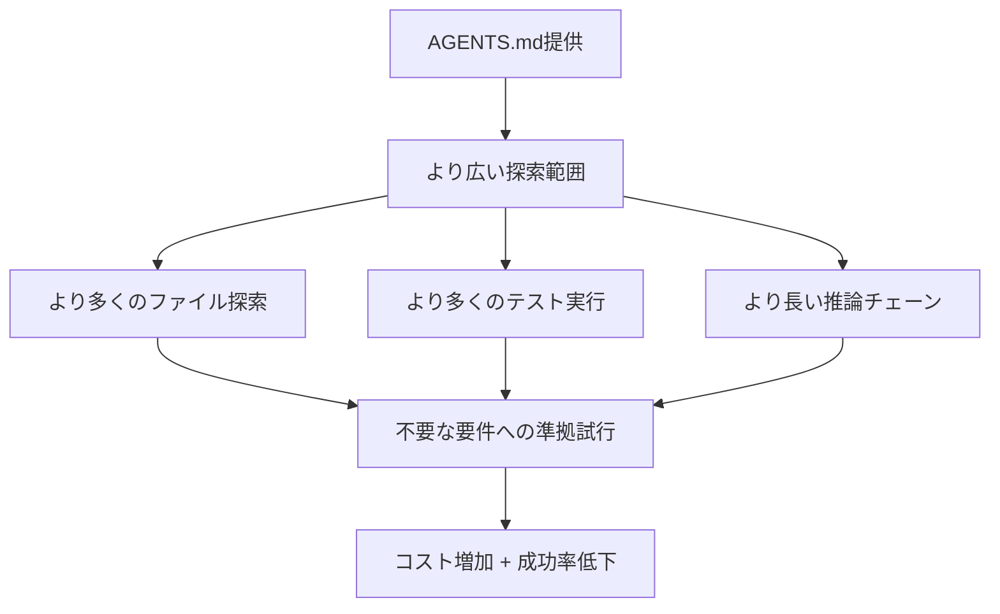

## 概要

Cursor、Claude Code、Codexなどのコーディングエージェントが普及する中、リポジトリに<strong>AGENTS.md</strong>（またはCLAUDE.md、CURSOR.md）ファイルを配置し、エージェントにプロジェクトのコンテキストを提供するプラクティスが急速に広まっています。現在、GitHubだけで6万以上のリポジトリがこのファイルを含んでいます。

しかし、このファイルは<strong>本当に</strong>エージェントのタスク成功率を向上させるのでしょうか？ ETH Zürichの研究チームが、この問いに対する<strong>初の実証的な回答</strong>を発表しました。

> 📄 論文: [Evaluating AGENTS.md: Are Repository-Level Context Files Helpful for Coding Agents?](https://arxiv.org/abs/2602.11988)（arXiv 2602.11988、2026年2月）

## 核心的な発見：予想を覆す結果

### LLM生成コンテキストファイルはむしろ成功率を下げる

研究チームは3つの設定でコーディングエージェントを評価しました：

1. <strong>コンテキストファイルなし</strong>（ベースライン）
2. <strong>LLMが自動生成したコンテキストファイル</strong>（エージェント開発者推奨方式）
3. <strong>開発者が手動で作成したコンテキストファイル</strong>

```
┌─────────────────────────────────────────────┐
│        設定別の平均成功率変化                  │
├─────────────────────────────────────────────┤
│  コンテキストなし（基準）   : ████████ 基準   │
│  LLM生成コンテキスト       : ██████▌  -3%    │
│  開発者作成コンテキスト     : ████████▌ +4%   │
└─────────────────────────────────────────────┘
```

主要な数値をまとめると：

- <strong>LLM生成ファイル</strong>：平均成功率<strong>3%低下</strong>
- <strong>開発者作成ファイル</strong>：平均成功率<strong>4%向上</strong>（わずかな改善）
- <strong>推論コスト</strong>：どちらの場合も<strong>20%以上増加</strong>

### なぜこのような結果になったのか？

研究チームはエージェントの行動パターンを詳細に分析しました：



エージェントはコンテキストファイルの指示を<strong>忠実に従う</strong>傾向がありました。問題は、その指示の多くが当該タスクにとって<strong>不要な要件</strong>だったという点です。スタイルガイドの遵守、特定のテストパターンの使用などの指示が、むしろタスクを複雑にしていました。

## AGENTbench：新しいベンチマーク

研究チームはこの評価のために<strong>AGENTbench</strong>という新しいベンチマークを構築しました。

| 項目 | 内容 |
|------|------|
| インスタンス数 | 138個 |
| 対象リポジトリ | 12個（開発者がコンテキストファイルを実際に使用しているリポジトリ） |
| タスク種類 | バグ修正 + 機能追加 |
| 補完ベンチマーク | SWE-bench Lite（有名リポジトリ対象） |

既存のSWE-benchは有名な大規模リポジトリが中心で、AGENTS.mdが含まれていませんでした。AGENTbenchは<strong>実際にコンテキストファイルを使用しているリポジトリ</strong>からタスクを収集した初のベンチマークです。

## 実践的な示唆：どう活用すべきか？

### ❌ やるべきでないこと

- LLMに`/init`コマンドでAGENTS.mdを<strong>自動生成</strong>させること
- プロジェクトの全ルール、スタイルガイド、アーキテクチャ説明を1ファイルに詰め込むこと
- エージェントが「全部読んでくれる」と期待して膨大なコンテキストを提供すること

### ✅ やるべきこと

研究チームの推奨事項は明確です：<strong>「最小限の要件のみを記述せよ」</strong>

効果的なAGENTS.md作成の原則：

1. <strong>ビルド・テストコマンド</strong>のみ明記（例：`npm test`、`pytest`）
2. <strong>プロジェクト固有のツール</strong>の使い方のみ記述
3. スタイルガイドやアーキテクチャ説明は<strong>別ドキュメント</strong>に分離
4. エージェントがタスクに<strong>直接必要な情報</strong>のみ含める

```markdown
# 良いAGENTS.mdの例

## ビルド
npm install && npm run build

## テスト
npm test              # 全テスト
npm test -- --grep "パターン"  # 特定テスト

## リント
npm run lint          # コミット前に必ず実行
```

```markdown
# 悪いAGENTS.mdの例（不要な要件が過多）

## アーキテクチャ
このプロジェクトはクリーンアーキテクチャに従い...
（冗長な説明200行）

## コーディングスタイル
すべての関数にはJSDocコメントを含める必要があり...
変数名は必ずキャメルケースで...
（詳細ルール100行）

## コミット規則
Conventional Commitsに従い...
```

## 開発コミュニティの反応

この論文はHacker Newsで58ポイントを記録し、活発な議論を呼びました。主な反応は：

- <strong>「直感的に正しい結果だ」</strong>：過度な指示がエージェントをかえって混乱させるという経験的な共感
- <strong>「コンテキストウィンドウの浪費」</strong>：長いAGENTS.mdが実際のコードコンテキストを押し出すという懸念
- <strong>「ミニマルが最善」</strong>：ビルド・テストコマンドだけで十分だという実務経験の共有

## 限界と今後の展望

この研究にはいくつかの限界があります：

- <strong>Python中心</strong>：AGENTbenchはPythonプロジェクトのみが対象
- <strong>ニッチなリポジトリ</strong>：開発者がコンテキストファイルを使用しているリポジトリは比較的小規模
- <strong>静的評価</strong>：コンテキストファイルが繰り返しタスクで累積効果を発揮するかは未検証

今後の研究方向としては：

1. <strong>適応的コンテキスト</strong>：タスク種類に応じて必要な情報のみを動的に提供
2. <strong>構造化コンテキスト</strong>：自由テキストの代わりに機械がパースしやすい形式を活用
3. <strong>多言語への拡張</strong>：Python以外の言語での効果検証

## 結論

AGENTS.mdはコーディングエージェントのエコシステムで事実上の標準になりつつありますが、今回の論文は<strong>「多く書けば書くほど良い」という通念にブレーキ</strong>をかけました。

核心的なメッセージはシンプルです：

> <strong>コンテキストファイルは最小限に、ビルドとテストコマンド中心で作成せよ。</strong>

エージェント開発者の推奨通りに`/init`で自動生成するのは、現時点ではむしろ逆効果になり得ます。手動で作成し、本当に必要な情報だけを含めるのが最も効果的な戦略です。

## 参考資料

- [論文原文（arXiv）](https://arxiv.org/abs/2602.11988)
- [AGENTbench GitHubリポジトリ](https://github.com/eth-sri/agentbench)
- [AGENTS.md公式サイト](https://agents.md)
- [Hacker Newsでの議論](https://news.ycombinator.com/item?id=43062692)
