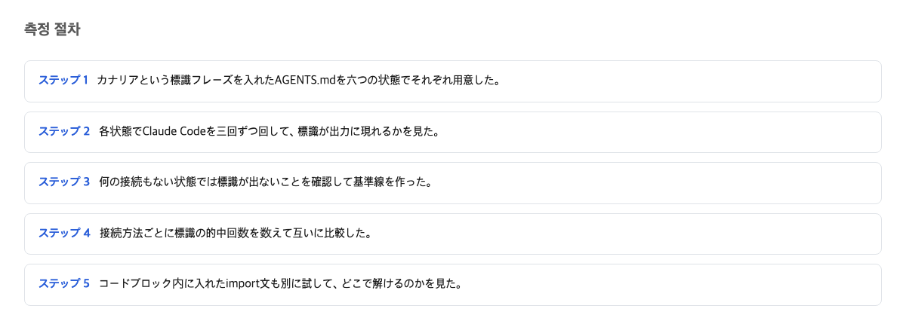

## AGENTS.md と CLAUDE.md の役割

AI コーディング支援ツールには、作業の約束事を書いたファイルを置ける。作業の約束事を書くファイルには、二つの名前がある。

AGENTS.md は、複数の AI ツールが共通で読むことを想定した約束事の書き置きである。AGENTS.md の公式サイトは、このファイルに「コーディング支援 AI が必要とする追加の、ときに細かい文脈を書く」と説明している [2]。

CLAUDE.md は、Claude Code というツールだけが読む書き置きである。公式ドキュメントの言い方ははっきりしている。

> Claude Code reads `CLAUDE.md`, not `AGENTS.md`.
> — [Manage Claude's memory (CLAUDE.md) / Claude Code Docs](https://code.claude.com/docs/en/memory)

つまり Claude Code は AGENTS.md という名前のファイルを読まない。読むのは CLAUDE.md という名前だけだ。では AGENTS.md をすでに書いてあるチームは、同じ内容をどうやって Claude Code に届ければいいのか。

ここには答えの決まらない疑問が一つある。届け方の違いは、届いた後の重さに影響するのか。それとも届くか届かないかだけが問題なのか。

## 六つの設定と測り方

確かめた方法は単純である。同じ一つの文書を、三つのつなぎ方それぞれで Claude Code に渡してみて、全部同じ文章が届くかを見る。

先に、この測り方で使う言葉の意味を述べておく。

トークンは、AI モデルが文章を読むときの量の単位である。長さの単位だと思えばよい。トークンが多いほど、モデルは長い文書を読んでいる。インポートは、あるファイルの先頭に別のファイルを読み込む指示を一行書く方式である。シンボリックリンクは、一つのファイルに別の名前を付けて、どちらの名前でも同じ中身が見えるようにする仕組みである。コードフェンスは、Markdown という書式で「これは説明ではなく実例のブロックです」と囲む記号である。

六つの設定で、同じ文書を三回ずつ、合計 18 回読ませて比べた。文書は 9,674 バイトの確かめ用の約束事で、その中に合言葉が一つ書いてある。文書が読み込まれたら合言葉が返ってくる。合言葉が三回中三回来たかが最初の判定、読みに使ったトークンの量が二つ目の判定だ。

## 配線なしで AGENTS.md だけ置いた結果

まず何もしなかった場合である。AGENTS.md を置くだけで、CLAUDE.md は作らない。

合言葉は三回とも来なかった。トークンの量は、どの読み込み対象でもないファイルを置いた対照と 2 トークンしか違わない。つまりこの 2 トークンは、文書の中身が読まれていないことを示している。

読み込みそのものが起きていない。エラーも警告も出ない。

これは冷蔵庫に張ったメモのような話である。家族に伝えたい約束を冷蔵庫の扉に張ったとする。だが相手は郵便受けしか見ない人だった。メモは一日中そこにあり、誰も読まない。何も壊れていないように見えるのに、約束は届いていない。

この違いが問題になるのは、日々の運用でつなぎ方を選ぶ場面だ。何もしない選択は、「見えない」ではなく「存在しない」と同じ結果になる。

## 三つのつなぎ方の実測結果

公式で用意されているつなぎ方は三つある。三つとも試した。

一つ目はインポート方式。CLAUDE.md の最初の行に `@AGENTS.md` と書く。ドキュメントは、この書き方でファイルが「起動時に展開され、参照する CLAUDE.md と一緒に読み込まれる」と説明する [1]。

二つ目はシンボリックリンク方式。AGENTS.md に CLAUDE.md という別名を付ける。

三つ目はコピー方式。中身を CLAUDE.md に写す。

結果はこうだった。合言葉は三方式とも三回中三回で届いた。トークンの量は、インポート方式が 17978、シンボリックリンク方式が 17856、コピー方式が 17862 だった。

ここから分かることが二つある。

まず、文書一通分の重さは約 2,920 トークンだった。コピー方式と何もしない対照の差がちょうどこの量で、9,674 バイトの文書に対応する。次に、インポート方式は文書を二重に数えていなかった。コピー方式との差は 116 トークンで、文書一通分には遠く及ばない。二重読み込みの心配は要らない。

## コードフェンスで囲んだ @import の結果

ここで、何もしていないのに一番重い事故が起きた。

説明用の文章では、`@AGENTS.md` という一行を「例」として書きたくなる場面がある。Markdown の書き方では、例はコードフェンスで囲むのが普通だ。この記事でも同じ一行を同じフェンスで囲んで測った。

合言葉は三回とも来なかった。

トークンの量は 15081 で、何もつないでいない場合より 141 多いだけで、文書一通分の 2,920 には遠く及ばない。つまり文書の中身は一行も読み込まれていない。フェンスを囲む六文字の記号が、文書一通分の読み込みの有無を決めた。

原因は公式ドキュメントに書いてあった。

> Import parsing skips Markdown code spans and fenced code blocks. To mention a path in your CLAUDE.md without importing it, wrap it in backticks: writing `@README` keeps the text literal, while @README outside backticks imports the file.
> — [Manage Claude's memory (CLAUDE.md) / Claude Code Docs](https://code.claude.com/docs/en/memory)

読み込みの判定は、画面に表示される前の段階で行われる。読み込みの処理は、「実例として囲まれた部分は読み飛ばす」という単純な規則で動く。だからフェンスの中に書いた一行は、読み込み指示としても、説明としても機能しない。そしてこの事故には表示上の兆候がない。エラーは出ない。消えるのは約束事の本文だ。

家の例で言えば、郵便受けに手紙を入れるつもりで、手紙ごと封筒の見本ケースに入れて棚に飾ってしまった状態である。手紙は書いてある。誰も読まない。

## 三つの方法の比較の結論

三方式の差を比べる。合言葉の届き方は三方式とも同じだった。トークンの最大の差は 122 で、インポート方式とシンボリックリンク方式の間だ。この 122 のうち 116 は、橋渡し用に置いた CLAUDE.md 自身の分であり、インポート方式が余分に読み込んだ量ではない。文書一通分 2,920 と比べれば 122 は 4% に相当する。

反論は可能である。122 トークンの差は、同じ測りの中で原因の分からない 109 トークンの揺らぎと同じ大きさだ。三回ずつの繰り返しでは、この差が安定しているとは言えないかもしれない。この点で「測定上の完全な同等」と言い切るのは統計的に言い過ぎという批判は正しい。

だが選ぶ場面で問うべきは、4% の差が再現されるかではなく、どちらの方式が文書を読まなくなるリスクを抱えるかだ。三方式とも合言葉は三回中三回で届いた。トークンを単位まで削る必要がある大規模な使い方でない限り、選択は性能ではなく暮らしの条件で決めてよい。

選び方の基準は二つしかない。内容を二箇所に書くのがいやなら、コピーは選ばず、インポートかリンクで一箇所にまとめる。環境が接続の作成に制限を課すなら、インポートを選ぶ。公式ドキュメントはこの条件を明示している。

> On Windows, creating a symlink requires Administrator privileges or Developer Mode, so use the `@AGENTS.md` import instead.
> — [Manage Claude's memory (CLAUDE.md) / Claude Code Docs](https://code.claude.com/docs/en/memory)

あわせて覚えておくべきは、一度の取り違えの重さだ。配線の選択で失うものは最大 122 トークンだが、一行をフェンスで囲んだだけで失うものは 2,920 トークンである。これは揺らぎ 109 の 27 倍だ。

## この記事が確認できなかったこと

測定は各条件三回である。ごく低い頻度で起きる取りこぼしは、この回数では捉えられない。また Claude Code 以外の AGENTS.md 系ツールや、Windows でのシンボリックリンクの動作は測っていない。実行環境が macOS だったためだ。109 トークンの揺らぎの原因も分からないままで、次に確認すべきはより大きな文書でフェンスの罠が同じ形で出るかどうかである。

読み手の状況別に言えば、こうなる。同じ約束事を二箇所で管理したくない人は、コピーを避けて接続でつなぐ方式をそのまま使えばよい。このツール専用の内容を付け足す必要がある人は、最初の行で他のファイルを読み込む方式を使う。接続の作成が面倒な環境でも同じ方式を選ぶ。経路を例として書くときは、コードフェンスに入れないこと。

判断が覆る条件は二つある。一つは、三つのつなぎ方のどれかで文書が繰り返し読まれない結果が出ることだ。もう一つは、どれかの方式が文書一通分（約 2,920 トークン）の余計な請求で二重計上すると確認されることだ。どちらかが確認されたら、この記事の判断は誤りになる。

## 参考資料

1. [Manage Claude's memory (CLAUDE.md) / Claude Code Docs](https://code.claude.com/docs/en/memory) — Anthropic (code.claude.com)
2. [AGENTS.md](https://agents.md/) — agents.md