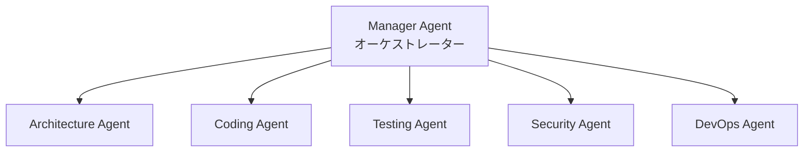
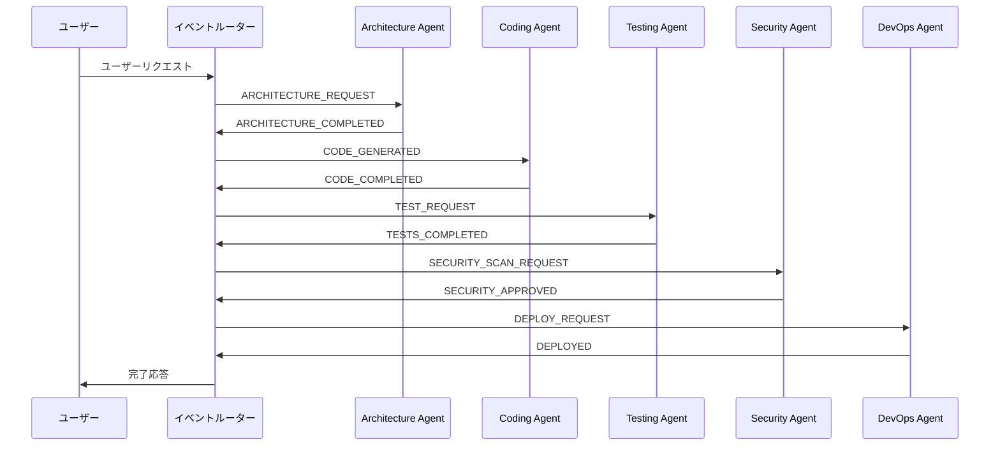
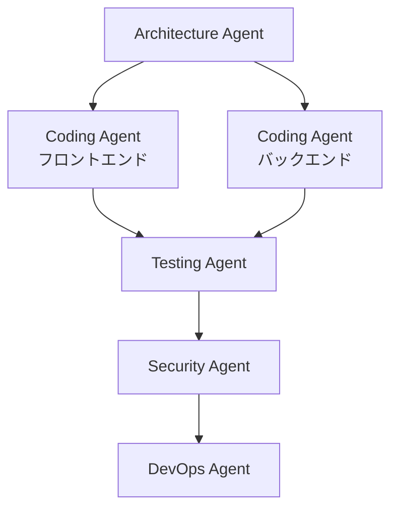
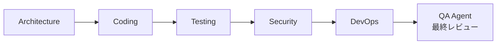

## マルチエージェント時代の到来

2025年、AI開発は新たな転換点を迎えました。単一のAIエージェントがすべてのタスクを処理する時代から、<strong>複数の専門エージェントが協業するマルチエージェントシステム</strong>へと進化しています。

1人の開発者が5つの専門エージェントをオーケストレーションしてフルスタックアプリケーションを構築する、これが今日の現実です。

### なぜマルチエージェントなのか?

<strong>単一エージェントの限界</strong>:
- コンテキストウィンドウ制限(1つのAIがすべてを記憶できない)
- 専門性不足(すべてのドメインに精通できない)
- 並列処理不可(一度に1つのタスクのみ実行)

<strong>マルチエージェントの強み</strong>:
- <strong>分業と専門化</strong>: 各エージェントが特定領域に集中
- <strong>並列実行</strong>: 複数タスクを同時処理
- <strong>拡張性</strong>: 新エージェント追加で機能拡張可能
- <strong>復元力</strong>: 1つのエージェント失敗がシステム全体に影響しない

実際、トヨタはマルチエージェントシステムで<strong>年間10,000時間以上削減</strong>、eコマースAPIプロジェクトでは<strong>バグ70%減少、リファクタリング時間75%短縮</strong>という成果を達成しました。

## 5つの専門エージェントアーキテクチャ

フルスタックアプリケーション開発のための理想的なエージェント構成:

### 1. Architecture Agent(アーキテクトエージェント)

<strong>役割</strong>: システム設計と構造決定

<strong>主な責務</strong>:
- システムアーキテクチャ設計(マイクロサービス、モノリシック、サーバーレスなど)
- データベーススキーマ設計
- 技術スタック選定
- コンポーネント間インターフェース定義
- スケーラビリティとパフォーマンス考慮事項

<strong>出力例</strong>:
````markdown
## システムアーキテクチャ

### 技術スタック
- フロントエンド: React 18 + TypeScript
- バックエンド: Node.js (Express) + TypeScript
- データベース: PostgreSQL 15 + Redis(キャッシング)
- インフラ: AWS (ECS Fargate, RDS, ElastiCache)

### コンポーネント構造
```
frontend/
├── components/       # Reactコンポーネント
├── hooks/           # カスタムフック
├── services/        # APIクライアント
└── store/           # 状態管理 (Zustand)

backend/
├── domain/          # ビジネスロジック
├── application/     # ユースケース
├── infrastructure/  # DB、外部API
└── presentation/    # RESTコントローラー
```

### データベーススキーマ
```sql
CREATE TABLE users (
  id UUID PRIMARY KEY,
  email VARCHAR(255) UNIQUE NOT NULL,
  created_at TIMESTAMP DEFAULT NOW()
);

CREATE TABLE posts (
  id UUID PRIMARY KEY,
  user_id UUID REFERENCES users(id),
  title VARCHAR(255) NOT NULL,
  content TEXT,
  published_at TIMESTAMP
);
```
````

### 2. Coding Agent(コーディングエージェント)

<strong>役割</strong>: コード実装と生成

<strong>主な責務</strong>:
- Architecture Agentの設計を実際のコードに実装
- ビジネスロジック作成
- APIエンドポイント実装
- フロントエンドコンポーネント開発
- コードレビューとリファクタリング

<strong>実際の成果</strong>:
- <strong>実装時間35%短縮</strong>(プロ開発者対象研究)
- <strong>欠陥率27%減少</strong>

<strong>実装例</strong>:
```typescript
// Architecture Agent設計 → Coding Agent実装

// domain/user.entity.ts
export class User {
  constructor(
    public readonly id: string,
    public readonly email: string,
    public readonly createdAt: Date
  ) {}

  static create(email: string): User {
    return new User(
      crypto.randomUUID(),
      email,
      new Date()
    );
  }
}

// application/user.service.ts
export class UserService {
  constructor(private userRepository: UserRepository) {}

  async createUser(email: string): Promise<User> {
    const existingUser = await this.userRepository.findByEmail(email);
    if (existingUser) {
      throw new Error('ユーザーが既に存在します');
    }

    const user = User.create(email);
    await this.userRepository.save(user);
    return user;
  }
}

// presentation/user.controller.ts
export class UserController {
  constructor(private userService: UserService) {}

  async create(req: Request, res: Response) {
    try {
      const { email } = req.body;
      const userId = req.user!.id; // 認証ミドルウェアから注入

      const user = await this.userService.createUser(email);
      res.status(201).json(user);
    } catch (error) {
      res.status(400).json({ error: error.message });
    }
  }
}
```

### 3. Testing Agent(テストエージェント)

<strong>役割</strong>: 自動テスト作成と品質保証

<strong>主な責務</strong>:
- ユニットテスト生成
- 統合テスト作成
- E2Eテストシナリオ実装
- テストカバレッジ分析
- バグ検出と報告

<strong>テスト例</strong>:
```typescript
// user.service.test.ts
describe('UserService', () => {
  let userService: UserService;
  let mockRepository: jest.Mocked<UserRepository>;

  beforeEach(() => {
    mockRepository = {
      findByEmail: jest.fn(),
      save: jest.fn(),
    } as any;
    userService = new UserService(mockRepository);
  });

  describe('createUser', () => {
    it('新しいユーザーを正常に作成する', async () => {
      const email = 'test@example.com';
      mockRepository.findByEmail.mockResolvedValue(null);
      mockRepository.save.mockResolvedValue(undefined);

      const user = await userService.createUser(email);

      expect(user.email).toBe(email);
      expect(mockRepository.save).toHaveBeenCalledWith(
        expect.objectContaining({ email })
      );
    });

    it('ユーザーが既に存在する場合はエラーをスロー', async () => {
      const email = 'existing@example.com';
      const existingUser = User.create(email);
      mockRepository.findByEmail.mockResolvedValue(existingUser);

      await expect(userService.createUser(email)).rejects.toThrow(
        'ユーザーが既に存在します'
      );
    });

    it('ユーザーIDに有効なUUIDを生成', async () => {
      mockRepository.findByEmail.mockResolvedValue(null);
      const user = await userService.createUser('test@example.com');

      expect(user.id).toMatch(
        /^[0-9a-f]{8}-[0-9a-f]{4}-4[0-9a-f]{3}-[89ab][0-9a-f]{3}-[0-9a-f]{12}$/i
      );
    });
  });
});

// 統合テスト
describe('User API統合テスト', () => {
  it('POST /users でユーザーを作成し201を返す', async () => {
    const response = await request(app)
      .post('/users')
      .send({ email: 'integration@test.com' })
      .expect(201);

    expect(response.body).toMatchObject({
      email: 'integration@test.com',
      id: expect.any(String),
      createdAt: expect.any(String)
    });
  });
});
```

### 4. Security Agent(セキュリティエージェント)

<strong>役割</strong>: セキュリティ脆弱性検出と防御

<strong>主な責務</strong>:
- コードセキュリティスキャン
- 脆弱性検出(SQLインジェクション、XSS、CSRFなど)
- 規制準拠検証(GDPR、HIPAA)
- セキュリティ推奨事項提供
- 脅威分析と緩和戦略

<strong>セキュリティチェックリスト例</strong>:
````markdown
## セキュリティチェックリスト

### 入力検証
- [x] すべてのユーザー入力を検証(Joi/Zodスキーマ)
- [x] SQLインジェクション防止(パラメータ化クエリ)
- [x] XSS防止(入力サニタイゼーション)
- [x] ファイルアップロード検証(MIMEタイプ、サイズ制限)

### 認証と認可
- [x] パスワードハッシング(bcrypt、コスト係数12)
- [x] JWTトークン有効期限設定(アクセス15分、リフレッシュ7日)
- [x] レート制限(IP当たり15分で100回)
- [x] HTTPS強制(本番環境)

### データ保護
- [x] 環境変数で秘密鍵管理
- [x] データベース暗号化(保存時、転送時)
- [x] CORSホワイトリスト設定
- [x] 機密情報ロギング防止

### コンプライアンス
- [x] GDPR: ユーザーデータ削除API
- [x] ログ保管ポリシー(90日)
- [x] プライバシーポリシー更新
````

<strong>脆弱性レポート例</strong>:
```typescript
// ❌ Security Agentが検出した脆弱性
app.get('/user/:id', (req, res) => {
  const query = `SELECT * FROM users WHERE id = '${req.params.id}'`;
  // SQLインジェクションリスク!
  db.query(query, (err, result) => {
    res.json(result);
  });
});

// ✅ Security Agentが提案した修正
app.get('/user/:id', async (req, res) => {
  const { id } = req.params;

  // 入力検証
  const schema = Joi.object({
    id: Joi.string().uuid().required()
  });
  const { error } = schema.validate({ id });
  if (error) {
    return res.status(400).json({ error: '無効なユーザーID' });
  }

  // パラメータ化クエリ
  const result = await db.query(
    'SELECT * FROM users WHERE id = $1',
    [id]
  );
  res.json(result.rows[0]);
});
```

### 5. DevOps Agent(DevOpsエージェント)

<strong>役割</strong>: CI/CD、デプロイ、モニタリング

<strong>主な責務</strong>:
- CI/CDパイプライン構成
- インフラプロビジョニング(Terraform、CloudFormation)
- コンテナ化(Docker、Kubernetes)
- モニタリングとアラート設定
- パフォーマンス最適化

<strong>実際の成果</strong>: 化学産業事例で<strong>品質失敗30%減少</strong>

<strong>CI/CDパイプライン例</strong>:
```yaml
# .github/workflows/deploy.yml
name: 本番環境デプロイ

on:
  push:
    branches: [main]

jobs:
  test:
    runs-on: ubuntu-latest
    steps:
      - uses: actions/checkout@v3
      - name: テスト実行
        run: |
          npm ci
          npm test -- --coverage
          # Testing Agentが生成したテストを実行

  security:
    runs-on: ubuntu-latest
    steps:
      - uses: actions/checkout@v3
      - name: セキュリティスキャン
        run: |
          npm audit
          # Security Agentが定義したセキュリティチェック
          npx snyk test

  build:
    needs: [test, security]
    runs-on: ubuntu-latest
    steps:
      - uses: actions/checkout@v3
      - name: Dockerイメージビルド
        run: |
          docker build -t myapp:${{ github.sha }} .
          docker push myapp:${{ github.sha }}

  deploy:
    needs: build
    runs-on: ubuntu-latest
    steps:
      - name: ECSにデプロイ
        run: |
          aws ecs update-service \
            --cluster production \
            --service myapp \
            --force-new-deployment

      - name: ヘルスチェック
        run: |
          # DevOps Agentが定義したヘルスチェック
          for i in {1..30}; do
            if curl -f https://api.example.com/health; then
              echo "デプロイ成功"
              exit 0
            fi
            sleep 10
          done
          echo "デプロイ失敗"
          exit 1
```

## エージェントオーケストレーションパターン

### 1. 階層的オーケストレーション(Hierarchical)

<strong>構造</strong>: Managerエージェントが5つの専門エージェントを調整



<strong>利点</strong>:
- 明確な指揮構造
- 集中的な進捗追跡
- デバッグ容易

<strong>適している場合</strong>:
- タスクを明確に分解できる場合
- 中央監視が必要な場合
- チームが構造化ワークフローを好む場合

<strong>実装例</strong>(LangGraph使用):
```python
from langgraph.graph import StateGraph, END

# 状態定義
class AppState(TypedDict):
    requirements: str
    architecture: dict
    code: dict
    tests: dict
    security_report: dict
    deployment_config: dict

# グラフ作成
workflow = StateGraph(AppState)

# ノード追加(各ノード = エージェント)
workflow.add_node("architect", architecture_agent)
workflow.add_node("coder", coding_agent)
workflow.add_node("tester", testing_agent)
workflow.add_node("security", security_agent)
workflow.add_node("devops", devops_agent)

# エッジ追加(タスクフロー)
workflow.add_edge("architect", "coder")
workflow.add_edge("coder", "tester")
workflow.add_edge("tester", "security")
workflow.add_edge("security", "devops")
workflow.add_edge("devops", END)

# 開始点設定
workflow.set_entry_point("architect")

# 実行
app = workflow.compile()
result = app.invoke({
    "requirements": "ユーザー管理のREST APIを構築"
})
```

### 2. イベント駆動アーキテクチャ(Event-Driven)

<strong>構造</strong>: エージェント間の非同期イベントストリーミング

<strong>利点</strong>:
- サービス分離(各エージェントはイベントルーターのみ認識)
- 障害隔離(1つのエージェント失敗が伝播しない)
- スケーラブルな調整
- リアルタイム処理

<strong>イベントフロー例</strong>:


<strong>Redis Streams実装</strong>:
```typescript
import Redis from 'ioredis';

const redis = new Redis();

// Architecture Agent: イベント公開
async function publishArchitectureComplete(architecture: any) {
  await redis.xadd(
    'agent-events',
    '*',
    'type', 'ARCHITECTURE_COMPLETED',
    'data', JSON.stringify(architecture),
    'timestamp', Date.now().toString()
  );
}

// Coding Agent: イベント購読
async function listenForArchitecture() {
  const consumer = redis.duplicate();

  // コンシューマグループ作成
  await consumer.xgroup(
    'CREATE', 'agent-events', 'coding-group', '0', 'MKSTREAM'
  ).catch(() => {}); // 既存の場合は無視

  while (true) {
    const events = await consumer.xreadgroup(
      'GROUP', 'coding-group', 'coder-1',
      'BLOCK', 5000,
      'STREAMS', 'agent-events', '>'
    );

    if (!events) continue;

    for (const [stream, messages] of events) {
      for (const [id, fields] of messages) {
        const event = parseEvent(fields);

        if (event.type === 'ARCHITECTURE_COMPLETED') {
          await generateCode(event.data);
          await redis.xack('agent-events', 'coding-group', id);
        }
      }
    }
  }
}
```

### 3. グラフベースオーケストレーション

<strong>構造</strong>: DAG(有向非巡回グラフ)で依存関係を表現

<strong>利点</strong>:
- 視覚的ワークフロー表現
- 並列タスク実行可能
- 明確な依存関係管理

<strong>並列実行例</strong>:


## エージェント間通信プロトコル

### Model Context Protocol (MCP)

<strong>開発</strong>: Anthropic(2024年オープンソース)、OpenAI公式採用(2025年3月)

<strong>目的</strong>: エージェント↔ツール/メモリ間の垂直通信

<strong>特徴</strong>:
- JSON-RPCクライアント-サーバーインターフェース
- セキュアなコンテキスト注入
- 構造化ツール呼び出し
- リソース管理
- アクセス制御強制

<strong>使用例</strong>:
```json
// MCPリクエスト: Coding Agent → データベースツール
{
  "jsonrpc": "2.0",
  "id": 1,
  "method": "tools/call",
  "params": {
    "name": "database_query",
    "arguments": {
      "query": "SELECT * FROM users WHERE id = $1",
      "params": ["user-123"]
    }
  }
}

// MCPレスポンス
{
  "jsonrpc": "2.0",
  "id": 1,
  "result": {
    "content": [
      {
        "type": "text",
        "text": "{\"id\": \"user-123\", \"email\": \"test@example.com\"}"
      }
    ]
  }
}
```

<strong>グローバル採用率</strong>: 2025年時点で<strong>世界の組織の78%がMCPまたはA2Aプロトコルを使用</strong>

### Agent-to-Agent Protocol (A2A)

<strong>目的</strong>: エージェント↔エージェント間の水平通信

<strong>違い</strong>:
- MCP: エージェントがツールやメモリにアクセスする時
- A2A: エージェント同士が直接通信する時

<strong>A2Aメッセージ例</strong>:
```json
// Architecture Agent → Coding Agent
{
  "from": "architecture-agent",
  "to": "coding-agent",
  "type": "TASK_ASSIGNMENT",
  "payload": {
    "task_id": "impl-user-api",
    "architecture": {
      "pattern": "clean-architecture",
      "layers": ["domain", "application", "infrastructure", "presentation"],
      "database": "postgresql"
    },
    "deadline": "2025-10-17T10:00:00Z"
  },
  "metadata": {
    "priority": "high",
    "confidence_score": 0.95
  }
}

// Coding Agent → Architecture Agent(完了通知)
{
  "from": "coding-agent",
  "to": "architecture-agent",
  "type": "TASK_COMPLETED",
  "payload": {
    "task_id": "impl-user-api",
    "files_created": [
      "src/domain/user.entity.ts",
      "src/application/user.service.ts",
      "src/infrastructure/user.repository.ts",
      "src/presentation/user.controller.ts"
    ],
    "status": "success"
  }
}
```

## エラー処理と復元力

### 1. Fallback戦略

<strong>3段階Fallback</strong>:
```typescript
async function executeWithFallback(task: Task) {
  try {
    // Level 1: 基本LLM(GPT-4)
    return await primaryAgent.execute(task);
  } catch (error) {
    console.warn('プライマリエージェント失敗、フォールバック試行');

    try {
      // Level 2: 代替LLM(Claude)
      return await fallbackAgent.execute(task);
    } catch (fallbackError) {
      // Level 3: Human-in-the-Loop
      return await escalateToHuman(task, [error, fallbackError]);
    }
  }
}
```

### 2. 段階的ロールアウト(Canaryデプロイ)

<strong>エージェントデプロイ戦略</strong>:
```yaml
# Canaryデプロイ: 5% → 50% → 100%
deployment:
  strategy: canary
  steps:
    - percentage: 5
      duration: 1h
      metrics:
        - error_rate < 1%
        - response_time < 200ms

    - percentage: 50
      duration: 2h
      metrics:
        - error_rate < 0.5%
        - user_satisfaction > 4.5/5

    - percentage: 100
      # すべてのメトリクス通過時のみ全体ロールアウト
```

### 3. Circuit Breakerパターン

<strong>エージェント間障害伝播防止</strong>:
```typescript
class CircuitBreaker {
  private failureCount = 0;
  private lastFailureTime: number | null = null;
  private state: 'CLOSED' | 'OPEN' | 'HALF_OPEN' = 'CLOSED';

  async call(agent: Agent, task: Task) {
    if (this.state === 'OPEN') {
      if (Date.now() - this.lastFailureTime! > 60000) {
        // 1分後に再試行
        this.state = 'HALF_OPEN';
      } else {
        throw new Error('サーキットブレーカーがOPEN状態です');
      }
    }

    try {
      const result = await agent.execute(task);
      this.onSuccess();
      return result;
    } catch (error) {
      this.onFailure();
      throw error;
    }
  }

  private onSuccess() {
    this.failureCount = 0;
    this.state = 'CLOSED';
  }

  private onFailure() {
    this.failureCount++;
    this.lastFailureTime = Date.now();

    if (this.failureCount >= 5) {
      this.state = 'OPEN';
      console.error('5回の失敗後、サーキットブレーカーがオープン');
    }
  }
}
```

## ベストプラクティス

### 1. エージェント責任分離

<strong>原則</strong>: 各エージェントは単一ドメインに集中

````markdown
✅ 良い例:
- Architecture Agent: システム設計のみ
- Coding Agent: コード実装のみ
- Testing Agent: テストのみ

❌ 悪い例:
- 万能Agent: 設計 + コーディング + テスト + デプロイ全部
````

<strong>メリット</strong>:
- 複雑度削減
- デバッグ容易
- コンテキストウィンドウオーバーロード防止
- より堅牢なシステム

### 2. QAステージ追加

<strong>最終レビュー段階</strong>:


<strong>QA Agentの役割</strong>:
- すべてのエージェント出力をレビュー
- 一貫性検証
- 品質基準充足確認
- 問題発見時は該当エージェントへ再作業依頼

### 3. Human-in-the-Loop統合

<strong>人間が介入すべきタイミング</strong>

| 状況 | HITL必要性 | 理由 |
|------|----------|------|
| 単純なCRUD API実装 | ❌ | 完全自動化可能 |
| 複雑なビジネスロジック決定 | ✅ | ドメイン専門家判断必要 |
| セキュリティ脆弱性修正 | ✅ | 重要なセキュリティ決定 |
| 一般的テスト作成 | ❌ | 自動化可能 |
| 本番デプロイ承認 | ✅ | 最終レビュー必要 |
| インフラ変更 | ✅ | コストと影響考慮 |

<strong>実装例</strong>:
```typescript
async function deployToProduction(deployment: Deployment) {
  // DevOps Agentがデプロイ計画生成
  const plan = await devopsAgent.createDeploymentPlan(deployment);

  // Human approval リクエスト
  const approval = await requestHumanApproval({
    title: '本番環境デプロイ承認',
    plan: plan,
    estimatedDowntime: '0分',
    risks: ['データベースマイグレーション', '設定変更'],
    rollbackPlan: plan.rollbackStrategy
  });

  if (!approval.approved) {
    throw new Error(`デプロイ拒否: ${approval.reason}`);
  }

  // 承認後デプロイ実行
  return await devopsAgent.execute(plan);
}
```

### 4. 可観測性(Observability)

<strong>5つの必須観測領域</strong>(Microsoft Azure推奨):

1. <strong>包括的ロギング</strong>:
```typescript
class AgentLogger {
  log(agent: string, event: string, data: any) {
    console.log(JSON.stringify({
      timestamp: new Date().toISOString(),
      agent: agent,
      event: event,
      data: data,
      trace_id: getTraceId()
    }));
  }
}

// 使用
logger.log('coding-agent', 'task-started', {
  task_id: 'impl-user-api',
  estimated_duration: '5m'
});
```

2. <strong>パフォーマンスメトリクス</strong>:
```typescript
const metrics = {
  agent_execution_time: new Histogram({
    name: 'agent_execution_seconds',
    help: 'エージェント実行時間',
    labelNames: ['agent_name', 'task_type']
  }),

  agent_errors: new Counter({
    name: 'agent_errors_total',
    help: '総エージェントエラー数',
    labelNames: ['agent_name', 'error_type']
  })
};

// 使用
const timer = metrics.agent_execution_time.startTimer({
  agent_name: 'coding-agent',
  task_type: 'generate-code'
});

try {
  await codingAgent.execute(task);
} catch (error) {
  metrics.agent_errors.inc({
    agent_name: 'coding-agent',
    error_type: error.constructor.name
  });
} finally {
  timer();
}
```

3. <strong>品質と安全基準検証</strong>
4. <strong>規制準拠監視</strong>
5. <strong>ユーザーエクスペリエンス最適化</strong>

## 将来展望

### 2025年: 「エージェンティックAIの年」

業界リーダーの合意: <strong>2025年はエージェンティックAIの年</strong>

<strong>主要トレンド</strong>:

1. <strong>兆単位の市場機会</strong>
   - AIソフトウェア開発スタック: 兆ドル規模市場
   - 世界中の3000万開発者がAIコーディングアシスタントを使用
   - 生産性向上で世界GDPに兆単位の価値創出

2. <strong>プロトタイプから本番環境へ</strong>
   - 2023-2024: 生成AI(GPT、画像生成)
   - 2025+: 自律エージェンティックシステム(実業務自動化)

3. <strong>プロトコル標準化</strong>
   - <strong>グローバル組織の78%</strong>がMCPまたはA2Aプロトコルを使用
   - 業界全体の相互運用性

4. <strong>Sovereign AI</strong>
   - データ主権と地政学的復元力
   - 自律エージェントの規制準拠と監査可能性
   - 重要インフラ展開

5. <strong>自己修復システム(Self-Healing)</strong>
   - 自律的エラー検出と復旧
   - 適応型システム復元力
   - 人間介入なしで問題解決

### 開発者役割の再定義

<strong>Before(従来の開発)</strong>:
- コード作成70% + 設計20% + テスト10%

<strong>After(エージェントオーケストレーション)</strong>:
- 要件定義30% + エージェント管理40% + 検証20% + 最適化10%

<strong>コアスキルの変化</strong>:

| 従来スキル | 重要度 | 新しいコアスキル |
|-----------|-------|------------------|
| コーディング速度 | ↓↓ | 要件明確化 |
| 文法知識 | ↓ | システムアーキテクチャ |
| デバッグ | → | エージェントプロンプトエンジニアリング |
| アルゴリズム | → | マルチエージェントオーケストレーション |
| コードレビュー | ↓ | エージェント出力検証 |

## 始め方

### 1週目: フレームワーク選択と学習

```bash
# LangGraphインストール(推奨: 本番システム)
pip install langgraph langchain-openai

# またはCrewAI(推奨: 迅速なプロトタイピング)
pip install crewai langchain-openai

# 環境変数設定
export OPENAI_API_KEY="your-api-key"
```

<strong>学習資料</strong>:
- [LangGraph公式チュートリアル](https://blog.langchain.com/langgraph-multi-agent-workflows/)
- [CrewAI GitHub](https://github.com/crewAIInc/crewAI)

### 2週目: 小規模プロジェクト実装

<strong>推奨スタートプロジェクト</strong>:
- シンプルなREST API(2-3エンドポイント)
- Architecture Agent + Coding Agentのみ使用
- 手動テストとデプロイ

### 3週目: 完全パイプライン拡張

<strong>5エージェント統合</strong>:
- Testing Agent追加 → 自動テスト
- Security Agent追加 → セキュリティスキャン
- DevOps Agent追加 → CI/CDパイプライン

### 1ヶ月後: 本番投入

<strong>成果測定</strong>:
- 開発速度向上率
- バグ減少率
- テストカバレッジ
- チーム満足度

## 結論

マルチエージェントシステムはもはや未来ではありません。<strong>今すぐ適用できる現実</strong>です。

<strong>重要ポイント</strong>:
1. <strong>5つの専門エージェント</strong>: Architecture、Coding、Testing、Security、DevOps
2. <strong>オーケストレーションパターン</strong>: 階層的、イベント駆動、グラフベース
3. <strong>通信プロトコル</strong>: MCP(ツールアクセス)、A2A(エージェント間通信)
4. <strong>復元力</strong>: Fallback、Circuit Breaker、Canaryデプロイ
5. <strong>ベストプラクティス</strong>: 責任分離、QAステージ、HITL、可観測性

<strong>実際の成果</strong>:
- トヨタ: <strong>年間10,000時間節約</strong>
- eコマースAPI: <strong>バグ70%減少、リファクタリング75%短縮</strong>
- プロ開発者: <strong>実装時間35%短縮、欠陥27%減少</strong>

5つのAIエージェントをオーケストレーションして、1人でもフルスタックアプリケーションを構築できる新時代が到来しました。

## 参考資料

### 公式ドキュメント
- [LangGraph Multi-Agent Workflows](https://blog.langchain.com/langgraph-multi-agent-workflows/)
- [Microsoft Agent Framework](https://azure.microsoft.com/en-us/blog/introducing-microsoft-agent-framework/)
- [AWS Multi-Agent Orchestration](https://aws.amazon.com/solutions/guidance/multi-agent-orchestration-on-aws/)

### フレームワーク比較
- [LangGraph vs AutoGen vs CrewAI比較](https://www.datagrom.com/data-science-machine-learning-ai-blog/langgraph-vs-autogen-vs-crewai-comparison-agentic-ai-frameworks)
- [Nuvi: AIエージェントフレームワーク比較](https://www.nuvi.dev/blog/ai-agent-framework-comparison-langgraph-crewai-openai-swarm)

### 実践事例
- [Google Cloud: 101 Gen AI使用事例](https://cloud.google.com/transform/101-real-world-generative-ai-use-cases-from-industry-leaders)
- [McKinsey: エージェンティックAI優位性の確保](https://www.mckinsey.com/capabilities/quantumblack/our-insights/seizing-the-agentic-ai-advantage)

### 学術論文
- [AgentOrchestra: 階層的マルチエージェントフレームワーク](https://arxiv.org/html/2506.12508v1)
- [エージェント相互運用性プロトコルサーベイ](https://arxiv.org/html/2505.02279v1)
- [マルチエージェント協業メカニズム](https://arxiv.org/html/2501.06322v1)

---

<strong>次回記事</strong>: [自己修復AIシステム: 人間介入なしで自動的にバグを修正するエージェント構築](/ja/blog/ja/self-healing-ai-systems)では、2025年のコアトレンドであるSelf-Healing Systemsの実装方法を実践コードと共にご紹介します。
