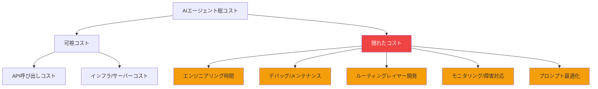
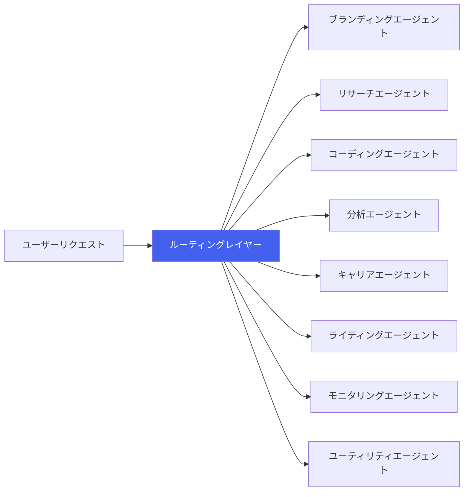
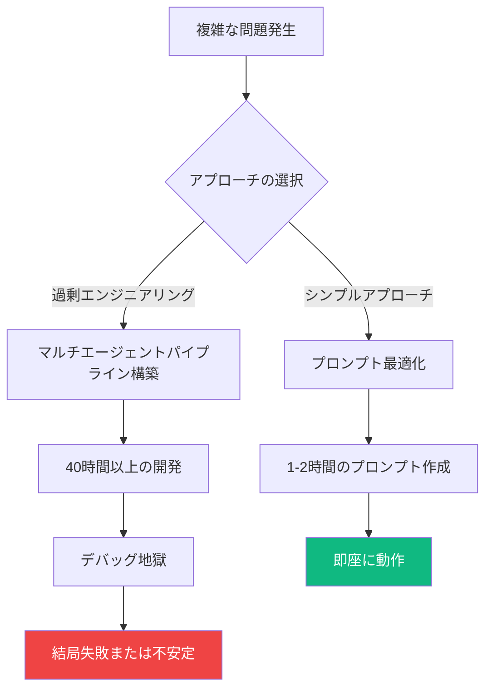

## AIエージェントは魔法ではない

AIエージェントへの期待が爆発的に高まっています。「エージェントに任せれば人件費を削減できる」という話が溢れていますが、実際にAIエージェント8体を運用している立場から申し上げると、**現実はそんなに単純ではありません**。

この記事では、AIエージェントの実際の運用コストをデータに基づいて分析し、「AIエージェントは魔法ではなくトレードオフ」という観点から率直な経験を共有します。

## 衝撃的なデータ：AIモデレーション vs 人間モデレーション

最近、英語圏で話題になった分析があります。AIエージェントを使った自律モデレーションのコスト構造を計算したもので、その結果は驚くべきものでした。

| 項目 | AIエージェントモデレーション | 人間モデレーター |
|------|---------------------------|----------------|
| **月間コスト** | $1,350 〜 $2,250 | 〜$1,200 |
| **24時間稼働** | ✅ 可能 | ❌ シフト制が必要 |
| **判断の一貫性** | 高い（プロンプト依存） | 変動あり |
| **コンテキスト理解** | 限定的 | 高い |
| **初期構築コスト** | 高い | 低い |

核心はこれです：**API呼び出しコストだけで人間のモデレーター人件費を超える可能性があります**。24時間自律運用、大量処理、複雑な判断が必要になれば、コストはさらに上がります。

## 8体AIエージェント運用の現実：コスト構造の解剖

私は現在8体のAIエージェントを実際に運用しています。各エージェントはブランディング、リサーチ、コーディング、分析など専門的な役割を担っています。この経験から実感したコスト構造を共有します。

### 1. APIコスト：氷山の一角

```
月間APIコスト内訳（例）
├── Claude API（主力モデル）     : 〜$150-300/月
├── GPT-4 API（補助モデル）      : 〜$50-100/月
├── 画像生成API                  : 〜$20-50/月
├── 検索/スクレイピングAPI       : 〜$30-60/月
└── その他（埋め込み、TTS等）    : 〜$20-40/月
────────────────────────────────────
合計                             : 〜$270-550/月
```

APIコストだけ見ると「安いな」と思うかもしれません。しかし、これは氷山の一角に過ぎません。

### 2. 隠れたコスト：本当にお金がかかるところ



実際のコスト構造はこのようになっています：

| コスト項目 | 月間推定 | 備考 |
|-----------|----------|------|
| APIコスト | $270-550 | 使用量に比例 |
| インフラ（サーバー、DB） | $50-100 | 固定費 |
| エンジニアリング時間 | **$500-2,000+** | 最大のコスト |
| 障害対応/デバッグ | $200-500 | 予測不可 |
| **合計** | **$1,020-3,150+** | |

**エンジニアリング時間が圧倒的に最大のコストです。** これを見落とすとコスト計算が完全に狂います。

## ルーティングレイヤー：最大の難関

8体AIエージェント運用で最も難しくコストがかかる部分は**ルーティングレイヤー**です。



ルーティングレイヤーが解決すべき問題：

- **意図分類**：ユーザーリクエストをどのエージェントに振り分けるか？
- **コンテキスト伝達**：エージェント間の状態をどう共有するか？
- **エラー処理**：エージェントが失敗した場合のリカバリー方法は？
- **コスト最適化**：高価なモデルと安価なモデルをどう使い分けるか？

このルーティングレイヤーの構築と安定化にかかる時間が、他のすべてのコストを合算したものより大きいのです。

## 過剰エンジニアリングの罠：40時間 vs 1プロンプト

AIエージェント開発で最も痛い教訓があります。

> **複雑なエージェントパイプラインを40時間かけて構築したが失敗。結局、よく書かれた1つのプロンプトで解決。**

これは私だけの経験ではありません。AIエージェントコミュニティで繰り返し報告されているパターンです：



### 過剰エンジニアリングのチェックリスト

こんな兆候が見えたら一歩引くべきです：

- ✅ 「エージェントがエージェントを呼ぶ」3段階以上のチェーンを設計している
- ✅ エージェント間通信プロトコルを作っている
- ✅ 単純なif-elseで解決できる問題にLLMを使っている
- ✅ プロンプト一つでテストせずにアーキテクチャから設計している

**Rule of Thumb**：まず単一プロンプトで試し、それが失敗した時だけエージェントに分離しましょう。

## ではAIエージェントはいつ役に立つのか？

コストだけ見ると「人を雇った方がいい」と思うかもしれません。しかし、AIエージェントが明確に優位な領域があります：

| AIエージェントが有利な場合 | 人間が有利な場合 |
|--------------------------|----------------|
| 24時間無停止処理が必要 | 複雑な文脈判断が必要 |
| 大量の定型作業の繰り返し | 創造的/感性的判断が必要 |
| 高速レスポンスが核心 | ステークホルダーの説得が必要 |
| 一貫した基準の適用が必須 | 例外状況への対応 |
| 個人の生産性拡張（1人チーム） | チーム協業/コミュニケーション |

特に**個人開発者や小規模チームで個人の生産性を拡張**する用途では、AIエージェントが圧倒的に効果的です。私の8体エージェントもこの目的で運用しており、「人を代替する」ではなく「一人でできる範囲を広げる」という観点が核心です。

## 実践コスト最適化のヒント

8体運用の経験から得たコスト最適化戦略を共有します：

### 1. モデルティアリング戦略

```
タスク複雑度別モデル配分：
├── 高複雑度（10%）: Claude Opus / GPT-4 → アーキテクチャ決定、複雑な分析
├── 中複雑度（30%）: Claude Sonnet / GPT-4o → コード生成、ドキュメント作成
└── 低複雑度（60%）: Claude Haiku / GPT-4o-mini → 分類、要約、フォーマッティング
```

この戦略だけでAPIコストを**40-60%削減**できます。

### 2. キャッシングとバッチ処理

- 同一プロンプトパターンの結果はキャッシング
- リアルタイム処理が不要なタスクはバッチでまとめて処理
- 埋め込み結果は必ずキャッシング（再計算コストが大きい）

### 3. 失敗コストの最小化

- タイムアウトとリトライロジックを必ず実装
- 高価なモデル呼び出し前に安価なモデルで事前検証
- エージェント失敗時のgraceful degradationを設計

## 結論：トレードオフを認識せよ

AIエージェントは魔法ではありません。**明確なトレードオフが存在するエンジニアリングツール**です。

核心的な教訓をまとめると：

1. **APIコストは総コストの一部に過ぎません。** エンジニアリング時間、メンテナンス、障害対応まで含めなければなりません。
2. **ルーティングレイヤーが最大の技術的難関です。** マルチエージェントシステムの本当の難しさは個別エージェントではなくオーケストレーションにあります。
3. **過剰エンジニアリングを警戒しましょう。** 40時間の複雑なパイプラインより1つのよく書かれたプロンプトの方が良い場合があります。
4. **用途に合わせて使いましょう。** 個人の生産性拡張には卓越していますが、単純な人件費代替目的ではコストが上回る可能性があります。

AIエージェントの導入を検討している方へ一言：**まず小さなプロンプトから始めて、必要な時だけエージェントに拡張しましょう。** それが8体のエージェントを運用して得た最も価値ある教訓です。

## 参考資料

- [AI Content Moderation Cost Analysis](https://www.getrevue.co/) — AIモデレーションコスト $1,350-2,250/月の分析
- [Anthropic Claude API Pricing](https://www.anthropic.com/pricing) — Claudeモデル別価格情報
- [OpenAI API Pricing](https://openai.com/pricing) — GPTモデル別価格情報
- [Building Effective Agents - Anthropic](https://docs.anthropic.com/en/docs/build-with-claude/agents) — エージェント設計パターンガイド
