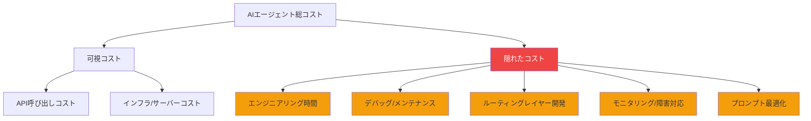
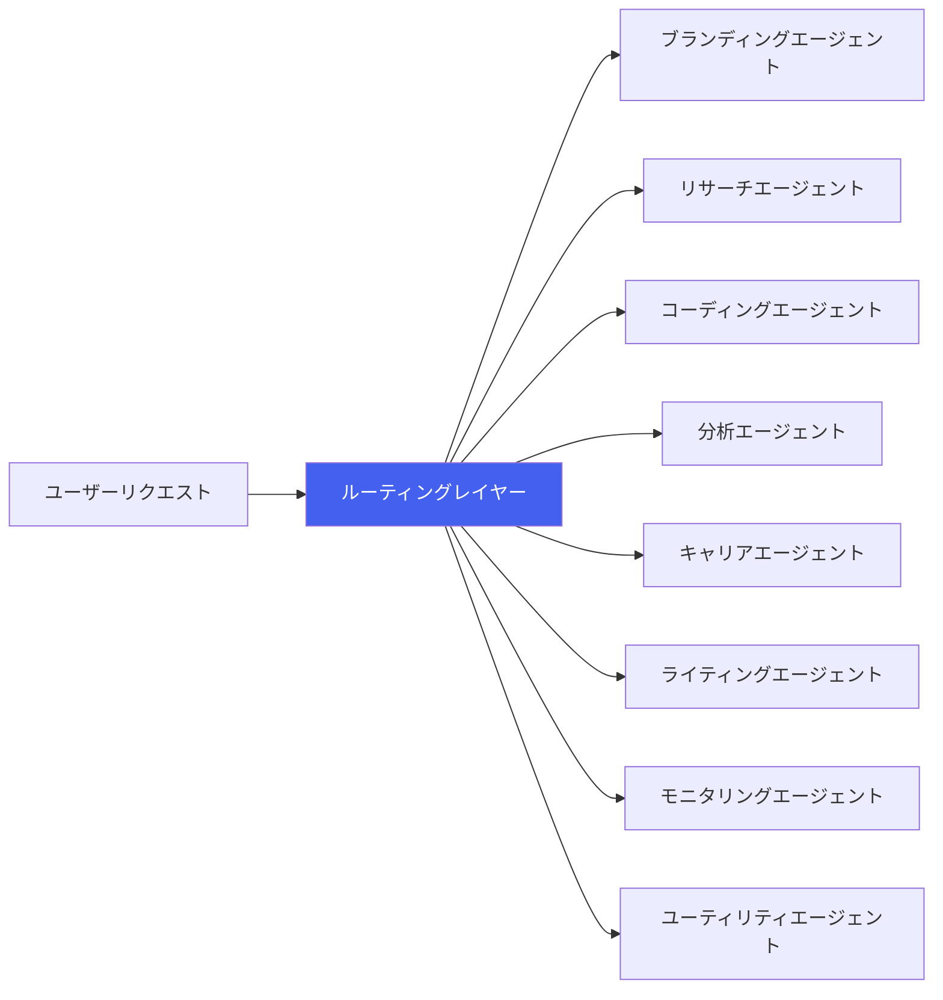
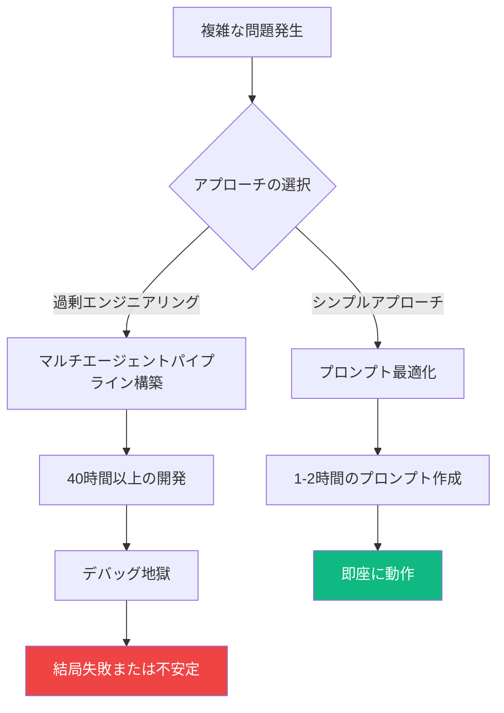

## AIエージェントは魔法ではない

AIエージェントへの期待が爆発的に高まっています。「エージェントに任せれば人件費を削減できる」という話が溢れていますが、実際にAIエージェント8体を運用している立場から申し上げると、<strong>現実はそんなに単純ではありません</strong>。

そこで、数字を直接見てみました。8体を回しながら毎月出ていくコストを項目ごとに分解すると、「エージェントは魔法ではなくトレードオフだ」という言葉が抽象的なスローガンではなく、一枚の請求書として迫ってきます。以下はその請求書を率直に書き起こした記録です。

## 衝撃的なデータ：AIモデレーション vs 人間モデレーション

最近、英語圏で話題になった分析があります。AIエージェントを使った自律モデレーションのコスト構造を計算したもので、その結果は驚くべきものでした。

| 項目 | AIエージェントモデレーション | 人間モデレーター |
|------|---------------------------|----------------|
| <strong>月間コスト</strong> | $1,350 〜 $2,250 | 〜$1,200 |
| <strong>24時間稼働</strong> | ✅ 可能 | ❌ シフト制が必要 |
| <strong>判断の一貫性</strong> | 高い（プロンプト依存） | 変動あり |
| <strong>コンテキスト理解</strong> | 限定的 | 高い |
| <strong>初期構築コスト</strong> | 高い | 低い |

核心はこれです：<strong>API呼び出しコストだけで人間のモデレーター人件費を超える可能性があります</strong>。24時間自律運用、大量処理、複雑な判断が必要になれば、コストはさらに上がります。

## 8体AIエージェント運用の現実：コスト構造の解剖

私は現在8体のAIエージェントを実際に運用しています。各エージェントはブランディング、リサーチ、コーディング、分析など専門的な役割を担っています。この経験から実感したコスト構造を共有します。

### 1. APIコスト：氷山の一角

```
月間APIコスト内訳（例）
├── Claude API（主力モデル）     : 〜$150-300/月
├── GPT-4 API（補助モデル）      : 〜$50-100/月
├── 画像生成API                  : 〜$20-50/月
├── 検索/スクレイピングAPI       : 〜$30-60/月
└── その他（埋め込み、TTS等）    : 〜$20-40/月
────────────────────────────────────
合計                             : 〜$270-550/月
```

APIコストだけ見ると「安いな」と思うかもしれません。しかし、これは氷山の一角に過ぎません。

### 2. 隠れたコスト：本当にお金がかかるところ


```mermaid
graph TD
    A[AIエージェント総コスト] --> B[可視コスト]
    A --> C[隠れたコスト]
    B --> B1[API呼び出しコスト]
    B --> B2[インフラ/サーバーコスト]
    C --> C1[エンジニアリング時間]
    C --> C2[デバッグ/メンテナンス]
    C --> C3[ルーティングレイヤー開発]
    C --> C4[モニタリング/障害対応]
    C --> C5[プロンプト最適化]
    style C fill:#EF4444,color:#fff
    style C1 fill:#F59E0B
    style C2 fill:#F59E0B
    style C3 fill:#F59E0B
    style C4 fill:#F59E0B
    style C5 fill:#F59E0B
```

実際のコスト構造はこのようになっています：

| コスト項目 | 月間推定 | 備考 |
|-----------|----------|------|
| APIコスト | $270-550 | 使用量に比例 |
| インフラ（サーバー、DB） | $50-100 | 固定費 |
| エンジニアリング時間 | <strong>$500-2,000+</strong> | 最大のコスト |
| 障害対応/デバッグ | $200-500 | 予測不可 |
| <strong>合計</strong> | <strong>$1,020-3,150+</strong> | |

<strong>エンジニアリング時間が圧倒的に最大のコストです。</strong> これを見落とすとコスト計算が完全に狂います。

## ルーティングレイヤー：最大の難関

8体AIエージェント運用で最も難しくコストがかかる部分は<strong>ルーティングレイヤー</strong>です。


```mermaid
graph LR
    User[ユーザーリクエスト] --> Router[ルーティングレイヤー]
    Router --> A1[ブランディングエージェント]
    Router --> A2[リサーチエージェント]
    Router --> A3[コーディングエージェント]
    Router --> A4[分析エージェント]
    Router --> A5[キャリアエージェント]
    Router --> A6[ライティングエージェント]
    Router --> A7[モニタリングエージェント]
    Router --> A8[ユーティリティエージェント]
    style Router fill:#4361EE,color:#fff
```

ルーティングレイヤーが解決すべき問題：

- <strong>意図分類</strong>：ユーザーリクエストをどのエージェントに振り分けるか？
- <strong>コンテキスト伝達</strong>：エージェント間の状態をどう共有するか？
- <strong>エラー処理</strong>：エージェントが失敗した場合のリカバリー方法は？
- <strong>コスト最適化</strong>：高価なモデルと安価なモデルをどう使い分けるか？

このルーティングレイヤーの構築と安定化にかかる時間が、他のすべてのコストを合算したものより大きいのです。[Claudeエージェントチーム構成ガイド](/ja/blog/ja/claude-agent-teams-guide)で紹介するマルチエージェントオーケストレーションパターンは、このルーティング複雑性を軽減する実践的な出発点となります。

## 過剰エンジニアリングの罠：40時間 vs 1プロンプト

AIエージェント開発で最も痛い教訓があります。

> <strong>複雑なエージェントパイプラインを40時間かけて構築したが失敗。結局、よく書かれた1つのプロンプトで解決。</strong>

これは私だけの経験ではありません。AIエージェントコミュニティで繰り返し報告されているパターンです：


```mermaid
graph TD
    A[複雑な問題発生] --> B{アプローチの選択}
    B -->|過剰エンジニアリング| C[マルチエージェントパイプライン構築]
    B -->|シンプルアプローチ| D[プロンプト最適化]
    C --> E[40時間以上の開発]
    E --> F[デバッグ地獄]
    F --> G[結局失敗または不安定]
    D --> H[1-2時間のプロンプト作成]
    H --> I[即座に動作]
    style G fill:#EF4444,color:#fff
    style I fill:#10B981,color:#fff
```

### 過剰エンジニアリングのチェックリスト

こんな兆候が見えたら一歩引くべきです：

- ✅ 「エージェントがエージェントを呼ぶ」3段階以上のチェーンを設計している
- ✅ エージェント間通信プロトコルを作っている
- ✅ 単純なif-elseで解決できる問題にLLMを使っている
- ✅ プロンプト一つでテストせずにアーキテクチャから設計している

<strong>Rule of Thumb</strong>：まず単一プロンプトで試し、それが失敗した時だけエージェントに分離しましょう。

## コストを自分で計算する方法：公式価格表を読む

コスト見積もりを他人の数字に頼らないためには、モデル提供元の公式価格表を直接見るのが最も正確です。価格はほぼ四半期ごとに変わるため、ブログ記事の数字より1次出典を確認する習慣が重要です。

- <strong>Anthropic APIの価格</strong>：公式ドキュメントページ（[docs.anthropic.com/en/docs/about-claude/pricing](https://docs.anthropic.com/en/docs/about-claude/pricing)）でモデル別の入力/出力トークン単価、プロンプトキャッシング割引、バッチ処理50%割引の条件を確認できます。料金プランの比較は[anthropic.com/pricing](https://www.anthropic.com/pricing)で見ます。
- <strong>OpenAI APIの価格</strong>：[openai.com/api/pricing](https://openai.com/api/pricing/)でGPTモデル別のトークン単価とBatch API割引を確認します。ChatGPTのサブスクリプションとAPI課金は完全に別物である点に注意してください。

見積もりの公式はシンプルです。<strong>（月間入力トークン ÷ 100万 × 入力単価）＋（月間出力トークン ÷ 100万 × 出力単価）</strong>。ここにキャッシュヒット率とバッチ比率を反映すれば、実際の請求額に近づきます。出力トークンは入力より4〜5倍高いことが多いので、出力長を削るのが最速の削減手段です。

## いつ使い、いつ避けるべきか

エージェント自動化を導入するかは「できるか」ではなく「コストに見合うか」で判断すべきです。次の基準をチェックリストとして使ってください。

<strong>導入がコストに見合う場合</strong>

- 同じ作業が1日数百件以上繰り返され、ルールが比較的安定しているとき。繰り返し量が大きいほど初期構築コストが分散されます。
- 24時間対応が売上やSLAに直結するとき。夜間シフトの人件費を代替する地点で損益が逆転します。
- 作業結果の誤りコストが低いか、人間のレビューで容易に拾えるとき。誤分類ひとつが大きな損害につながらない領域が安全です。
- 入力と出力が短いテキスト中心で、トークン単価が制御可能なとき。

<strong>導入を避けるか先送りすべき場合</strong>

- 作業頻度が低く非定型なとき。月数十件の作業にルーティングレイヤーを作るのはほぼ常に赤字です。
- 誤り1件のコストが非常に大きいとき（法律、医療、金融の判断など）。こうした領域では人間の最終責任がコストより重要です。
- 入力コンテキストが非常に長く、毎回大量のトークンを消費するとき。長い文書を繰り返し丸ごと入れると、APIコストがすぐ人件費を追い越します。
- 要件がまだ頻繁に変わるとき。プロンプトとパイプラインを毎週作り直すと、エンジニアリング時間が際限なく膨らみます。

判断が曖昧なときの原則はひとつです。<strong>まず単一プロンプトで1〜2週間運用して実際のトークン使用量と誤り率を計測し、そのデータでフル自動化の損益を計算する</strong>ことです。計測せずにアーキテクチャから作るのが最も高くつく間違いです。

## ではAIエージェントはいつ役に立つのか？

コストだけ見ると「人を雇った方がいい」と思うかもしれません。しかし、AIエージェントが明確に優位な領域があります：

| AIエージェントが有利な場合 | 人間が有利な場合 |
|--------------------------|----------------|
| 24時間無停止処理が必要 | 複雑な文脈判断が必要 |
| 大量の定型作業の繰り返し | 創造的/感性的判断が必要 |
| 高速レスポンスが核心 | ステークホルダーの説得が必要 |
| 一貫した基準の適用が必須 | 例外状況への対応 |
| 個人の生産性拡張（1人チーム） | チーム協業/コミュニケーション |

特に<strong>個人開発者や小規模チームで個人の生産性を拡張</strong>する用途では、AIエージェントが圧倒的に効果的です。私の8体エージェントもこの目的で運用しており、「人を代替する」ではなく「一人でできる範囲を広げる」という観点が核心です。Anthropicエージェントスキル実践ガイドでは、こうしたユースケース向けの具体的な実装パターンとコスト効率の高い設計方法を解説しています。

## 実践コスト最適化のヒント

8体運用の経験から得たコスト最適化戦略を共有します：

### 1. モデルティアリング戦略

```
タスク複雑度別モデル配分：
├── 高複雑度（10%）: Claude Opus / GPT-4 → アーキテクチャ決定、複雑な分析
├── 中複雑度（30%）: Claude Sonnet / GPT-4o → コード生成、ドキュメント作成
└── 低複雑度（60%）: Claude Haiku / GPT-4o-mini → 分類、要約、フォーマッティング
```

この戦略だけでAPIコストを<strong>40-60%削減</strong>できます。モデル別単価とツール呼び出しコストをコードレベルでどう扱うかは、[Claude Agent SDK ツール使用 完全ガイド](/ja/blog/ja/claude-agent-sdk-tool-use-complete-guide-2026)で具体的な実装とともに確認できます。

### 2. キャッシングとバッチ処理

- 同一プロンプトパターンの結果はキャッシング
- リアルタイム処理が不要なタスクはバッチでまとめて処理
- 埋め込み結果は必ずキャッシング（再計算コストが大きい）

LLM PMワークフロー自動化の事例では、こうしたバッチ処理とキャッシング戦略が実際の本番環境でどのように適用されているかを確認できます。

### 3. 失敗コストの最小化

- タイムアウトとリトライロジックを必ず実装
- 高価なモデル呼び出し前に安価なモデルで事前検証
- エージェント失敗時のgraceful degradationを設計

## 8体を回して学んだ4つのこと

AIエージェントは魔法ではありません。<strong>明確なトレードオフが存在するエンジニアリングツール</strong>です。

この一年の運用で身に染みた教訓を整理すると、こうなります。

1. <strong>APIコストは総コストの一部に過ぎません。</strong> エンジニアリング時間、メンテナンス、障害対応まで含めなければなりません。
2. <strong>ルーティングレイヤーが最大の技術的難関です。</strong> マルチエージェントシステムの本当の難しさは個別エージェントではなく[オーケストレーション](/ja/blog/ja/multi-agent-orchestration-improvement)にあります。
3. <strong>過剰エンジニアリングを警戒しましょう。</strong> 40時間の複雑なパイプラインより1つのよく書かれたプロンプトの方が良い場合があります。
4. <strong>用途に合わせて使いましょう。</strong> 個人の生産性拡張には卓越していますが、単純な人件費代替目的ではコストが上回る可能性があります。

AIエージェントの導入を検討している方へ一言：<strong>まず小さなプロンプトから始めて、必要な時だけエージェントに拡張しましょう。</strong> それが8体のエージェントを運用して得た最も価値ある教訓です。

## 参考資料

<strong>1次出典（公式価格・ドキュメント）</strong>

- [Anthropic API Pricing（公式ドキュメント）](https://docs.anthropic.com/en/docs/about-claude/pricing) — Claudeモデル別の入力/出力トークン単価、キャッシング・バッチ割引
- [Anthropic Plans & Pricing](https://www.anthropic.com/pricing) — 料金プランの比較
- [OpenAI API Pricing（公式）](https://openai.com/api/pricing/) — GPTモデル別トークン単価とBatch API割引
- [Building Effective Agents - Anthropic](https://docs.anthropic.com/en/docs/build-with-claude/agents) — エージェント設計パターンガイド
