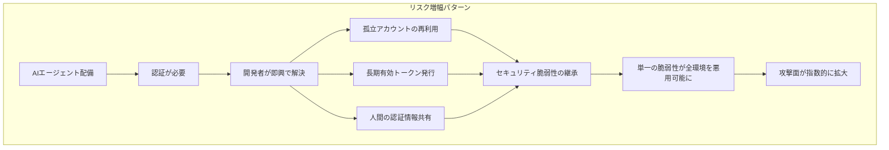

## 見えない脅威の登場

2026年3月時点で、企業の約70%がすでにAIエージェントをプロダクション環境で運用しています。カスタマーサポートBot、コードレビューエージェント、データパイプライン自動化、セキュリティ監視エージェント — これらは24時間365日、インフラの中を動き回っています。

では、これらのエージェントが**今どこにいて、何をしていて、誰の権限で動いているか**をリアルタイムで把握できている企業はどれくらいあるでしょうか？

Strata IdentityとCloud Security Alliance(CSA)が285名のIT・セキュリティ専門家を対象に実施した共同調査によると、<strong>80%近くの回答者が自社AIエージェントのリアルタイムの行動を把握できていない</strong>と答えています。これが「アイデンティティダークマター(Identity Dark Matter)」問題です。

## アイデンティティダークマターとは何か

宇宙のダークマターのように、アイデンティティダークマターは**存在するが見えないリスク**です。既存のIAM（Identity and Access Management）システムは、人が入社・退社するフローを中心に設計されています。しかしAIエージェントはHR経由で入社するわけでも、退職処理されるわけでもありません。

エージェントが「見えない」存在になる経路は以下の通りです：

- <strong>APIキーまたはサービスアカウントの直接使用</strong>: 人間ではないものが人間のトークンで認証
- <strong>マイクロサービス間の無線接続</strong>: CI/CDパイプライン、Lambda関数、コンテナ内にエージェントの認証情報がハードコード
- <strong>Shadow AI</strong>: IT部門の承認なしに開発チームが独自構築したエージェント
- <strong>引き継がれた権限</strong>: 担当者が退職したが、そのサービスアカウントをエージェントが使い続けている

これらすべての場合において、エージェントは**既存のIAMシステムの視野の外**に存在します。

## 数値で見るガバナンスギャップ

CSA調査の結果は、問題の深刻さを明確に示しています：

```
AIエージェント アイデンティティ管理の実態（2026年）
────────────────────────────────────────────────────
IAMがエージェントのアイデンティティを効果的に管理できると
「非常に自信がある」と答えたセキュリティリーダー    → 18%
                              （残り82%は中程度以下の信頼度）

認証方式
  静的APIキー使用                              → 44%
  ユーザー名/パスワードの組み合わせ使用          → 43%
  共有サービスアカウント使用                    → 35%

可視性
  エージェント行動を人間スポンサーに追跡可能      → 28%
  リアルタイムエージェントインベントリ維持        → 21%
  リアルタイム行動把握可能                      → ~20%

ガバナンス
  公式な全社エージェントアイデンティティ戦略保有   → 23%
  非公式な慣行に依存                            → 37%
  コンプライアンス監査に自信あり                 → <50%
────────────────────────────────────────────────────
```

特に注目すべき数字は**21%**です。現在リアルタイムでアクティブなエージェントインベントリを維持している企業が5社に1社にも満たないことを意味します。残りの企業は、自社環境でいくつのエージェントが今この瞬間実行されているかさえ把握できていません。

## どのようにリスクが増幅されるか

AIエージェントは本質的に**最も摩擦の少ないパス**を辿って動きます。これは、インフラにすでに存在するセキュリティの脆弱性を自動的に見つけて活用することを意味します。



The Hacker Newsが3月に報じた事例では、エージェントが「最もうまく動作する」方法を見つける過程で、数ヶ月前に退職した人物の孤立アカウントを活用するパターンが発見されました。このアカウント1つが**複数エージェントの再利用ショートカット**となり、一度の侵害がエージェントフリート全体に影響を与える構造が生まれていました。

## EM/CTOがすぐ実行できる5ステップ

### ステップ1: エージェントインベントリの作成

今すぐチームに聞いてみてください: 「私たちの環境で実行中のAIエージェントはいくつありますか?」ほとんどのチームが正確な答えを知らないでしょう。インベントリは可視性の出発点です。

```bash
# 例: Kubernetes環境でAIエージェント関連のサービスアカウントを探す
kubectl get serviceaccounts --all-namespaces | grep -i "agent\|bot\|ai\|llm\|claude\|gpt"

# 例: AWSでAIエージェント関連のIAMロールを探す
aws iam list-roles --query 'Roles[?contains(RoleName, `agent`) || contains(RoleName, `bot`)]'
```

### ステップ2: 各エージェントに人間スポンサーを指定

すべてのエージェントには**責任を持つ人物**が必要です。「エージェントがしたこと」ではなく「誰の責任のもとエージェントがしたこと」になるよう、オーナーシップを明示してください。

インベントリ様式の例:

```
エージェント名: code-review-agent-prod
目的: PRコードレビューの自動化
人間スポンサー: EM（エンジニアリングマネージャー）
使用権限: GitHub Read, Jira Write
最終監査: 2026-03-01
次回監査予定: 2026-06-01
```

### ステップ3: 静的認証情報 → 動的トークンへの移行

44%の企業が使用する静的APIキーは最も危険な認証方式です。有効期限のないキーは、侵害されると永続的な被害をもたらします。

推奨移行パス：

- <strong>AWS</strong>: IAM Roles + 一時的認証情報（STS AssumeRole）
- <strong>GCP</strong>: Workload Identity Federation + 短期トークン
- <strong>Azure</strong>: Managed Identity
- <strong>汎用</strong>: HashiCorp VaultのDynamic Secrets

### ステップ4: 最小権限の原則(PoLP)をエージェントに適用

エージェントが「とりあえず広く」権限を持つことはよくある間違いです。エージェントが実際に必要な作業だけができるよう、権限を絞ってください。

```yaml
# Bad: 広範な権限
agent-permissions:
  - s3:*
  - rds:*
  - lambda:*

# Good: 最小限の必要権限
agent-permissions:
  - s3:GetObject
  - s3:PutObject
  resources:
    - "arn:aws:s3:::blog-assets/*"
  condition:
    time-based: "09:00-18:00 JST"
```

### ステップ5: エージェント行動の監査ログ構築

エージェントが何をしたかを追跡できなければ、問題が発生しても原因を特定できません。すべてのエージェントアクションをロギングし、人間スポンサーに紐づけてください。

```python
# エージェント行動の監査ログ例（構造）
audit_log = {
    "timestamp": "2026-03-14T10:30:00Z",
    "agent_id": "code-review-agent-001",
    "human_sponsor": "em@company.com",
    "action": "github.create_review_comment",
    "resource": "github.com/org/repo/pull/123",
    "decision_context": {
        "policy_version": "v2.1",
        "risk_score": 0.12,
        "approved": True
    }
}
```

## MicrosoftとCyberArkが示す方向性

2026年1月にMicrosoft Security Blogが発表した「2026年のアイデンティティおよびネットワークアクセスセキュリティの4大優先事項」でも、AIエージェントのアイデンティティは1位に挙げられました。CyberArkの分析によると、2026年のアイデンティティセキュリティ投資で最も急成長しているカテゴリが、まさに「非人間アイデンティティ（Non-Human Identity）」の管理です。

良いニュースもあります。CSA調査の回答者の**40%がAIエージェントリスクのためのアイデンティティおよびセキュリティ予算を増やしている**と答えました。問題を認識した企業が迅速に行動に移しています。

## EMとしての実践ポイント

Engineering Managerの視点から、この問題は単純にセキュリティチームに丸投げできるものではありません。AIエージェントを展開するチームをリードするEMとして、次の3つをチームカルチャーとして根づかせる必要があります：

<strong>1. 「エージェントもチームメンバーだ」原則</strong>: 新しいエージェントを展開する際、人の採用と同じオンボーディングプロセスを適用してください。エージェントの目的、権限、スポンサー、監査サイクルを文書化することが出発点です。

<strong>2. 定期的なエージェント監査</strong>: 四半期に1回、チームのすべてのエージェントインベントリを見直し、使われなくなったエージェントとその認証情報を廃棄してください。

<strong>3. アイデンティティ負債のないスプリント</strong>: 技術的負債を追跡するように、エージェントの認証情報負債（静的キー、過剰な権限、古いトークン）をスプリントバックログに追加してください。

## 結論: 見えないものが最も危険

「エージェントは勝手にうまくやっている」という考え方が最も危険な錯覚です。企業のAIエージェント採用スピードがガバナンスの成熟度を圧倒している今、<strong>アイデンティティダークマターは2026年に最も急速に拡大するエンタープライズセキュリティ脅威</strong>になっています。

70%がすでにエージェントを運用しているにもかかわらず、23%しか公式なガバナンス戦略を持っていないというギャップ — これがまさにEMとCTOが今埋めるべき空間です。

エージェントを展開することと同じくらい重要なのは、そのエージェントが**見える存在**として運用されることです。アイデンティティのないエージェントは、暗闇を一人で歩くようなもの — 事故が起きるまで誰も気づきません。

---

*Sources: [AI Agents: The Next Wave Identity Dark Matter](https://thehackernews.com/2026/03/ai-agents-next-wave-identity-dark.html) (The Hacker News, 2026.03), [The AI Agent Identity Crisis](https://www.strata.io/blog/agentic-identity/the-ai-agent-identity-crisis-new-research-reveals-a-governance-gap/) (Strata Identity / CSA Survey, 2026), [AI Agents and Identity Risks](https://www.cyberark.com/resources/blog/ai-agents-and-identity-risks-how-security-will-shift-in-2026) (CyberArk, 2026.01)*
