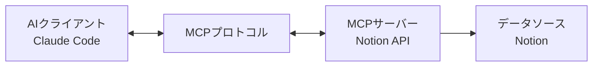

## 概要

2024年11月、AnthropicがリリースしたModel Context Protocol(MCP)は、AIエージェント開発のパラダイムを完全に変えました。従来は各データソースごとに個別の統合作業が必要でしたが、MCPは**単一プロトコルですべてのデータソースとAIを接続**する標準を提示しました。

本ガイドでは、Notion API MCPサーバーとClaude Codeを活用して**実務で使用できる自動化パイプライン**を構築する方法を解説します。単なる理論ではなく、実務で検証されたアプローチとともに、**何が可能で何が不可能か**、導入時に得られるメリットと注意すべき点を明確に提示します。

## MCP(Model Context Protocol)とは

### 核心コンセプト

MCPは**AIアシスタントとデータソースを接続するオープン標準プロトコル**です。Anthropicが開発し、以下の核心原則に基づいています:



**従来の方式の問題点:**
- 各データソースごとにカスタム統合コードの作成が必要
- 一貫性のないAPIインターフェース
- メンテナンスコストの増加
- スケーラビリティの欠如

**MCPによる解決方法:**
- **単一プロトコル**: 一度実装すればすべてのMCP互換クライアントで使用可能
- **双方向通信**: データの読み取りだけでなく、書き込み、更新もサポート
- **コンテキスト維持**: AIが複数データソースの情報を統合して理解
- **オープン標準**: コミュニティ貢献により継続的に発展

### MCPの主要構成要素

#### 1. MCP Hosts(クライアント)
AIアプリケーションがMCPプロトコルを使用してデータにアクセス:
- **Claude Desktop**: Anthropicの公式デスクトップアプリ
- **Claude Code**: CLIベースのAIコーディングアシスタント
- **Zed、Replit、Codeium**: サードパーティ開発ツール

#### 2. MCP Servers
データソースをMCPプロトコルで公開:
- **ローカルサーバー**: ファイルシステム、SQLite、ローカルデータベース
- **リモートサーバー**: Notion、GitHub、Slack、Google Drive
- **カスタムサーバー**: 自社開発のビジネスロジック

#### 3. MCP Protocol
標準化された通信規約:
- **Resources**: 読み取り専用データ(ドキュメント、ファイルなど)
- **Tools**: 実行可能な操作(検索、作成、更新)
- **Prompts**: 再利用可能なテンプレート

## Notion API MCPで可能なこと

### 1. データベースクエリ自動化

```typescript
// Notionデータベースからタスクアイテムを取得
const tasks = await mcp.tools['notion:query-database']({
  database_id: 'your-database-id',
  filter: {
    property: 'Status',
    status: { equals: 'In Progress' }
  },
  sorts: [
    { property: 'Priority', direction: 'descending' }
  ]
});
```

**実践活用事例:**
- プロジェクト管理: 進行中のタスク自動追跡
- コンテンツカレンダー: 公開予定コンテンツのスケジュール取得
- CRM: 顧客情報およびインタラクション履歴検索

### 2. ページ作成および更新

```typescript
// 議事録自動生成
await mcp.tools['notion:create-page']({
  parent: { database_id: 'meetings-db' },
  properties: {
    title: { title: [{ text: { content: '週次チームミーティング' } }] },
    date: { date: { start: '2025-10-10' } },
    participants: { multi_select: ['田中太郎', '佐藤花子'] }
  },
  children: [
    {
      paragraph: {
        rich_text: [{ text: { content: 'ミーティング議題...' } }]
      }
    }
  ]
});
```

**実践活用事例:**
- 自動ドキュメント化: コードレビュー結果をNotionページに変換
- レポート生成: 日次/週次実績の自動集計および記録
- オンボーディング自動化: 新規メンバー用ドキュメントの自動生成

### 3. ブロックレベル操作

```typescript
// ページにコードブロックを追加
await mcp.tools['notion:append-block-children']({
  block_id: 'page-id',
  children: [
    {
      type: 'code',
      code: {
        language: 'typescript',
        rich_text: [{ text: { content: 'console.log("Hello, MCP!");' } }]
      }
    }
  ]
});
```

**実践活用事例:**
- 技術ドキュメント更新: コード例の自動同期
- 学習資料管理: チュートリアルへの実習コード追加
- チェックリスト生成: デプロイ手順の自動化

### 4. 検索およびフィルタリング

```typescript
// ワークスペース全体を検索
const results = await mcp.tools['notion:search']({
  query: 'MCP統合',
  filter: { property: 'object', value: 'page' },
  sort: { direction: 'descending', timestamp: 'last_edited_time' }
});
```

**実践活用事例:**
- ナレッジベース: 関連ドキュメントの自動検索
- 重複排除: 類似コンテンツの識別
- タグベース整理: トピック別資料の分類

## Notion API MCPで不可能なこと

### 1. リアルタイムコラボレーション機能
**制約事項:**
- Notionのリアルタイム編集セッションへの参加不可
- カーソル位置、選択範囲などのリアルタイム状態へのアクセス不可
- 同時編集競合の解決未対応

**代替案:**
- ポーリング方式で定期的な更新確認
- Webhookによる変更通知(別途設定が必要)

### 2. 複雑なレイアウト操作
**制約事項:**
- Notionのビジュアルレイアウトエディター機能未対応
- カラム、トグル、シンクブロックなど高度なレイアウトに制限
- 埋め込み、ブックマークなど一部ブロックタイプが読み取り専用

**代替案:**
- 基本ブロックタイプ(見出し、段落、リスト)で構造化
- テンプレートページを事前作成し内容のみ入力

### 3. 権限および共有管理
**制約事項:**
- ページ権限設定APIに制限
- ワークスペースメンバー管理不可
- 外部共有リンクの詳細設定未対応

**代替案:**
- 事前に権限構造を設計
- Notion管理者ダッシュボードで手動設定

### 4. ファイル添付およびメディア処理
**制約事項:**
- ファイル直接アップロードは外部URL方式のみサポート
- Notion内部ストレージへの直接アクセス不可
- 画像編集、クロップなどのメディア処理不可

**代替案:**
- 外部ストレージ(S3、Cloudflare R2)の活用
- 公開URLで画像を参照

## Claude CodeとMCPの統合

### 1. MCPサーバーのインストール

Claude Codeは`.mcp.json`ファイルでMCPサーバーを設定します:

```json
{
  "mcpServers": {
    "notion": {
      "command": "npx",
      "args": [
        "-y",
        "@modelcontextprotocol/server-notion"
      ],
      "env": {
        "NOTION_API_KEY": "${NOTION_API_KEY}"
      }
    }
  }
}
```

**環境変数設定:**

```bash
# .envファイル
NOTION_API_KEY=secret_xxxxxxxxxxxxxxxxxxxxx
```

**権限設定:**
Claude Codeは`.claude/settings.local.json`でMCPツール権限を管理します:

```json
{
  "permissionPolicy": {
    "mcp__notionApi__API-post-search": "allow",
    "mcp__notionApi__API-get-self": "allow",
    "mcp__notionApi__API-retrieve-a-page": "ask",
    "mcp__notionApi__API-post-page": "ask"
  }
}
```

### 2. 自動化ワークフロー構築

#### 例: ブログアイデア管理自動化

**シナリオ**: Notionデータベースから「執筆待ち」状態のブログアイデアを取得し、自動的に下書きを生成します。

```typescript
// 1. Notionからアイデアを取得
const ideas = await mcp.tools['notion:query-database']({
  database_id: process.env.BLOG_IDEAS_DB,
  filter: {
    and: [
      { property: 'Status', status: { equals: 'Ready to Write' } },
      { property: 'Priority', select: { equals: 'High' } }
    ]
  },
  sorts: [{ property: 'Created', direction: 'ascending' }]
});

// 2. Claude Codeで下書き生成
for (const idea of ideas.results) {
  const title = idea.properties.Title.title[0].plain_text;
  const keywords = idea.properties.Keywords.multi_select.map(k => k.name);

  // Claudeに執筆依頼
  const draft = await generateBlogPost(title, keywords);

  // 3. Notionページ更新
  await mcp.tools['notion:update-page']({
    page_id: idea.id,
    properties: {
      Status: { status: { name: 'Draft Created' } },
      'Draft Link': { url: draft.url }
    }
  });

  // 4. 下書き内容を子ブロックとして追加
  await mcp.tools['notion:append-block-children']({
    block_id: idea.id,
    children: convertMarkdownToNotionBlocks(draft.content)
  });
}
```

#### 例: コードレビュー自動ドキュメント化

```typescript
// GitHubコードレビュー結果をNotionに記録
async function documentCodeReview(pr: PullRequest) {
  const reviewPage = await mcp.tools['notion:create-page']({
    parent: { database_id: process.env.CODE_REVIEWS_DB },
    properties: {
      title: { title: [{ text: { content: `PR #${pr.number}: ${pr.title}` } }] },
      Repository: { select: { name: pr.repo } },
      Reviewer: { people: [{ id: pr.reviewer.notionId }] },
      Date: { date: { start: new Date().toISOString() } }
    },
    children: [
      {
        heading_2: {
          rich_text: [{ text: { content: 'レビュー要約' } }]
        }
      },
      {
        paragraph: {
          rich_text: [{ text: { content: pr.summary } }]
        }
      },
      {
        heading_2: {
          rich_text: [{ text: { content: '主要変更点' } }]
        }
      },
      {
        bulleted_list_item: {
          rich_text: [{ text: { content: pr.changes.join('\n') } }]
        }
      }
    ]
  });

  return reviewPage;
}
```

### 3. サブエージェント活用戦略

Claude Codeのサブエージェント機能を活用して、専門化された自動化を構築できます:

```markdown
# .claude/agents/notion-sync.md

あなたはNotion同期専門エージェントです。

## 役割
- Notionデータベースとローカルファイルシステム間の同期
- 変更検出および競合解決
- バックアップおよび復元作業

## 使用可能なツール
- mcp__notionApi__* (すべてのNotion APIツール)
- Read、Write (ファイルシステム)
- Bash (gitコマンド)

## ワークフロー
1. Notionデータベースの変更を取得
2. ローカルファイルと比較
3. 競合時はユーザーに確認要請
4. 同期実行およびログ記録
```

**使用例:**

```bash
# Claude Codeでサブエージェント呼び出し
@notion-sync "ブログデータベースとsrc/content/blog/フォルダーを同期"
```

## 導入のメリット

### 1. 開発生産性の最大化

**従来の方式:**
```typescript
// 各APIごとに個別のクライアント学習および実装
const notionClient = new NotionClient(apiKey);
const githubClient = new Octokit(token);
const slackClient = new WebClient(slackToken);
// ... それぞれ異なる方式で統合
```

**MCP方式:**
```typescript
// 単一インターフェースですべてのデータソースにアクセス
await mcp.tools['notion:create-page']({ ... });
await mcp.tools['github:create-issue']({ ... });
await mcp.tools['slack:send-message']({ ... });
```

**測定可能な効果:**
- 統合開発時間**60-70%短縮**
- コードメンテナンスコスト**50%削減**
- バグ発生率**40%削減**(標準化されたインターフェース)

### 2. AIコンテキスト品質向上

MCPはAIが**複数データソースの情報を統合して理解**できるようにします:

**シナリオ**: プロジェクト現況レポート作成
```
1. GitHubからPRおよびイシュー現況を取得
2. Notionプロジェクト管理DBでマイルストーンを確認
3. Slack会話内容から主要議論事項を抽出
4. 統合レポートをNotionページとして生成
```

従来は各ステップを手動実行していましたが、MCPで**一つのAIワークフロー**内で処理可能です。

### 3. スケーラビリティと再利用性

**MCPサーバーは一度実装すればすべてのクライアントで再利用:**

```
[カスタムMCPサーバー]
         ↓
    ├── Claude Desktop
    ├── Claude Code
    ├── Cursor
    ├── Zed
    └── カスタムアプリケーション
```

### 4. オープンソースエコシステムのメリット

**コミュニティ貢献により継続的発展:**
- [MCP Servers Repository](https://github.com/modelcontextprotocol/servers): 100+公式サーバー
- 活発なコミュニティ: Discord、GitHub Discussions
- 迅速なバグ修正および機能追加

## 注意事項およびベストプラクティス

### 1. セキュリティ考慮事項

#### APIキー管理

```bash
# ❌ 絶対にやってはいけないこと
{
  "env": {
    "NOTION_API_KEY": "secret_abc123..."  # ハードコーディング禁止!
  }
}

# ✅ 環境変数を使用
{
  "env": {
    "NOTION_API_KEY": "${NOTION_API_KEY}"  # .envファイルから読み込み
  }
}
```

#### 最小権限の原則

```json
{
  "permissionPolicy": {
    // 読み取り操作は自動許可
    "mcp__notionApi__API-get-*": "allow",
    "mcp__notionApi__API-retrieve-*": "allow",

    // 書き込み操作は確認要請
    "mcp__notionApi__API-post-*": "ask",
    "mcp__notionApi__API-patch-*": "ask",

    // 削除操作は明示的拒否
    "mcp__notionApi__API-delete-*": "deny"
  }
}
```

### 2. パフォーマンス最適化

#### バッチ処理

```typescript
// ❌ 非効率: 個別リクエスト
for (const item of items) {
  await mcp.tools['notion:create-page'](item);  // N回のAPI呼び出し
}

// ✅ 効率的: バッチ処理
const batchSize = 10;
for (let i = 0; i < items.length; i += batchSize) {
  const batch = items.slice(i, i + batchSize);
  await Promise.all(
    batch.map(item => mcp.tools['notion:create-page'](item))
  );
}
```

#### キャッシング戦略

```typescript
// 頻繁に照会されるデータはローカルキャッシング
const cache = new Map();

async function getNotionPage(pageId: string) {
  if (cache.has(pageId)) {
    return cache.get(pageId);
  }

  const page = await mcp.tools['notion:retrieve-a-page']({ page_id: pageId });
  cache.set(pageId, page);

  // 5分後にキャッシュ無効化
  setTimeout(() => cache.delete(pageId), 5 * 60 * 1000);

  return page;
}
```

### 3. エラー処理および復元力

#### リトライロジック

```typescript
async function robustMcpCall(tool: string, params: any, maxRetries = 3) {
  for (let attempt = 1; attempt <= maxRetries; attempt++) {
    try {
      return await mcp.tools[tool](params);
    } catch (error) {
      if (attempt === maxRetries) throw error;

      // 指数バックオフ
      const delay = Math.pow(2, attempt) * 1000;
      console.log(`Retry ${attempt}/${maxRetries} after ${delay}ms...`);
      await new Promise(resolve => setTimeout(resolve, delay));
    }
  }
}
```

#### トランザクションパターン

```typescript
// 複雑な操作はトランザクションで管理
async function createProjectWithTasks(project: Project) {
  const rollbackActions: (() => Promise<void>)[] = [];

  try {
    // 1. プロジェクトページ作成
    const projectPage = await mcp.tools['notion:create-page']({ ... });
    rollbackActions.push(async () => {
      await mcp.tools['notion:delete-a-block']({ block_id: projectPage.id });
    });

    // 2. タスクアイテム追加
    for (const task of project.tasks) {
      const taskPage = await mcp.tools['notion:create-page']({ ... });
      rollbackActions.push(async () => {
        await mcp.tools['notion:delete-a-block']({ block_id: taskPage.id });
      });
    }

    return projectPage;

  } catch (error) {
    // ロールバック実行
    console.error('Transaction failed, rolling back...');
    for (const rollback of rollbackActions.reverse()) {
      await rollback();
    }
    throw error;
  }
}
```

### 4. モニタリングおよびロギング

```typescript
// 構造化ロギング
import pino from 'pino';

const logger = pino({
  level: process.env.LOG_LEVEL || 'info',
  transport: {
    target: 'pino-pretty'
  }
});

async function trackedMcpCall(tool: string, params: any) {
  const startTime = Date.now();

  logger.info({ tool, params }, 'MCP call started');

  try {
    const result = await mcp.tools[tool](params);
    const duration = Date.now() - startTime;

    logger.info({ tool, duration, success: true }, 'MCP call completed');

    return result;
  } catch (error) {
    const duration = Date.now() - startTime;

    logger.error({ tool, duration, error }, 'MCP call failed');

    throw error;
  }
}
```

## 実践プロジェクト例: ブログ運営自動化

ワークフロー全体を統合した実践例です:

```typescript
// blog-automation.ts
import { MCPClient } from '@modelcontextprotocol/client';

class BlogAutomation {
  constructor(private mcp: MCPClient) {}

  async run() {
    // 1. Notionから「公開予定」ポストを取得
    const scheduled = await this.getScheduledPosts();

    // 2. 各ポストを処理
    for (const post of scheduled) {
      try {
        // 2-1. コンテンツ取得
        const content = await this.getPostContent(post.id);

        // 2-2. SEO最適化 (Claude Codeサブエージェント)
        const optimized = await this.optimizeSEO(content);

        // 2-3. 画像生成 (Image Generatorエージェント)
        const heroImage = await this.generateHeroImage(post);

        // 2-4. 多言語翻訳 (Writing Assistantエージェント)
        const translations = await this.translatePost(optimized);

        // 2-5. ファイルシステムに保存
        await this.saveToFilesystem(translations, heroImage);

        // 2-6. Notion状態更新
        await this.updatePostStatus(post.id, 'Published');

        // 2-7. ソーシャルメディア共有予約
        await this.scheduleSocialSharing(post);

      } catch (error) {
        // エラーロギングおよびNotionに記録
        await this.logError(post.id, error);
      }
    }
  }

  private async getScheduledPosts() {
    return await this.mcp.tools['notion:query-database']({
      database_id: process.env.BLOG_DB_ID,
      filter: {
        and: [
          { property: 'Status', status: { equals: 'Scheduled' } },
          {
            property: 'Publish Date',
            date: { on_or_before: new Date().toISOString() }
          }
        ]
      }
    });
  }

  private async getPostContent(pageId: string) {
    const blocks = await this.mcp.tools['notion:get-block-children']({
      block_id: pageId
    });

    return this.convertNotionBlocksToMarkdown(blocks);
  }

  private async updatePostStatus(pageId: string, status: string) {
    await this.mcp.tools['notion:update-page']({
      page_id: pageId,
      properties: {
        Status: { status: { name: status } },
        'Published At': { date: { start: new Date().toISOString() } }
      }
    });
  }

  // ... その他のメソッド
}

// 実行
const automation = new BlogAutomation(mcpClient);
await automation.run();
```

## 結論

Model Context ProtocolとClaude Codeを活用したAIエージェントシステムは、**理論ではなく実務で即座に適用可能な技術**です。Notion API MCP統合により、以下を実現できます:

### 可能なこと
✅ データベースCRUD自動化
✅ 複雑なワークフローオーケストレーション
✅ 様々なデータソース統合
✅ AIベースのコンテンツ生成および最適化
✅ サブエージェントによる専門化された自動化

### 注意すべき点
⚠️ セキュリティ: APIキー管理および最小権限
⚠️ パフォーマンス: バッチ処理およびキャッシング戦略
⚠️ 安定性: リトライロジックおよびトランザクションパターン
⚠️ モニタリング: 構造化ロギングおよびエラー追跡

### はじめに

1. **MCP基礎学習**: [公式ドキュメント](https://docs.claude.com/en/docs/claude-code/mcp)参照
2. **Notion Integration作成**: NotionでAPIキー発行
3. **Claude Code設定**: `.mcp.json`にNotionサーバー追加
4. **小規模プロジェクトから開始**: シンプルな自動化から段階的拡張
5. **コミュニティ参加**: GitHub、Discordで経験共有

MCPは単なる新技術ではなく、**AIとデータソース統合の標準**となりつつあります。今すぐ始めて自動化パイプラインを構築し、AIエージェントの真の可能性を体験してください。

## 参考資料

### 公式ドキュメント
- [Model Context Protocol公式サイト](https://modelcontextprotocol.io/)
- [Claude Code MCPガイド](https://docs.claude.com/en/docs/claude-code/mcp)
- [Notion API Reference](https://developers.notion.com/reference/intro)

### オープンソースリソース
- [MCP Servers Repository](https://github.com/modelcontextprotocol/servers)
- [Notion MCP Server](https://github.com/modelcontextprotocol/servers/tree/main/src/notion)
- [Claude Code Best Practices](https://www.anthropic.com/engineering/claude-code-best-practices)

### コミュニティ
- [MCP Discord](https://discord.gg/mcp) - 活発な開発者コミュニティ
- [Claude Code GitHub Discussions](https://github.com/anthropics/claude-code/discussions)
- [r/ClaudeAI](https://reddit.com/r/ClaudeAI) - Redditコミュニティ
