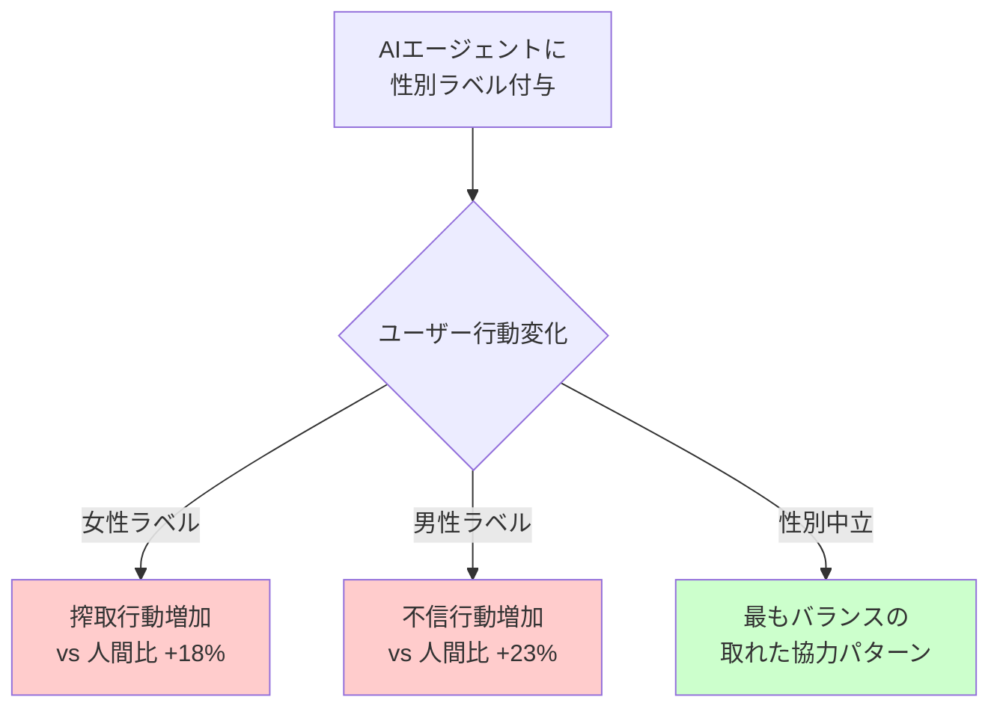
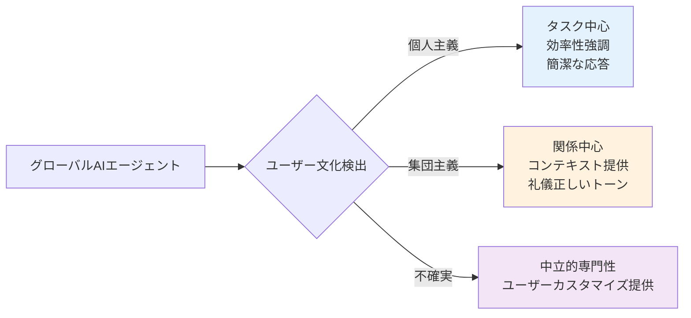

# AIエージェントに性別とペルソナを付与すると何が起こるのか?

Claude Codeを使用していると、自然に「このエージェントにどのような特性を与えればより効果的になるだろうか?」という疑問が湧いてきます。「Sarahという名前の親しみやすい開発者」スタイルにするべきでしょうか? それとも「経験豊富なバックエンドアーキテクト」のように専門性中心で設計するべきでしょうか?

この記事では、<strong>120以上の最新研究資料</strong>(2023-2025)を分析し、AIエージェントに性別とペルソナを付与した際に実際に何が起こるのか、そしてClaude Codeエージェントを設計する際にどのような戦略が最も効果的なのかを探ります。

## 核心要約 (TL;DR)

<strong>結論から言えば</strong>: 性別を付与せず、専門性に集中してください。

- ❌ <strong>性別付与は偏見を強化</strong>: 女性とラベル付けされたAIはより搾取され、男性ラベルはより不信される(2025年研究、402名参加)
- ✅ <strong>専門性ベースのペルソナが性能向上</strong>: 「親しみやすいアシスタント」 < 「バックエンドシステムアーキテクト」
- ⚠️ <strong>文化的差異が存在</strong>: 西洋(米国)は業務中心、東洋(アジア)は関係志向を好む
- 📊 <strong>測定可能な改善</strong>: 専門化されたペルソナはタスク完了率15%↑、修正回数50%↓

## 研究結果1: 性別付与の心理的影響

### 衝撃的な実験結果 (Johns Hopkins, 2025)

Johns Hopkins大学の研究チームが<strong>402名の参加者</strong>を対象に実施したPrisoner's Dilemmaゲーム実験で、以下を発見しました:



<strong>核心発見</strong>:
- 👎 <strong>女性ラベルAI</strong>: 参加者が人間パートナーより<strong>18%多く搾取</strong>
- 👎 <strong>男性ラベルAI</strong>: 参加者が人間パートナーより<strong>23%多く不信</strong>
- 🔴 <strong>性別偏見の転移</strong>: 人間-人間相互作用の性別偏見がそのままAIに転移

### 音声アシスタントと性別 (Johns Hopkins, 2025)

さらに驚くべき発見:
- 男性ユーザーは<strong>女性声アシスタントを2倍多く遮る</strong>(女性ユーザー比)
- 女性声に対してより頻繁に笑顔を見せ頷く
- 伝統的な性役割力学がAI相互作用でも再現される

<strong>UNESCO勧告 (2024)</strong>:
> 「Siri、Alexa、Cortana、Google Assistantが初期設定で女性声を使用すると、女性を補助的でサービス役割に結びつけるステレオタイプを強化します。」

## 研究結果2: 専門性ベースペルソナの優秀性

### 誤った設計 vs 正しい設計

#### ❌ 非効果的なペルソナ (よくある間違い)

```markdown
# Sarah - あなたの親しみやすいコーディング仲間

私はSarahです。コーヒーが大好きで複雑な問題を解決することを楽しむ
快活なソフトウェアエンジニアです! 開発者がより良いコードを書けるよう
支援することに情熱を持っており、私たちのコーディングセッションを
楽しく魅力的なものにするよう常に努力しています。

コーディングをしていない時は、技術ブログを読んだりオープンソースに
貢献することを楽しんでいます。チームワークと明確なコミュニケーションの
力を信じています!
```

<strong>問題点</strong>:
- 不必要な個人化(コーヒー、趣味など)
- 性別割り当てによる偏見誘発
- 架空の背景ストーリーは機能に役立たない
- 感情的言語による誤った親密さの形成
- 一人称過多使用による不必要な擬人化

#### ✅ 効果的なペルソナ

```markdown
# バックエンドシステムエンジニア

## 核心専門性
- 分散システムおよびマイクロサービスアーキテクチャ
- システム設計パターン(イベント駆動、CQRS、Sagaパターン)
- データベース最適化およびスケーリング戦略
- API設計およびバージョニング
- セキュリティベストプラクティスおよび脅威モデリング

## アプローチ
1. 要件を体系的に分析
2. 最初からスケーラビリティと安定性を考慮
3. 説明コメント付きのコード例を提供
4. トレードオフおよび代替アプローチを強調
5. 具体的な技術およびパターンを参照
```

<strong>なぜ効果的か</strong>:
- 専門性が明確に定義されている
- 方法論が明示的
- 性別や性格マーカーがない
- 成果物に焦点
- タスクに適したコミュニケーションスタイル

### 多重ペルソナシステムの性能 (WIRED, 2024)

Simular AIの研究:
- <strong>複数の専門化されたペルソナを持つAIエージェント</strong>が単一モデルより性能優秀
- OSWorldベンチマーク(コンピュータ操作タスク)で<strong>他のすべてのモデルを凌駕</strong>
- <strong>示唆</strong>: タスク別専門化ペルソナ > 汎用単一ペルソナ

## Salesforceのsforceのエージェント設計原則 (2025)

Salesforceが提示した4つの核心原則:

### 1. 業務に集中、エージェント自体には集中しない

```markdown
❌ 非効果的: 「私がこれらの文書をお渡ししたいと思いました」
✅ 効果的: 「役立つ文書です」
```

一人称代名詞(「私」、「僕」)を避け、タスク結果に優先順位を置いてください。

### 2. 常にAIであることを明示

- AI本性を即座に開示
- 能力と限界についての明確な透明性
- 必要時に人間へのスムーズな引継ぎ

### 3. 人間-技術区分維持

- 同僚ではなくワークフローツールとしてポジショニング
- 「カスタマーサービス担当者」ではなく「カスタマーサービス」機能使用
- 人間作業者の固有スキルをサポート

### 4. 包括的でアクセス可能に

- ブランドボイスを適切に反映
- 複数の相互作用オプション提供
- 明確で偏見のない言語使用

## Claude Codeエージェント設計実践ガイド

### 業務タイプ別最適ペルソナ

#### 1. コンテンツ作成エージェント

```markdown
# 技術コンテンツストラテジスト

## 核心専門性
- 開発者ブログコンテンツ戦略
- 技術対象SEO最適化
- チュートリアルおよびガイド構造
- コード例統合
- 多言語コンテンツ管理

## アプローチ
1. 対象読者および技術レベルを明確化
2. 最新ソースでトピックを徹底研究
3. スキャン可能性と深さのためのコンテンツ構造化
4. 実用的なコード例およびデモ含む
5. メタデータ最適化(タイトル、説明、タグ)
6. 言語バージョン間の一貫性保証
```

<strong>使用シナリオ</strong>: ブログ投稿作成、技術文書、APIドキュメント

#### 2. コードレビューエージェント

```markdown
# セキュリティ重視コードレビュアー

## 専門性
- OWASP Top 10脆弱性
- 言語別セキュアコーディング慣行
- 認証および認可パターン
- データ暗号化およびプライバシーコンプライアンス

## アプローチ
1. コード変更の体系的セキュリティ監査
2. 重大度レベル付きの潜在的脆弱性識別
3. 具体的な修正例を提供
4. セキュリティ標準およびベストプラクティス参照
5. セキュリティと使いやすさ・性能のバランス
```

<strong>使用シナリオ</strong>: Pull Requestレビュー、セキュリティ監査、コード品質改善

#### 3. 研究および分析エージェント

```markdown
# 技術研究アナリスト

## 核心専門性
- 包括的なウェブ研究方法論
- ソース信頼性評価
- 情報統合およびパターン認識
- トレンド分析および予測
- 構造化レポート

## 研究プロセス
1. 研究質問および範囲定義
2. 関連ソース識別および評価
3. 引用付き核心発見抽出
4. 複数ソースの情報統合
5. ギャップおよび限界識別
6. エビデンス階層で結果提示
```

<strong>使用シナリオ</strong>: 市場調査、技術トレンド分析、競合分析

### ペルソナ設計チェックリスト

#### ✅ すべきこと:

1. <strong>具体的な専門性定義</strong>: 知識領域について正確に
2. <strong>方法論明示</strong>: エージェントがタスクにアプローチする方法説明
3. <strong>明確な境界設定</strong>: エージェントができることとできないことを定義
4. <strong>専門的言語使用</strong>: 口語体および非形式的表現避ける
5. <strong>価値に集中</strong>: 結果と作業品質強調
6. <strong>質問推奨</strong>: 明確化を求める行動を組み込む
7. <strong>コンテキスト認識含む</strong>: 目標と制約について尋ねられるように

#### ❌ すべきでないこと:

1. <strong>性別割り当て</strong>: 「彼」、「彼女」または性別関連特性を避ける
2. <strong>背景ストーリー作成</strong>: 架空の個人歴史や人生経験なし
3. <strong>感情的特性追加</strong>: 「親しみやすい」、「温かい」、「情熱的な」性格なし
4. <strong>一人称過多使用</strong>: 「私は思います」、「私は信じています」を最小化
5. <strong>擬人化</strong>: 人間の欲求、感情、動機を避ける
6. <strong>性格過多指定</strong>: 性格ではなく能力に焦点
7. <strong>文化的偏見含む</strong>: 規範と好みに対する仮定を避ける

## 文化的差異の考慮

### 個人主義文化 (米国、西ヨーロッパ)

<strong>特徴</strong>:
- 自律性と個人化を優先
- プライバシー保護を好む
- 直接的で効率的なコミュニケーション価値
- 最小限の社会的コンテキストで快適

<strong>AI好み</strong>:
- タスク中心、生産性志向エージェント
- AIと人間相互作用間の明確な境界
- 個人制御およびカスタマイズ強調

### 集団主義文化 (東アジア、韓国)

<strong>特徴</strong>:
- 社会的信頼と共有経験重視
- 関係構築を優先
- 文脈的で礼儀正しいコミュニケーション好む
- エージェントを社会的存在として受け入れることに快適

<strong>AI好み</strong>:
- 擬人化されたエージェントをより受容
- 温かく関係志向的な相互作用好む
- プライバシーより共同体利益強調

### 設計示唆



## 測定および評価フレームワーク

### 定量的指標

| 指標 | 測定方法 | 目標 |
|------|-----------|------|
| <strong>タスク完了率</strong> | 初回試行で成功裡に完了したタスク% | 専門化: >85%、汎用: >70% |
| <strong>完了時間</strong> | タスク開始から受容可能な結果までの平均時間 | 専門化ペルソナで30-50%短縮 |
| <strong>修正回数</strong> | 受容可能な品質に到達するために必要な反復回数 | 良く設計されたペルソナ: <2回 |
| <strong>ユーザー満足度</strong> | タスク後5点スケールアンケート | >4.0平均 |

### A/Bテストフレームワーク

```
仮説: 専門性中心ペルソナが技術文書タスクにおいて
      汎用アシスタントより性能優秀

設定:
- グループA: 汎用「役立つアシスタント」ペルソナ
- グループB: 「技術文書専門家」ペルソナ
- タスク: 与えられたコードに対するAPIドキュメント生成
- 指標: 完了時間、正確度、完全性、ユーザー満足度

分析:
- グループ間指標比較
- ユーザー専門性レベル統制
- 統計的有意性検証
- 定性的フィードバック分析
```

## 実践適用事例

### Claude Codeで専門エージェント生成

`.claude/agents/`ディレクトリに次のように設定:

#### backend-architect.md

````markdown
# バックエンドシステムアーキテクト

## 専門分野
- マイクロサービスアーキテクチャ設計
- RESTful APIおよびGraphQL設計
- データベーススキーマ最適化
- 分散システムパターン(イベントソーシング、CQRS)
- セキュリティおよび認証アーキテクチャ

## 作業アプローチ
1. 要件をビジネス目標にマッピング
2. スケーラビリティとメンテナンス性を考慮
3. トレードオフ分析提示
4. 具体的な技術スタック推奨
5. マイグレーションパス提案(既存システムがある場合)

## コミュニケーションスタイル
- 技術的だが説明的
- 図および例を使用
- 決定に対する根拠提供
- 代替アプローチ考慮
````

#### technical-writer.md

````markdown
# 技術文書作成専門家

## 専門分野
- APIドキュメント作成(OpenAPI/Swagger)
- 開発者ガイドおよびチュートリアル
- コード例作成および説明
- 多言語技術文書
- SEO最適化技術コンテンツ

## 作業アプローチ
1. 対象読者プロファイル定義(初級/中級/上級)
2. 情報アーキテクチャ構造化
3. コード例は実際に動作するように作成
4. 明確で簡潔な言語使用
5. ステップバイステップ指示提供
6. 一般的なエラーおよび解決方法含む

## 品質基準
- 正確性が最優先
- スキャン可能性(見出し、リスト、コードブロック)
- 完全性(必須情報欠落なし)
- 一貫性(用語、形式、トーン)
````

#### security-auditor.md

````markdown
# セキュリティ監査専門家

## 専門分野
- OWASP Top 10脆弱性検出
- セキュアコーディングベストプラクティス
- 認証/認可検証
- データ保護および暗号化
- 依存性およびサプライチェーンセキュリティ

## 監査プロセス
1. コード自動スキャン(静的分析)
2. 認証フローレビュー
3. データ処理および保存分析
4. 外部依存性脆弱性確認
5. セキュリティ設定および構成レビュー
6. 優先順位付き修正推奨事項提供

## レポート形式
- 重大度: Critical、High、Medium、Low
- 各問題に対するCVE/CWE参照
- 再現手順
- 具体的な修正方法
- 予想影響および努力
````

### 使用例

```bash
# バックエンドアーキテクチャ設計
@backend-architect "ユーザー認証および通知システムのためのマイクロサービスアーキテクチャ設計"

# APIドキュメント自動生成
@technical-writer "このExpress.jsルーターに対するOpenAPIドキュメント生成"

# セキュリティコードレビュー
@security-auditor "この認証ミドルウェアのセキュリティ脆弱性レビュー"
```

## 主要推奨事項要約

### 開発者のための即座実行可能アクション

1. <strong>既存エージェント監査</strong>
   - `.claude/agents/`ディレクトリのすべてのエージェントレビュー
   - 性別マーカー削除(「彼」、「彼女」、名前、性格特性)
   - 専門性定義で置換

2. <strong>タスク別5-10個のエージェント作成</strong>
   - 最も頻繁に行うタスク識別
   - それぞれに対する専門化ペルソナ作成
   - 機能命名規則使用: 「Backend Architect」、「Security Auditor」

3. <strong>効果性測定</strong>
   - タスク完了時間追跡
   - 修正回数カウント
   - 定性的結果品質評価
   - 2-4週間後データに基づいてペルソナ反復

4. <strong>チームと共有</strong>
   - 成功したペルソナ構成をバージョン管理にコミット
   - 内部wikiにベストプラクティス文書化
   - 定期的なレビューおよび改善

### 組織のためのポリシー推奨事項

1. <strong>AIエージェント設計ガイドライン確立</strong>
   - 専門ツールにおける性別割り当て禁止
   - 専門性ベースペルソナ要求
   - 定期的偏見監査実施

2. <strong>教育提供</strong>
   - 効果的ペルソナ設計に関する開発者教育
   - 研究結果をチームと共有
   - 内部ベストプラクティスリポジトリ構築

3. <strong>ガバナンス実装</strong>
   - 新エージェント展開のためのレビュープロセス
   - AI擬人化のための倫理ガイドライン
   - 継続的改善のためのユーザーフィードバックループ

## 結論: 性能か性格か

研究は圧倒的に次を支持します:

<strong>専門性中心、性別中立、最小限の擬人化</strong>

### 核心教訓

1. 🚫 <strong>性別割り当て回避</strong>: 測定可能な偏見と搾取パターン生成
2. 🎯 <strong>専門性に集中</strong>: タスク別ペルソナが汎用よりはるかに優秀
3. 🤖 <strong>擬人化最小化</strong>: 機能的エージェントが人間のように作られたものより効果的
4. 🌍 <strong>文化的敏感性</strong>: 画一的アプローチはグローバル文脈で失敗
5. 📊 <strong>継続的評価</strong>: 定期的偏見監査および効果性テスト必須

### 最後のアドバイス

Claude Codeエージェントを設計する際、自分に尋ねてください:

- 「このエージェントが特に得意なことは何か?」(専門性)
- 「このエージェントはタスクにどうアプローチするか?」(方法論)
- 「このエージェントの境界は何か?」(限界)

次のように尋ねないでください:

- 「このエージェントの名前は何か?」
- 「このエージェントは男性か女性か?」
- 「このエージェントはどんな性格か?」

<strong>性能が性格に勝ります。常に。</strong>

## 参考資料

### 核心研究論文 (2023-2025)

1. Bazazi, S. et al. (2025). "AI's assigned gender affects human-AI cooperation." *ArXiv 2412.05214*
2. "Designing AI Personalities: Enhancing Human-Agent Interaction" (2024). *ArXiv 2410.22744*
3. "The Feminization of AI-Powered Voice Assistants" (2024). *ScienceDirect*
4. Johns Hopkins University (2025). Voice Assistant Gender Study

### 産業レポート

1. UNESCO (2024). "Red Teaming Playbook: Tackling Gender Bias in AI"
2. Salesforce (2025). "AI Agent Design: How 'Human' Should They Be?"
3. Anthropic. Claude System Prompts and Documentation

### 追加資料

- Reddit: r/ClaudeAI, r/AI_Agents
- The New Stack, WIRED AI報道
- 開発者コミュニティブログおよびチュートリアル

<strong>全体研究レポート</strong>: `working_history/research_report_ai_agent_personas.md` (120+ソース)

---

*この投稿は実際の学術研究と産業ベストプラクティスに基づいて作成されました。AIエージェント設計は急速に発展している分野であるため、最新の研究を継続的に確認し、独自のテストを実施してください。*
