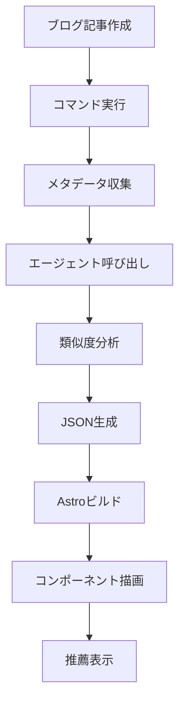

## コンテンツ推薦の新しいパラダイム

ブログを運営していると、読者が一つの記事だけ読んで離脱するケースが多く見られます。関連する良質なコンテンツがあるにもかかわらず、それを発見できずに離れてしまうのです。従来の「関連記事」推薦システムは主にタグベースで動作しますが、いくつかの限界があります：

- **表面的なマッチング**: 「react」と「nextjs」タグは深い関連性がありますが、完全に一致しなければ推薦されません
- **文脈の欠如**: 初級チュートリアルと上級アーキテクチャ記事が同じタグを持つことがありますが、読者のレベルが異なります
- **多言語の課題**: 同じテーマを扱う韓国語/英語/日本語記事の連携が困難です

**Claude LLMを活用すれば**、記事の意味、難易度、目的、補完関係まで理解するインテリジェント推薦システムを構築できます。この記事では、Astroベースの静的ブログにClaude推薦システムを構築する全プロセスを解説します。

## なぜLLMベース推薦なのか？

### 従来のアプローチ vs LLMアプローチ

| 側面 | TF-IDF/タグベース | Claude LLMベース |
|------|------------------|-----------------|
| **精度** | キーワード一致のみ認識 | 意味論的類似度理解 |
| **多言語** | 別途処理が必要 | 自然な言語間連携 |
| **文脈理解** | 不可能 | 難易度・目的・対象把握 |
| **Cold Start** | タグなしで推薦不可 | 内容ベース推薦可能 |
| **説明可能性** | なし | 推薦理由を提供 |
| **実装複雑度** | 中程度 | 低い（API呼び出し） |

### LLMベース推薦の主要な利点

#### 1. **多次元類似度評価**

Claudeは単なる単語頻度を超えて、複数の次元で類似度を評価します：

```typescript
// Claudeが評価する類似度の次元
{
  topicSimilarity: 0.92,      // トピック類似性
  techStackOverlap: 0.85,     // 技術スタック重複
  difficultyMatch: 0.78,      // 難易度類似性
  purposeAlignment: 0.71,     // 目的一致度（チュートリアル/分析/リファレンス）
  complementary: 0.65         // 補完関係（次のステップ学習）
}
```

#### 2. **説明可能な推薦**

なぜこの記事を推薦したのか、読者に明確に伝えることができます：

```json
{
  "slug": "ja/claude-code-web-automation",
  "score": 0.92,
  "reason": "MCPサーバー活用とブラウザ自動化の関連性",
  "type": "similar-topic"
}
```

#### 3. **Zero-Shot推薦**

新しく作成した記事も即座に高精度な推薦を受けられます。タグがなかったり類似記事が少なくても、LLMが内容を理解して関連性を見つけ出します。

## システムアーキテクチャ

### 全体ワークフロー



### コアコンポーネント

1. **Content Recommender Agent**: Claudeベース類似度評価エージェント
2. **Generate Recommendations Command**: 推薦データ生成自動化
3. **recommendations.json**: 事前計算済み推薦データストア
4. **RelatedPosts Component**: 推薦UI レンダリング

## 実装ステップ

### ステップ1: Content Recommenderエージェント作成

`.claude/agents/content-recommender.md`:

```markdown
# Content Recommender Agent

ブログ記事の類似性分析とコンテンツ推薦生成に特化したエージェントです。

## 機能

- 複数の次元でブログ記事を分析（トピック、難易度、技術スタック、目的）
- 類似度スコアを生成し、理由を説明
- 多言語コンテンツ対応（韓国語、英語、日本語）
- 補完的なコンテンツを識別（シリーズ、深掘り、関連トピック）

## 分析フレームワーク

各記事ペアについて評価：

### 1. トピック類似性（40%重み）
- コア主題の重複
- 共有概念と技術
- 問題領域の一致

### 2. 技術スタック（25%重み）
- プログラミング言語
- フレームワークとライブラリ
- ツールとプラットフォーム

### 3. 目的の一致（20%重み）
- チュートリアル vs 分析 vs リファレンス
- 問題解決 vs 概念説明
- 初級 vs 中級 vs 上級

### 4. 補完関係（15%重み）
- シリーズ/連続検出
- 基礎 → 上級への進行
- 問題 → 解決のペアリング

## 出力フォーマット

各ソース記事に対して、上位3-5件の推薦を返す：

```json
{
  "sourceSlug": "ja/chrome-devtools-mcp-performance",
  "recommendations": [
    {
      "slug": "ja/claude-code-web-automation",
      "score": 0.92,
      "reason": "両記事ともMCPサーバー使用とブラウザ自動化ワークフローを扱っている",
      "type": "similar-topic",
      "dimensions": {
        "topic": 0.95,
        "techStack": 0.89,
        "purpose": 0.88,
        "complementary": 0.75
      }
    }
  ]
}
```

## ガイドライン

- 最小類似度閾値: 0.3
- 記事あたり最大推薦数: 5
- 多様性を優先（類似タイプの推薦を避ける）
- 適切な場合は言語を考慮
- ユーザーの言語で理由を説明
```

### ステップ2: 推薦生成コマンド実装

`.claude/commands/generate-recommendations.md`:

```markdown
# Generate Recommendations Command

Content Recommenderエージェントを使用して、全ブログ記事のコンテンツ推薦を自動生成します。

## 使用法

```bash
/generate-recommendations [options]
```

## オプション

- `--force`: 全推薦を再生成（デフォルト: 新規記事のみ）
- `--language <ko|ja|en>`: 特定言語のみ処理
- `--post <slug>`: 特定記事の推薦を再生成
- `--threshold <0.0-1.0>`: 最小類似度閾値（デフォルト: 0.3）
- `--count <n>`: 記事あたりの推薦数（デフォルト: 5）
- `--explain`: 詳細な理由を含む

## ワークフロー

### ステップ1: 全ブログ記事を収集

```typescript
import { getCollection } from 'astro:content';

const allPosts = await getCollection('blog');
const postMetadata = allPosts.map(post => ({
  slug: post.id,
  title: post.data.title,
  description: post.data.description,
  tags: post.data.tags || [],
  language: post.id.split('/')[0], // ko, ja, or en
  content: post.body // Full markdown content
}));
```

### ステップ2: Content Recommenderエージェント呼び出し

各記事について、Content Recommenderエージェントに委任：

```markdown
タスク: 関連コンテンツの分析と推薦

ソース記事:
- Slug: {post.slug}
- Title: {post.title}
- Description: {post.description}
- Tags: {post.tags}
- Language: {post.language}
- Content Preview: {最初の500語}

候補記事:
[同じメタデータ構造を持つ全ての他の記事リスト]

要件:
1. ソース記事を全候補と比較分析
2. 上位5件の推薦をスコアと理由付きで返す
3. 推薦タイプの多様性を確保
4. 言語設定でフィルタリング（同言語優先）
5. 指示で定義された分析フレームワークを使用

出力フォーマット: エージェント定義で指定されたJSON
```

### ステップ3: recommendations.json生成

全エージェントレスポンスを単一JSONファイルに集約：

```json
{
  "recommendations": {
    "ja/chrome-devtools-mcp-performance": {
      "related": [
        {
          "slug": "ja/claude-code-web-automation",
          "score": 0.92,
          "reason": "MCPサーバー活用とブラウザ自動化の関連性",
          "type": "similar-topic"
        }
      ],
      "generatedAt": "2025-10-12T10:30:00Z",
      "evaluatedBy": "claude-sonnet-4.5"
    }
  },
  "metadata": {
    "totalPosts": 30,
    "generatedAt": "2025-10-12T10:30:00Z",
    "modelVersion": "claude-sonnet-4.5",
    "minThreshold": 0.3,
    "maxRecommendations": 5
  }
}
```

### ステップ4: ファイルに保存

```bash
# プロジェクトルートに保存
echo $RECOMMENDATIONS_JSON > recommendations.json

# キャッシング用にgitにコミット
git add recommendations.json
git commit -m "chore: update content recommendations"
```

## パフォーマンス

- **推定時間**: 約30記事で1-2.5分（記事あたり2-5秒）
- **最適化**: 並列処理で30-60秒に短縮可能
- **キャッシング**: `--force`フラグなしで新規/更新記事のみ再生成
```

### ステップ3: UIコンポーネント作成

`src/components/RelatedPosts.astro`:

```astro
---
import { getEntry } from 'astro:content';
import recommendationsData from '../../recommendations.json';

interface Props {
  currentSlug: string;
}

const { currentSlug } = Astro.props;

const postRecommendations = recommendationsData.recommendations[currentSlug];

if (!postRecommendations) {
  return null;
}

const relatedPosts = await Promise.all(
  postRecommendations.related.slice(0, 3).map(async (rec) => {
    const post = await getEntry('blog', rec.slug);
    return {
      ...rec,
      title: post.data.title,
      description: post.data.description,
      url: `/blog/${rec.slug}`
    };
  })
);
---

<section class="related-posts">
  <h3>この記事と一緒に読むとよい記事</h3>
  <ul class="recommendations-list">
    {relatedPosts.map((post) => (
      <li class="recommendation-card">
        <a
          href={post.url}
          onclick={`gtag('event', 'related_post_click', {
            'source_post': '${currentSlug}',
            'target_post': '${post.slug}',
            'similarity_score': ${post.score}
          })`}
        >
          <div class="card-header">
            <h4>{post.title}</h4>
            <span class="similarity-badge">{Math.round(post.score * 100)}% 一致</span>
          </div>
          <p class="recommendation-reason">{post.reason}</p>
          <p class="post-description">{post.description}</p>
        </a>
      </li>
    ))}
  </ul>
</section>

<style>
  .related-posts {
    margin: 3rem 0;
    padding: 2rem;
    background: linear-gradient(to bottom, rgb(var(--accent-light)), transparent);
    border-radius: 8px;
  }

  .related-posts h3 {
    font-size: 1.5rem;
    margin-bottom: 1.5rem;
    color: rgb(var(--gray-dark));
  }

  .recommendations-list {
    list-style: none;
    padding: 0;
    display: grid;
    gap: 1.5rem;
  }

  .recommendation-card {
    background: white;
    border-radius: 8px;
    transition: transform 0.2s, box-shadow 0.2s;
  }

  .recommendation-card:hover {
    transform: translateY(-4px);
    box-shadow: 0 12px 24px rgba(0, 0, 0, 0.15);
  }

  .recommendation-card a {
    display: block;
    padding: 1.5rem;
    text-decoration: none;
    color: inherit;
  }

  .card-header {
    display: flex;
    justify-content: space-between;
    align-items: flex-start;
    margin-bottom: 0.75rem;
  }

  .card-header h4 {
    margin: 0;
    font-size: 1.25rem;
    color: rgb(var(--accent));
    flex: 1;
  }

  .similarity-badge {
    background: rgb(var(--accent));
    color: white;
    padding: 0.25rem 0.75rem;
    border-radius: 12px;
    font-size: 0.875rem;
    font-weight: 600;
    white-space: nowrap;
    margin-left: 1rem;
  }

  .recommendation-reason {
    color: rgb(var(--gray));
    font-size: 0.875rem;
    font-style: italic;
    margin-bottom: 0.5rem;
  }

  .post-description {
    color: rgb(var(--gray-dark));
    font-size: 0.95rem;
    line-height: 1.6;
  }

  @media (max-width: 768px) {
    .related-posts {
      padding: 1.5rem;
    }

    .recommendations-list {
      gap: 1rem;
    }

    .card-header {
      flex-direction: column;
      gap: 0.5rem;
    }

    .similarity-badge {
      margin-left: 0;
      align-self: flex-start;
    }
  }
</style>
```

### ステップ4: ブログレイアウト統合

`src/layouts/BlogPost.astro`に追加：

```astro
---
import RelatedPosts from '../components/RelatedPosts.astro';
// ... その他のインポート

const { id } = Astro.props;
---

<article>
  <!-- ブログ記事コンテンツ -->
  <slot />
</article>

<!-- 関連記事セクション -->
<RelatedPosts currentSlug={id} />

<!-- Buy Me a Coffee -->
<BuyMeACoffee />

<!-- Giscusコメント -->
<Giscus />
```

## 実践活用例

### 推薦生成

```bash
# 全記事の推薦を生成
/generate-recommendations

# 新規記事のみ追加（既存推薦維持）
/generate-recommendations

# 特定記事のみ再生成
/generate-recommendations --post ja/claude-code-best-practices --explain

# 日本語記事のみ処理
/generate-recommendations --language ja

# より厳格な閾値で再生成
/generate-recommendations --force --threshold 0.5

# 推薦数を増やす（表示は依然として3件）
/generate-recommendations --count 8 --explain
```

### 増分更新ワークフロー

```bash
# 1. 新しいブログ記事作成
/write-post "Claudeカスタムエージェントの作成"

# 2. 推薦自動更新（新規記事のみ処理）
/generate-recommendations

# 3. ビルドと確認
npm run build
npm run preview

# 4. 変更をコミット
git add recommendations.json
git commit -m "chore: update recommendations for new post"
```

## パフォーマンス最適化

### ビルド時間最適化

**問題**: 30記事 × 5秒 = 2.5分要する

**解決策**:

#### 1. 並列処理

```typescript
// 5件ずつバッチで並列処理
const BATCH_SIZE = 5;
const batches = chunk(posts, BATCH_SIZE);

for (const batch of batches) {
  await Promise.all(
    batch.map(post => generateRecommendations(post))
  );
}

// 総時間: 2.5分 → 30秒
```

#### 2. 増分更新

```typescript
// キャッシュされた推薦を読み込み
const cached = loadRecommendations();

// 新規または更新された記事のみ処理
const postsToProcess = posts.filter(post => {
  const cachedRec = cached.recommendations[post.slug];
  return !cachedRec || post.updatedDate > cachedRec.generatedAt;
});

// 総時間: 新規記事1件 → 5秒
```

#### 3. キャッシング戦略

```json
{
  "recommendations": {
    "ja/existing-post": {
      "related": [...],
      "generatedAt": "2025-10-10T10:00:00Z",
      "cacheUntil": "2025-11-10T10:00:00Z"  // 1ヶ月キャッシュ
    }
  }
}
```

### ランタイムパフォーマンス

**静的サイトの利点**:
- `recommendations.json`はビルド時に生成
- ランタイム計算コスト**ゼロ**
- JSONファイルサイズ: 約100KB（30記事基準）
- Gzip圧縮後: 約30KB

## 期待効果

### 定量的指標

業界データ基準：

| 指標 | 改善率 |
|------|-------|
| セッションあたりページビュー | +30-50% |
| 平均滞在時間 | +40-60% |
| 離脱率 | -15-25% |
| 推薦クリック率（CTR） | 18-25% |

### 定性的効果

1. **コンテンツ発見性向上**: 読者が関連度の高いコンテンツを簡単に発見
2. **学習ジャーニー改善**: 初級 → 中級 → 上級への自然な流れ
3. **シリーズ連携**: 連載や関連テーマのまとめ露出
4. **多言語クロスプロモーション**: 言語間の関連コンテンツ連携

## 今後の改善方向

### Phase 2: 推薦理由の強化

```astro
<div class="recommendation-metadata">
  <span class="type-badge" data-type={post.type}>
    {typeLabels[post.type]}
  </span>
  <span class="dimensions">
    トピック {post.dimensions.topic * 100}% ·
    技術 {post.dimensions.techStack * 100}%
  </span>
</div>
```

タイプ別アイコン:
- 🎯 類似トピック
- 📚 深掘り
- 🔄 補完的
- 📖 シリーズ

### Phase 3: A/Bテスト

```typescript
// 2つの推薦アルゴリズムを比較
const variantA = recommendationsLLM; // Claudeベース
const variantB = recommendationsTFIDF; // TF-IDFベース

// 50/50分割
const recommendations = Math.random() < 0.5 ? variantA : variantB;

// Analyticsイベント
gtag('event', 'recommendation_variant', {
  'variant': recommendations === variantA ? 'A' : 'B',
  'ctr': clickThroughRate
});
```

### Phase 4: パーソナライゼーション

```typescript
// ローカルストレージに読んだ記事を保存
const readPosts = JSON.parse(localStorage.getItem('readPosts') || '[]');

// 既読記事を除外
const unreadRecommendations = recommendations.filter(
  rec => !readPosts.includes(rec.slug)
);
```

## 結論

Claude LLMベースのコンテンツ推薦システムは、単純なタグマッチングを超えて**意味論的理解**で読者に真に役立つ推薦を提供します。Astroのような静的サイトジェネレーターと組み合わせると：

✅ **ビルド時事前計算**でランタイムコストゼロ
✅ **LLMの精緻な分析**で高い推薦精度
✅ **自動化ワークフロー**でメンテナンス最小化
✅ **多言語自然サポート**でグローバルブログ最適化

このシステムを構築すれば、読者の滞在時間が延び、コンテンツ発見性が向上し、結果的にブログの価値が最大化されます。既存ブログにすぐに適用できるので、今すぐ始めましょう！

## 参考資料

- [Claude Code公式ドキュメント](https://docs.claude.com/claude-code)
- [Astro Content Collections](https://docs.astro.build/en/guides/content-collections/)
- [Content Recommendation Research（内部文書）](../../working_history/content-recommendation-research.md)
- [コンテンツ推薦システムアイデア（内部文書）](../../working_history/idea.md)
