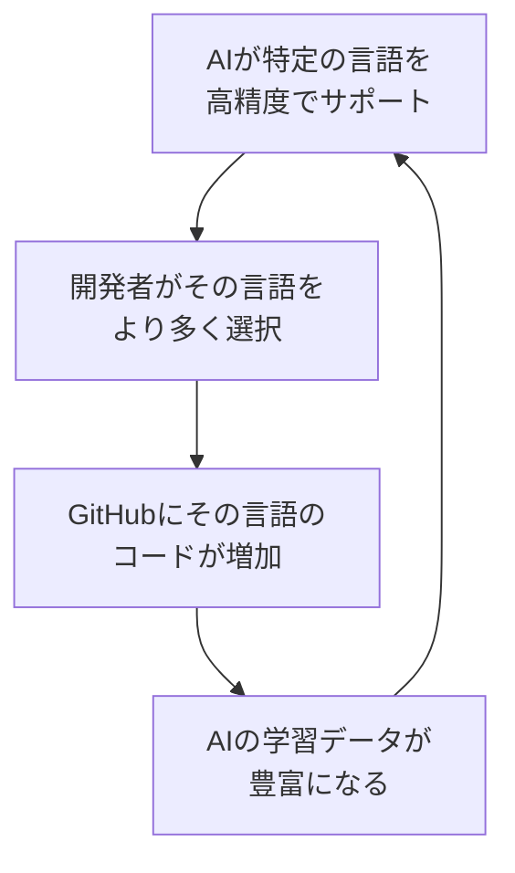
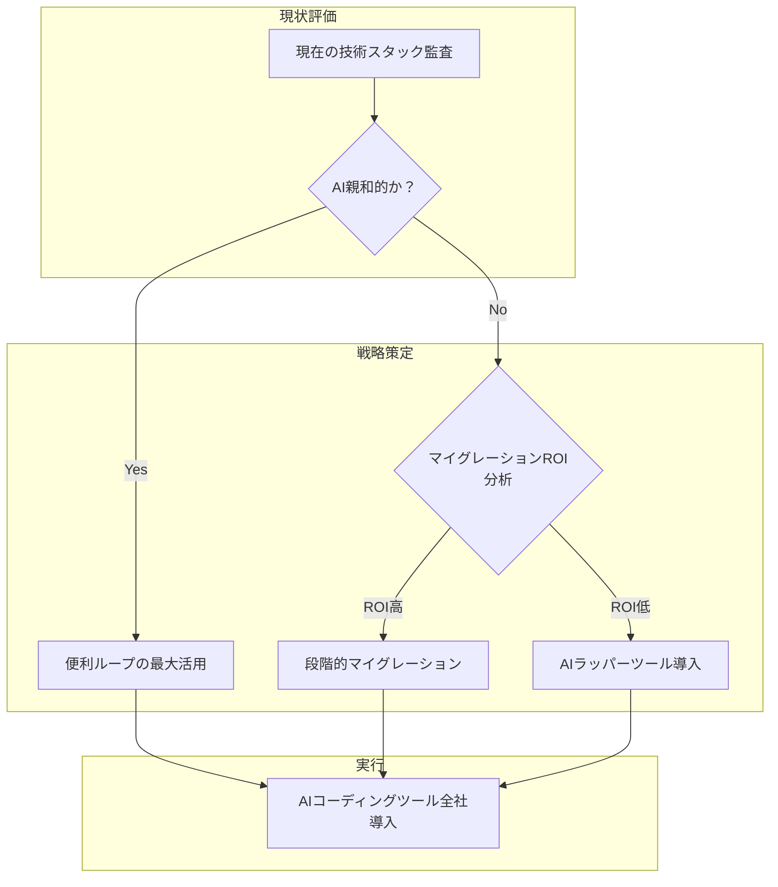

## 概要

AIコーディングアシスタントが単なる「コードを素早く書くツール」にとどまらず、<strong>開発者がどの言語を選択するかまで変えている</strong>というデータが発表されました。GitHubのOctoverse 2025レポートによると、TypeScriptは前年比<strong>66%急騰</strong>し、GitHubで最も使用される言語の第1位に躍り出ました。GitHub開発者アドボケイトのAndrea Griffithsは、これを<strong>「便利ループ（Convenience Loop）」</strong>と名付けました。

本記事では、便利ループのメカニズムを分析し、Engineering ManagerとCTOが技術スタックの意思決定において考慮すべき構造的変化を考察します。

## 便利ループとは何か

### 自己強化フィードバックメカニズム

便利ループ（Convenience Loop）は、以下のような循環構造を持ちます：



AIコーディングツールが特定の技術をフリクションレスに使えるようにすると、開発者はその技術に集中します。これがより多くの学習データを生成し、AIがその技術でさらに正確になる<strong>自己強化サイクル</strong>が形成されます。

### なぜTypeScriptが66%急騰したのか

TypeScriptがこのループの最大の受益者となった理由は、<strong>静的型システムがLLMの動作方式と構造的に相性が良いため</strong>です。

<strong>学術研究データ</strong>：2025年の学術研究によると、LLMが生成したコードのコンパイルエラーのうち<strong>94%が型チェックの失敗</strong>でした。これは、静的タイピングがAIのミスをプロダクション環境にデプロイされる前にキャッチする「セーフティガードレール」の役割を果たしていることを意味します。

```typescript
// TypeScript: AIが型を見て即座に有効な演算のみを提案
function processUser(user: { name: string; age: number }) {
  // AIはuser.nameがstringであることを認識し、.toUpperCase()を正確に提案
  // user.ageには数値演算のみを提案
  return `${user.name.toUpperCase()} (${user.age + 1}歳)`;
}

// JavaScript: AIがランタイム型を推測する必要がある
function processUser(user) {
  // user.nameがstringか、user.ageがnumberか保証なし
  // AIの提案がランタイムエラーを引き起こす可能性がある
  return `${user.name.toUpperCase()} (${user.age + 1}歳)`;
}
```

<strong>核心的な違い</strong>：`x: string`と宣言すれば、AIは即座にstringで動作しないすべての演算を除外します。型がなければ、AIは「おそらくstringだろう」と推測する必要があり、この推測が外れればランタイムエラーにつながります。

### フレームワークエコシステムの加速効果

TypeScriptの急騰は、言語そのものだけの力ではありません。<strong>Next.js、Astro、Remix</strong>などの主要フレームワークがTypeScriptをデフォルトとして採用することでシナジーが生まれました：

- <strong>Next.js 15+</strong>：`create-next-app`がTypeScriptをデフォルトで生成
- <strong>Astro 5+</strong>：Content CollectionsでTypeScriptベースのスキーマバリデーション
- <strong>Remix/React Router 7</strong>：タイプセーフなルーティングをコア機能として提供

フレームワーク → TypeScriptデフォルト採用 → AIコード生成品質の向上 → 開発者採用の増加という<strong>多層便利ループ</strong>が形成されています。

## 言語別AI互換性ギャップ

### AI親和的な言語 vs 非親和的な言語

| 言語 | AIコード生成品質 | 主な理由 |
|------|----------------|----------|
| <strong>Python</strong> | 非常に高い | 教育/MLで圧倒的な学習データ |
| <strong>TypeScript</strong> | 非常に高い | 静的型 + 豊富なエコシステム |
| <strong>Go</strong> | 高い | シンプルな文法 + 明示的なエラーハンドリング |
| <strong>Rust</strong> | 中程度 | 強力な型システムだが所有権ルールが複雑 |
| <strong>C++</strong> | 低い | 複雑な文法、学習データ対比でパターンが多様 |
| <strong>Perl</strong> | 非常に低い | 学習データ不足、文法の曖昧性 |

<strong>注目すべきパターン</strong>：AIツールが十分にサポートする言語へ開発者が移動するにつれ、サポートが弱い言語のラーニングカーブはさらに急峻になります。新しい開発者がC++を学ぶ際にAIの支援をほとんど受けられなければ、PythonやTypeScriptを選択する確率が高まります。

### GitHubデータが示す数字

- <strong>TypeScript</strong>：月間アクティブコントリビューター263万6千人（第1位）
- <strong>Python</strong>：AI/ML研究で25.87%と依然としてトップ
- <strong>パブリックLLM SDKリポジトリ</strong>：110万以上がすでにLLM SDKを使用

この数字が示しているのは、<strong>AIツール互換性が「あれば嬉しい」ではなく、言語選択の核心的な変数</strong>になったという点です。

## EM/CTO視点：技術スタック戦略の変化

### 1. 採用戦略の再検討

AI便利ループは採用市場にも影響を及ぼします：

- <strong>TypeScript/Pythonデベロッパープールが最も急速に成長</strong>：新規開発者がAIとの相性が良い言語から学習
- <strong>レガシー言語エキスパートの希少性が増加</strong>：Perl、COBOLなどはAIサポートが弱く、新規参入が減少
- <strong>AI活用能力が新たな技術力の基準</strong>：言語そのものよりも「AIツールとともに生産的に働けるか」が重要

### 2. 技術的負債への対応戦略



<strong>実務ガイド</strong>：

- <strong>Python/TypeScript中心のスタック</strong>：AIコーディングツールを積極活用し生産性を最大化
- <strong>Java/C#スタック</strong>：静的型のメリットを活かしつつ、AIツールカバレッジの確認が必要
- <strong>動的型レガシー（PHP、Ruby）</strong>：TypeScript型定義の追加や段階的マイグレーションを検討
- <strong>システム言語（C/C++）</strong>：AIサポートが限定的なため、Rustへの移行ロードマップ策定を検討

### 3. 開発生産性測定の変化

従来の生産性指標に<strong>AI活用効率</strong>を追加する必要があります：

- <strong>AI提案採択率</strong>：チームがAIコード提案をどれだけ活用しているか
- <strong>型カバレッジ</strong>：コードベースで型が明示されている割合（AIパフォーマンスと直結）
- <strong>AI起因バグ率</strong>：AIが生成したコードから発生する欠陥の追跡
- <strong>言語別AI ROI</strong>：どの言語/フレームワークでAIツール投資対比の生産性向上が高いか

## 便利ループのリスク

### 多様性の減少問題

便利ループの自己強化特性は、長所であると同時にリスクでもあります：

- <strong>新言語の参入障壁の上昇</strong>：AI学習データが不足している新規言語は開発者の流入が困難
- <strong>特定パラダイムへの偏り</strong>：AIがうまく生成できるコードパターンへの画一化の懸念
- <strong>革新的アプローチの過小評価</strong>：AIが「一般的な」ソリューションを好むことで、非伝統的アプローチが淘汰される可能性

### セキュリティの観点

LLMが生成したコードの<strong>94%が型チェック失敗</strong>というデータは型システムの重要性を示していますが、同時に<strong>AI生成コードの品質がまだ完全ではない</strong>というシグナルでもあります。型システムを備えた言語であっても、セキュリティ脆弱性のレビューは必須です。

## 結論：技術選択の新たな軸

AI便利ループは、プログラミング言語の選択に<strong>新たな次元の基準</strong>を加えました。従来はパフォーマンス、エコシステム、チームの力量が主な基準でしたが、今では<strong>「AIツールとの相性」</strong>が無視できない変数となっています。

<strong>Engineering ManagerとCTOへの主要な示唆</strong>：

1. <strong>技術スタックの決定にAI互換性を公式基準として組み込んで</strong>ください
2. 静的型システムを備えた言語がAI時代に構造的な優位性を持ちます
3. 便利ループの恩恵を最大化しつつ、<strong>多様性の減少とセキュリティリスクをモニタリング</strong>してください
4. チームのAI活用効率を<strong>生産性KPIに反映</strong>することを検討してください

TypeScriptの66%急騰は始まりに過ぎません。AIコーディングツールが高度化するほど便利ループの影響力は強まり、これを理解し活用する組織が開発生産性で先行することになるでしょう。

## 参考資料

- [GitHub Data Shows AI Tools Creating "Convenience Loops" That Reshape Developer Language Choices — InfoQ](https://www.infoq.com/news/2026/03/ai-reshapes-language-choice/)
- [Octoverse: AI leads TypeScript to #1 — GitHub Blog](https://github.blog/news-insights/octoverse/octoverse-a-new-developer-joins-github-every-second-as-ai-leads-typescript-to-1/)
- [Is AI Impacting Which Programming Language Projects Use? — Slashdot](https://developers.slashdot.org/story/26/02/23/0732245/is-ai-impacting-which-programming-language-projects-use)
- [Generative coding: Breakthrough Technologies 2026 — MIT Technology Review](https://www.technologyreview.com/2026/01/12/1130027/generative-coding-ai-software-2026-breakthrough-technology/)
