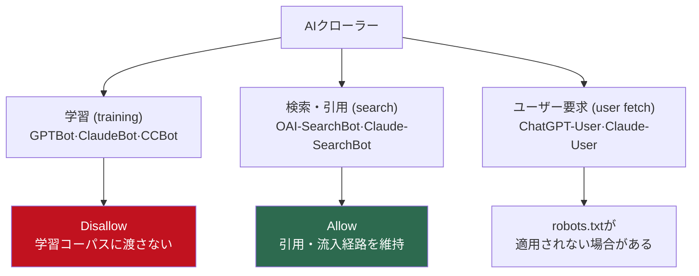

多くのサイトがrobots.txtに `User-agent: GPTBot` / `Disallow: /` の一行を入れて、AIの件はこれで片付いたと考えている。半分は正しい。GPTBotはOpenAIが<strong>モデル学習</strong>に使うクローラーだ。ところがOpenAIには学習用以外のクローラーもあり、そのうちの一つを一緒にブロックすると、ChatGPTの検索が自分のページを引用する機会まで自ら閉ざしてしまう。逆に何も考えず全部開けておけば、コンテンツが学習データとして丸ごと吸い上げられる。

つまり「AIを止めるか通すか」はスイッチ一つの話ではない。2026年のrobots.txtは、少なくとも三種類のボットをそれぞれ違う扱いにする必要がある。私はこれをドキュメントで読んで済ませるのが嫌で、実際にrobots.txtを書き、標準パーサーでルールが意図どおり効くかを回してみた。その過程で、標準パーサーが本物のGooglebotと違う答えを返す箇所も一つ見つけた。順に整理する。

## AIクローラーは一種類ではない: 学習・検索・ユーザー要求の3層

まずクローラーを目的別に分ける。同じ会社のボットでも、やっている仕事はまったく違うからだ。OpenAIの公式ドキュメント([Overview of OpenAI Crawlers](https://developers.openai.com/api/docs/bots))は、自社のボットをこう区別している。

- <strong>GPTBot</strong>（`GPTBot/1.3`）: 生成モデルの<strong>学習</strong>用。ブロックすれば「私のコンテンツを学習に使うな」というシグナルになる。
- <strong>OAI-SearchBot</strong>（`OAI-SearchBot/1.3`）: ChatGPTの<strong>検索</strong>機能が回答を作るとき引用するページを収集する。ブロックするとChatGPTの検索回答から消える。
- <strong>ChatGPT-User</strong>（`ChatGPT-User/1.0`）: ユーザーが「このURLを読んで」と直接指示したときにそのページを取りに行くボット。公式ドキュメントは、これはユーザー起点なので「robots.txtのルールが適用されない場合がある」と明記している。

Anthropicも[公式ヘルプ](https://support.claude.com/en/articles/8896518-does-anthropic-crawl-data-from-the-web-and-how-can-site-owners-block-the-crawler)で同じ構造にボットを分けている。`ClaudeBot`（学習）、`Claude-User`（ユーザー起点のfetch）、`Claude-SearchBot`（検索インデックス）。以前使っていた `anthropic-ai` や `Claude-Web` はサポート終了（deprecated）なので、今これだけでブロックしても空振りだ。

ここで最初の実務判断が出てくる。<strong>学習ボットと検索ボットを一括りにしてはいけない。</strong>「AI全部いや」とGPTBot・OAI-SearchBot・ClaudeBot・Claude-SearchBotをすべて `Disallow` した瞬間、学習の遮断には成功するが、ChatGPTやClaudeの検索回答で自サイトが引用される通り道まで閉じてしまう。トラフィックを望むパブリッシャーにとって、これは損だ。

三つの層とデフォルト戦略を図に整理するとこうなる。



## 2026年のパブリッシャーのデフォルト戦略: 学習は拒否、引用は許可

だから私がデフォルトとして薦める戦略は明確だ。<strong>学習（training）は拒否、検索・引用（search）は許可。</strong>コンテンツを無料の学習コーパスとしては渡さないが、AIの回答に引用されて訪問者が流れてくる道は開けておく。これをrobots.txtに落とすとこうなる。

```text
# --- AI学習(training)クローラー: モデル学習に使わせない ---
User-agent: GPTBot
Disallow: /

User-agent: ClaudeBot
Disallow: /

User-agent: CCBot
Disallow: /

# Google-Extendedは「クローラー」ではなく学習データ利用を制御するトークンだ。
User-agent: Google-Extended
Disallow: /

# --- 検索/引用(search)クローラー: ChatGPT・Claudeの検索に引用されるよう許可 ---
User-agent: OAI-SearchBot
Allow: /

User-agent: Claude-SearchBot
Allow: /

User-agent: PerplexityBot
Allow: /

# --- 一般検索クローラー ---
User-agent: Googlebot
Allow: /
Disallow: /admin/

User-agent: *
Disallow: /admin/
Disallow: /drafts/

Sitemap: https://example.com/sitemap.xml
```

`CCBot`はCommon Crawlのボットで、多くのオープンデータセットがこれを学習ソースに使うため、学習を拒否したいなら一緒に入れるのが正しい。下の表がこの戦略を一目で整理したものだ。

| クローラー | 所属 | 目的 | この戦略では |
|-----------|------|------|-------------|
| GPTBot | OpenAI | モデル学習 | ブロック |
| OAI-SearchBot | OpenAI | ChatGPT検索の引用 | 許可 |
| ChatGPT-User | OpenAI | ユーザー直接要求 | robots.txt適用外（公式） |
| ClaudeBot | Anthropic | モデル学習 | ブロック |
| Claude-SearchBot | Anthropic | 検索インデックス | 許可 |
| Google-Extended | Google | 学習データ利用の制御トークン | ブロック（下の落とし穴に注意） |
| Googlebot | Google | 一般検索（AI Overviews含む） | 許可 |
| CCBot | Common Crawl | 学習コーパス収集 | ブロック |
| PerplexityBot | Perplexity | 回答エンジンの引用 | 許可 |

もちろんこれは「引用トラフィックを<strong>望む</strong>サイト」のデフォルトだ。有料コンテンツやコミュニティアーカイブのように引用すら望まないサイトなら、検索ボットもブロックするのが正しい。正解は一つではない。ただ、たいていのブログやドキュメントサイトなら、この「学習拒否＋引用許可」の組み合わせが合理的な出発点だと思う。

クローラーが到着した後、実際に何を読み取るかは別の層の話だ。その部分は[LocalBusiness構造化データをサーバーサイドで出力する話](/ja/blog/ja/localbusiness-structured-data-server-side-vs-js-2026)で別に扱った。robots.txtが「誰を入れるか」なら、マークアップは「入ってきたボットに何を見せるか」だ。
そして複数の言語で運営するサイトなら、上記robots.txtのSitemapディレクティブが運ぶhreflangシグナルが実際に双方向でかみ合っているかも別途確認すべきだ。その監査の過程は[自分の4言語ブログのhreflangを直接監査した記録](/ja/blog/ja/hreflang-reciprocity-audit-multilingual-2026)にまとめた。


## 実際に検証した: ルールは本当に意図どおり効くのか

robots.txtは書くことより、<strong>自分の意図どおりに本当に動くかを確認すること</strong>が難しい。タイプミス一つで全体のルールが無効化されるファイルなのでなおさらだ。そこで上のrobots.txtを一時ディレクトリに保存し、Python標準ライブラリの `urllib.robotparser` で、各ボットが特定のパスを取得できるか一つずつ聞いてみた。別途インストール不要の標準パーサーなので再現も簡単だ。

```python
import urllib.robotparser as rp

p = rp.RobotFileParser()
p.parse(open("robots.txt").read().splitlines())

cases = [
    ("GPTBot",           "/blog/my-article"),
    ("OAI-SearchBot",    "/blog/my-article"),
    ("ClaudeBot",        "/blog/my-article"),
    ("Claude-SearchBot", "/blog/my-article"),
    ("Google-Extended",  "/blog/my-article"),
    ("Googlebot",        "/blog/my-article"),
]
for ua, path in cases:
    print(ua, path, p.can_fetch(ua, path))
```

実行結果はこう出た。

```text
user-agent         path                 allowed?  note
----------------------------------------------------------------------
GPTBot             /blog/my-article     False     学習クローラー(OpenAI)
OAI-SearchBot      /blog/my-article     True      検索/引用クローラー(OpenAI)
ClaudeBot          /blog/my-article     False     学習クローラー(Anthropic)
Claude-SearchBot   /blog/my-article     True      検索クローラー(Anthropic)
Google-Extended    /blog/my-article     False     Google学習トークン
Googlebot          /blog/my-article     True      一般検索(AI Overviews含む)
Googlebot          /admin/secret        True      一般検索 - 機密パス
PerplexityBot      /blog/my-article     True      Perplexity検索
CCBot              /blog/my-article     False     Common Crawl(学習ソース)
SomeRandomBot      /drafts/wip          False     その他ボット - ドラフト
```

意図どおりだ。学習ボット（GPTBot, ClaudeBot, Google-Extended, CCBot）はすべて `False`（ブロック）、検索ボット（OAI-SearchBot, Claude-SearchBot, PerplexityBot）は `True`（許可）。名前を知らない `SomeRandomBot` は `User-agent: *` の `Disallow: /drafts/` ルールに引っかかり、ドラフトのパスでブロックされた。user-agentのマッチングは大文字小文字を区別しないので、`GPTBot` でも `gptbot` でも同じルールに当たる。これは実際のクローラーの挙動とも一致する。

ここまではきれいだった。ところが一行、目に留まった。

## 標準パーサーが本物のGooglebotと違う答えを返した箇所

上のログの `Googlebot /admin/secret → True` を見てほしい。私はGooglebotグループに `Disallow: /admin/` を明確に入れた。それなのに標準パーサーは `/admin/secret` を<strong>許可</strong>と答えた。最初は自分のタイプミスかと思い、何度も見直した。

原因はルールの優先順位の解釈の違いだった。私のGooglebotグループはこうなっている。

```text
User-agent: Googlebot
Allow: /
Disallow: /admin/
```

Pythonの標準パーサーは `Allow: /` を先に満たして通した。だが<strong>本物のGooglebotのルールは違う。</strong>Google公式ドキュメントによれば、AllowとDisallowが衝突した場合、<strong>パスがより長い（より具体的な）ルールが勝つ。</strong>`/admin/secret` に対して `Allow: /` は長さ1、`Disallow: /admin/` は長さ7なので、本物のGooglebotなら、より長い `Disallow: /admin/` を適用して<strong>ブロック</strong>する。

つまり同じrobots.txtを前に、標準パーサーは「許可」、本物のGooglebotは「ブロック」と答える。この不一致は些細に見えるが実務では危険だ。ローカルスクリプトや何かのライブラリでrobots.txtを「テストしたら通った」と安心したのに、そのパーサーがGoogleの最長一致ルールを実装していなければ、実際にはブロックされたり開いてしまったりする、という意味だからだ。

ここでの私の結論はこうだ。<strong>robots.txtの検証は、必ずそのクローラーが実際に使うルールで確認すべきだ。</strong>Googleならサーチコンソールのrobots.txtテスター、OpenAIなら公式ドキュメントのボット別挙動を基準に見る。汎用パーサー一つで「OK」と流すな。今日私が見つけたこの一行が、その証拠だ。（ちなみに、この「ツールが通したから全部OK」という落とし穴はアクセシビリティでも同じように現れる。[Lighthouse 100点がWCAG準拠を意味しないこと](/ja/blog/ja/a11y-lighthouse-audit-fix-2026)と、まったく同じ種類の錯覚だ。）

## Google-Extendedの落とし穴: AI Overviewsは止められない

上の表で「Google-Extended: ブロック（落とし穴に注意）」と書いた理由がここにある。多くの開発者が `User-agent: Google-Extended` / `Disallow: /` を入れ、「これでGoogleのAIが私のコンテンツを使わない」と安心する。これも半分しか正しくない。

Google公式の説明（[AI Features and Your Website](https://developers.google.com/search/docs/appearance/ai-features)）によれば、Google-Extendedは<strong>クローラーではなく</strong>、すでにクロール済みのコンテンツをGeminiなどの生成モデルの<strong>学習に使うか</strong>を制御するトークンだ。コンテンツ自体は依然としてGooglebotがクロールする。そして決定的な部分。<strong>Google-Extendedをブロックしても、AI Overviewsには露出し続ける。</strong>AI Overviewsは別の学習データではなく、Google検索のライブインデックスから回答を引いてくるからだ。

ではAI Overviewsだけ外すには？ まともな方法がない。`nosnippet` メタタグを使えばAI Overviewsの引用から外れられるが、それは<strong>通常の検索スニペットまで一緒に殺す。</strong>検索結果に自分の説明テキストが出なくなるのを受け入れる、という意味だ。事実上「通常検索はそのままにAI Overviewsだけ抜ける」は、現状きれいな方法がない。これは私の推測ではなく、Googleのドキュメントで確認できる構造的な限界だ。

だから開発者に必要なのは正確な期待値だ。Google-Extended `Disallow` がやる仕事は「Geminiの学習に使うな」までで、「GoogleのすべてのAI機能から外して」ではない。この二つを混同すると、robots.txtに一行入れて、やれていないことをやれたと錯覚する。

## llms.txtは今入れる価値があるか: 正直な現状

ここまで来ると自然に出てくる問い。「では最近よく話題の `llms.txt` は？」結論から言えば、入れて損はないが効果は期待するな。

llms.txtは、サイトがLLMに「ここに主要な文書がある」と案内するマークダウンファイルの提案だ。アイデア自体は悪くない。問題は<strong>2026年現在、主要なAIプロバイダーが誰もこれを実際に使っていないこと</strong>だ。GoogleのJohn MuellerとGary Illyesは公に「検索チームはllms.txtを使わない」と述べ、Muellerはこれを廃れたkeywordsメタタグになぞらえさえした。OpenAI・Anthropic・Meta・Mistralのうち、プロダクションの回答でllms.txtをシグナルに使うと公式に認めたところもない。

数字も冷ややかだ（以下は第三者調査値なので<strong>参考、公式ではない</strong>）。ある業界分析は、llms.txtを置いたサイトの相当数が実際のAIボット訪問をほとんど受けなかったと報告し、5億件規模のAIボット訪問を観測した別のモニタリングでは、llms.txtを直接狙ったリクエストがごくわずかにとどまった。ファイルは増えるのに、読むボットがいない。

私の立場はこうだ。llms.txtは<strong>今は宝くじではなく保険</strong>程度だ。生成コストはほぼゼロで、標準が定着する可能性に備える意味はあるので、入れてもいい。だが「llms.txtを入れたからAI検索によく拾われるだろう」は根拠のない期待だ。その時間はむしろ、上で整理したrobots.txtのボット別制御と構造化データに使うほうが、実測の効果ははるかに大きい。

## だから今日やること: チェックリスト

まとめると、AI時代のrobots.txtは「止めるか通すか」ではなく「ボット別にどう扱うか」の問題だ。今すぐ点検する項目。

1. <strong>ボットを目的別に分けたか。</strong>学習（GPTBot, ClaudeBot, Google-Extended, CCBot）と検索（OAI-SearchBot, Claude-SearchBot, PerplexityBot）を同じルールでまとめて処理していないか確認する。
2. <strong>deprecatedなトークンだけを信じていないか。</strong>`anthropic-ai` や `Claude-Web` だけブロックしているなら、今のAnthropicのボットはブロックされていない。`ClaudeBot` に更新する。
3. <strong>Google-Extendedに過剰な期待をかけていないか。</strong>それはGeminiの学習拒否までで、AI Overviewsの除外ではない。期待値を正確に合わせる。
4. <strong>実際のクローラーのルールで検証したか。</strong>汎用パーサーの「通過」を信じず、Googleはサーチコンソールのrobots.txtテスターで、最長一致ルールまで確認する。
5. <strong>ChatGPT-User・Claude-Userのようなユーザー起点のボットはrobots.txtで止まらない場合があると知る。</strong>これはポリシーではなくユーザーの行動なので、制御の範囲外だ。

robots.txtは法的な強制ではなく、自主的な遵守の取り決めだ。行儀のよいボットは守るが、悪質なクローラーは無視する。IPでブロックしようとして、かえってrobots.txtすら読めなくして逆効果になることもある。だからこれは「完璧な遮断壁」ではなく「明示的な意思表示」に近い。その限界を分かって使えば、学習拒否と引用許可という自分の意思を、ボットたちに正確に伝える最も標準的な手段になる。

<strong>2026-07-04 追記</strong>: この戦略を当ブログのrobots.txtにそのまま適用した。学習ボット4種（GPTBot・ClaudeBot・CCBot・Google-Extended）はDisallow、検索ボット3種（OAI-SearchBot・Claude-SearchBot・PerplexityBot）はAllow。適用の際、本文で警告したパーサー差を実際に踏んだ — first-matchパーサーでは`Allow: /`が後ろのDisallowを隠す問題があり、DisallowをAllowより前に置くことで両方のパーサー系で同一動作することを12シナリオで検証した。

---

構造化データをサーバーサイドで確実に出力したい、あるいは既存サイトのrobots.txt・構造化マークアップ・GEO対応が実際に意図どおり動いているか点検したい、という場合は、個人的に相談・実装の依頼を受けている。プロフィールの連絡先から気軽に問い合わせを残してもらえればいい。

---

本記事のようなAI引用・GEOの実測は、noteの連載[「AIに引用されるブログの作り方」](https://note.com/jw_effloow/n/n91d7682a8aff)でも扱っている。検索露出56万回・AI引用19.6万回という当ブログの生データから始まる日本語シリーズだ（一部有料）。
