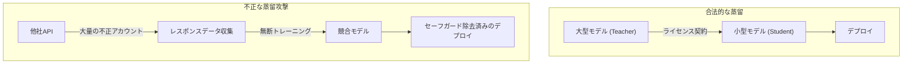
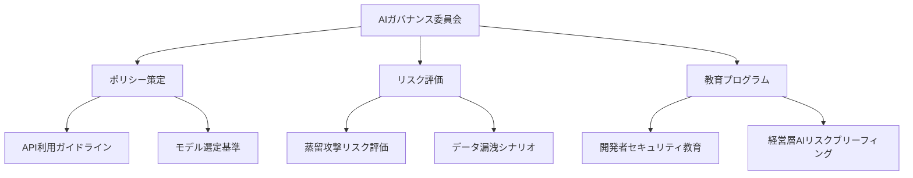

## 1,600万件のリクエスト、24,000個の偽アカウント — 何が起きたのか

2026年2月、Anthropicは自社のClaudeモデルを標的とした大規模な<strong>蒸留攻撃（distillation attack）</strong>を公表しました。DeepSeek、Moonshot AI、MiniMaxの3社の中国AIスタートアップが、約24,000個の不正アカウントと商用プロキシサービスを利用してClaudeとの<strong>1,600万件以上の会話</strong>を生成し、自社モデルのトレーニングに活用していたのです。

各社がターゲットにした領域は異なっていました：

- <strong>DeepSeek</strong>：推論（reasoning）能力、ルーブリックベースの採点、検閲バイパスクエリ（15万件以上）
- <strong>Moonshot AI</strong>：エージェント推論、ツール使用、コーディング、コンピュータビジョン（340万件以上）
- <strong>MiniMax</strong>：エージェントコーディングおよびツール使用能力（1,300万件以上）

Anthropicは、IPアドレスの相関関係、リクエストメタデータ、インフラストラクチャ指標を通じて、各キャンペーンを特定のAI研究所に帰属させることができたと発表しています。

## 蒸留攻撃とは何か

<strong>モデル蒸留（model distillation）</strong>は、本来合法的なマシンラーニング手法です。大型モデル（teacher）の出力を活用して小型モデル（student）をトレーニングする方式で、正当なライセンスのもとで広く使用されています。

問題は、これが<strong>無断で</strong>行われた場合に発生します：



不正蒸留の核心的なリスクは、<strong>セーフガードの喪失</strong>です。元のモデルに組み込まれた有害コンテンツフィルタリングやバイアス防止メカニズムなどが蒸留プロセスで除去され、危険な能力が保護機構なしに拡散する恐れがあります。

## EM/CTO視点での脅威分析

### 企業AIガバナンスへの影響

この事件は単なる企業間の紛争ではありません。AI APIを活用するすべての企業にとって重要な示唆を与えます：

<strong>1. API利用データのセキュリティリスク</strong>

企業がAI APIを通じて送信するデータ — プロンプト、コンテキスト、ビジネスロジック — が外部に漏洩する可能性があるという事実を再認識する必要があります。蒸留攻撃者がこのようなプロキシネットワークを通じてトラフィックを傍受する可能性も存在します。

<strong>2. ベンダー選定時のセキュリティ評価基準の変化</strong>

AIベンダーを選定する際、パフォーマンスとコストだけでなく、<strong>蒸留攻撃への対応能力</strong>も評価する必要があります：

- 行動分類器（behavioral classifier）の実装状況
- 異常使用パターンの検知システム
- アカウント検証および認証強化レベル
- レートリミティングの精度

<strong>3. オープンソースモデルの出所リスク</strong>

不正蒸留で作られたモデルがオープンソースとして公開された場合、それを使用する企業も間接的にIP侵害に関与することになりかねません。モデルの<strong>プロベナンス（出所）</strong>を検証することが重要になっています。

### 国家安全保障レベルの懸念

Anthropicは、不正に蒸留されたモデルが軍事、情報機関、監視システムに投入されるリスクを警告しました。セーフガードが除去されたフロンティアAIモデルが、攻撃的サイバーオペレーション、偽情報キャンペーン、大規模監視に活用される可能性があるとしています。

## 企業の実務対応戦略

### ステップ1：AI API利用ポリシーの再検討

```yaml
# AI APIガバナンスチェックリスト
セキュリティポリシー:
  - 機密データをAI APIに送信する前の分類体系の整備
  - PII/機密データマスキングパイプラインの構築
  - API呼び出しのロギングおよび監査システムの運用

ベンダー管理:
  - AIベンダーの蒸留攻撃対応能力の評価
  - 利用規約のデータ使用条項の確認
  - 定期的なベンダーセキュリティ監査の実施

モデル出所管理:
  - 使用中のオープンソースモデルのトレーニングデータ出所の確認
  - モデルライセンスおよびIPポリシーの確認
  - SBOM（Software Bill of Materials）へのAIモデルの組み込み
```

### ステップ2：技術的防御体制の構築

Anthropicが公開した防御戦略から学べる技術的アプローチ：

<strong>行動分析ベースの検知</strong>

従来のファイアウォール、DLP、ネットワークモニタリングでは、ML-APIレイヤーの脅威を検知できません。以下のような新しい視点でのモニタリングが必要です：

- <strong>使用パターン異常検知</strong>：大量の体系的クエリ、異常な時間帯の使用、反復的パターン
- <strong>アカウントクラスタ分析</strong>：同一IP帯域、類似したクエリパターンを持つアカウントグループの検知
- <strong>フィンガープリンティング</strong>：モデル出力に検出可能なウォーターマークの埋め込み

### ステップ3：組織レベルのAIリテラシー強化



## 業界全体の対応方向

この事件以降、AI業界では以下のような動きが見られます：

<strong>1. 業界全体の連携強化</strong>

AnthropicはOpenAIと共に、蒸留攻撃に対する業界全体の対応を呼びかけています。個々の企業の防御だけでは不十分であり、AI業界、クラウドプロバイダー、政策立案者の協力が必要です。

<strong>2. Microsoftのオープンウェイトモデル向けバックドアスキャナー</strong>

Microsoftは、オープンウェイトAIモデルのバックドアを検出するスキャナーを開発しました。これは蒸留されたモデルに埋め込まれた悪意のある機能を識別するのに活用できます。

<strong>3. 規制フレームワークの進化</strong>

米国のAIチップ輸出規制の議論と相まって、AIモデルのIP保護に関する規制議論も活発化しています。

## 実務担当者のための要点整理

| 領域 | 対応策 | 優先度 |
|------|--------|--------|
| APIセキュリティ | 機密データの分類およびマスキング | 即時 |
| ベンダー管理 | 蒸留防御能力の評価を追加 | 1ヶ月以内 |
| モデル管理 | オープンソースモデルの出所検証 | 四半期ごと |
| 組織 | AIガバナンス委員会の設置 | 3ヶ月以内 |
| 教育 | 開発者向けAIセキュリティ教育 | 半期ごと |
| モニタリング | API利用異常検知システム | 6ヶ月以内 |

## 結論 — 「信頼せよ、されど検証せよ」

AIモデル蒸留攻撃は、AI産業の信頼基盤を揺るがす事件です。EMやCTOとして私たちができることは明確です：

1. <strong>利用中のAI APIのセキュリティポリシーを再検討</strong>し
2. <strong>オープンソースモデルの出所を検証</strong>し
3. <strong>組織内のAIガバナンス体制を整備</strong>すること

AI技術の民主化は歓迎すべきことですが、それが他者の知的財産を無断で収奪する形であってはなりません。「信頼せよ、されど検証せよ（Trust but verify）」の原則は、AI時代においても依然として有効です。

## 参考資料

- [Anthropic公式発表: Detecting and Preventing Distillation Attacks](https://www.anthropic.com/news/detecting-and-preventing-distillation-attacks)
- [CNBC: Anthropic accuses DeepSeek, Moonshot and MiniMax of distillation attacks on Claude](https://www.cnbc.com/2026/02/24/anthropic-openai-china-firms-distillation-deepseek.html)
- [TechCrunch: Anthropic accuses Chinese AI labs of mining Claude](https://techcrunch.com/2026/02/23/anthropic-accuses-chinese-ai-labs-of-mining-claude-as-us-debates-ai-chip-exports/)
- [The Hacker News: Anthropic Says Chinese AI Firms Used 16 Million Claude Queries](https://thehackernews.com/2026/02/anthropic-says-chinese-ai-firms-used-16.html)
- [Google GTIG: AI Threat Tracker — Distillation and Adversarial AI Use](https://cloud.google.com/blog/topics/threat-intelligence/distillation-experimentation-integration-ai-adversarial-use)
