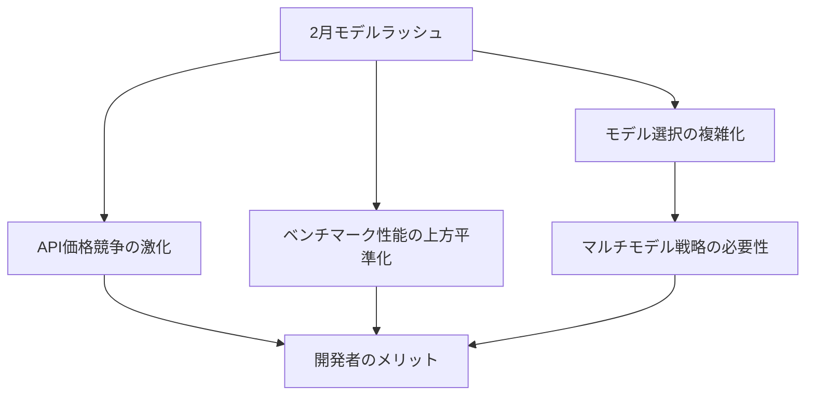

2026年2月、AI業界に前例のない事態が起きています。<strong>7つの主要AIモデルが同じ月にリリース予定</strong>というニュースが伝わり、業界はまさに「モデルラッシュ（Model Rush）」状態に突入しました。

## 2月リリース予定モデル一覧

[Mark（@mark_k）のXポスト](https://x.com/mark_k/status/2020822166984372373)によると、以下の7モデルが2026年2月中にリリース予定です。

| モデル | 開発元 | 備考 |
|--------|--------|------|
| <strong>Gemini 3 Pro GA</strong> | Google DeepMind | Gemini 3 Proの正式リリース（General Availability） |
| <strong>Sonnet 5</strong> | Anthropic | Claude Sonnetシリーズの次期バージョン |
| <strong>GPT-5.3</strong> | OpenAI | GPT-5シリーズのマイナーアップデート |
| <strong>Qwen 3.5</strong> | Alibaba Cloud | オープンソース陣営の強者 |
| <strong>GLM 5</strong> | Zhipu AI | 中国AIスタートアップの次世代モデル |
| <strong>Deepseek v4</strong> | DeepSeek | 推論特化モデルの新バージョン |
| <strong>Grok 4.20</strong> | xAI | Elon MuskのxAIによる最新モデル |

## なぜ2月に集中するのか？

### 1. 年初発表シーズンの本格化

CESとMWCの間に位置する2月は、企業が一年の技術ロードマップを提示する時期です。特に2026年はAI競争が極度に過熱し、各企業が競合他社より先に市場を先取りしようとする動きが顕著です。

### 2. オープンソース vs クローズドソースの全面戦

今回のラッシュで注目すべきは、<strong>オープンソースモデル（Qwen 3.5、DeepSeek v4）とクローズドソースモデル（Gemini、Sonnet、GPT）が同時に激突</strong>する点です。2025年下半期からオープンソースモデルの性能が急激に向上し、クローズドソース陣営もより速いアップデートサイクルで対応しています。

### 3. 中国AI企業の台頭

GLM 5（Zhipu AI）、DeepSeek v4、Qwen 3.5と<strong>中国発モデルが3つ</strong>も含まれています。これは米中AI競争がモデルレベルでも本格的に展開されていることを示しています。

## 各モデルの注目ポイント

### Gemini 3 Pro GA — Googleの本格的反撃

Gemini 3 Proはすでにプレビュー段階でマルチモーダル性能と長いコンテキストウィンドウで注目を集めました。GA リリースに伴い、API安定性と価格競争力がどう変化するかが焦点です。

### Sonnet 5 — Anthropicのバランス戦略

ClaudeシリーズにおいてSonnetは性能とコストのバランスポイントを担っています。Sonnet 5がコーディング、分析、創作などどの領域で差別化を図るか注目されます。

### GPT-5.3 — OpenAIの漸進的進化

GPT-5リリース後、マイナーアップデートを重ねるOpenAIの戦略です。5.3では推論能力とツール使用（function calling）精度の向上が期待されます。

### Qwen 3.5 — オープンソースの新基準

Alibaba CloudのQwenはオープンソースLLMの中で最も速いアップデートサイクルを見せています。3.5では多言語性能とコーディング能力の大幅な向上が予想されます。

### GLM 5 — Zhipu AIの挑戦

GLMシリーズは中国国内で強力な地位を築いており、GLM 5でグローバル市場への本格進出が見込まれます。

### DeepSeek v4 — 推論の最終兵器

DeepSeekは推論（reasoning）特化モデルとして注目されてきました。v4では数学、コーディング、論理的推論ベンチマークで新記録を打ち立てる可能性が高いです。

### Grok 4.20 — xAIの独自路線

xAIのGrokはリアルタイム情報アクセスとユーモラスな応答スタイルで差別化してきました。4.20ではエンタープライズAPI強化に焦点を当てると予想されます。

## 開発者への影響

### 1. API価格競争の恩恵

7つのモデルが同時に競争することで、API価格はさらに下落する見通しです。特にオープンソースモデルのセルフホスティングオプションはコスト削減に大きく貢献します。

### 2. マルチモデル戦略の必須化

単一モデルに依存する時代は終わりました。タスクの種類ごとに最適なモデルを選択する<strong>モデルルーティング（Model Routing）</strong>戦略がますます重要になっています。

### 3. ベンチマークを超えた実践的評価

モデルが増えるほど、ベンチマークスコアだけでは判断が難しくなります。自社のユースケースに合った<strong>実践的な評価（Eval）パイプライン</strong>構築が必須となります。

## 今後の展望

2026年2月のモデルラッシュは、AI業界の競争が新たな局面に入ったことを示しています。モデルの絶対的な性能差が縮まる中、今後は<strong>価格、速度、特化領域、エコシステム</strong>がモデル選択の核心的な基準となるでしょう。

開発者として私たちがすべきことは明確です。特定のモデルにロックインされないアーキテクチャを設計し、急速に変化するモデルエコシステムに柔軟に対応できるインフラを構築することです。

## 参考資料

- [Mark（@mark_k）— 2026年2月AIモデルリリーススケジュールまとめ](https://x.com/mark_k/status/2020822166984372373)
