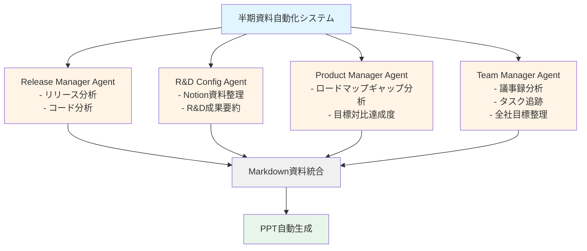

## はじめに：60時間の苦痛

チームリーダーとして、年2回、全社員の前で半期ごとの成果報告を行う必要があります。リリース履歴、研究開発成果、ロードマップに対する実績、チームコミュニケーションの状況まで、すべてを総合してPPTにまとめ、発表しなければなりません。

**従来のプロセスは合計60時間以上を要しました**：
- リリース分析：4-5時間
- R&D資料化：20-30時間
- ロードマップレビュー：4-5時間
- 議事録分析：8-10時間
- 全社目標把握：2-3時間
- PPT作成：20-30時間
- レビューと改善：6-11時間
- 発表練習：5-10時間

しかし、AIと自動化ツールを導入した結果、**この時間を約10時間に短縮**することができました。この記事では、どのようにしてこのような革新的な変化を実現したのか、実践プロセスを共有します。

## 得られる効果

AI自動化システムの導入により、以下のような効果を得ることができました：

### 1. 時間短縮：60時間 → 10時間
単に作業スピードが速くなっただけではありません。反復的で退屈なデータ収集作業をAIが代わりに行うことで、核心メッセージの構成とストーリーテリングに集中できるようになりました。

### 2. データの漏れ防止
人が手作業で整理すると、一部のリリースや会議内容を見落としやすくなります。AIエージェントは指定期間のすべてのデータを漏れなく収集し、体系的に整理します。

### 3. 不要な内容の削除
以前は「もしかしたら必要かもしれない」とすべての内容を含めてしまい、PPTが50-60ページにまで膨らんでいました。AIが重要度を判断し、核心だけを選び出すことで、経営陣に伝えるべきメッセージだけに集中できるようになりました。

### 4. 効果的なストーリーテリング
AIは収集したデータを「Overview → 成果中心のReview → 課題抽出」という論理的な構造に自動整理します。これを基に説得力のあるストーリーを作ることができます。

## 従来のプロセス分析

まず、従来の非効率的なプロセスを詳しく見ていきましょう。

### 1. リリースノートとコード分析（4-5時間）
半期中にデプロイした機能をGitの履歴とリリースノートを調べながら手作業で抽出します。コミットメッセージが不明確だったり、リリースノートが不十分な場合、コードを直接開いて確認する必要がありました。

### 2. R&D資料化（20-30時間）
チーム内で実施した研究開発活動（新技術の検討、POC、パフォーマンス最適化など）を整理する作業です。各エンジニアが作成したNotionドキュメント、Slackの会話、コードコメントなどをすべて探し出して統合する必要がありました。**最も時間がかかるステップ**です。

### 3. 開発ロードマップレビュー（4-5時間）
年初に立てた開発計画と実際の達成内容を比較します。「なぜA機能は完了したのにB機能は遅延したのか？」といったギャップ分析が核心です。

### 4. 議事録分析（8-10時間）
毎週行われるチームミーティング、隔週のビジネスサイドミーティングなどの議事録を読み、主要イシューと意思決定事項を抽出します。半期間に少なくとも20-30件の議事録を確認する必要があります。

### 5. 全社・部門目標の把握（2-3時間）
私たちのチームの成果が全社目標とどのように連携しているかを整理します。CEOの発表資料や部門OKRドキュメントを参照します。

### 6. PPT資料作成（20-30時間）
収集したすべての資料をもとにストーリーを構成し、スライドをデザインし、グラフと表を作成します。**2番目に時間がかかるステップ**です。

### 7. レビューと改善（6-11時間）
同僚や上司にレビューを受け、フィードバックを反映して修正します。通常2-3回の反復が必要です。

### 8. 発表練習（5-10時間）
発表時間（通常10-15分）に合わせてスクリプトを作成し、流れを確認し、実際に発表練習をします。

## AIと生産性ツールの導入

本格的な自動化の前に、日常業務にAIと生産性ツールをまず導入しました。

### 1. Notion AIで議事録を自動作成
[Notion AIの会議ノート機能](https://www.notion.so/help/guides/using-notions-meeting-notes-feature)を活用して、会議中の音声をリアルタイムでテキストに変換し要約します。

**効果**：
- 会議後の議事録作成時間ゼロ
- 会議内容の漏れなし
- 後で検索可能な構造化されたデータの確保

### 2. Notion API MCPで自動ドキュメント化
[Notion API MCP（Model Context Protocol）](https://modelcontextprotocol.io/introduction)を活用して、コードベースから自動でドキュメントを抽出してNotionに整理します。

**自動化された項目**：
- 開発進捗状況
- 発生した問題と解決方法
- 技術調査内容
- 仕様書とAPIドキュメント

**実装例**：
```typescript
// Notion API MCPを通じてコードコメントを自動的にNotionページに変換
// コードに特定のタグを付けると自動的にドキュメント化される
/**
 * @notion-doc
 * @category: Infrastructure
 * @title: Redisキャッシング戦略
 *
 * Redisを活用したAPIレスポンスキャッシングの実装。
 * TTL設定：5分
 * キャッシュキーパターン：api:{endpoint}:{params}
 */
export class CacheService {
  // ...
}
```

### 3. AIコードレビューとインフラトラブルシューティング
Claude Code、ChatGPT、Geminiなど様々なAIツールをコードレビューとインフラ問題解決に積極的に活用します。

**効果**：
- コードレビュー時間の短縮
- エラーログ分析速度の向上
- インフラ設定問題の迅速な解決

## AIエージェントベースの自動化システム

それでは、核心となる半期資料作成自動化システムを紹介します。4つの専門AIエージェントが並列で作業し、それぞれの領域を担当します。

### 全体アーキテクチャ



### 1. Release Manager Agent（リリース管理者）

**役割**：Git履歴とリリースノートを分析して、半期中のすべてのデプロイ履歴を自動整理

**入力データ**：
- Gitコミット履歴（特定の日付範囲）
- GitHub/GitLab Release Notes
- JIRA/Linearチケット情報

**出力形式**：
```markdown
# リリース要約（2024-04 ～ 2024-09）

## 主要機能リリース
- [2024-04-15] ユーザー通知システム v2.0
  - リアルタイムプッシュ通知実装
  - 通知設定カスタマイズ機能

- [2024-06-20] 決済システム改善
  - カカオペイ連携
  - 定期決済機能追加

## バグ修正と改善
- [2024-05-03] ログイン速度40%改善
- [2024-07-12] メモリリーク問題解決

## 統計
- 総デプロイ回数：23回
- 主要機能：8個
- バグ修正：47件
```

**実装のヒント**：
Claude CodeのMCPを活用してGit APIに直接アクセスするか、GitHub Actionsで定期的にリリースデータを収集してNotionに保存します。

### 2. R&D Configuration Agent（研究開発構成管理）

**役割**：Notionに作成された研究開発関連資料を自動的に分類して要約

**入力データ**：
- Notionページ（特定のデータベースフィルタリング）
- 技術調査ドキュメント
- POC結果レポート
- パフォーマンス測定データ

**出力形式**：
```markdown
# 研究開発活動要約

## 新規技術導入
### GraphQL導入検討（2024-04 ～ 2024-05）
- **目的**：REST API比でネットワーク効率性向上
- **結果**：POC完了、一部サービスに段階的適用計画
- **投入工数**：120時間
- **核心学習**：Schema-first設計の重要性

## パフォーマンス最適化
### データベースクエリ最適化（2024-06）
- **問題**：特定API応答時間3秒以上
- **解決**：インデックス追加およびN+1クエリ除去
- **成果**：応答時間300msに短縮（90%改善）
- **投入工数**：40時間

## 統計
- 研究テーマ：5個
- 総投入時間：280時間
- 実際適用：3個
```

**実装のヒント**：
Notion APIを通じて特定期間のページをフィルタリングし、AIが各ページの核心内容を要約するようにします。タグや属性でカテゴリを自動分類します。

### 3. Product Manager Agent（プロダクトマネージャー）

**役割**：ロードマップに対する実際の達成度を分析し、目標と実績のギャップを把握

**入力データ**：
- 年初の製品ロードマップ（Excel/Notion/JIRA）
- Release Managerのリリースデータ
- R&D Agentの研究開発データ

**出力形式**：
```markdown
# ロードマップ対比達成度分析

## 計画対比実績
### 完了した機能（80%達成）
✅ ユーザー通知システム v2.0（計画：Q2、完了：Q2）
✅ 決済システム改善（計画：Q2、完了：Q2）
✅ 管理者ダッシュボード v3（計画：Q3、完了：Q3）

### 遅延した機能（20%）
⚠️ 多言語対応（計画：Q3、予想：Q4）
- **遅延理由**：翻訳リソース不足、外部翻訳会社契約遅延
- **対応方案**：Q4優先順位引き上げ

## ギャップ分析
### 計画になかったが追加された作業
- カカオペイ連携（ビジネス要請により緊急追加）
- データベースマイグレーション（パフォーマンス問題により不可避）

## 影響分析
追加作業により多言語対応スケジュールが1ヶ月遅延。
```

**実装のヒント**：
Product Manager AgentはRelease ManagerとR&D Agentの成果物をインプットとして受け取り、ロードマップExcelと比較します。Claudeのstructured outputを活用してJSON形式でギャップ分析結果を生成します。

### 4. Team Manager Agent（チームマネージャー）

**役割**：AI議事録を分析してタスク進捗状況および全社目標を整理

**入力データ**：
- Notion AI議事録（半期中のすべてのミーティング）
- 全社OKRドキュメント
- 部門目標ドキュメント

**出力形式**：
```markdown
# チームコミュニケーションと目標整合

## 主要会議テーマ分析
### 1. ビジネスサイド協業（10回ミーティング）
- **主要議題**：新規機能優先順位調整、バグ対応
- **意思決定**：カカオペイ連携緊急追加（CEO承認）

### 2. チーム内部ミーティング（24回ミーティング）
- **主要議題**：技術スタック改善、コードレビュープロセス改善
- **アクションアイテム完了率**：85%（34/40件）

## 全社目標対比貢献度
### 2024全社目標：「ユーザー体験革新」
- **私たちのチームの貢献**：
  - 通知システム改編によりユーザー再訪問率15%増加
  - 決済プロセス簡素化により転換率8%向上

### 部門目標：「開発生産性20%向上」
- **私たちのチームの達成度**：
  - AIツール導入によりコードレビュー時間30%短縮
  - CI/CD改善によりデプロイ頻度2倍増加
```

**実装のヒント**：
Notion AI議事録はすでに構造化されているため、特定のキーワード（アクションアイテム、意思決定、イシューなど）を抽出する簡単なスクリプトを作成します。AIが全社目標ドキュメントとマッチングして貢献度を自動計算します。

## PPT自動生成プロセス

4つのエージェントの作業が完了すると、すべての資料がMarkdownファイルとして保存されます。今度はProduct Manager Agentが最終PPTを生成します。

### Step 1：構造化されたMarkdown生成

Product Manager Agentに次のように指示します：

```
以下の資料を活用して、[Overview → 成果中心のReview → 課題抽出]
構造でスライド別Markdownを生成してください：

- release_summary.md
- rnd_summary.md
- roadmap_gap_analysis.md
- team_communication.md

各セクションは以下の原則に従ってください：
1. 1スライドに1-2個の核心メッセージのみ
2. 経営陣が3秒以内に理解できる簡潔な表現
3. 数字とデータで裏付け
4. ビジュアル（グラフ、表）を積極的に活用
```

**出力例**：
```markdown
# Slide 1: Overview
## 2024上半期開発チーム成果要約
- ✅ 主要機能8個リリース（計画対比100%）
- ✅ R&D投資280時間、3個の技術適用
- ⚠️ 多言語対応1ヶ月遅延（Q4完了予定）

---

# Slide 2: リリース成果
## ユーザー体験改善中心の開発
| 機能 | リリース日 | ビジネスインパクト |
|------|-----------|-------------------|
| 通知システム v2.0 | 2024-04 | 再訪問率+15% |
| 決済システム改善 | 2024-06 | 転換率+8% |
| 管理者ダッシュボード v3 | 2024-09 | 運営効率+25% |

---

# Slide 3: R&D活動
## 技術的負債の解消と未来への準備
- **GraphQL導入**：API効率性向上、Q4段階的適用
- **DBクエリ最適化**：応答時間90%改善（3秒 → 300ms）
- **CI/CD改善**：デプロイ頻度2倍増加、障害減少
```

### Step 2：AIレビューと改善

生成された初稿をClaude、Gemini、ChatGPTにそれぞれ添付してレビューを依頼します：

```
添付されたMarkdown資料は半期経営報告用PPT初稿です。
以下の観点から改善点を提案してください：

1. メッセージが明確か？（経営陣の視点）
2. 論理的な流れが自然か？
3. 不要または重複した内容はないか？
4. 数字とデータが説得力を持って提示されているか？
5. ビジュアルで表現すると良い内容はあるか？
```

**AI別フィードバック例**：
- **Claude**：「Slide 2のビジネスインパクトが定量的によく表現されています。ただし、Slide 3のR&D活動は技術用語が多く、非技術系経営陣が理解しづらい可能性があります。『パフォーマンス90%改善』よりも『ユーザー待機時間を10分の1に短縮』の方が直感的です。」
- **Gemini**：「Overviewで遅延した機能に言及するのは良いですが、解決方案を一緒に提示するともっと前向きです。」
- **ChatGPT**：「Slide 3にグラフを追加すると良いでしょう。例：R&D投資時間 vs ビジネスインパクト相関関係」

### Step 3：手動レビューと修正

AIフィードバックを参考に、間違っている部分や文脈が誤っている内容を直接修正します。特に機密性の高い数字やビジネスデータは必ず検証します。

### Step 4：PowerPoint生成

Claude Codeの「Create File」機能を活用してMarkdownをPowerPointに変換します：

```
修正されたMarkdownファイルをもとにPowerPointファイル(.pptx)を生成してください。

要件：
- テンプレート：会社標準テンプレート使用（template.pptx）
- フォント：ナヌムゴシック、タイトル28pt、本文18pt
- 色：会社ブランドカラー（#1E40AF メイン、#F59E0B 強調）
- 表とグラフは可読性優先
- アニメーション：最小化（fade-in程度のみ）
```

またはPythonライブラリ（`python-pptx`）を使用してプログラミング方式で生成することもできます：

```python
from pptx import Presentation
from pptx.util import Inches, Pt

prs = Presentation('template.pptx')

# スライド追加
slide_layout = prs.slide_layouts[1]  # Title and Content
slide = prs.slides.add_slide(slide_layout)

# タイトル追加
title = slide.shapes.title
title.text = "2024上半期開発チーム成果要約"

# 本文追加
content = slide.placeholders[1]
tf = content.text_frame
tf.text = "✅ 主要機能8個リリース（計画対比100%）"
# ...

prs.save('presentation.pptx')
```

### Step 5：発表スクリプト生成

最後にAIに10分間の発表スクリプトを作成させます：

```
添付されたPPTを10分間発表するスクリプトを作成してください。

- 聴衆：経営陣（CEO、CFO、各部門長）
- トーン：自信を持ちながらも謙虚に
- 構造：導入（1分）→ 本論（7分）→ 結論（2分）
- 各スライドごとに話す内容を詳細に記載
- 予想質問と回答も含める
```

**出力例**：
```markdown
## スライド1：導入（30秒）
「こんにちは、開発チームリーダーの山田太郎です。今日は2024年上半期
開発チームの成果と下半期の計画についてお話しします。」

（スライドを指しながら）
「一目でご覧いただけるように、計画していた主要機能8個をすべてリリースし、
新技術導入のためのR&Dにも280時間を投資しました。」

## スライド2：リリース成果（2分）
「まず、リリース成果です。今年上半期は『ユーザー体験革新』という
全社目標に合わせて3つの核心機能をリリースしました。」

（表を指しながら）
「特に4月にリリースした通知システム v2.0はユーザー再訪問率を15%高める
成果を上げ、6月の決済システム改善は転換率を8%向上させました...」

## 予想質問
Q：「多言語対応が遅延した理由は何ですか？」
A：「外部翻訳会社との契約が予想より遅延し、カカオペイ連携が
緊急追加されたことでリソースが分散されました。ただし、下半期最優先課題として
設定しており、Q4には必ず完了する計画です。」
```

## 最終結果と効果

### 時間投入比較

| 段階 | 従来（手作業） | AI自動化 | 削減率 |
|------|---------------|---------|--------|
| データ収集 | 18-23時間 | 2時間 | **90%** |
| 資料整理 | 20-30時間 | 1時間 | **96%** |
| PPT作成 | 20-30時間 | 4時間 | **85%** |
| レビューと改善 | 6-11時間 | 2時間 | **75%** |
| 発表練習 | 5-10時間 | 1時間 | **87%** |
| **合計** | **60+ 時間** | **~10時間** | **83%** |

### 定性的効果

**1. 業務満足度向上**
反復的なデータ収集作業から解放され、創造的なストーリーテリングに集中できるようになりました。

**2. 信頼度向上**
AIが体系的に整理したデータのおかげで、「この数値は正しいですか？」といった質問を受けることが減りました。

**3. 再利用可能なシステム構築**
一度構築したエージェントシステムは次の半期、次の年にも継続して使用できます。改善も容易です。

**4. チーム全体の生産性向上**
Notion AI議事録、自動ドキュメント化など構築したインフラをチーム全体が活用することで、他の業務の効率も一緒に高まりました。

## 構築時の注意点

### 1. データ品質が核心
「Garbage in, garbage out.」AIは入力データの品質に全面的に依存します。Notionドキュメントが不十分だったり、Gitコミットメッセージが不明確だと、AIも適切に整理できません。

**解決策**：普段から文書化とコミットメッセージ作成規則をチームに定着させます。

### 2. AIは検証が必要
AIが生成した内容は必ず人が確認する必要があります。特に数字、日付、因果関係は間違っている可能性があります。

**解決策**：Step 3（手動レビュー）を絶対に省略しません。

### 3. 初期構築コスト
エージェントシステムを最初に構築するには試行錯誤が必要です。最初の半期報告書はむしろ時間がかかる可能性があります。

**解決策**：長期的な視点で投資します。2回目からは本当に10時間で十分です。

### 4. セキュリティと機密情報
社内データをAIに入力する際は、セキュリティポリシーを遵守する必要があります。

**解決策**：オンプレミスLLM（例：Llama、GPT-4 Azure Enterprise）を使用するか、機密情報はマスキング処理します。

## 拡張可能性

このシステムは半期報告書以外にも様々に活用できます：

- **月次チームレポート**：エージェント入力期間を1ヶ月に調整
- **プロジェクト振り返り**：特定プロジェクトのタイムラインとデータのみフィルタリング
- **年次成果評価**：1年分のデータを総合して個人別/チーム別評価資料作成
- **対外発表資料**：カンファレンスや採用説明会用資料にも変換可能

## 結論：AIはツール、核心はプロセス

AI自動化の核心は技術自体ではなく**プロセス設計**です。
- どんなデータが必要か？
- どんな順序で整理するか？
- 最終成果物の形態は何か？

このような質問にまず答えた後、AIはそのプロセスを実行する「ツール」として活用すべきです。

60時間を10時間に減らしたのは、単に「速いツール」を使ったのではなく、**反復作業をシステム化**したためです。AIはそのシステムを実装する最高の手段に過ぎません。

皆さんの業務にもこのような反復的で時間がかかる作業があれば、一度AI自動化を試してみることをお勧めします。最初の試みは難しいですが、一度システムが構築されればその効果は想像以上です。

---

**次回予告**：[AIエージェントシステム構築実践ガイド：Notion API MCPとClaude Codeで自動化パイプラインを作る](/ja/blog/ja/ai-agent-notion-mcp-automation)

ご質問や追加で知りたい内容があれば、コメントでお知らせください！