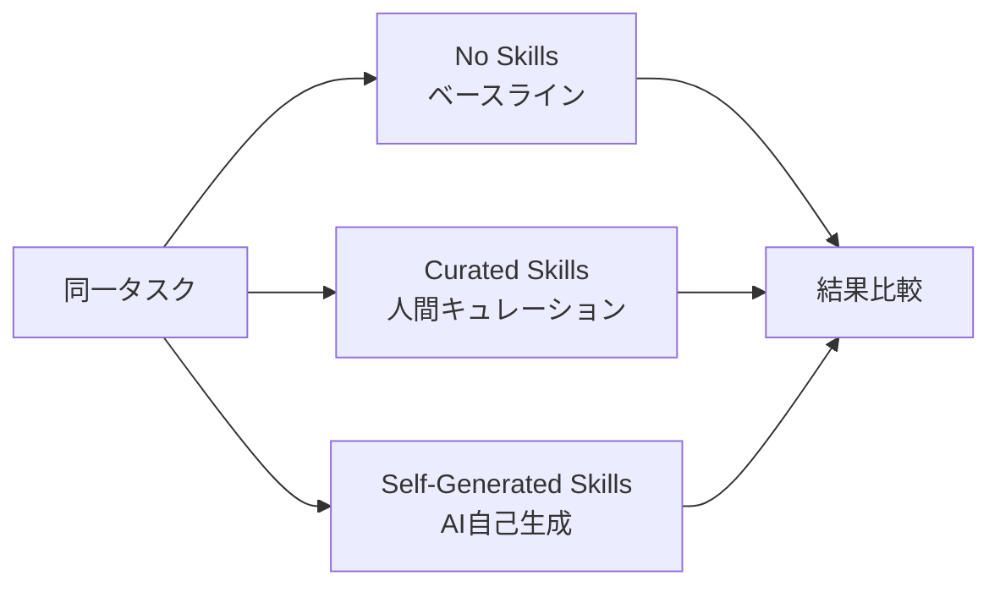
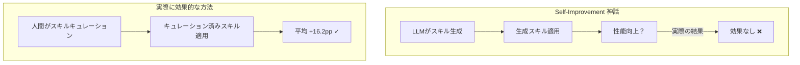

## 概要

「AIが自らより優れたAIを作る」——self-play、self-improvementパラダイムはAI業界の強力なナラティブの一つです。しかし、最新研究<strong>SkillsBench</strong>（arXiv:2602.12670）は、この神話に正面から反論します。

11ドメイン、86タスク、7つのエージェント・モデル構成、<strong>7,308トラジェクトリ</strong>にわたる大規模実験の結果：

- 人間がキュレーションしたスキル：平均<strong>+16.2pp</strong>の性能向上
- AIが自己生成したスキル：<strong>効果なし（0pp）</strong>

つまり、<strong>LLMは自身が消費すれば有益な手続き的知識を、自ら著述する能力を持っていません</strong>。

## Agent Skillとは何か

研究で定義される<strong>Agent Skill</strong>とは、LLMエージェントの推論時に注入される構造化された手続き的知識パッケージです。

```
Skillsパッケージ構造
├── SKILL.md          # 手続きガイド（ワークフロー、SOP）
├── scripts/          # 実行可能スクリプト
├── templates/        # コードテンプレート
└── examples/         # 参考例
```

従来のプロンプトエンジニアリングやRAGとの違い：

| 区分 | System Prompt | RAG | Few-shot | <strong>Skills</strong> |
|------|--------------|-----|----------|---------|
| 構造化 | ✗ | ✗ | ✗ | <strong>✓</strong> |
| 手続き的 | △ | ✗ | ✗ | <strong>✓</strong> |
| 実行可能リソース | ✗ | ✗ | ✗ | <strong>✓</strong> |
| ポータビリティ | ✗ | △ | △ | <strong>✓</strong> |

Claude Codeの`CLAUDE.md`、Gemini CLI、Codex CLIなど、最新のエージェントツールがこのSkillsコンセプトを採用しています。

## 実験設計：3条件の比較

SkillsBenchは同一タスクを3つの条件で評価します：



<strong>実験規模：</strong>
- 11ドメイン（ソフトウェアエンジニアリング、データ分析、ヘルスケアなど）
- 86タスク（105名の貢献者が322候補から選別）
- 7つのエージェント・モデル構成（Claude Code、Gemini CLI、Codex CLI）
- <strong>7,308トラジェクトリ</strong>（全数評価）

すべての評価は決定論的検証器（deterministic verifier）でpass/failを判定し、LLM-as-judgeのバイアスを排除しています。

## 核心的発見1：キュレーションされたスキルは効果的

人間がキュレーションしたスキルは平均<strong>+16.2pp</strong>の性能向上を示しました。ただし、ドメイン別の差異は極めて大きいです：

| ドメイン | 性能向上 |
|---------|---------|
| ヘルスケア | <strong>+51.9pp</strong> |
| データ分析 | 高い向上 |
| ソフトウェアエンジニアリング | <strong>+4.5pp</strong> |
| 一部タスク（16/84） | <strong>マイナス</strong> |

<strong>84タスク中16タスクではスキルがむしろ性能を低下</strong>させた点が重要です。スキルは万能ではありません。

## 核心的発見2：自己生成スキルは無意味

これが本研究の最も衝撃的な結果です。

LLMに「このタスクをうまく遂行するためのスキルを自分で書いてみて」と依頼し、そのスキルを使わせた場合：

> <strong>"Self-generated Skills provide no benefit on average, showing that models cannot reliably author the procedural knowledge they benefit from consuming."</strong>

自己生成スキルの平均効果は<strong>0pp</strong>。一部ではむしろ有害でした。



これは<strong>self-play/self-improvement万能論</strong>に対する強力な反証です。モデルは外部から提供された手続き的知識を<strong>消費</strong>するのは得意ですが、有用な手続き的知識を<strong>生産</strong>する能力が欠如しています。

## 核心的発見3：少ないほうが良い

もう一つの重要な発見はスキルのサイズに関するものです：

> <strong>2〜3モジュールで構成された集中的なスキルが、包括的なドキュメントより効果的</strong>

膨大なマニュアルよりも核心だけを含む小さなスキルパッケージが性能をより引き上げます。これはLLMのコンテキストウィンドウ活用効率に関連していると考えられます。

また、<strong>小さなモデル + スキル ＝ 大きなモデル（スキルなし）</strong>という結果も注目に値します。適切なスキルで武装した小型モデルが大型モデルの基本性能に匹敵できるということです。

## 実務的な示唆

この研究結果がAIエージェントを活用する実務者に与えるメッセージは明確です：

<strong>1. スキル自動生成パイプラインは再考せよ</strong>

「AIが自分のスキルを生成し改善する」というアプローチは、現時点では効果がありません。人間の専門家によるキュレーションが依然として必須です。

<strong>2. スキルは小さく集中的に</strong>

2〜3モジュールの核心スキルが巨大な文書群より効果的です。`CLAUDE.md`を数百行で書くより、核心ワークフローだけを記述するほうが良いです。

<strong>3. ドメイン別の効果差を認識せよ</strong>

ヘルスケア（+51.9pp）とソフトウェアエンジニアリング（+4.5pp）の差は10倍以上です。モデルがすでに精通しているドメインではスキルの限界効用は低くなります。

<strong>4. スキルが有害になりうることを認識せよ</strong>

84タスク中16タスクでスキルが性能を低下させました。誤ったスキルはないほうがましです。

## 技術的分析：なぜ自己生成は失敗するのか

論文は直接的な原因分析を提示していませんが、以下の構造的理由が推論できます：

<strong>メタ認知の限界</strong>：LLMは「何を知らないか」を正確に把握できません。自分に必要な手続き的知識が何かを診断する能力自体が不足しています。

<strong>汎用知識 vs 手続き的知識</strong>：LLMの事前学習データは宣言的（declarative）知識に偏重しています。「どうやって（how-to）」より「何（what）」をより良く学習します。

<strong>検証不可能性</strong>：自己生成されたスキルの品質をモデル自身が検証する手段がありません。キュレーションされたスキルは人間の専門家による検証を経ています。

## 結論

SkillsBenchはAIエージェントスキルに対する初の体系的ベンチマークとして、<strong>「AIの自己改善」という魅力的なナラティブに冷静なデータを提示</strong>します。

核心メッセージはシンプルです：

- ✅ 人間が作ったスキルは効果的（+16.2pp）
- ❌ AIが作ったスキルは効果なし（0pp）
- ✅ 小さく集中的なスキルが膨大な文書より優れる
- ✅ 小さなモデル + 良いスキル ≈ 大きなモデル

self-improvementの夢は魅力的ですが、現在のLLMはまだそのレベルに到達していません。<strong>人間のドメイン専門性とキュレーションは依然として代替不可能</strong>です。

## 参考資料

- [SkillsBench: Benchmarking How Well Agent Skills Work Across Diverse Tasks](https://arxiv.org/abs/2602.12670) — Xiangyi Li et al., 2026
- [Anthropic Claude Code Skills Documentation](https://docs.anthropic.com/en/docs/agents-and-tools/claude-code/skills)
- [Harbor Framework](https://github.com/harbor-ai/harbor) — エージェントベンチマークフレームワーク
