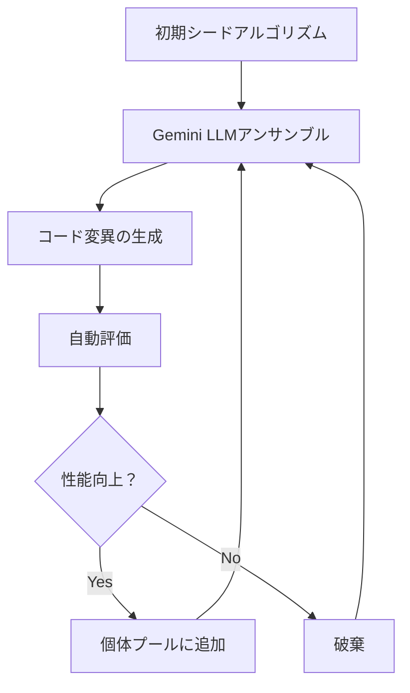
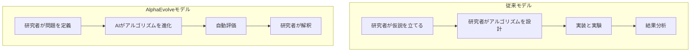
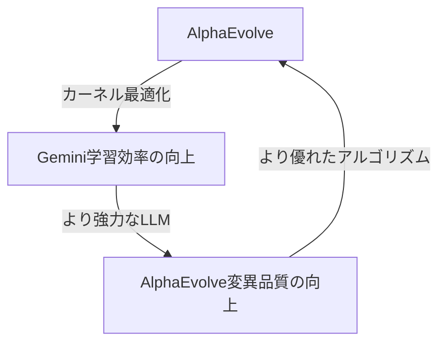

## はじめに

2026年3月10日、Google DeepMindチームがarXivに公開した論文「Reinforced Generation of Combinatorial Structures: Ramsey Numbers」は、静かながらも意義深いマイルストーンを打ち立てました。<strong>AlphaEvolveという単一のメタアルゴリズムが、5つの古典的なラムゼー（Ramsey）数の下界を同時に更新</strong>したのです。一部の記録は20年間維持されていたものでした。

AIがコードを書き、バグを修正し、PRをレビューすることはすでに日常となっています。しかし、AIが<strong>数学者たちが数十年間解けなかった問題の新たな解を発見</strong>するというのは、次元の異なる話です。本記事では、AlphaEvolveの動作原理、ラムゼー数突破の意義、そしてエンジニアリング組織への示唆について整理します。

## ラムゼー数とは何か

ラムゼー理論（Ramsey Theory）は組合せ論の一分野で、「十分に大きな構造には、必ず規則的な部分構造が現れる」という原理を扱います。

<strong>ラムゼー数 R(s, t)</strong>とは、以下を満たす最小の整数nのことです：

> n人の人が集まったとき、必ず互いに全員が知り合いであるs人のグループが存在するか、互いに全員が知り合いでないt人のグループが存在する。

グラフ理論で表現すると、n個の頂点を持つ完全グラフの辺を赤・青の2色で塗り分けたとき、必ず赤い完全部分グラフ K_s または青い完全部分グラフ K_t が現れる最小のnを意味します。

ラムゼー数の正確な値を求めることは、<strong>組合せ論で最も難しい問題のひとつ</strong>として知られています。著名な数学者ポール・エルデシュ（Paul Erdős）はこう述べています：

> 「もし宇宙人が地球を破壊すると脅してR(5,5)の値を要求したなら、我々はあらゆるコンピュータと数学者を動員してその答えを探すべきだろう。しかしR(6,6)を要求されたなら、むしろ宇宙人を攻撃するほうがましだろう。」

## AlphaEvolveが達成したこと

AlphaEvolveは今回、5つのラムゼー数の下界（lower bound）を更新しました：

| ラムゼー数 | 従来の下界 | 新しい下界 | 記録維持期間 |
|-----------|----------|------------|------------|
| R(3, 13) | 60 | <strong>61</strong> | 11年 |
| R(3, 18) | 99 | <strong>100</strong> | 20年 |
| R(4, 13) | 138 | <strong>139</strong> | 11年 |
| R(4, 14) | 147 | <strong>148</strong> | 11年 |
| R(4, 15) | 158 | <strong>159</strong> | 6年 |

単に下界を1ずつ上げただけのように見えるかもしれませんが、ラムゼー数の研究においてこの規模の進展は、<strong>単一の論文としては極めて異例</strong>です。従来は1つのラムゼー数の下界を改善するだけでも数年の研究が必要でした。

さらに注目すべきは、AlphaEvolveが既に正確な値が判明しているすべてのラムゼー数に対しても、その下界を正しく復元したことです。これはシステムの信頼性を実証するものです。

## AlphaEvolveの動作原理

AlphaEvolveは、Google DeepMindが開発した<strong>進化的コーディングエージェント（evolutionary coding agent）</strong>です。核となるアイデアは、「問題を直接解くのではなく、問題を解くアルゴリズムを進化させる」というものです。

### ステップ1：初期化

問題仕様、評価ロジック、そしてシードプログラム（初期アルゴリズム）を定義します。シードプログラムは最適でなくても、問題を解ける基本コードです。

### ステップ2：変異（ミューテーション）

Geminiモデルアンサンブルが現在のコードを分析し、変異されたバージョンを生成します：

- <strong>Gemini Flash</strong>：高速で多様なアイデアを探索（探索の幅）
- <strong>Gemini Pro</strong>：深い分析で質の高い改善案を提示（探索の深さ）

このアンサンブルアプローチが鍵です。Flashが広い空間を探索する間に、Proがブレイクスルーを生み出します。

### ステップ3：進化（エボリューション）

進化アルゴリズムが個体プール（population space）から有望な変異を選択し、それらを組み合わせて次世代の出発点として使用します。

### ステップ4：評価と反復

自動化された評価メトリクスが、各候補プログラムの正確性と品質を定量的に測定します。結果は再びLLMにフィードバックされ、次のラウンドで改善されたソリューションを生成します。

このループが再帰的に繰り返されることで、初期の単純なシードコードが<strong>最先端（state-of-the-art）アルゴリズムへと進化</strong>します。

## メタアルゴリズムが意味するもの

今回のラムゼー数研究で最も驚くべき発見は、AlphaEvolveが独自に発明したアルゴリズムを分析した結果、<strong>人間の数学者が以前に手作業で開発した手法を再発見</strong>していたという点です。

具体的には：

- <strong>ペイリーグラフ</strong>に基づくアプローチ
- <strong>二次剰余（Quadratic Residue）グラフ</strong>の構成法
- その他の代数的グラフ理論手法

AIがこれらの数学的構成法を「学習」したのではなく、進化的探索の過程で<strong>独自に再発見</strong>したのです。これは、AlphaEvolveのメタアルゴリズムアプローチが単純なパターンマッチングを超え、根本的な数学的構造を捉えられることを示しています。

## 既存のAI研究ツールとの違い

AlphaEvolve以前にも、AIが科学研究に貢献した事例はありました。しかし、アプローチには重要な違いがあります：

| システム | アプローチ | 特徴 |
|---------|----------|------|
| AlphaFold | タンパク質構造予測 | 特定ドメインに特化したモデル |
| GPT-5.2 | 理論物理学の推論 | 大規模モデルの推論能力を活用 |
| AlphaEvolve | アルゴリズムの自動発見 | <strong>ドメイン非依存のメタアルゴリズム</strong> |

AlphaEvolveの核心的な差別化ポイントは<strong>汎用性</strong>です。ラムゼー数だけでなく：

- Gemini学習時の行列積カーネルを23%最適化し、全体の学習時間を1%短縮
- 50以上の公開数学問題のうち約20%で、既存の最良解を改善
- キッシング数（Kissing Number）問題など、多様な組合せ論の問題に適用

<strong>ひとつのシステムが数学・最適化・エンジニアリング全般</strong>にわたって成果を上げている点が注目に値します。

## CTO/EMが注目すべきポイント

### 1. AI R&Dパイプラインの変化

AlphaEvolveの事例は、AIが<strong>「ツール」から「研究パートナー」へと進化</strong>していることを示しています。これはR&D組織の運営に構造的な変化を示唆します：

研究者の役割が「アルゴリズム設計者」から<strong>「問題定義者＋結果解釈者」</strong>へと変化しています。

### 2. エンジニアリング最適化への適用可能性

AlphaEvolveはすでにGoogle社内でプロダクション最適化に活用されています：

- <strong>行列積カーネルの最適化</strong>：Gemini学習速度23%向上
- <strong>データセンタースケジューリング</strong>：リソース割り当てアルゴリズムの改善
- <strong>コンパイラ最適化</strong>：自動コード最適化の探索

エンジニアリングチームがすぐに適用できる領域：

- パフォーマンスクリティカルなアルゴリズムの自動最適化
- A/Bテスト戦略の進化的改善
- インフラコスト最適化アルゴリズムの探索

### 3. 「AIがAIを改善する」フィードバックループ

AlphaEvolveがGeminiの学習効率を改善し、改善されたGeminiが再びAlphaEvolveの性能を高める構造は、<strong>自己強化ループ（self-reinforcing loop）</strong>の初期形態です：

このループが加速するほど、AI能力の発展速度は非線形的に増加する可能性があります。CTOとしてこのトレンドをモニタリングし、自社システムに類似の自動最適化パイプラインを設計することが重要です。

### 4. 人材戦略の再考

AIがアルゴリズム設計と最適化をますます上手くこなすようになるにつれて、エンジニアリングチームに求められるスキルの重心が移動します：

- <strong>問題定義能力</strong>：正しい問いを立てる力
- <strong>評価設計能力</strong>：AIが生成した結果を検証するメトリクスの設計
- <strong>結果解釈能力</strong>：AIが発見したソリューションの意味を理解するドメイン知識
- <strong>AIシステムオーケストレーション</strong>：複数のAIエージェントを調整する力

## 今後の展望

AlphaEvolveのラムゼー数突破は始まりに過ぎません。2026年現在、AIが科学研究に与える影響は加速しています：

- <strong>2025年5月</strong>：AlphaEvolve初公開（行列積の最適化）
- <strong>2025年12月</strong>：Google CloudでAlphaEvolveをサービス化
- <strong>2026年3月</strong>：ラムゼー数5件を同時更新

Google Cloudを通じてAlphaEvolveにアクセスできるようになったことで、大企業だけでなくスタートアップや研究機関もこのツールを活用する道が開かれました。

## まとめ

AlphaEvolveのラムゼー数突破は、単なる数学的成果ではありません。これは<strong>AIが人間の知的活動においてますます深い役割</strong>を担うようになる流れのマイルストーンです。

エンジニアリングリーダーとして準備すべきことは：

1. <strong>問題を定義する力</strong>を組織のコアコンピタンスとして育成
2. <strong>自動評価パイプライン</strong>を技術スタックに統合
3. AIを「ツール」ではなく<strong>「研究・最適化パートナー」</strong>としてポジショニングする組織文化
4. <strong>進化的アプローチ</strong>をエンジニアリングプロセスに実験的に導入

コードを書くAIはすでに普及しています。今や<strong>アルゴリズムを発明するAI</strong>の時代が幕を開けています。

## 参考資料

- [Reinforced Generation of Combinatorial Structures: Ramsey Numbers (arXiv)](https://arxiv.org/abs/2603.09172)
- [AlphaEvolve: A Gemini-powered coding agent for designing advanced algorithms (Google DeepMind)](https://deepmind.google/blog/alphaevolve-a-gemini-powered-coding-agent-for-designing-advanced-algorithms/)
- [AI as a research partner: Advancing theoretical computer science with AlphaEvolve (Google Research)](https://research.google/blog/ai-as-a-research-partner-advancing-theoretical-computer-science-with-alphaevolve/)
- [AlphaEvolve on Google Cloud](https://cloud.google.com/blog/products/ai-machine-learning/alphaevolve-on-google-cloud)
