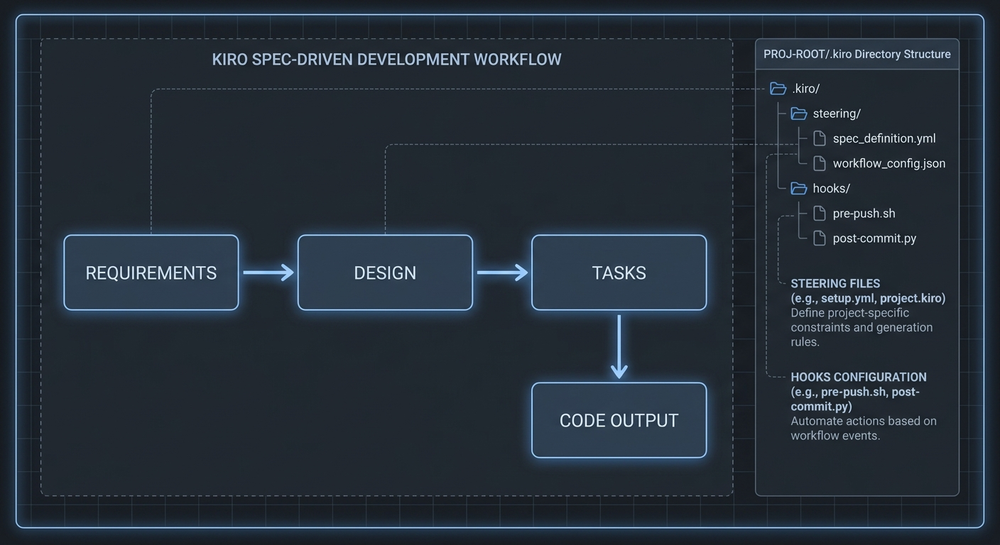

AIコーディングツール市場に新しいプレイヤーが入ってきた。Amazonが2025年7月に公開したKiroは、単純なAI補完ではなく「コードを書く前にスペックを先に書こう」という哲学の上に構築されたIDEだ。Claude Codeを毎日使っている立場から、これが実際にどういう意味を持つのか検討してみた。

結論から言う: KiroとClaude Codeは直接競合関係にない。それぞれ異なる問題を解こうとしている。ただし、この違いを正確に理解しないと両方とも間違った使い方をすることになる。

この記事はSource Reviewによる分析だ。KiroはGUI IDEのため、CLI導入を試みたがmacOSアプリベースで自動化サンドボックスの実行に限界があった。代わりに公式ドキュメント、リリースノート、GitHubイシュー、コミュニティレビューを分析し、`.kiro/`ディレクトリ構造を再現して本文に収めた。実行していない機能を実行したとは書かない。

## Kiroが解決しようとしている問題: 「バイブコーディング」の限界

Kiroの公式キャッチコピーは「Beyond Vibe Coding」だ。感覚的なコーディングを超えようという意味だ。これを理解するには、バイブコーディングのどこが問題なのかをまず見る必要がある。

今多くのチームがAIコーディングツールをこう使っている。「ユーザー認証機能を作って」と入力するとエージェントがコードを生成する。動く。でも2ヶ月後にそのコードがなぜそう設計されたのか誰もわからない。要件ドキュメントもなく、設計決定は口頭だけで行われ、テストは後から追加された。これがバイブコーディングの典型的な結果だ。

Kiroはこれを変えようとする。プロンプトを入れてもコードをすぐ生成せず、まず要件ドキュメントを作り、設計をレビューし、タスクリストを構成してからコードを生成する。開発者が各ステップをレビューして承認してはじめて次に進む。

[スペック駆動開発の哲学](/ja/blog/ja/specification-driven-development)でも触れたが、このアプローチが意味を持つ場面は確かにある。複数の開発者が一緒に複雑な機能を開発するとき、要件が頻繁に変わる環境では、こうした構造化されたワークフローが実際に助けになる。

## スペック駆動開発ワークフロー: 実際の構造

Kiroのスペックシステムは`.kiro/specs/`ディレクトリ以下に3つのファイルを順番に生成する。

```
.kiro/
├── steering/
│   ├── product.md      # 製品が何をするか、誰が使うか
│   ├── tech.md         # スタック、フレームワーク、依存関係
│   └── structure.md    # フォルダ構造、アーキテクチャルール
├── specs/
│   └── user-auth/
│       ├── requirements.md    # EARS記法による要件
│       ├── design.md          # 技術設計、シーケンス図
│       └── tasks.md           # 具体的な実装タスクリスト
└── hooks/
    └── on-save.json    # ファイル保存時の自動実行アクション
```

この中でもっとも重要なのが`requirements.md`だ。KiroはEARS（Easy Approach to Requirements Syntax）記法で要件を構造化する。たとえばこういう形だ。

```markdown
## ユーザーストーリー: タスクへの担当者割り当て

WHEN プロジェクトマネージャーがタスクに担当者を割り当てるとき
THE SYSTEM SHALL 担当者を更新して通知を送信しなければならない
SO THAT 開発者が新しい割り当てを認識できるように

**受入基準:**
- WHEN task.assignee_idが更新されたら THEN 前の担当者に通知
- WHEN task.assignee_idがnullなら THEN 未割り当て状態に変更
- IF assignee_idが存在しない場合 THEN HTTP 404を返す
```

この形式の利点は明確だ。要件が自然言語のように読めながらも構造化されていてAIの誤解が減る。開発者もレビューしやすい。

`design.md`にはこの要件をどう実装するかの技術設計が入る。シーケンス図、DBスキーマ変更、APIエンドポイント設計などが含まれる。`tasks.md`はそれを実際の実装ステップに分解したチェックリストだ。

```markdown
# 実装タスク

- [ ] 1. TaskモデルにAssignee_idフィールドを追加（マイグレーション必要）
- [ ] 2. PATCH /tasks/{task_id}/assignエンドポイントを作成
- [ ] 3. 通知サービスを実装
- [ ] 4. エッジケースのテストを書く（null、無効ユーザー）
- [ ] 5. OpenAPIスキーマを更新
```

「Run all Tasks」を押すとKiroがタスクの依存関係を分析して独立したタスクを並列実行する。公式ドキュメントによれば、ほとんどの機能スペックで実行時間が大幅に短縮されるとのことだ。

## Agent HooksとSteering Files: Kiroが持つ独自の強み



この部分が正直、自分には興味深いと思った。Claude CodeもKiroもHooksの概念があるが、アプローチが違う。

[Claude CodeのHooksシステム](/ja/blog/ja/claude-code-hooks-workflow)は、Claude Code実行イベントにシェルコマンドを紐付ける方式だ。強力だが設定がJSON/シェルスクリプトで行われるため技術的な敷居がある。

KiroのAgent Hooksは違う。自然言語でHookを定義できる。

> 「Reactコンポーネントを保存するたびに: 1) `__tests__`ディレクトリに対応するテストファイルがなければ作成する。2) あれば新しいpropや関数をカバーするように更新する。3) テストを実行して通過するか確認する。」

これが公式ドキュメントの例だ。ファイル保存、ファイル作成、ファイル削除などのイベントにこうしたAIベースのアクションを紐付けられる。コードを書かなくてもチームの品質ゲートを自動化できるということだ。

Steering Filesはもっとシンプルだが実用的だ。`.kiro/steering/`以下のMarkdownファイルにプロジェクトのコンテキストを一度書いておくと、以降のすべての会話でKiroがそれを記憶する。毎回「このプロジェクトはFastAPI + PostgreSQLを使っています」と説明しなくていいということだ。Claude Codeの`CLAUDE.md`と似ているが、Kiroでは`product.md`、`tech.md`、`structure.md`に体系的に分かれている。

正直に言うと、この2つの機能はClaude Codeにはないか、まだ洗練されていない部分だ。Hooksの自然言語定義方式とSteering Filesの構造化は、Kiroが明確に優れた点だと思う。

## 料金と現実的な限界

料金の話をしよう。Kiroの現在のプランはこうだ。

| プラン | 料金 | クレジット | 実際の使用量 |
|--------|------|-----------|------------|
| Free | 無料 | 50 | アクティブなコーディング1〜2時間 |
| Pro | $20/月 | 1,000 | 日常的な開発 |
| Pro+ | $40/月 | 2,000 | ヘビーユーザー |
| Power | $200/月 | 10,000 | チーム/企業 |

Free プラン50クレジットはKiroがどう動くか体験するには十分だが、実際の業務には足りない。1〜2時間で終わる。Pro プラン$20/月、1,000クレジットが一般的な開発者にとって現実的な出発点だ。

Claude Code Maxが$100/月であることと比較するとKiro Proははるかに安い。ただし作業方式が違うため単純な比較は意味がない。

MCP（Model Context Protocol）はKiroも対応している。`.kiro/mcp.json`で設定し、他のMCPクライアントと同じ方式だ。ただし[Claude CodeとOpenAI Codexの比較で見たように](/ja/blog/ja/openai-codex-api-release-vs-claude-code-comparison-may-2026)、Claude Codeエコシステムのサーバー数と成熟度に比べればまだ初期段階だ。

正直に言って残念な点がひとつある: KiroはVS Codeのフォークだ。利点はVS Codeエコシステムの拡張機能をそのまま使えることだ。欠点はVS Code以外のワークフロー、特にターミナル中心の開発者には向かないことだ。私のようにNeovimやターミナルワークフローを好む人にはKiroをメインとして使うのが難しい。

## Claude Codeと何が違うのか

一番多く受ける質問: 「KiroはClaude Codeを代替できるか?」

私の答えはノーだ。少なくとも今は。理由を具体的に見てみよう。

**モデルの性能**: KiroはClaude Sonnet + Amazon Novaを使用する。Claude CodeはClaude Opus 4モデルを直接使える。複雑な推論、マルチステップタスクにおいてOpus 4の性能差は現実的に存在する。

**速度と柔軟性**: Claude Codeはスペックフェーズなしで直接実行する。小さなバグ修正、高速なリファクタリング、探索的なコーディングではClaude Codeが圧倒的に速い。Kiroのスペック生成プロセスには価値があるが時間がかかる。10分の修正にスペックを先に作るのはオーバーヘッドになる。

**ワークフロー統合**: [Claude Codeは様々なエージェントワークフローパターンをサポートしている](/ja/blog/ja/claude-code-agentic-workflow-patterns-5-types)。GitHub、Jira、Slack、内部APIとの統合も設定なしにMCPで接続される。KiroもMCPをサポートしているが生態系の成熟度が違う。

**アプローチの哲学**: 最も根本的な違いだ。Claude Codeは「あなたが望むものを実装します」と言う。Kiroは「一緒に要件を整理して、設計をレビューして、それから実装しましょう」と言う。前者はスピードを、後者は厳密さを選択する。

コミュニティの実際のパターンを見ると、多くのシニア開発者が両ツールを併用している。複雑な新機能の設計にはKiro、実際の実装と反復的な修正にはClaude Code。これが現時点では最も合理的な組み合わせだと思う。

## 私の正直な評価: 誰に向いているか

Kiroが過大評価されているとは思わない。解決しようとしている問題は実際に存在し、アプローチも妥当だ。ただし、いくつかの文脈を明確にする必要がある。

**Kiroが本当に価値を発揮する場合:**
- チームで複雑な機能を開発するとき
- 要件が頻繁に変わりトレーサビリティが重要なとき
- コード品質ゲートを自動化したいがスクリプトを書きたくないとき
- VS Codeをすでにメインで使っているとき

**Kiroが向かない場合:**
- 一人で作業してスピードが最優先のとき
- ターミナル中心のワークフローを好むとき
- すでにClaude CodeやCursorを上手く使っていてワークフローを変えたくないとき
- 作業の80%が既存コードの修正とバグ修正のとき

Kiroのスペック駆動アプローチがAIコーディングツールの未来になり得ると思う。今のようにエージェントがコードを次々と生成する方式は、規模が大きくなると保守が難しくなる。スペックが先にあってコードがそれに従う方式が長期的にはより持続可能だ。

ただしそれが今すぐKiroに乗り換えるべきだという意味ではない。Free プランの50クレジットで実際に触ってみて、自分のワークフローに合うか判断するのが正しい。一度使ってみれば、このツールが何をしようとしているのかすぐ感じ取れる。

AmazonがKiroにClaudeをライセンスして使っているという事実が興味深い。AWSインフラの上でAnthropicのモデルで動くIDEを作ったわけだ。AIツールエコシステムがどれほど複雑に絡み合っていくかを示す事例だ。

---

**参考資料:**
- [Kiro公式ドキュメント](https://kiro.dev/docs/)
- [Kiro紹介ブログ](https://kiro.dev/blog/introducing-kiro/)
- [AWS re:Post — Kiroアーキテクチャ分析](https://repost.aws/articles/AROjWKtr5RTjy6T2HbFJD_Mw/)
- [InfoQ — Kiroスペック駆動AI IDE](https://www.infoq.com/news/2025/08/aws-kiro-spec-driven-agent/)
