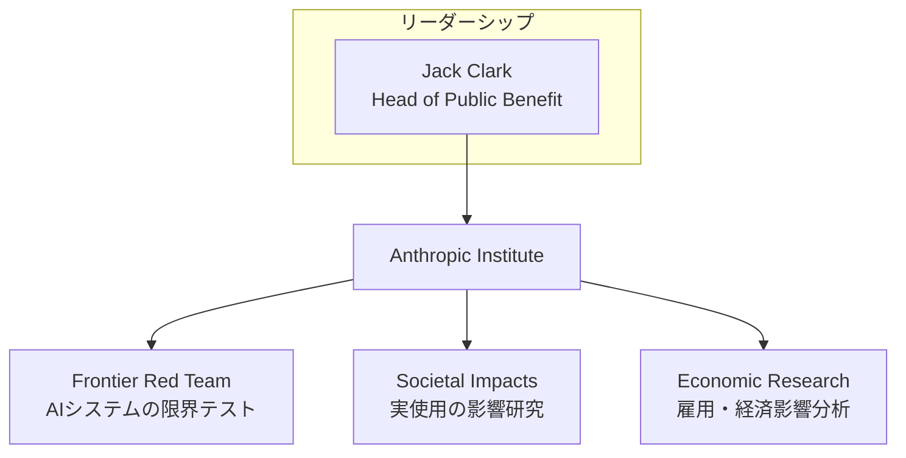
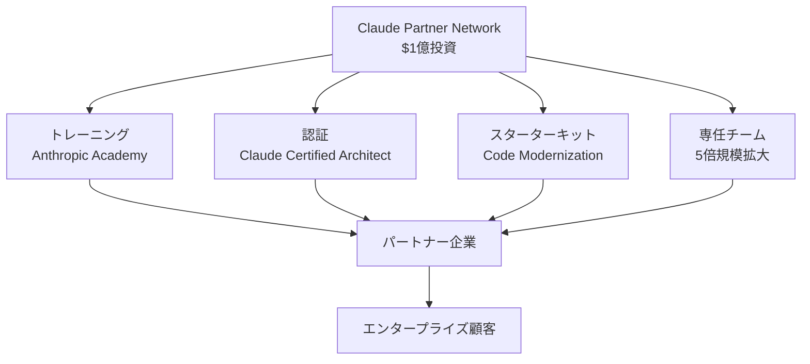

2026年3月11日と12日、Anthropicが2日連続で大型発表を行いました。1つ目はAIの社会的影響を研究する<strong>Anthropic Institute</strong>の設立、2つ目はエンタープライズパートナーエコシステム構築のための<strong>1億ドル規模のClaude Partner Network</strong>投資です。

この2つの発表は単なる新規プログラムのローンチではありません。Anthropicが「モデル会社」から「AIプラットフォームエコシステム企業」へ転換しているという明確なシグナルです。CTOとVPoEの視点から、これが意味するところを分析します。

## Anthropic Institute — AI研究所がなぜ必要なのか

### 3つのチームの統合

Anthropic Instituteは、従来分散していた3つの研究チームを1つの組織に統合したものです。



<strong>Frontier Red Team</strong>は、AIシステムの極限能力をストレステストするチームです。最近ではClaudeを活用してFirefoxコードベースから22件のCVE（セキュリティ脆弱性）を自律的に発見したプロジェクトが代表的です。単に脆弱性を見つけるだけでなく、AIがその脆弱性を自律的にエクスプロイトできるかまでテストしました。このプロジェクトの技術的な詳細は[ClaudeがFirefoxで22件のCVEを発見 — AIセキュリティ監査の新パラダイム](/ja/blog/ja/claude-firefox-22-cves-ai-security-audit)で確認できます。

<strong>Societal Impacts</strong>チームは、AIが実世界でどのように使用されているかフィールドリサーチを行います。<strong>Economic Research</strong>チームは、AIが雇用市場とマクロ経済に与える影響をトラッキングします。

### なぜモデル会社が研究所を作るのか

AIモデルの性能が急激に向上する中、「この技術が社会にどのような影響を与えるか」をモデル開発会社自体が研究する必要性が高まりました。Anthropic Instituteの設立には3つのメッセージが込められています。

1. <strong>規制対応の先手戦略</strong>：外部から規制が来る前に、自社の研究データでポリシー議論に参加するという意思表示です。

2. <strong>エンタープライズ信頼の構築</strong>：大企業顧客に対して「我々はモデルを売るだけでなく、そのモデルが及ぼす影響まで責任を持つ」というシグナルを送ることです。

3. <strong>人材確保</strong>：マシンラーニングエンジニアだけでなく、エコノミスト、社会科学者、サイバーセキュリティ専門家を1つの組織に集めることは、AI安全性人材マーケットにおける競争力を意味します。

## Claude Partner Network — 1億ドルのエコシステム投資

### プログラムの構造



対象パートナーは経営コンサルティングファーム、SIer、AI専門サービス企業です。

### Claude Certified Architect — AIベンダー初の技術認証

Claude Certified Architect、Foundations認証は、Claudeを活用したプロダクションアプリケーションを設計するソリューションアーキテクト向けの技術試験です。

意味：
- 人材マーケットの構造的変化：「Claudeエキスパート」がキャリアトラックになる
- 組織の能力証明：パートナー企業が専門性を証明する公式チャネル
- ベンダーロックインの深化：認証エコシステムはスイッチングコストを高めるツール

### Code Modernization Starter Kit

レガシーコードベースのマイグレーションと技術的負債の解消に向けた標準化されたスタートポイントをパートナー企業に提供します。Claudeを活用したエージェンティックコーディングパターンについては[Claude Codeエージェンティックワークフローパターン5種類](/ja/blog/ja/claude-code-agentic-workflow-patterns-5-types)を参照してください。

## CTOが読むべき3つのシグナル

### シグナル1：AIベンダー評価基準の変化

| 過去の質問 | 2026年の質問 |
|---|---|
| モデル性能ベンチマーク | パートナーエコシステムの規模と成熟度 |
| API価格 | 導入支援体制 |
| コンテキストウィンドウサイズ | 規制対応および安全性研究投資 |
| 推論速度 | レガシーモダナイゼーションツール |

### シグナル2：安全性研究がセールスツールになる

Frontier Red TeamがFirefoxでCVEを発見したことは、研究成果であると同時に強力なエンタープライズセールスメッセージです。

### シグナル3：AI認証エコシステムの始まり

AWS認証がクラウド人材マーケットを構造的に変えたように、AIベンダー認証も同じ効果を生む可能性があります。

## 競合他社との比較ポジショニング

| 領域 | Anthropic | OpenAI | Google |
|---|---|---|---|
| 研究機関 | Anthropic Institute | — | DeepMind |
| パートナープログラム | Claude Partner Network（1億ドル） | Frontier Program | Google Cloud AI Partner |
| セキュリティ戦略 | Frontier Red Team | Promptfoo買収 | Project Zero |
| プロトコル標準 | MCP（Linux Foundation） | Open Responses API | A2Aプロトコル |
| 認証プログラム | Claude Certified Architect | — | Google Cloud AI認証 |

## 実践：エンジニアリングチームが今やるべきこと

### 1. Claude Certified Architect準備の検討
### 2. Partner Networkへの参加検討（無料） — パートナーエコシステムでClaudeエージェントを最大活用する方法は[Anthropic Agent Skills標準：AIエージェント能力の拡張](/ja/blog/ja/anthropic-agent-skills-standard)を参照
### 3. ベンダー評価フレームワークのアップデート

```yaml
model_performance:
  weight: 0.25
ecosystem_maturity:
  weight: 0.30
safety_and_governance:
  weight: 0.20
cost_and_scalability:
  weight: 0.15
developer_experience:
  weight: 0.10
```

### 4. Code Modernizationパイロット

## おわりに

Anthropicの今回の発表は、AI産業が「モデル性能競争」から「エコシステム成熟度競争」へ転換しているという最も明確なシグナルです。

## 参考資料

- [Introducing The Anthropic Institute](https://www.anthropic.com/news/the-anthropic-institute)
- [Anthropic invests $100 million into the Claude Partner Network](https://www.anthropic.com/news/claude-partner-network)
- [Anthropic forms institute to study long-term AI risks](https://www.helpnetsecurity.com/2026/03/11/anthropic-institute-ai-challenges/)
- [Anthropic launches partner network with $100m investment](https://www.investing.com/news/economy-news/anthropic-launches-partner-network-with-100m-investment-93CH-4557957)
