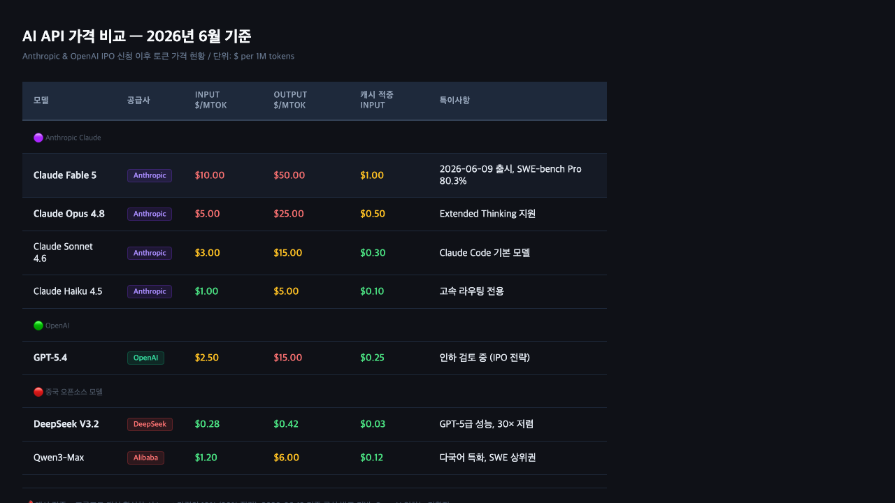

6月1日の朝、AnthropicがSECに非公開のS-1登録書類を提出したというニュースが入ってきた。その1週間後の6月8日、OpenAIが同じ動きを繰り返した。AIの最大手2社が同じ月にIPOを申請するというのは前例のない出来事だ。これは単なる資本市場のイベントではなく、開発者として必ず把握しておくべき構造的な変化だと感じている。

## まず結論から：短期的には開発者にとって有利な状況だ

先に言ってしまうと、今すぐは良いニュースだ。両社ともIPOに向けて成長指標を高めようとしており、その手段のひとつが価格引き下げだ。OpenAIはすでにトークン価格を「大幅に」下げる可能性を検討していると伝えられており、Anthropicも定額制から消費型APIに収益構造を移行させながら市場シェアの拡大を狙っている。

ただ中期的には懸念点がある。上場後に株主への責任が生まれると、価格戦略が変わりうる。そして今の競争圧力の相当な部分が中国のオープンソースモデルから来ており、その価格差は単純な値下げで埋まるレベルではない。

## 6月第1週に何が起きたのか

Anthropicは6月1日に非公開S-1の草稿をSECに提出した。非公開申請は正式なIPO前にSECが内部審査を先行できる方式で、詳細な財務情報はまだ公開されていない。それでも既知の情報だけでも規模がわかる。

- Anthropicの直前Series H調達額：$650億（約10兆円）
- これに基づく企業価値評価：〜$9,650億（約140兆円）
- 年率換算売上（ARR）：〜$470億水準と報道
- IPO予想時期：早ければ2026年10月

OpenAIはそれより1週間遅れた6月8日に同じ手続きを踏んだ。OpenAIの2026年3月ラウンド基準の企業価値は〜$8,520億で、この時点ではAnthropicを下回っていた。

両社が同じ月にIPOを申請したのは偶然ではない。AI投資熱がまだ高い今のタイミングを狙うとともに、相手が先に上場すれば投資家の関心が分散されるという競争ロジックも働いている。

## なぜIPO前に価格を下げようとしているのか

上場前に企業価値を高めるには3つの指標が必要だ：売上規模、成長率、そして市場支配力のナラティブ。今は両社とも3番目の項目で中国のオープンソースモデルに押されている。

[先のAnthropicの価格ポリシー変化の分析](/ja/blog/ja/anthropic-usage-caps-llm-pricing-disruption-analysis-2026)でも取り上げたが、Anthropicは今年初めにOpenClawのようなサードパーティエージェントのサブスクAPIアクセスを遮断し、消費ベースの収益化へ方向転換した。API消費量が増えるほどARRが上がる構造になった。開発者がより多く使うようにすることが、IPOストーリーを強化することになる。

DeepSeek V3.2は現在、入力$0.28/MTok、出力$0.42/MTokでGPT-5レベルのコーディング性能を提供している。これはClaude Sonnet 4.6（$3.00/$15.00）比で入力基準約10倍、Opus 4.8（$5.00/$25.00）比で約18倍安い。Qwen3-Maxも同様の位置にある。西側モデルが価格を維持するなら、企業顧客が中国モデルに移行する誘因が大きくなる。

この圧力が今回の価格引き下げ議論の実質的な背景だ。

## AnthropicのIPO財務指標が示すもの

報じられているARR〜$470億という数字は単なる大きな数字ではなく、Anthropicが上場に向けてどのように収益構造を築いてきたかを示している。

Anthropicには現在3つの主要な収益チャネルがある：API消費型、エンタープライズ契約、Claude.aiサブスクリプションだ。中でも最も成長が速いのはAPI消費型だ。これは今年初めにOpenClawのようなサードパーティツールの[サブスク経由のAPI接続を遮断](/ja/blog/ja/anthropic-usage-caps-llm-pricing-disruption-analysis-2026)した戦略と直結している。安いサブスクのルートを塞いで開発者を直接API課金に誘導すれば、消費されるトークン数がARRに直接反映される。

IPO投資家が重視するのは現在の売上額だけでなく、成長率とその持続可能性だ。もし半年前のARRが$200億で今が$470億なら2.35倍の成長だ。このペースを維持してIPOロードショーに臨むことは非常に価値があり、そのための手段のひとつがわずかな価格引き下げによる量の拡大だ。

開発者が今受けている価格割引は、Anthropicの上場戦略の一部だと理解しておいた方がいい。批判的に見るというより、「今がレバレッジを使うタイミング」として捉えるべきだ。

## 実際のAPIコストは今どこにあるのか

サンドボックスで@anthropic-ai/sdk 0.104.1をインストールして実際のトークンコストを計算した。公式発表基準で、OpenAIは未発表の引き下げ前の現行料金だ。



キャッシュを適用すると数字がかなり変わる。プロンプトキャッシュヒット時には入力トークンコストが10%に下がる（90%削減）。同じ50K入力+2K出力のシナリオで：

- **キャッシュなし**：Claude Sonnet 4.6 → $0.18 / Claude Haiku 4.5 → $0.06
- **80%キャッシュヒット**：Claude Sonnet 4.6 → 〜$0.072 / Claude Haiku 4.5 → 〜$0.024

コードベース分析や長いシステムプロンプトを繰り返し使うワークフローなら、実効コストはsticker priceの30〜40%水準まで下がりうる。それでも[Claude Fable 5の$10/$50という価格設定](/ja/blog/ja/claude-fable-5-mythos-public-api-developer-analysis-2026)と合わせて考えると、Anthropicが高性能モデルでのプレミアム維持と量的拡大の両方を狙っているのがわかる。

## 上場後に開発者が警戒すべき本当のリスク

正直に言うと、今の価格競争は上場前の特殊状況である可能性が高いと見ている。

**第一に、株主圧力が生まれると価格戦略が変わる。** 非上場企業は成長のために価格を下げられるが、上場企業はマージン改善の圧力を受ける。AWS、Azure、GCPも上場初期には積極的に価格を下げ、市場を掌握した後に単価を上げた。両社が上場後に同じパターンを繰り返さないという保証はない。

**第二に、ロックインリスクが現実的だ。** Claude Code、Cursor、Windsurf などのAIコーディングツールがAnthropicのClaudeに強く依存している。コードベースやワークフローが特定のモデルに最適化されるほど、後で価格が上がっても離脱コストが大きくなる。

**第三に、中国モデルのデータ信頼問題はまだ解決されていない。** DeepSeekがいくら安くても、企業内部のコードベースや顧客データを中国のサーバーで処理することへの法務・セキュリティチームの反対は現実的だ。EU GDPR、米国の防衛・医療規制環境では選択肢がさらに狭まる。この点でAnthropicとOpenAIは中国モデルには代替しにくいエンタープライズ信頼性を持っている。

## 今私が取っている戦略

この状況を見て、3つのことを実践している。

**1. モデル抽象化レイヤーを明確に維持する。** コードで `claude-sonnet-4-6` を直接ハードコーディングする代わりに、環境変数や設定ファイルで分離する。価格が変わったりより良い選択肢が生まれた時の離脱コストを減らす最も基本的な方法だ。

```typescript
// 悪い例：モデル名がハードコードされている
const msg = await client.messages.create({
  model: "claude-sonnet-4-6",
});

// 良い例：環境変数で外部化
const MODEL = process.env.CLAUDE_MODEL ?? "claude-sonnet-4-6";
const msg = await client.messages.create({
  model: MODEL,
});
```

**2. プロンプトキャッシュを今使っているワークフローに適用する。** コードベース分析のように同じコンテキストを繰り返し使う場合、キャッシュだけで請求額が半分以下になる。価格が下がるのを待つより現在のツールを最適化する方が確実だ。

**3. 中国モデルを無条件に排除せず、ワークロード別に区別する。** 内部コードが含まれない一般的なテキスト処理、公開データベースの分析などはDeepSeekやQwenをテストする価値がある。一方で顧客データや独自のコードベースが含まれる作業はAnthropicかOpenAIを維持する。

## まとめ — 価格戦争の受益者になりつつ、構造は把握しておく

AnthropicとOpenAIの同時IPOは、短期的にAPIユーザーに有利な環境を作っている。両社とも成長指標を高めるために価格を下げたり機能を素早く追加したりする方向に動く理由がある。

ただし過剰な期待は戒めたい。上場後の株主圧力、モデルのロックイン、データ主権の問題は価格引き下げだけでは解決されない構造的な要素だ。DeepSeekが30倍安いからといってすぐに全ワークロードを移行するのも賢明ではない。

今すべきことはシンプルだ：価格引き下げを享受しつつ、特定のプロバイダーに完全に縛られないアーキテクチャを維持すること。上場後の世界で最も柔軟な開発者が最も少ないコストで仕事できる。
