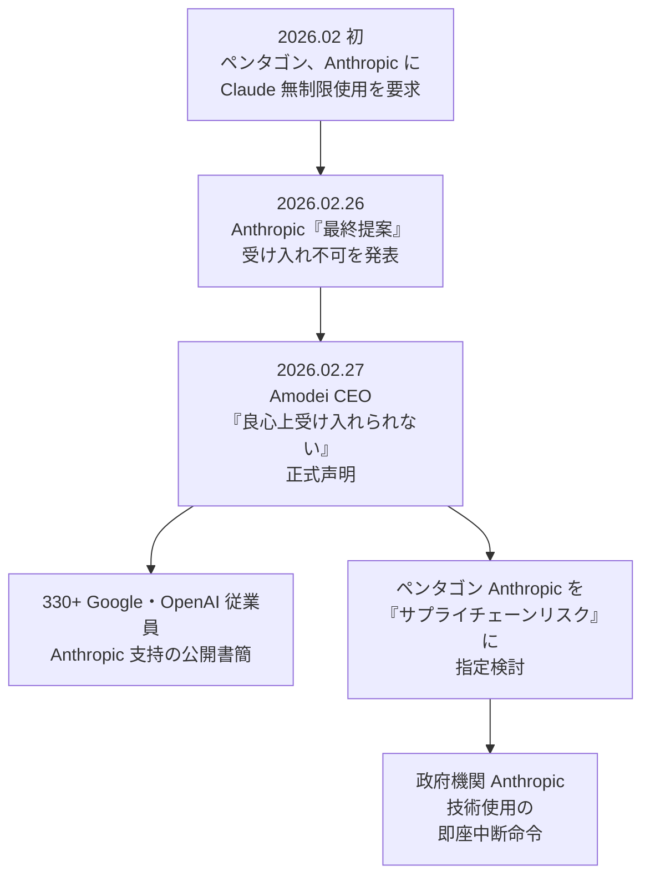
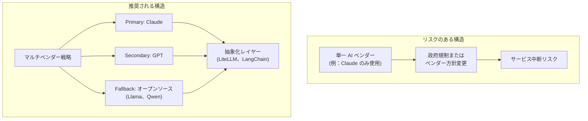
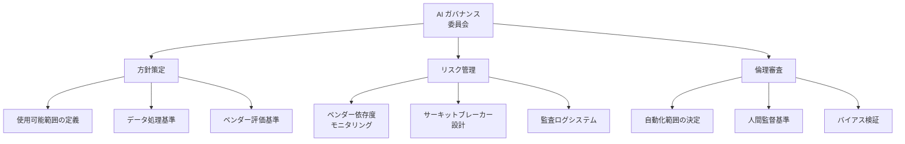
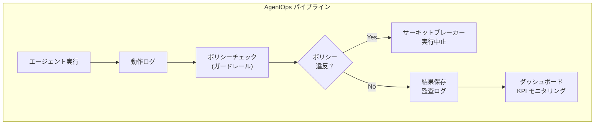

## 概要

2026 年 2 月 27 日、テック業界を揺るがす事件が発生しました。Anthropic CEO の Dario Amodei が、米国国防総省(ペンタゴン)の Claude AI 無制限の軍事使用要求を公式に拒否したのです。この事件は単なる企業-政府間の紛争ではありません。<strong>AI を導入したすべての組織の CTO と VPoE が必ず直面する「AI ガバナンス」という新たな課題</strong>を明確に浮き彫りにした事件です。

このポストでは、事態の本質を分析し、技術リーダーが AI ベンダー戦略とガバナンス フレームワークをいかに構築すべきかについて、実践的なガイドを提示します。

## 事件の本質：何が起きたのか

### タイムライン



### 争点の整理

ペンタゴンが要求したのは、大きく分けて 2 つでした。

<strong>1. 米国市民を対象とした大規模監視(Mass Surveillance)</strong>に Claude を制限なく使用する権限

<strong>2. 人間の関与なしの完全自律兵器(Fully Autonomous Weapons)</strong>に Claude を統合する権限

Anthropic はこの 2 つを「超えられない線」と位置づけて拒否しました。Amodei CEO は正式声明で次のように述べています：

> この 2 つの事案については、良心上受け入れることはできません。

### 業界の反応

注目すべき点は、Google と OpenAI の従業員 330 人以上が Anthropic を公開支持したということです。Google DeepMind の主任研究者 Jeff Dean も大規模監視に反対の意を表明しています。これは AI 業界全体が「AI の軍事的使用」に関する倫理的基準線を形成しつつあることを示しています。

## CTO/VPoE がこの事態から学ぶべき 5 つのポイント

### 1. AI ベンダーは一夜にして使用不可能になる可能性がある

ペンタゴンは Anthropic を「サプライチェーンリスク」に指定し、国防関連企業(Boeing、Lockheed Martin など)が Anthropic 技術を使用できないようにしました。さらには、すべての政府機関による Anthropic 技術の使用中止を命令しました。

<strong>示唆</strong>：貴組織が特定の AI ベンダーに深く依存しているのであれば、政治的・規制的理由によってそのベンダーが突然使用不可能になるシナリオに備える必要があります。



### 2. AI ガバナンスはオプションではなく必須になった

Deloitte の 2026 Tech Trends レポートによると、正式な AI ガバナンス フレームワークを備えた企業は<strong>17% に過ぎない</strong>ものの、これらの企業はエージェント配置の拡大において著しく高い成功率を示しています。

<strong>CTO が確立すべき AI ガバナンス フレームワーク</strong>：



### 3. 「AI ベンダーの倫理的立場」がビジネスリスクになる

Anthropic の事例は、AI ベンダーの倫理的決定が顧客企業のビジネスに直接的な影響を及ぼしうることを示しています。逆に、倫理的基準が低いベンダーを選択すると、評判リスクが発生します。

<strong>ベンダー評価時に確認すべき項目</strong>：

| 評価項目 | 質問 | 重要度 |
|-----------|------|--------|
| 倫理方針 | ベンダーの AI 使用方針(Acceptable Use Policy)は明確か？ | 高 |
| 政府関係 | ベンダーが政府圧力にどう対応しているか？ | 高 |
| データ主権 | データはどの国の管轄権に保存されるか？ | 高 |
| オープンソース代替 | ベンダーがブロックされた場合、オープンソースに移行可能か？ | 中 |
| SLA 保証 | 政治的リスクに対するサービス保証があるか？ | 中 |

### 4. マルチベンダー + 抽象化レイヤーは生存戦略である

2026 年現在、企業が AI ベンダーを選択する際に考慮すべき現実的なアーキテクチャ戦略です。

```typescript
// AI ベンダー抽象化レイヤーの例
interface AIProvider {
  name: string;
  chat(messages: Message[]): Promise<Response>;
  isAvailable(): Promise<boolean>;
}

class AIGateway {
  private providers: AIProvider[];
  private primary: AIProvider;

  async chat(messages: Message[]): Promise<Response> {
    // Primary ベンダーを試行
    if (await this.primary.isAvailable()) {
      return this.primary.chat(messages);
    }
    // フォールバック チェーン
    for (const provider of this.providers) {
      if (await provider.isAvailable()) {
        console.warn(
          `Primary unavailable, falling back to ${provider.name}`
        );
        return provider.chat(messages);
      }
    }
    throw new Error('All AI providers unavailable');
  }
}
```

<strong>核となる原則</strong>：プロンプトとツール定義をベンダー独立的に設計し、API 呼び出しレイヤーのみ交換可能にしてください。MCP(Model Context Protocol)のような標準プロトコルを活用すれば、ベンダー切り替え費用を大幅に削減できます。

### 5. AgentOps と観測可能性(Observability)に投資する

Anthropic-ペンタゴン事態が示すように、AI システムの「何をしているのか」を追跡する能力は、技術的要件を超えて<strong>法的・倫理的必須要件</strong>となっています。



<strong>最低限構築すべき観測可能性項目</strong>：

| 項目 | 説明 | ツール例 |
|------|------|----------|
| 実行追跡 | エージェントがどのツールをどの順序で使用したか | LangSmith、Braintrust |
| コスト監視 | トークン使用量、API 呼び出しコスト | Helicone、OpenMeter |
| ポリシー準拠 | ガードレール違反検出と阻止 | Guardrails AI、NeMo |
| 監査ログ | すべての入出力の改ざん不可能な記録 | 自家構築または Langfuse |

## 実践チェックリスト：月曜日から始められる 3 つのステップ

<strong>ステップ 1：AI ベンダー依存度監査(1 週間)</strong>

現在、組織で使用中の AI サービスをリストアップし、各サービスが中断された場合のビジネスインパクトを評価します。

<strong>ステップ 2：マルチベンダー移行計画の策定(2〜4 週間)</strong>

Primary/Secondary/Fallback 構造を設計し、抽象化レイヤーの導入を検討します。LiteLLM や LangChain のようなツールが迅速なスタート地点になります。

<strong>ステップ 3：AI ガバナンス草案の作成(1 か月)</strong>

経営陣とともに AI 使用方針を定義します。最低限「自動化範囲」「人間監督基準」「データ処理原則」の 3 つは文書化する必要があります。

## 結論

Anthropic vs ペンタゴン事態は、AI 技術が純粋な技術的ツールを超えて<strong>政治的・倫理的・法的複雑性</strong>を内包していることを生々しく示しました。

CTO/VPoE として我々が行うべきことは明確です：

1. 単一ベンダー依存から脱却し、マルチベンダー戦略を確立すること
2. AI ガバナンス フレームワークを組織文化の一部として内在化させること
3. 観測可能性と監査システムを最初から設計すること

AI がビジネスの中核となった 2026 年、<strong>「AI を上手に使うこと」と同じくらい「AI を安全に管理すること」</strong>が技術リーダーの核となる能力になったのです。

## 参考資料

- [Anthropic CEO refuses Pentagon demands - Fortune](https://fortune.com/2026/02/27/dario-amodei-says-he-cannot-in-good-conscience-bow-to-pentagons-demands-over-ai-use-in-military/)
- [Anthropic rejects Pentagon's final offer - Axios](https://www.axios.com/2026/02/26/anthropic-rejects-pentagon-ai-terms)
- [Google & OpenAI employees support Anthropic - TechCrunch](https://techcrunch.com/2026/02/27/employees-at-google-and-openai-support-anthropics-pentagon-stand-in-open-letter/)
- [Deloitte Agentic AI Strategy Report 2026](https://www.deloitte.com/us/en/insights/topics/technology-management/tech-trends/2026/agentic-ai-strategy.html)
- [Best Practices for AI Agent Implementations 2026](https://onereach.ai/blog/best-practices-for-ai-agent-implementations/)
