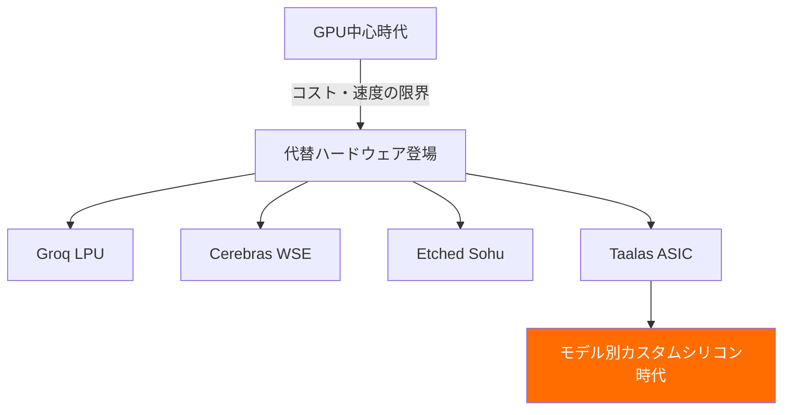

## 概要

AI推論のコストと速度は、これまでGPUハードウェアに依存してきました。しかしスタートアップ<strong>Taalas</strong>がASIC専用チップで<strong>Llama 3.1 8Bを16,000 tok/s</strong>という驚異的な速度で駆動し、これを無料で公開しました。Reddit r/LocalLLaMAで77ポイント、70件以上のコメントが寄せられ、大きな話題となっています。

GPUなしでこれほどの速度が可能であることは、AI推論インフラのパラダイムシフトを意味します。

## TaalasとASIC推論チップとは

### 従来のGPU推論の限界

現在のLLM推論は、ほとんどがNVIDIA GPU（A100、H100など）に依存しています。このアプローチの問題点は明白です：

- <strong>高コスト</strong>：H100一台の価格が3万ドル以上
- <strong>高消費電力</strong>：GPUクラスターは数百kWの電力を消費
- <strong>複雑なインフラ</strong>：液体冷却、HBMスタック、高速I/Oなどが必要
- <strong>汎用設計の非効率</strong>：GPUはグラフィックス処理用に設計された汎用チップ

### Taalasのアプローチ：完全特化

Taalasは2.5年前に設立され、<strong>モデル別カスタムシリコン</strong>を製造するプラットフォームを開発しました。コア原則は3つ：

1. <strong>完全特化（Total Specialization）</strong>：各AIモデルに最適化された専用シリコンを生産
2. <strong>ストレージ・演算統合</strong>：メモリと演算を単一チップにDRAM密度で統合
3. <strong>ラジカルな単純化</strong>：HBM、先進パッケージング、3Dスタック、液体冷却が不要

モデル受領から<strong>わずか2ヶ月</strong>でハードウェア化できるとのことです。

## 性能比較：GPU vs ASIC

| 項目 | GPU（H100） | Taalas ASIC |
|------|-----------|-------------|
| Llama 3.1 8B速度 | ～1,500-2,000 tok/s | <strong>16,000+ tok/s</strong> |
| 速度倍率 | 1x | <strong>約10x</strong> |
| 電力効率 | 低い（700W/チップ） | 高い（大幅削減） |
| 冷却方式 | 液体冷却が必要 | 空冷可能 |
| インフラ複雑度 | 高い | 低い |

従来のGPU比で<strong>約10倍の速度向上</strong>を達成しながら、インフラは遥かにシンプルになりました。

## GPU依存からの脱却トレンド

この動きはTaalasだけのものではありません。AI推論ハードウェア市場でGPU代替が続々と登場しています：

- <strong>Groq</strong>：LPU（Language Processing Unit）で超高速推論
- <strong>Cerebras</strong>：ウェハースケールチップで大規模モデル処理
- <strong>Etched</strong>：Transformer専用ASIC開発
- <strong>Taalas</strong>：モデル別カスタムASIC

Taalas CEOのLjubisa Bajic氏はENIACからトランジスタへの転換を例に挙げ、AIも<strong>「簡単に作れ、速く、安い」</strong>方向に進化すべきだと強調しています。

## 推論コスト構造の激変

### 現在のコスト構造

現在のLLM推論コストの大部分はハードウェアと電力です：

- GPUハードウェア：40-50%
- 電力・冷却：20-30%
- ネットワーク/ストレージ：10-15%
- 人件費・運用：10-15%

### ASICが変えるコスト構造

ASIC専用チップが普及すると：

- <strong>ハードウェアコスト大幅削減</strong>：HBM、先進パッケージング不要
- <strong>電力コスト急減</strong>：10倍以上の効率改善
- <strong>インフラ単純化</strong>：データセンターの複雑さが減少
- <strong>トークン単価が1/10以下</strong>に低下する可能性

これは現在のAPIコール課金方式の価格破壊を意味します。推論がほぼ無料に近づけば、AI活用の範囲が爆発的に拡大します。

## 限界と注意点

もちろん現段階で注意すべき点もあります：

- <strong>モデル限定</strong>：現在Llama 3.1 8Bのみ対応（小規模モデル）
- <strong>柔軟性不足</strong>：モデルが変われば新しいチップが必要
- <strong>量産検証未完</strong>：大規模商用化にはまだ時間が必要
- <strong>大型モデル未対応</strong>：70B、405Bなどの大型モデルはまだロードマップ段階

Redditコミュニティでも「8Bは小さすぎる」という意見と「proof of conceptとしては十分」という意見が分かれました。

## 実践活用：体験してみよう

Taalasは現在、以下の2つを無料提供しています：

1. <strong>チャットボットデモ</strong>：[ChatJimmy](https://chatjimmy.ai/)で16,000 tok/sの速度を直接体験
2. <strong>推論API</strong>：[API申請フォーム](https://taalas.com/api-request-form)で無料アクセス申請が可能

Redditユーザーの反応にもあるように、速度自体が圧倒的な体験だとのことです。

## 結論

TaalasのASIC推論チップは、AI推論ハードウェアの未来を示す重要なマイルストーンです。現在は8Bモデルに限定されていますが、この技術が大型モデルに拡張されれば、<strong>GPU依存的なAIインフラ構造が根本的に変わる</strong>可能性があります。

キーポイント：

- GPU比<strong>10倍以上の推論速度</strong>
- 電力・冷却・インフラコストの<strong>大幅削減</strong>
- モデル別カスタムシリコンという<strong>新しいパラダイム</strong>
- 推論コスト構造の<strong>根本的変化</strong>の可能性

AIが真にユビキタスになるためには、推論インフラの民主化が先行する必要があります。ASIC専用チップはその道の始まりです。

## 参考資料

- [Taalas公式ブログ：The Path to Ubiquitous AI](https://taalas.com/the-path-to-ubiquitous-ai/)
- [Reddit r/LocalLLAMA ディスカッション](https://www.reddit.com/r/LocalLLaMA/comments/1r9e27i/free_asic_llama_31_8b_inference_at_16000_toks_no/)
- [ChatJimmy チャットボットデモ](https://chatjimmy.ai/)
