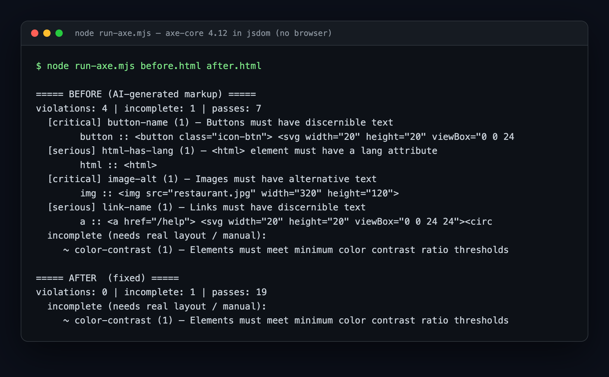
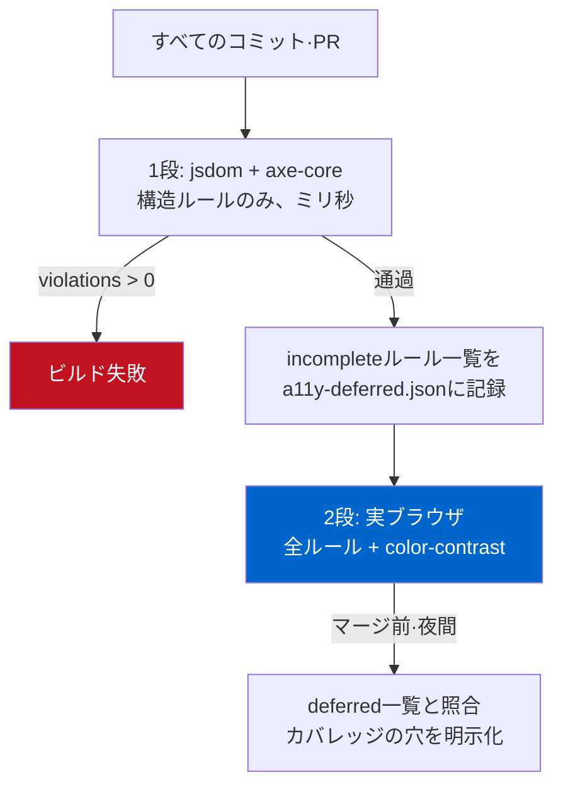

同じHTMLを1枚、axe-coreに2回通したら判定が違った。片方は`color-contrast`を`incomplete`と言い、もう片方は`2.4:1`だと明確な違反として捕まえた。マークアップは一文字も変えていない。変わったのは実行環境ひとつだけだ。

これは些細な脚注に見えて、アクセシビリティ検査をCIに入れるチームが最もよく踏む地雷だ。`axe-core`をJestやVitestに繋げば、ブラウザなしでユニットテスト速度のアクセシビリティ検査が手に入る。魅力的だ。問題は、その便利さの代償として特定のルールがカバレッジから**静かに抜け落ちる**ことで、多くの人はそれに気づかないまま緑のチェックを信じる。今日はサンドボックスでこれを再現し、なぜそうなるかを掘り、パイプラインをどう組めば穴が開かないかまで整理した。

## AIが吐き出したコンポーネントで繰り返される4つの違反

最近はコンポーネントを生成ツールで作ることが多い。私もそうだ。ところが生成されたマークアップをアクセシビリティの目で見ると、同じ場所で同じミスが何度も出る。アイコンだけのボタン、alt無しの画像、テキスト無しのリンク、`lang`の抜けた文書。画面上は問題なく見えるので、人間の目では引っかからない。

実験用に「予約ウィジェット」をひとつ作った。ちょうど生成ツールが吐きそうな形だ。

```html
<!DOCTYPE html>
<html>
<head><title>Booking widget</title></head>
<body>
  <div class="card">
    <h3>Reserve a table</h3>
    
    <p class="muted">Popular near you. Book in seconds.</p>

    <input type="text" placeholder="Your name">
    <input type="email" placeholder="Email">

    <button class="icon-btn">
      <svg viewBox="0 0 24 24"><path d="M12 2v20M2 12h20" stroke="black"/></svg>
    </button>
    <a href="/help">
      <svg viewBox="0 0 24 24"><circle cx="12" cy="12" r="10"/></svg>
    </a>
  </div>
</body>
</html>
```

目で見ればありふれたカードだ。入力欄が2つ、アイコンボタン、ヘルプリンク。スクリーンリーダーで読むと別物になる。ボタンは「ボタン」としか読まれず、何のボタンか分からない。リンクにも行き先のテキストがない。入力欄はフォーカスが入って`placeholder`が消えた瞬間、何を入れる欄かの手がかりを失う。`placeholder`はラベルではない。これは好みの問題ではなく、W3Cが定義した違反だ。

## ブラウザなしでaxe-coreを走らせる

まずCIに優しい側から。`axe-core`と`jsdom`があれば、ブラウザを立ち上げずにNodeの中でアクセシビリティ検査を走らせ、ユニットテストにそのまま載せられる。

```javascript
import { readFileSync } from 'node:fs';
import { JSDOM } from 'jsdom';
import axe from 'axe-core';

async function auditFile(path) {
  const html = readFileSync(path, 'utf8');
  const dom = new JSDOM(html, { runScripts: 'dangerously', pretendToBeVisual: true });
  const { window } = dom;
  window.eval(axe.source); // このwindowにaxeを注入
  return window.axe.run(window.document, {
    resultTypes: ['violations', 'incomplete'],
    runOnly: { type: 'tag', values: ['wcag2a', 'wcag2aa', 'wcag21a', 'wcag21aa'] },
  });
}
```

肝は`window.eval(axe.source)`だ。`axe-core`パッケージはライブラリ全体を文字列にした`axe.source`を提供する。これをjsdomが作った`window`に注入すれば、その中で実ブラウザと同じように`axe.run()`を呼べる。`runOnly`でWCAG 2.1 A/AAタグだけに絞った。多くのチームが準拠目標に置く基準線だ。

beforeページをこのコードで走らせた実際の出力がこれだ。飾っていない。



```text
===== BEFORE (AI-generated markup) =====
violations: 4 | incomplete: 1 | passes: 7
  [critical] button-name (1)   — Buttons must have discernible text
  [serious]  html-has-lang (1) — <html> element must have a lang attribute
  [critical] image-alt (1)     — Images must have alternative text
  [serious]  link-name (1)     — Links must have discernible text
  incomplete:
     ~ color-contrast (1)      — Elements must meet minimum contrast ratio
```

構造的な違反4つが正確に捕まった。`button-name`はアイコンボタンにアクセシブルな名前が無いこと、`link-name`はリンクにテキストが無いこと、`image-alt`と`html-has-lang`は名前のままだ。ここまでブラウザは一切要らなかった。マークアップの構造だけで判定できるルールだからだ。これがjsdom方式の本当の値打ちで、`git push`のたびに数ミリ秒でこの種の回帰を止められる。

違反を直したafterページも同じコードで走らせた。アイコンボタンに`aria-label`、SVGに`aria-hidden="true"`、画像に`alt`、入力欄に本物の`<label for>`を付けた。

```text
===== AFTER (fixed) =====
violations: 0 | incomplete: 1 | passes: 19
  incomplete:
     ~ color-contrast (1)      — Elements must meet minimum contrast ratio
```

違反0、通過19。きれいだ。だが`incomplete`に残った`color-contrast`の一行が引っかかる。beforeでもafterでも、このルールだけは判定が出なかった。ここが罠だ。

## なぜcolor-contrastだけincompleteに落ちるのか

`incomplete`はpassではない。「違反がない」ではなく、**「この環境では確認できない」**という意味だ。axe-coreが判定を諦めた合図である。

理由はjsdomの根本的な性格にある。jsdomはDOMツリーを作るが、レイアウトもレンダリングもしない。どの要素が画面のどこにどの色で描画され、その背後にどんな背景が重なるかを計算しない。ところがコントラスト判定は、まさにその「実際に塗られた前景色と背景色」があって初めて可能になる。axe-coreのコントラスト検査は内部で`document.createRange()`と`getClientRects()`を使ってテキストが実際に占める領域を掴むが、jsdomにはこのAPIが実装されていない。Dequeが管理するaxe-coreリポジトリの[issue #595](https://github.com/dequelabs/axe-core/issues/595)にこの制約がそのまま記録されており、人気の[jest-axe](https://github.com/nickcolley/jest-axe)はこの問題ゆえに`color-contrast`ルールをデフォルトで無効化している。

つまりこうだ。jsdomではコントラスト検査は「通過」するのではなく、「存在しない」。そしてaxe-coreを初めて繋いだチームは、`incomplete`を読まずに流すか、`resultTypes`からそもそも外してしまうことが多い。その瞬間、WCAGで最も頻繁に破られる違反のひとつであるコントラストが、テストのカバレッジから丸ごと消える。

そこで同じbeforeページを実ブラウザエンジン（ヘッドレスChromium）でもう一度走らせた。コントラストルールだけを指定して。

```javascript
// 実ブラウザのページコンテキスト内で実行
const r = await window.axe.run(document, {
  runOnly: { type: 'rule', values: ['color-contrast'] }
});
```

結果は明確な違反だった。

```json
{
  "id": "color-contrast",
  "impact": "serious",
  "message": "Element has insufficient color contrast of 2.4
              (foreground #a7a7a7, background #ffffff, 16px).
              Expected contrast ratio of 4.5:1"
}
```

`2.4:1`。W3Cの[WCAG 2.1 SC 1.4.3 Contrast (Minimum)](https://www.w3.org/WAI/WCAG21/Understanding/contrast-minimum.html)は本文テキストに最低`4.5:1`（大きなテキストは`3:1`）を求める。`#a7a7a7`の薄いグレーの案内文は、要求の半分ほどだった。jsdomが「判定不能」と流したまさにその要素を、ブラウザは一撃で捕まえた。色を`#595959`に濃くしたところ、コントラストは`7:1`を超え、ブラウザでも違反0になった。

同じaxe-core、同じマークアップ、違うランタイム。判定が割れる。レンダリングのタイミングが自動ツールの視野を決めるこの落とし穴は、アクセシビリティに限った話ではない。[構造化データをサーバー側でレンダリングするかクライアントのJSで注入するか](/ja/blog/ja/localbusiness-structured-data-server-side-vs-js-2026/)で、クローラーがスキーマを読むか丸ごと見落とすかが分かれるのも、まったく同じ構造だ。この一枚の絵が今日の記事のすべてだ。

## だからパイプラインは2段で組む

ここで結論が「ならjsdomは使わず常にブラウザを立てろ」になると困る。ブラウザ起動は遅く、ユニットテストごとにChromiumを上げればCIがもたつく。私は役割を分ける側を取る。

<strong>1段目 — jsdom＋axe-core（速いゲート）。</strong>すべてのコミット、すべてのPRでユニットテストとして走る。`button-name`・`image-alt`・`link-name`・`label`・`html-has-lang`のようにマークアップだけで判定される構造的違反をここで止める。ミリ秒単位なので負担がない。コンポーネントのスナップショットテストの隣にそのまま載せればいい。

<strong>2段目 — 実ブラウザ（全ルール）。</strong>PlaywrightやPuppeteerでレンダリングまでした上で、`color-contrast`を含む全ルールを走らせる。`@axe-core/playwright`のようなアダプタを使えば配線は短い。この段は毎コミットで重く回す必要はなく、マージ前や夜間パイプラインで主要ページだけ選んで回せば十分だ。

2段を繋ぐとき、必ず入れておくべき仕掛けがひとつある。**1段目で`incomplete`に落ちたルールをログに残し、2段目がそのルールを実際にカバーしているか照合すること**だ。こうすれば「jsdomが判断できなかったのはどのルールか」がパイプラインに明示的に表れる。さもないと`incomplete`は誰も見ないログの一行になり、カバレッジの穴は開いたままだ。

ゲートのロジックはこの程度で十分だ。

```javascript
const results = await runAxeInJsdom(html);
if (results.violations.length > 0) {
  console.error('構造的なa11y違反:', results.violations.map(v => v.id));
  process.exit(1); // 1段目ゲート: ここでビルド失敗
}
// incompleteは失敗にせず、2段目がカバーすべきリストとして渡す
const deferred = results.incomplete.map(v => v.id);
writeFileSync('a11y-deferred.json', JSON.stringify(deferred));
```

発想自体は新しくない。私は[SEO監査をビルドゲートとして常設化したキャンペーン](/ja/blog/ja/multilingual-blog-technical-audit-campaign-2026/)で同じ原理を使った。一度直したものを人の規律に任せず、パイプラインに固定する。アクセシビリティもまったく同じだ。監査はイベントではなくループであるべきだ。

2段構造を図に整理するとこうなる。



## ツールが緑になっても残るもの

正直に言えば、上の2段を全部通しても、そのページがアクセシブルだという保証はない。これはaxe-coreの限界ではなく、自動検査全体の限界だ。

axe-coreが捕まえられない代表格がある。キーボードだけで全てのボタンとリンクに到達し操作できるか。`Tab`順が視覚的な順・論理的な順と合っているか。モーダルを開いたときフォーカスがその中に閉じ込められ、閉じれば元の位置に戻るか。スクリーンリーダーで最初から最後まで読んで流れが意味を成すか。どれもマークアップの静的解析では判定できない。実際、[Lighthouseでアクセシビリティ100点にしたページ](/ja/blog/ja/a11y-lighthouse-audit-fix-2026/)でも、`div`に`onclick`だけ付けた偽ボタンは満点を取りながら、キーボードでは押せないまま残っていた。

だから私は自動ツールを「天井」ではなく「床」と見る。axe-coreが捕まえる違反は、人がわざわざ時間をかけて確認するまでもない、必ず0であるべき下限だ。その床をCIで押さえ、浮いた時間をキーボードウォークスルーとスクリーンリーダー通読に使うのが正しい。ツールが全部やってくれると信じた瞬間、ツールに見えない半分がそのままプロダクションに出る。

その床が実際どのあたりにあるのかは別途測った。[W3C ACTのテストケースにaxe-coreを全件かけてみる](/ja/blog/ja/act-rules-axe-coverage-wcag-sc-2026/)と、36の達成基準のうち22は検出件数が0だった。沈黙の一部は、ルールがそもそも無効になっていたことによるものだ。CIに載せる前に `rules` の設定を確認すべき理由はここにある。

## 今日すぐ使えるチェックリスト

- `axe-core`をユニットテストに繋いだなら、`resultTypes`に`'incomplete'`を必ず含め、そのリストを実際に読む。`color-contrast`がそこにあれば、それは通過ではなく未検査だ。
- jsdom段は構造ルール（`button-name`, `image-alt`, `link-name`, `label`, `html-has-lang`）専用と明確にスコープする。コントラストやフォーカスの可視性のようにレンダリングが要るルールを、ここで通過したと勘違いしない。
- コントラスト検査は必ず実ブラウザ段へ昇格させる。Playwright/Puppeteer＋`@axe-core/*`アダプタなら配線は短い。
- アイコンボタンには`aria-label`、装飾用SVGには`aria-hidden="true"`、入力欄には`placeholder`ではなく本物の`<label for>`。この3つを守るだけで、生成マークアップのよくある違反のほとんどが消える。
- 自動ゲートを通したら、キーボードだけでその画面を一度最後まで操作してみる。ツールの緑は始まりであって、終わりではない。

アクセシビリティは一度直すことではなく、回帰を止める問題だ。`incomplete`をそのまま流さないことから始まる。

---

構造化データをサーバーサイドで確実に出力する、既存サイトのアクセシビリティや検索対応を実測ベースで点検してゲートに固定する、といった作業を個人的に相談・受託している。似たパイプラインを組んで詰まった箇所があれば、[プロフィール](/ja/about/)の連絡先から気軽に問い合わせを残してほしい。
