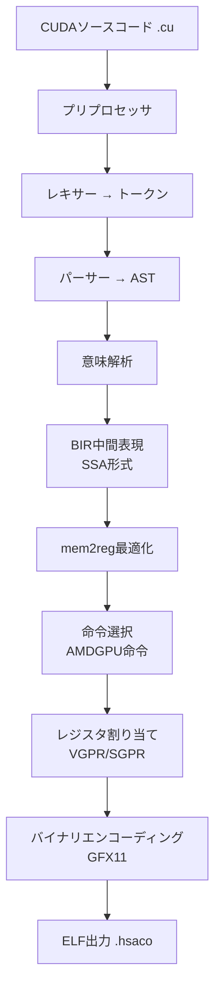

## 概要

GPUコンピューティングの世界で、NVIDIAのCUDAは事実上の標準です。しかし、これは同時に<strong>ベンダーロックイン</strong>を意味します。CUDAで書かれたコードはNVIDIA GPUでしか実行できませんでした。

<strong>BarraCUDA</strong>は、この壁を打ち破るために生まれたオープンソースコンパイラです。`.cu`ファイルを受け取り、AMD RDNA 3（GFX11）マシンコードに直接コンパイルします。LLVM依存なし、15,000行のC99で書かれており、HIP変換レイヤーも不要です。

## BarraCUDAのアーキテクチャ

BarraCUDAのコンパイルパイプラインは、従来のコンパイラ構造を踏襲しつつ、AMD GPUを直接ターゲットとしています。



主な特徴は以下の通りです：

- <strong>LLVMゼロ依存</strong>：約1,700行の手書き命令選択ロジック
- <strong>SSAベースのIR</strong>：BIR（BarraCUDA IR）という独自の中間表現を使用
- <strong>完全なプリプロセッサ</strong>：`#include`、`#define`、マクロ、条件付きコンパイルに対応
- <strong>検証済みエンコーディング</strong>：すべての命令エンコーディングが`llvm-objdump`で検証済み

## 対応するCUDA機能

BarraCUDAは、すでにかなり多くのCUDA機能に対応しています：

### コア言語機能

- `__global__`、`__device__`、`__host__`関数修飾子
- `threadIdx`、`blockIdx`、`blockDim`、`gridDim`組み込み変数
- 構造体、列挙型、typedef、名前空間
- ポインタ、配列、ポインタ演算
- すべてのC制御フロー：if/else、for、while、switch/case、goto
- 基本的なテンプレートインスタンス化

### CUDA固有機能

- <strong>`__shared__`メモリ</strong>：LDSから割り当て、適切に追跡
- <strong>`__syncthreads()`</strong>：`s_barrier`に変換
- <strong>アトミック操作</strong>：`atomicAdd`、`atomicSub`、`atomicMin`、`atomicMax`など
- <strong>Warpイントリンシック</strong>：`__shfl_sync`、`__shfl_up_sync`、`__shfl_down_sync`
- <strong>ベクトル型</strong>：`float2`、`float3`、`float4`など`.x/.y/.z/.w`アクセス
- <strong>半精度</strong>：`__half`、`__float2half()`、`__half2float()`
- <strong>Cooperative Groups</strong>：`this_thread_block()`および`.sync()`、`.thread_rank()`

## 使い方

ビルドは驚くほど簡単です：

```bash
# ビルド — C99コンパイラさえあれば十分です
make

# AMD GPUバイナリにコンパイル
./barracuda --amdgpu-bin kernel.cu -o kernel.hsaco

# IRダンプ（デバッグ用）
./barracuda --ir kernel.cu

# AST出力
./barracuda --ast kernel.cu
```

## GPU民主化の意義

BarraCUDAの登場は、単なる技術的成果を超え、GPUエコシステムの構造的変化を示唆しています。

### NVIDIA独占への挑戦

現在のGPUコンピューティング市場におけるCUDAの地位は絶対的です。AI/MLワークロードの大半がCUDAベースであり、NVIDIA GPUなしでは実行が不可能でした。BarraCUDAはこの構図に亀裂を入れます。

### AMD GPU活用の可能性拡大

AMDのROCm/HIPエコシステムは成長していますが、既存のCUDAコードを変換する際にはまだ摩擦が存在します。BarraCUDAは<strong>コード変換なしに直接コンパイル</strong>するアプローチで、この摩擦を最小化します。

### オープンソースの力

15,000行のC99でCUDAコンパイラを実装したという事実自体が、オープンソースコミュニティの実力を示しています。Hacker Newsで66ポイントを記録し、開発者コミュニティの注目を集めました。

## 現在の制限と展望

もちろん、まだ初期段階であるため制限もあります：

- <strong>GFX11（RDNA 3）専用</strong>：現在AMDの最新アーキテクチャのみ対応
- <strong>ランタイム未搭載</strong>：`cudaMalloc`、`cudaMemcpy`などのホストAPIは別途実装が必要
- <strong>最適化が限定的</strong>：nvccレベルの最適化にはまだ及ばない
- <strong>Tenstorrent対応進行中</strong>：AMD以外のアーキテクチャへの拡張を計画

しかし、プロジェクトの方向性は明確です。CUDAコードのポータビリティを高め、GPU選択の自由を開発者に取り戻すことです。

## まとめ

BarraCUDAは、GPUコンピューティングの未来を垣間見ることができるプロジェクトです。NVIDIAのCUDA独占に対するオープンソースの代替として、<strong>コード変更なしにAMD GPUでCUDAコードを実行</strong>できる可能性を示しています。

AI/MLワークロードが爆発的に増加している今、GPU選択の多様性はコスト削減とサプライチェーンの安定性の面でも重要です。BarraCUDAのようなプロジェクトが成熟すれば、GPUエコシステムの競争構図がより健全になるでしょう。

## 参考資料

- [BarraCUDA GitHubリポジトリ](https://github.com/Zaneham/BarraCUDA)
- [Hacker Newsディスカッション](https://news.ycombinator.com/item?id=barracuda)
- [AMD ROCm公式ドキュメント](https://rocm.docs.amd.com/)
- [NVIDIA CUDA公式ドキュメント](https://developer.nvidia.com/cuda-zone)
