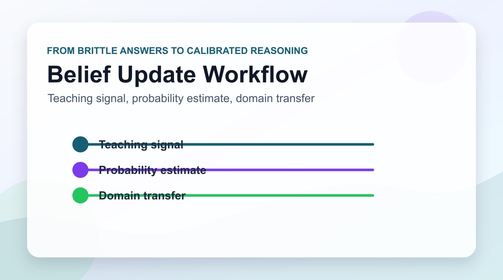

現代のLLMは驚くべき能力を持っているが、一つの根本的な弱点がある。会話が長くなるほど、あるいは新しい情報が与えられるほど、自分の「信念(belief)」を合理的に更新する能力が著しく低下するという点だ。ユーザーが「実は窓側の席が好きなんです」と言っても、次の推薦でLLMがそれを反映できないことが多い。

Google ResearchとMITの研究チームが<strong>Nature Communications</strong>に発表した「Bayesian Teaching Enables Probabilistic Reasoning in Large Language Models」は、この問題に正面から取り組む。核心のアイデアはシンプルでありながら強力だ：LLMが正解を暗記する方式ではなく、<strong>ベイズ最適モデルの確率的推論プロセスを模倣するよう訓練する</strong>ことだ。

## LLMの確率的推論の問題

人間は自然にベイズ的に推論する。「昨日は雨が降ったから、今日も曇りの可能性が高い」のように、新しい証拠が入るたびに以前の信念(prior)を更新して事後確率(posterior)を計算する。

一方、標準的なLLMはこのような漸進的な信念更新が非常に苦手だ。研究チームの実験では、LLMは最初の相互作用後にパフォーマンスが頭打ちになる傾向を示した。つまり、何度もユーザーのフィードバックを受けても、初期応答のレベルから向上しなかった。

これはAIエージェントや推薦システムにとって致命的な問題だ。ユーザーと何十回も会話しても、ユーザーの実際の好みを把握できないなら、エージェントの価値は急激に下がる。

## Bayesian Teaching: 解決策の核心

研究チームは2つの訓練戦略を比較した。

**Oracle Teaching**：常に正解を選ぶ完璧なアシスタントの行動パターンを学習。結果的にLLMは「この状況で何が正解か」を暗記することに集中する。

**Bayesian Teaching**：数学的に最適化されたベイズアシスタントの確率的予測を模倣。単に最終的な正解ではなく、「現在の証拠から見て、各オプションの確率はどれくらいか」という中間プロセスを学習する。

結果は明確だった。Bayesian Teachingで訓練されたモデルはOracle Teaching比で一貫して高いパフォーマンスを示し、<strong>ベイズアシスタントと約80%の一致度</strong>を達成した。

さらに印象的なのは**汎化能力**だ。航空券推薦データで訓練されたモデルが、訓練に全く使われていないホテル予約や実際のウェブショッピングのドメインでもベイズ的推論能力を発揮した。

## なぜ重要か：推論スキルの移転性

この研究で最も注目すべきは**推論スキルの移転性(transferability)**だ。

従来のLLM訓練はドメイン知識の暗記に焦点を当てる傾向があった。Bayesian Teachingは違う。ドメインを超えた**推論の原理そのもの**を学習させる。

```
訓練ドメイン：航空券推薦
        ↓ (Bayesian Teaching)
学習された能力：確率的信念更新の原理
        ↓ (ゼロショット汎化)
適用ドメイン：ホテル予約 / ショッピング / 医療診断 / 法律リサーチ...
```

これは数学的思考力を身につければ、物理、経済、工学など様々な分野に応用できるのと同じ理屈だ。

## 実務への適用：EM/CTO視点の示唆

Engineering ManagerやCTOの立場から、この研究はいくつかの実質的な示唆を与える。

### 1. AIエージェント設計の再考

現在、多くのAIエージェントシステムは単純にRAG(Retrieval-Augmented Generation)やツール呼び出しで動作する。しかしBayesian Teachingを適用すれば、エージェントがユーザーとのインタラクション履歴を通じて漸進的により正確なモデルを形成できる。

例えばエンタープライズHRシステムでAIエージェントが候補者の好みを把握したり、プロジェクト管理ツールでチームの作業パターンを学習するのに活用できる。

### 2. 不確実性定量化(Uncertainty Quantification)の可能性

ベイズ的推論の核心は不確実性を数値で表現することだ。「このオプションが70%で最も適切です」のように。現在のLLMはこのようなキャリブレーション(calibration)が弱い。Bayesian Teachingはこれを改善できる。

エンタープライズ意思決定支援システムで「確信度82%」と「確信度51%」の違いは非常に重要だ。

### 3. Fine-tuning戦略の変化

Oracle方式(正解データセットfine-tuning)から脱却し、ベイズアシスタントのプロセスを模倣する合成データ生成パイプラインを構築することが新しいアプローチになり得る。

コスト面でも興味深い。正解ラベリングに莫大なコストをかける代わりに、数学的に定義されたベイズモデルの出力を合成データとして活用できるからだ。

## 現実的な限界と考慮事項

この研究が完璧な解決策というわけではない。

**計算コスト**：ベイズアシスタントの予測をリアルタイムで計算したり、大規模な合成データを生成することはかなりの計算コストがかかる。

**訓練データの複雑性**：現実世界の好みは航空券やホテルのような構造化された環境よりはるかに曖昧で多次元的だ。これをベイズモデルで形式化すること自体が難しい場合がある。

**スケール検証の必要性**：実験は特定の推薦タスクに集中していた。言語理解、コーディング、マルチステップエージェントタスクなどでの検証が追加で必要だ。

## 今後の展望

この研究は、LLMが単純なパターンマッチングマシンを超えて、真の意味での**確率的推論エンジン**に発展できることを示している。特に次の方向が期待される。

- **長期対話エージェント**：数十、数百回のインタラクションを通じてユーザーモデルを継続的に改善するエージェント
- **医療診断支援**：症状と検査結果を累積して最も可能性の高い診断を推論するAI
- **金融リスク分析**：市場データを継続的に反映してポートフォリオリスクを動的に評価するシステム

Gartnerが2027年までにエージェンティックAIプロジェクトの40%以上が失敗すると警告している状況で、Bayesian Teachingのような根本的な推論能力改善研究は、この失敗率を下げる中核技術になり得る。

## まとめ

Engineering Managerとして、このような基礎研究が実際の製品に適用されるまで通常2〜3年かかることは知っている。しかし方向性を理解することは、今すぐのアーキテクチャ決定にも影響を与える。

今日AIエージェントを設計するとき、「このシステムはユーザーのフィードバックを受けて自分のモデルを更新するか？」という問いを投げかけてみよう。Bayesian Teachingがこの能力を訓練段階で内在化する方法を示しているなら、今はアーキテクチャ設計段階でこのための空間を確保しておくことが賢明だ。

確率的に考えるLLMが生まれたとき、AIエージェントは真の学習パートナーになるだろう。

---

**参考資料：**
- [Bayesian Teaching Enables Probabilistic Reasoning in Large Language Models — Nature Communications](https://www.nature.com/articles/s41467-025-67998-6)
- [Teaching LLMs to Reason Like Bayesians — Google Research Blog](https://research.google/blog/teaching-llms-to-reason-like-bayesians/)
- [arXiv: 2503.17523](https://arxiv.org/abs/2503.17523)
